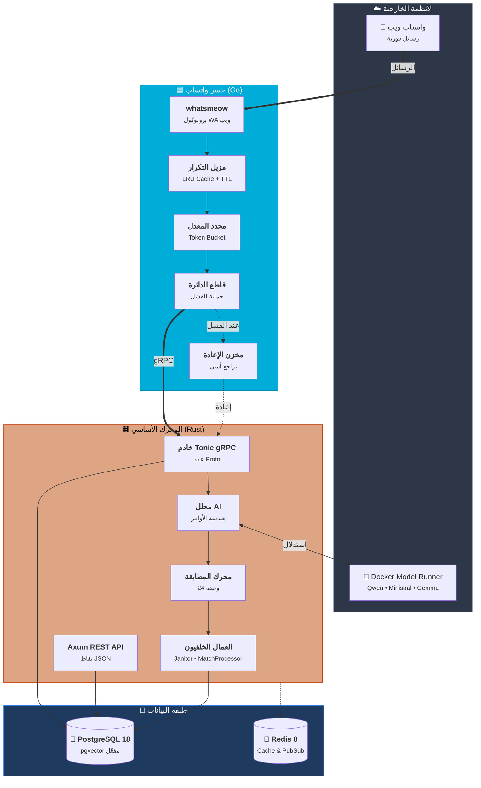
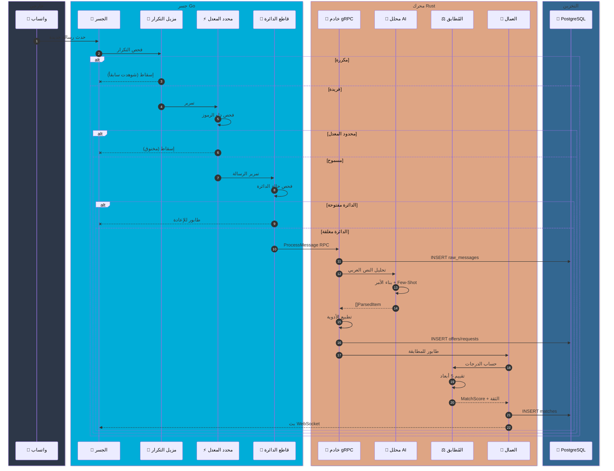
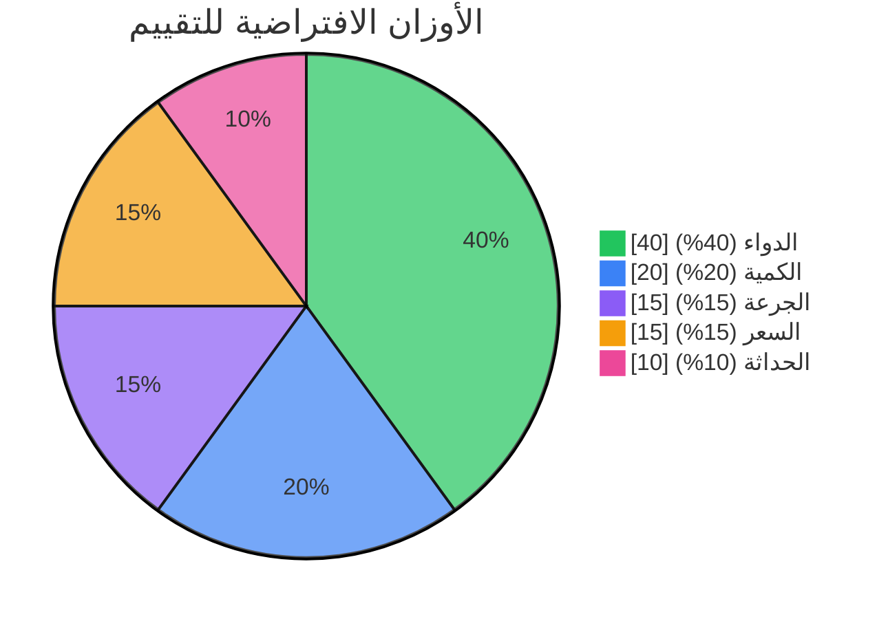
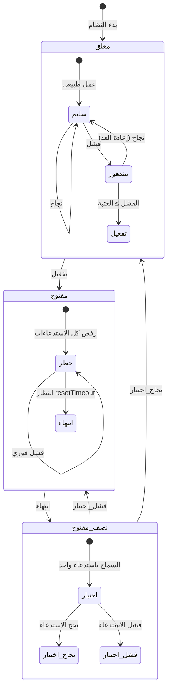

<div dir="rtl">

<p align="center">
  
</p>

<h1 align="center">🏥 فارما بروكر</h1>

<p align="center">
  <strong>🌍 منصة تداول أدوية ذكية مدعومة بالذكاء الاصطناعي لسوق الدواء المصري</strong>
</p>

<p align="center">
  <em>ربط سلسلة توريد الأدوية بين الصيدليات من خلال الأتمتة الذكية عبر واتساب</em>
</p>

<p align="center">
  
</p>

<p align="center">
  <a href="https://golang.org"></a>
  <a href="https://www.rust-lang.org"></a>
  <a href="https://www.postgresql.org"></a>
  <a href="https://grpc.io"></a>
  <a href="LICENSE"></a>
</p>

<p align="center">
  <a href="#-نظرة-عامة">نظرة عامة</a> •
  <a href="#-المميزات">المميزات</a> •
  <a href="#-البنية-المعمارية">البنية</a> •
  <a href="#-البدء-السريع">البدء السريع</a> •
  <a href="#-واجهة-api">API</a>
</p>

---

## 📖 نظرة عامة

**فارما بروكر** هو نظام متكامل على مستوى المؤسسات يعمل بتقنية **الخدمات المصغرة متعددة اللغات** (Go + Rust) لتحويل طريقة تداول الأدوية في مصر. يتكامل النظام بسلاسة مع مجموعات واتساب حيث يتبادل الصيادلة والموزعون عروض وطلبات الأدوية باللغة العربية.

باستخدام **معالجة اللغة الطبيعية المتقدمة** المدعومة بنماذج ذكاء اصطناعي محلية، يستخرج فارما بروكر بيانات الأدوية المهيكلة تلقائياً من النصوص العربية غير الرسمية، ثم يوظف **محرك مطابقة متطور مكون من 24 وحدة** لربط العرض بالطلب في الوقت الفعلي.

### 🎯 المشكلة التي نحلها

في سوق الأدوية المصري، نقص الأدوية شائع. يعتمد الصيادلة على مجموعات واتساب لإيجاد الأدوية، لكن:

- **المراقبة اليدوية** لمئات الرسائل يومياً مرهقة
- **فرص ضائعة** عندما لا تُرى العروض/الطلبات المتطابقة في الوقت المناسب
- **لا تتبع** للصفقات التاريخية أو اتجاهات الأسعار
- **حواجز اللغة** - النصوص العربية غير الرسمية صعبة التحليل برمجياً

### 💡 حلنا

يوفر فارما بروكر **طبقة أتمتة ذكية** تقوم بـ:

1. **استيعاب** رسائل واتساب في الوقت الفعلي
2. **تحليل** النصوص العربية غير الرسمية باستخدام نماذج LLM محلية (لا تخرج البيانات من بنيتك التحتية)
3. **مطابقة** العروض مع الطلبات باستخدام تقييم محسّن بالتعلم الآلي
4. **التعلم** من ملاحظات المشغل للتحسين المستمر
5. **إشعار** المشغلين بالمطابقات عالية الثقة للتصرف السريع

---

## ✨ المميزات

<table>
<tr>
<td width="50%">

### 🤖 تحليل ذكي بالذكاء الاصطناعي

- **معالجة لغوية عربية** من اللهجة المصرية غير الرسمية
- **دعم متعدد النماذج**: Qwen، Ministral، Gemma
- **استدلال محلي** عبر Docker Model Runner
- **حلقة تغذية راجعة** للتحسين المستمر

</td>
<td width="50%">

### ⚖️ محرك مطابقة متقدم

- **24 وحدة متخصصة** تعمل بتناغم
- **استراتيجيات مجمعة**: ضبابية، تضمين، نص كامل
- **إطار اختبار A/B** لتحسين الاستراتيجيات
- **معايرة الثقة** باستخدام Platt Scaling

</td>
</tr>
<tr>
<td width="50%">

### 🧠 تعلم تكيفي

- **تحسين الأوزان** بالنزول التدريجي
- **إدارة البدء الدافئ** للنشر الجديد
- **كشف القيم الشاذة** لجودة البيانات
- **تعلم الألفة التاريخية**

</td>
<td width="50%">

### 🛡️ مرونة المؤسسات

- **نمط قاطع الدائرة** (مفتوح/مغلق/نصف مفتوح)
- **تحديد معدل الرموز** مع دعم الدفعات
- **إزالة تكرار الرسائل** بذاكرة LRU
- **مخزن إعادة المحاولة** بتراجع أسي

</td>
</tr>
<tr>
<td width="50%">

### 📊 مراقبة في الوقت الفعلي

- تحديثات مباشرة عبر **WebSocket**
- تكامل مقاييس **Prometheus**
- **تسجيل منظم** (zerolog/tracing)
- **سجل تدقيق** شامل

</td>
<td width="50%">

### 🔒 جاهز للإنتاج

- **إيقاف أنيق** مع فترات تصريف
- **فحوصات صحية** ومجسات الجاهزية
- تنسيق **Docker Compose**
- **قابلية توسع أفقية**

</td>
</tr>
</table>

---

## 🏗️ البنية المعمارية

يوظف فارما بروكر **بنية خدمات مصغرة متعددة اللغات** تستفيد من نقاط قوة كل من Go و Rust:

| المكون              | اللغة      | المسؤولية                                         |
| ------------------- | ---------- | ------------------------------------------------- |
| **جسر واتساب**      | Go         | استيعاب الرسائل الفوري، أنماط المرونة، عميل gRPC  |
| **المحرك الأساسي**  | Rust       | تحليل AI، المطابقة، منطق الأعمال، خوادم REST/gRPC |
| **قاعدة البيانات**  | PostgreSQL | تخزين دائم مع pgvector للتضمينات                  |
| **الذاكرة المؤقتة** | Redis      | تخزين موزع و pub/sub (مستقبلي)                    |

### نظرة عامة على النظام



---

## 📨 خط معالجة الرسائل

تمر كل رسالة واتساب عبر خط معالجة منسق بعناية، من الاستيعاب إلى إشعار المطابقة:



---

## ⚖️ محرك المطابقة بالتفصيل

قلب فارما بروكر هو **محرك المطابقة ذو الـ 24 وحدة**، نظام متطور يجمع استراتيجيات متعددة لجودة مطابقة مثالية.

### أبعاد التقييم

يقيّم المُطابق أزواج العرض-الطلب عبر خمسة أبعاد موزونة:



| البُعد         | الوزن | الخوارزمية                       | الوصف                                                        |
| -------------- | ----- | -------------------------------- | ------------------------------------------------------------ |
| **💊 الدواء**  | 40%   | مطابقة ضبابية + جيب تمام التضمين | مطابقة أسماء الأدوية باستخدام مسافة التحرير والتشابه الدلالي |
| **📦 الكمية**  | 20%   | نسبة الوفاء                      | حساب `min(المعروض، المطلوب) / المطلوب`                       |
| **💉 الجرعة**  | 15%   | مقارنة موحدة                     | تحليل الوحدات (مجم، جم، مل) والمقارنة الرقمية                |
| **💰 السعر**   | 15%   | ملاءمة الميزانية                 | الدرجة = 1.0 إذا `سعر_العرض ≤ الحد_الأقصى`، وإلا متدرجة      |
| **⏰ الحداثة** | 10%   | تناقص أسي                        | العناصر الأحدث تحصل على درجة أعلى (عمر نصفي 24 ساعة)         |

### نطاقات الثقة والإجراءات

بناءً على الدرجة النهائية المعايرة، توجَّه المطابقات لإجراءات مختلفة:

| النطاق |   نطاق الدرجة   | الإجراء    | الوصف                             |
| :----: | :-------------: | ---------- | --------------------------------- |
|   🟢   |   **≥ 0.90**    | **تلقائي** | تأكيد تلقائي - أعلى ثقة           |
|   🟡   | **0.70 - 0.89** | **اقتراح** | مقترح للمشغل للموافقة السريعة     |
|   🟠   | **0.50 - 0.69** | **مراجعة** | في طابور المراجعة اليدوية المفصلة |
|   🔴   |   **< 0.50**    | **لا شيء** | لا مطابقة - الدرجات منخفضة جداً   |

### مرجع الوحدات

<details>
<summary><strong>📋 اضغط لتوسيع قائمة الوحدات الكاملة (24 وحدة)</strong></summary>

| الوحدة            | الملف                | الغرض                          |
| ----------------- | -------------------- | ------------------------------ |
| `scorer`          | `scorer.rs`          | تقييم موزون متعدد الأبعاد      |
| `learner`         | `learner.rs`         | تحسين الأوزان بالنزول التدريجي |
| `calibration`     | `calibration.rs`     | معايرة Platt للاحتمالات        |
| `confidence`      | `confidence.rs`      | تصنيف نطاقات الثقة             |
| `ensemble`        | `ensemble.rs`        | إطار دمج الاستراتيجيات         |
| `abtest`          | `abtest.rs`          | بنية اختبار A/B                |
| `warm_start`      | `warm_start.rs`      | بدء من الأنماط التاريخية       |
| `historical`      | `historical.rs`      | تعلم ألفة الأدوية              |
| `filter`          | `filter.rs`          | قواعد التصفية المسبقة          |
| `hybrid_filter`   | `hybrid_filter.rs`   | استراتيجيات تصفية مجمعة        |
| `fts_search`      | `fts_search.rs`      | بحث النص الكامل PostgreSQL     |
| `embedding_cache` | `embedding_cache.rs` | ذاكرة متجهات مع مرادفات        |
| `thresholds`      | `thresholds.rs`      | حساب عتبات سلسة                |
| `audit`           | `audit.rs`           | تسجيل الإجراءات                |
| `scheduler`       | `scheduler.rs`       | جدولة مهام التعلم              |
| `weights`         | `weights.rs`         | تكوين الأوزان                  |
| `score_types`     | `score_types.rs`     | تعريفات الأنواع                |
| `actions`         | `actions.rs`         | معالجات الإجراءات التلقائية    |
| `arabic`          | `arabic.rs`          | تطبيع النص العربي              |
| `dosage`          | `dosage.rs`          | تحليل ومقارنة الجرعات          |
| `fuzzy`           | `fuzzy.rs`           | مطابقة السلاسل الضبابية        |
| `service`         | `service.rs`         | واجهة خدمة المطابقة            |
| `engine`          | `engine.rs`          | تنسيق المحرك الأساسي           |
| `mod`             | `mod.rs`             | تصدير الوحدات                  |

</details>

---

## 🛡️ أنماط المرونة

ينفذ جسر Go **أنماط مرونة مجربة** لضمان عمل موثوق حتى في الظروف الصعبة:

### آلة حالة قاطع الدائرة



### مكونات المرونة

| المكون           | النمط      | التكوين                        | الغرض                   |
| ---------------- | ---------- | ------------------------------ | ----------------------- |
| **قاطع الدائرة** | فشل سريع   | 5 فشل → 30 ثانية انتظار        | يمنع تسلسل الفشل للمحرك |
| **محدد المعدل**  | دلو الرموز | 100/دقيقة، دفعة 20             | يحمي من طوفان الرسائل   |
| **مزيل التكرار** | ذاكرة LRU  | 10 آلاف مدخل، 5 دقائق TTL      | يصفي الرسائل المكررة    |
| **مخزن الإعادة** | تراجع أسي  | مخزن 1000 رسالة، تنظيف 5 ثواني | يعالج الفشل المؤقت      |

---

## 📁 هيكل المشروع

```
pharma-broker/
│
├── 🟦 bridge/                      # جسر واتساب (Go)
│   ├── adapters/                   # محولات البنية التحتية
│   │   ├── grpc/                   # → عميل gRPC للمحرك Rust
│   │   ├── qr/                     # → معالج HTTP لرمز QR
│   │   ├── resilience/             # → مرسل إعادة المحاولة
│   │   └── whatsapp/               # → محول whatsmeow
│   ├── app/                        # تنسيق التطبيق
│   │   └── bridge.go               # → منطق الجسر الأساسي
│   ├── domain/                     # نماذج المجال
│   │   ├── message.go              # → كيان الرسالة
│   │   └── types.go                # → أنواع قوية (JID، Phone)
│   ├── ports/                      # تعريفات الواجهات
│   │   ├── inbound.go              # → MessageSource، QRHandler
│   │   ├── outbound.go             # → MessageSink، GroupRepo
│   │   └── policies.go             # → واجهات المرونة
│   ├── resilience/                 # تنفيذات المرونة
│   │   ├── circuit_breaker.go      # → قاطع الدائرة
│   │   └── rate_limiter.go         # → محدد دلو الرموز
│   ├── deduplicator/               # إزالة تكرار الرسائل
│   └── cmd/bridge/                 # نقطة الدخول
│
├── 🟧 core/                        # المحرك الأساسي (Rust)
│   ├── crates/
│   │   ├── db/                     # طبقة قاعدة البيانات (SeaORM)
│   │   │   ├── entity/             # → كيانات ORM
│   │   │   ├── migration/          # → ترحيل المخطط
│   │   │   ├── repo/               # → تنفيذات المستودع
│   │   │   ├── traits/             # → واجهات المستودع
│   │   │   └── service/            # → خدمات الأعمال
│   │   └── ai-client/              # مكتبة عميل AI عامة
│   ├── src/
│   │   ├── ai/                     # نظام AI الفرعي
│   │   │   ├── pharma_parser.rs    # → محلل الرسائل
│   │   │   ├── feedback_loop.rs    # → التعلم من التصحيحات
│   │   │   └── token_batcher.rs    # → تجميع فعال
│   │   ├── api/                    # REST API (Axum)
│   │   │   ├── handlers.rs         # → معالجات النقاط
│   │   │   └── routes.rs           # → تكوين الموجه
│   │   ├── grpc/                   # خادم gRPC (Tonic)
│   │   │   ├── server.rs           # → تنفيذ الخدمة
│   │   │   └── params.rs           # → أنواع الطلب/الاستجابة
│   │   ├── matching/               # محرك المطابقة (24 وحدة)
│   │   ├── worker/                 # العمال الخلفيون
│   │   │   ├── janitor.rs          # → تنظيف البيانات
│   │   │   └── match_processor.rs  # → معالجة الطابور
│   │   └── main.rs                 # → دخول التطبيق
│   └── tests/                      # اختبارات التكامل
│
├── 📜 proto/                       # تعريفات gRPC
│   └── pharma.proto                # → عقد الخدمة
│
├── 🗃️ migrations/                  # ترحيلات SQL
├── 📊 monitoring/                  # تكوينات Prometheus/Grafana
├── 🐳 docker-compose.yaml          # تنسيق المجموعة الكاملة
└── 📋 Taskfile.yml                 # أتمتة التطوير
```

---

## 🔌 عقد خدمة gRPC

يكشف المحرك Rust خدمة gRPC محددة جيداً (`proto/pharma.proto`):

```protobuf
service PharmaCore {
    rpc ProcessMessage(RawMessage) returns (ProcessResponse);
    rpc GetStats(StatsRequest) returns (StatsResponse);
    rpc HealthCheck(HealthRequest) returns (HealthResponse);
    rpc GetMonitoredGroups(MonitoredGroupsRequest) returns (MonitoredGroupsResponse);
    rpc SyncGroups(SyncGroupsRequest) returns (SyncGroupsResponse);
}
```

| RPC                    | الوصف                                 | حالة الاستخدام                  |
| ---------------------- | ------------------------------------- | ------------------------------- |
| **ProcessMessage**     | معالجة رسالة واتساب واردة             | تمرير الرسائل من الجسر → المحرك |
| **GetStats**           | إرجاع إحصائيات النظام                 | مقاييس لوحة التحكم              |
| **HealthCheck**        | التحقق من صحة الخدمة                  | مجسات Kubernetes                |
| **GetMonitoredGroups** | قائمة JIDs المجموعات المراقبة         | تصفية مجموعات الجسر             |
| **SyncGroups**         | مزامنة مجموعات واتساب لقاعدة البيانات | اكتشاف المجموعات الأولي         |

---

## 🚀 البدء السريع

### المتطلبات الأساسية

| الأداة                                                                        | الإصدار | الغرض              |
| ----------------------------------------------------------------------------- | ------- | ------------------ |
| [Go](https://golang.org/dl/)                                                  | 1.25+   | جسر واتساب         |
| [Rust](https://rustup.rs/)                                                    | 1.75+   | المحرك الأساسي     |
| [Docker](https://www.docker.com/)                                             | 24+     | وقت تشغيل الحاويات |
| [Task](https://taskfile.dev/)                                                 | 3+      | أتمتة البناء       |
| [Docker Model Runner](https://docs.docker.com/desktop/features/model-runner/) | الأحدث  | استدلال AI محلي    |

### 1. الاستنساخ والتكوين

```bash
# استنساخ المستودع
git clone https://github.com/sabry-awad97/pharma-broker.git
cd pharma-broker

# نسخ تكوين البيئة
cp .env.example .env

# مراجعة وتخصيص الإعدادات
nano .env
```

### 2. بدء البنية التحتية

```bash
# بدء PostgreSQL و Redis
docker compose up -d postgres redis

# انتظر حتى يصبح PostgreSQL صحياً
docker compose logs -f postgres

# سحب نماذج AI (المرة الأولى فقط، ~3-5 جيجا إجمالي)
docker model pull ai/qwen3-vl:latest
docker model pull ai/embeddinggemma:latest
```

### 3. تشغيل التطبيق

<details>
<summary><strong>🐳 الخيار أ: Docker Compose (موصى به)</strong></summary>

```bash
# بدء جميع الخدمات
docker compose up -d

# عرض السجلات
docker compose logs -f core bridge

# الوصول للخدمات
# REST API:  http://localhost:8080
# gRPC:      grpc://localhost:50051
# رمز QR:   http://localhost:5050/qr
```

</details>

<details>
<summary><strong>💻 الخيار ب: التطوير المحلي</strong></summary>

```bash
# الطرفية 1: بدء محرك Rust
cd core
cargo run --release

# الطرفية 2: بدء جسر Go
cd bridge
go run ./cmd/bridge

# الوصول لرمز QR في http://localhost:5050/qr
```

</details>

### 4. ربط واتساب

1. افتح http://localhost:5050/qr في متصفحك
2. امسح رمز QR بواتساب على هاتفك
3. سيبدأ الجسر باستقبال الرسائل

---

## 📋 أوامر مشغل المهام

يستخدم فارما بروكر [Task](https://taskfile.dev/) لأتمتة البناء:

```bash
# أوامر المجموعة الكاملة (الدليل الجذر)
task                      # بناء كل شيء
task up                   # docker compose up -d
task down                 # docker compose down
task logs                 # عرض جميع السجلات
task dev:core             # تشغيل محرك Rust (وضع التطوير)
task dev:bridge           # تشغيل جسر Go (وضع التطوير)

# أوامر خاصة بالمحرك (دليل core/)
task check                # cargo check --all-targets
task test                 # cargo test
task clippy               # cargo clippy --fix
task build                # cargo build --release
task clean                # cargo clean
```

---

## ⚙️ مرجع التكوين

### متغيرات البيئة

| المتغير                      | الافتراضي                | الوصف                                         |
| ---------------------------- | ------------------------ | --------------------------------------------- |
| `DATABASE_URL`               | `postgres://...`         | سلسلة اتصال PostgreSQL                        |
| `REDIS_URL`                  | `redis://localhost:6379` | سلسلة اتصال Redis                             |
| `API_PORT`                   | `8080`                   | منفذ REST API                                 |
| `GRPC_PORT`                  | `50051`                  | منفذ خادم gRPC                                |
| `RUST_LOG`                   | `info`                   | مستوى السجل (trace, debug, info, warn, error) |
| `AI_BASE_URL`                | Docker داخلي             | نقطة نهاية نموذج AI                           |
| `AI_MODEL`                   | `ai/qwen3-vl:latest`     | نموذج LLM الأساسي                             |
| `LEARNING_SCHEDULER_ENABLED` | `false`                  | تفعيل cron تعلم الأوزان                       |
| `LEARNING_SCHEDULER_CRON`    | `0 0 3 * * *`            | جدول التعلم (3 صباحاً يومياً)                 |
| `JANITOR_INTERVAL_SECS`      | `3600`                   | فترة عامل التنظيف                             |
| `JANITOR_RETENTION_DAYS`     | `30`                     | فترة الاحتفاظ بالبيانات                       |

### تكوين الجسر (`bridge/config.yml`)

```yaml
# اتصال gRPC بمحرك Rust
grpc:
  core_addr: "localhost:50051"
  connect_timeout: 5s

# إعدادات واتساب
whatsapp:
  store_path: "./data/whatsapp.db"
  qr_terminal: true
  qr_timeout: 60s
  qr_retries: 3

# تكوين المرونة
resilience:
  circuit_breaker:
    max_failures: 5
    timeout: 30s
  retry_buffer:
    max_size: 1000
    flush_interval: 5s

# تحديد المعدل
rate_limit:
  enabled: true
  per_minute: 100
  burst_size: 20

# معالجة الرسائل
processing:
  skip_own_messages: true
  worker_count: 20
  worker_queue_size: 100

# مزامنة المجموعات
group_sync:
  interval: 5m

# إزالة التكرار
dedup:
  window: 30s
  cache_size: 10000
  cache_ttl: 5m
  cleanup_interval: 1m
```

---

## 🔗 مرجع REST API

### نقاط النهاية الأساسية

<details>
<summary><strong>📦 العروض والطلبات</strong></summary>

| الطريقة | المسار              | الوصف                                 |
| ------- | ------------------- | ------------------------------------- |
| `GET`   | `/api/offers`       | قائمة العروض النشطة مع ترقيم الصفحات  |
| `GET`   | `/api/offers/:id`   | الحصول على عرض بالمعرف                |
| `GET`   | `/api/requests`     | قائمة الطلبات النشطة مع ترقيم الصفحات |
| `GET`   | `/api/requests/:id` | الحصول على طلب بالمعرف                |

</details>

<details>
<summary><strong>🤝 المطابقات</strong></summary>

| الطريقة | المسار                     | الوصف                   |
| ------- | -------------------------- | ----------------------- |
| `GET`   | `/api/matches`             | قائمة المطابقات المعلقة |
| `GET`   | `/api/matches/:id`         | تفاصيل مطابقة           |
| `POST`  | `/api/matches/:id/confirm` | تأكيد مطابقة            |
| `POST`  | `/api/matches/:id/reject`  | رفض مطابقة              |
| `GET`   | `/api/matches/stats`       | إحصائيات المطابقات      |

</details>

<details>
<summary><strong>👥 المجموعات</strong></summary>

| الطريقة  | المسار                     | الوصف                    |
| -------- | -------------------------- | ------------------------ |
| `GET`    | `/api/groups`              | قائمة جميع المجموعات     |
| `GET`    | `/api/groups/monitored`    | قائمة المجموعات المراقبة |
| `POST`   | `/api/groups/:jid/monitor` | تفعيل المراقبة           |
| `DELETE` | `/api/groups/:jid/monitor` | إيقاف المراقبة           |

</details>

<details>
<summary><strong>⚖️ محرك المطابقة</strong></summary>

| الطريقة | المسار                   | الوصف                  |
| ------- | ------------------------ | ---------------------- |
| `GET`   | `/api/weights`           | أوزان المطابقة الحالية |
| `PUT`   | `/api/weights`           | تحديث الأوزان          |
| `POST`  | `/api/weights/learn`     | تشغيل مهمة التعلم      |
| `GET`   | `/api/calibration/stats` | مقاييس المعايرة        |
| `GET`   | `/api/abtest/stats`      | نتائج اختبار A/B       |
| `POST`  | `/api/abtest/create`     | إنشاء اختبار A/B       |

</details>

<details>
<summary><strong>🔍 طابور المراجعة</strong></summary>

| الطريقة | المسار                    | الوصف             |
| ------- | ------------------------- | ----------------- |
| `GET`   | `/api/review/queue`       | المراجعات المعلقة |
| `POST`  | `/api/review/:id/approve` | موافقة مع تصحيحات |
| `POST`  | `/api/review/:id/reject`  | رفض عنصر          |
| `GET`   | `/api/review/stats`       | إحصائيات الطابور  |

</details>

<details>
<summary><strong>📊 النظام</strong></summary>

| الطريقة | المسار       | الوصف                |
| ------- | ------------ | -------------------- |
| `GET`   | `/health`    | فحص صحي              |
| `GET`   | `/metrics`   | مقاييس Prometheus    |
| `GET`   | `/api/stats` | إحصائيات لوحة التحكم |
| `GET`   | `/api/audit` | مدخلات سجل التدقيق   |

</details>

### أحداث WebSocket

اتصل بـ `/api/ws` للتحديثات في الوقت الفعلي:

```json
{ "type": "match_created", "data": { "id": "...", "score": 0.92 } }
{ "type": "match_confirmed", "data": { "id": "...", "operator": "..." } }
{ "type": "new_offer", "data": { "id": "...", "medication": "..." } }
{ "type": "new_request", "data": { "id": "...", "medication": "..." } }
```

---

## 🧪 الاختبار

### اختبارات الوحدة

```bash
# اختبارات Go
cd bridge && go test ./... -v

# اختبارات Rust
cd core && cargo test

# مع التغطية
cd core && cargo llvm-cov --html
open target/llvm-cov/html/index.html
```

### اختبارات التكامل

```bash
# تتطلب Docker (testcontainers)
cd core && cargo test --features integration-tests

# اختبار محدد
cargo test test_matching_engine --features integration-tests
```

---

## 📄 الرخصة

هذا المشروع مرخص بموجب رخصة MIT - انظر ملف [LICENSE](LICENSE) للتفاصيل.

---

## 🙏 شكر وتقدير

<table>
<tr>
<td align="center">
<a href="https://github.com/tulir/whatsmeow">
<strong>whatsmeow</strong><br/>
<sub>مكتبة واتساب ويب لـ Go</sub>
</a>
</td>
<td align="center">
<a href="https://www.sea-ql.org/SeaORM/">
<strong>SeaORM</strong><br/>
<sub>ORM غير متزامن لـ Rust</sub>
</a>
</td>
<td align="center">
<a href="https://github.com/tokio-rs/axum">
<strong>Axum</strong><br/>
<sub>إطار ويب لـ Rust</sub>
</a>
</td>
<td align="center">
<a href="https://github.com/hyperium/tonic">
<strong>Tonic</strong><br/>
<sub>gRPC لـ Rust</sub>
</a>
</td>
</tr>
<tr>
<td align="center">
<a href="https://github.com/uber-go/fx">
<strong>Uber FX</strong><br/>
<sub>إطار DI لـ Go</sub>
</a>
</td>
<td align="center">
<a href="https://docs.docker.com/desktop/features/model-runner/">
<strong>Docker Model Runner</strong><br/>
<sub>استدلال AI محلي</sub>
</a>
</td>
<td align="center">
<a href="https://github.com/pgvector/pgvector">
<strong>pgvector</strong><br/>
<sub>تشابه المتجهات لـ PostgreSQL</sub>
</a>
</td>
<td align="center">
<a href="https://github.com/rs/zerolog">
<strong>zerolog</strong><br/>
<sub>تسجيل منظم سريع</sub>
</a>
</td>
</tr>
</table>

---

<p align="center">
  صُنع بـ ❤️ لمجتمع الصيدلة المصري
</p>

</div>
