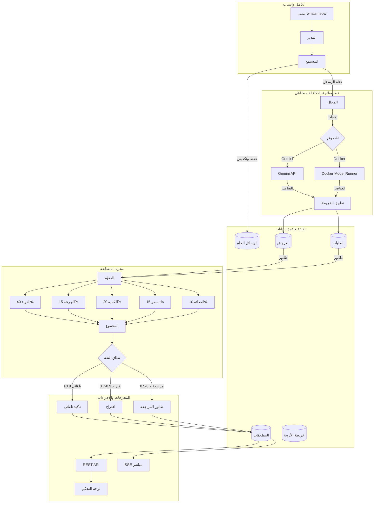

<div dir="rtl">

# فارما بروكر

> منصة تداول أدوية مدعومة بالذكاء الاصطناعي لمجموعات واتساب المصرية

[](https://golang.org)
[](LICENSE)

**فارما بروكر** يستقبل رسائل واتساب بالعربية، يستخرج عروض وطلبات الأدوية باستخدام الذكاء الاصطناعي، ويطابق العرض مع الطلب عبر نظام تقييم ذكي متعدد المعايير.

---

## ✨ المميزات

- **تحليل عربي بالذكاء الاصطناعي** - استخراج الأدوية من النصوص العربية غير الرسمية
- **دعم متعدد للموفرين** - Gemini Cloud أو نموذج محلي (Docker Model Runner)
- **مطابقة ذكية** - تقييم 5 أبعاد: الدواء، الجرعة، الكمية، السعر، الحداثة
- **لوحة تحكم فورية** - React SPA مع تحديثات SSE المباشرة
- **تعلم تكيفي** - أوزان المطابقة تتحسن ذاتياً بناءً على التغذية الراجعة
- **طابور المراجعة** - مراجعة يدوية للاستخراجات منخفضة الثقة

---

## 🏗️ البنية المعمارية



### كيف يعمل النظام

1. **تكامل واتساب**: مكتبة `whatsmeow` تتصل بواتساب ويب. المدير يتولى المصادقة والاتصال، بينما المستمع يستقبل الرسائل من المجموعات المراقَبة.

2. **معالجة الرسائل**: عند وصول رسالة، يحفظها المستمع في `RawMessages` ويضعها في الطابور عبر قناة داخلية. المحلل يجمع الرسائل ويرسلها لموفر الذكاء الاصطناعي.

3. **استخراج الذكاء الاصطناعي**: AI يحلل النص العربي غير الرسمي ويستخرج بيانات الدواء (الاسم، الجرعة، الكمية، السعر، النوع). تمر النتائج عبر `enforceMappings` لتوحيد أسماء الأدوية.

4. **تخزين العروض/الطلبات**: العناصر المستخرجة تُصنف كـ `OFFER` (البائع لديه دواء) أو `REQUEST` (المشتري يحتاج دواء) وتُحفظ في قاعدة البيانات.

5. **المطابقة الذكية**: المقيّم يستطلع العناصر الجديدة باستمرار ويحسب درجات المطابقة متعددة الأبعاد بين العروض والطلبات.

6. **إجراءات حسب الثقة**: بناءً على الدرجة الإجمالية، توجَّه المطابقات إلى:

   - **تلقائي** (≥0.9): تأكيد تلقائي
   - **اقتراح** (0.7-0.9): اقتراح للمشغل للموافقة السريعة
   - **مراجعة** (0.5-0.7): في طابور المراجعة اليدوية

7. **تحديثات فورية**: المطابقات المؤكدة تُبث عبر SSE للوحة التحكم React للمراقبة الحية.

---

## 🚀 البدء السريع

### المتطلبات الأساسية

- [Go 1.25+](https://golang.org/dl/)
- [Bun](https://bun.sh/) (للواجهة الأمامية)
- [Task](https://taskfile.dev/) (مشغل المهام)
- SQLite (مدمج)

### 1. استنساخ وإعداد

```bash
git clone https://github.com/sabry-awad97/pharma-broker.git
cd pharma-broker

# نسخ قالب البيئة
cp .env.example .env
```

### 2. إعداد موفر الذكاء الاصطناعي

عدّل `.env` أو `config.yaml`:

```yaml
# الخيار أ: Gemini Cloud (موصى به للإنتاج)
ai:
  provider: gemini

# في ملف .env
GEMINI_API_KEY=مفتاحك-هنا
```

```yaml
# الخيار ب: نموذج محلي (Docker Model Runner)
ai:
  provider: docker
docker_model:
  base_url: http://localhost:12434/engines/llama.cpp/v1
  model: ai/qwen3-vl:latest
```

### 3. البناء والتشغيل

```bash
# بناء كل شيء (العميل + الخادم)
task

# أو التشغيل في وضع التطوير
task dev:server
```

### 4. الوصول للوحة التحكم

افتح [http://localhost:8080](http://localhost:8080)

---

## 📋 الأوامر المتاحة

| الأمر                     | الوصف                       |
| ------------------------- | --------------------------- |
| `task`                    | بناء العميل + الخادم        |
| `task dev:server`         | تشغيل خادم Go (وضع التطوير) |
| `task dev:client`         | تشغيل خادم React للتطوير    |
| `task db:reset`           | إعادة تعيين قاعدة البيانات  |
| `task test:unit`          | تشغيل اختبارات الوحدة       |
| `task test:integration`   | تشغيل اختبارات التكامل      |
| `task playground:mapping` | اختبار خريطة الأدوية        |
| `task monitor`            | واجهة مراقبة المجموعات      |

---

## 📁 هيكل المشروع

```
pharma-broker/
├── cmd/
│   ├── app/           # نقطة الدخول الرئيسية
│   ├── serve.go       # إعداد خادم HTTP
│   └── playground/    # أدوات التطوير
├── internal/
│   ├── ai/            # التحليل، التقييم، التعلم
│   ├── api/           # معالجات REST، SSE، الملفات الثابتة
│   ├── domain/        # نماذج الكيانات
│   ├── storage/       # مستودعات GORM
│   ├── whatsapp/      # تكامل واتساب
│   └── monitor/       # التنبيهات (غرفة الحرب)
├── config.yaml        # إعدادات التطبيق
├── medications.json   # خريطة الأدوية (عربي → إنجليزي)
└── Taskfile.yml       # أوامر مشغل المهام
```

---

## ⚙️ الإعدادات

### متغيرات البيئة (`.env`)

| المتغير            | الوصف                | مطلوب                              |
| ------------------ | -------------------- | ---------------------------------- |
| `GEMINI_API_KEY`   | مفتاح Google AI API  | إذا كنت تستخدم Gemini              |
| `PB_AI_PROVIDER`   | `gemini` أو `docker` | لا (افتراضي: gemini)               |
| `PB_DATABASE_PATH` | مسار SQLite          | لا (افتراضي: data/pharmabroker.db) |

---

## 🔌 نقاط API

### الموارد الأساسية

| الطريقة | النقطة                      | الوصف                   |
| ------- | --------------------------- | ----------------------- |
| GET     | `/api/offers`               | قائمة العروض النشطة     |
| GET     | `/api/requests`             | قائمة الطلبات النشطة    |
| GET     | `/api/matches`              | قائمة المطابقات المعلقة |
| POST    | `/api/matches/{id}/confirm` | تأكيد مطابقة            |
| POST    | `/api/matches/{id}/reject`  | رفض مطابقة              |
| GET     | `/api/stats`                | إحصائيات لوحة التحكم    |

### طابور المراجعة

| الطريقة | النقطة                     | الوصف                   |
| ------- | -------------------------- | ----------------------- |
| GET     | `/api/review/queue`        | قائمة المراجعات المعلقة |
| POST    | `/api/review/{id}/approve` | موافقة مع تصحيحات       |
| POST    | `/api/review/{id}/reject`  | رفض العنصر              |

---

## 📊 خوارزمية المطابقة

يستخدم فارما بروكر تقييم متعدد المعايير:

| العامل  | الوزن | الوصف                          |
| ------- | ----- | ------------------------------ |
| الدواء  | 40%   | مطابقة ضبابية + تشابه المتجهات |
| الجرعة  | 15%   | مقارنة رقمية (مجم، جم، إلخ)    |
| الكمية  | 20%   | نسبة الوفاء                    |
| السعر   | 15%   | ملاءمة الميزانية               |
| الحداثة | 10%   | تناقص أسي (عمر نصفي 24 ساعة)   |

### نطاقات الثقة

| النطاق | الدرجة      | الإجراء       |
| ------ | ----------- | ------------- |
| تلقائي | ≥ 0.90      | تأكيد تلقائي  |
| اقتراح | 0.70 - 0.89 | اقتراح للمشغل |
| مراجعة | 0.50 - 0.69 | مراجعة يدوية  |
| لا شيء | < 0.50      | لا مطابقة     |

---

## 📄 الرخصة

رخصة MIT - انظر [LICENSE](LICENSE) للتفاصيل.

---

## 🙏 شكر وتقدير

- [whatsmeow](https://github.com/tulir/whatsmeow) - مكتبة عميل واتساب ويب
- [GORM](https://gorm.io/) - ORM لـ Go
- [Gemini](https://ai.google.dev/) - واجهة Google للذكاء الاصطناعي

</div>
