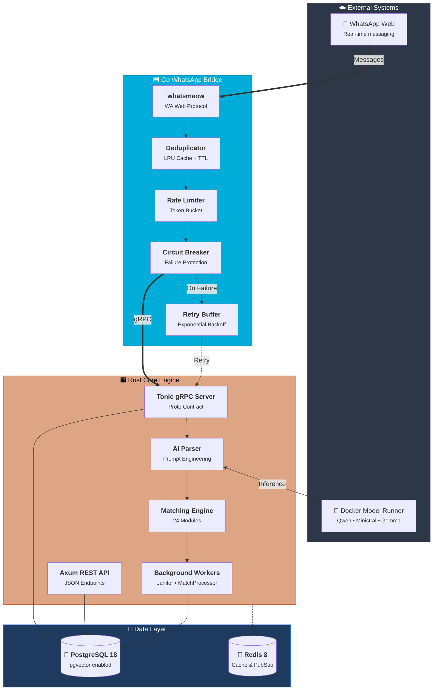
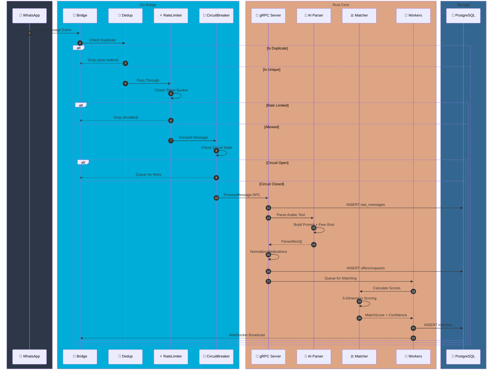
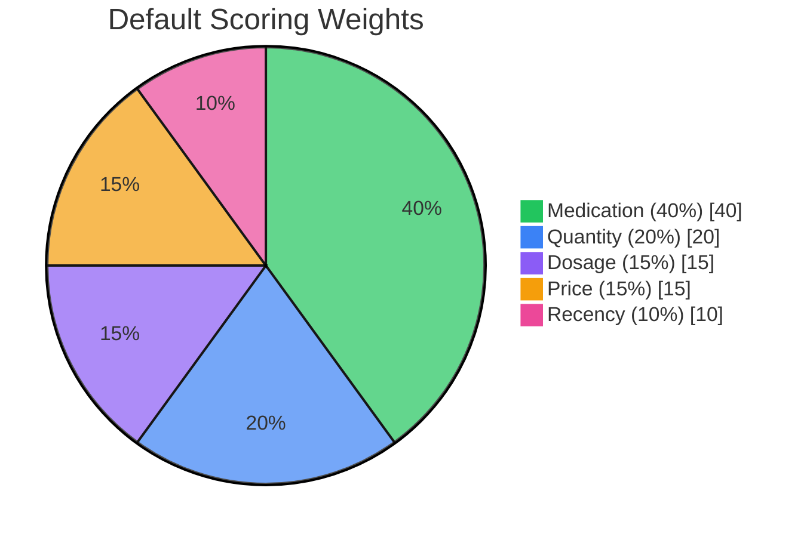
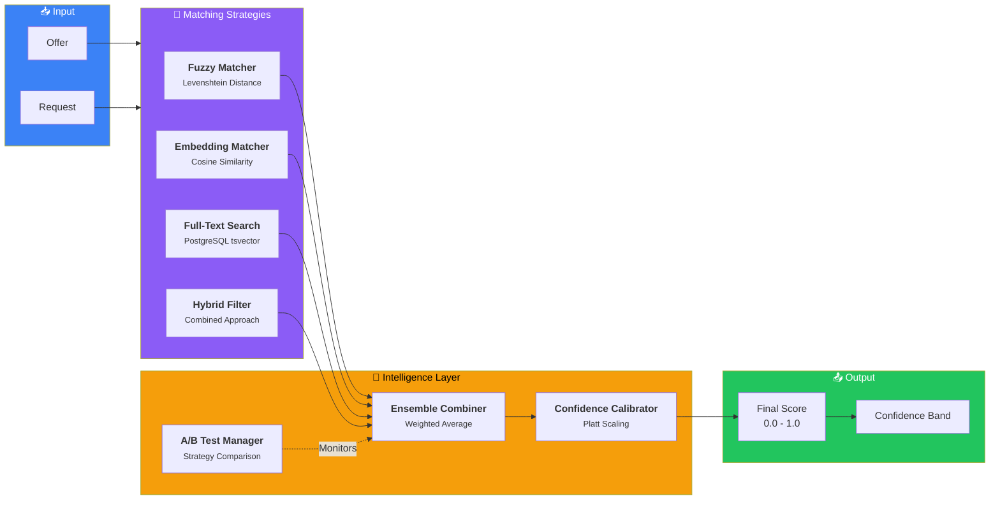
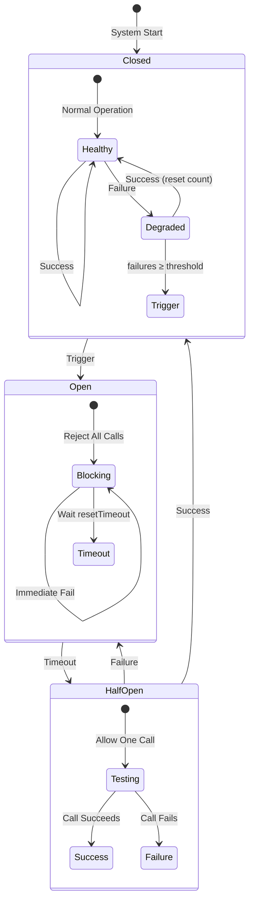

<p align="center">
  
</p>

<h1 align="center">🏥 PharmaBroker</h1>

<p align="center">
  <strong>🌍 AI-Powered Pharmaceutical Trading Platform for Egyptian WhatsApp Groups</strong>
</p>

<p align="center">
  <em>Bridging the gap between medication supply and demand through intelligent automation</em>
</p>

<p align="center">
  
</p>

<p align="center">
  <a href="https://golang.org"></a>
  <a href="https://www.rust-lang.org"></a>
  <a href="https://www.postgresql.org"></a>
  <a href="https://grpc.io"></a>
  <a href="LICENSE"></a>
</p>

<p align="center">
  <a href="#-features">Features</a> •
  <a href="#-architecture">Architecture</a> •
  <a href="#-quick-start">Quick Start</a> •
  <a href="#-api-reference">API</a> •
  <a href="#-contributing">Contributing</a>
</p>

---

## 📖 Overview

**PharmaBroker** is an enterprise-grade, polyglot microservices platform designed to revolutionize pharmaceutical trading in Egypt. The system seamlessly integrates with WhatsApp groups where pharmacists and distributors exchange medication offers and requests in Arabic.

Using advanced **Natural Language Processing** powered by local AI models, PharmaBroker automatically extracts structured medication data from informal Arabic text, then employs a sophisticated **24-module matching engine** to connect supply with demand in real-time.

### 🎯 The Problem We Solve

In Egypt's pharmaceutical market, medication shortages are common. Pharmacists rely on WhatsApp groups to find medications, but:

- **Manual monitoring** of hundreds of daily messages is exhausting
- **Missed opportunities** when matching offers/requests aren't seen in time
- **No tracking** of historical trades or pricing trends
- **Language barriers** - informal Arabic text is hard to parse programmatically

### 💡 Our Solution

PharmaBroker provides an **intelligent automation layer** that:

1. **Ingests** WhatsApp messages in real-time
2. **Parses** informal Arabic using local LLMs (no data leaves your infrastructure)
3. **Matches** offers with requests using ML-optimized scoring
4. **Learns** from operator feedback to continuously improve
5. **Notifies** operators of high-confidence matches for quick action

---

## ✨ Features

<table>
<tr>
<td width="50%">

### 🤖 Intelligent AI Parsing

- **Arabic NLP** extraction from informal Egyptian dialect
- **Multi-model support**: Qwen, Ministral, Gemma
- **Local inference** via Docker Model Runner
- **Feedback loop** for continuous improvement

</td>
<td width="50%">

### ⚖️ Advanced Matching Engine

- **24 specialized modules** working in harmony
- **Ensemble strategies**: fuzzy, embedding, full-text
- **A/B testing framework** for strategy optimization
- **Confidence calibration** using Platt scaling

</td>
</tr>
<tr>
<td width="50%">

### 🧠 Adaptive Learning

- **Gradient descent** weight optimization
- **Warm-start manager** for new deployments
- **Outlier detection** for data quality
- **Historical affinity** learning

</td>
<td width="50%">

### 🛡️ Enterprise Resilience

- **Circuit breaker** pattern (Open/Closed/Half-Open)
- **Token rate limiting** with burst support
- **Message deduplication** with LRU cache
- **Retry buffer** with exponential backoff

</td>
</tr>
<tr>
<td width="50%">

### 📊 Real-time Observability

- **WebSocket** live updates
- **Prometheus metrics** integration
- **Structured logging** (zerolog/tracing)
- **Comprehensive audit trail**

</td>
<td width="50%">

### 🔒 Production Ready

- **Graceful shutdown** with drain periods
- **Health checks** and readiness probes
- **Docker Compose** orchestration
- **Horizontal scalability**

</td>
</tr>
</table>

---

## 🏗️ Architecture

PharmaBroker employs a **polyglot microservices architecture** that leverages the strengths of both Go and Rust:

| Component           | Language   | Responsibility                                                |
| ------------------- | ---------- | ------------------------------------------------------------- |
| **WhatsApp Bridge** | Go         | Real-time message ingestion, resilience patterns, gRPC client |
| **Core Engine**     | Rust       | AI parsing, matching, business logic, REST/gRPC servers       |
| **Database**        | PostgreSQL | Persistent storage with pgvector for embeddings               |
| **Cache**           | Redis      | Distributed caching and pub/sub (future)                      |

### System Overview



---

## 📨 Message Processing Pipeline

Every WhatsApp message flows through a carefully orchestrated pipeline, from ingestion to match notification:



---

## ⚖️ Matching Engine Deep Dive

The heart of PharmaBroker is its **24-module matching engine**, a sophisticated system that combines multiple strategies for optimal match quality.

### Scoring Dimensions

The matcher evaluates offer-request pairs across five weighted dimensions:



| Dimension         | Weight | Algorithm                | Description                                                          |
| ----------------- | ------ | ------------------------ | -------------------------------------------------------------------- |
| **💊 Medication** | 40%    | Fuzzy + Embedding Cosine | Matches medication names using edit distance and semantic similarity |
| **📦 Quantity**   | 20%    | Fulfillment Ratio        | Calculates `min(offered, requested) / requested`                     |
| **💉 Dosage**     | 15%    | Normalized Comparison    | Parses units (mg, g, ml) and compares numerically                    |
| **💰 Price**      | 15%    | Budget Fit               | Score = 1.0 if `offer_price ≤ max_price`, else scaled                |
| **⏰ Recency**    | 10%    | Exponential Decay        | Fresher items score higher (24h half-life default)                   |

### Ensemble Architecture

The matching engine doesn't rely on a single strategy. Instead, it uses an **ensemble of strategies** that are weighted and combined:



### Confidence Bands & Actions

Based on the final calibrated score, matches are routed to different actions:

| Band |   Score Range   | Action      | Description                                  |
| :--: | :-------------: | ----------- | -------------------------------------------- |
|  🟢  |   **≥ 0.90**    | **AUTO**    | Automatically confirmed - highest confidence |
|  🟡  | **0.70 - 0.89** | **SUGGEST** | Suggested to operator for quick approval     |
|  🟠  | **0.50 - 0.69** | **REVIEW**  | Queued for detailed manual review            |
|  🔴  |   **< 0.50**    | **NONE**    | No match - scores too low                    |

### Module Reference

The matching engine comprises 24 specialized modules:

<details>
<summary><strong>📋 Click to expand full module list</strong></summary>

| Module            | File                 | Purpose                                   |
| ----------------- | -------------------- | ----------------------------------------- |
| `scorer`          | `scorer.rs`          | Multi-dimensional weighted scoring        |
| `learner`         | `learner.rs`         | Gradient descent weight optimization      |
| `calibration`     | `calibration.rs`     | Platt scaling for probability calibration |
| `confidence`      | `confidence.rs`      | Confidence band classification            |
| `ensemble`        | `ensemble.rs`        | Strategy combination framework            |
| `abtest`          | `abtest.rs`          | A/B testing infrastructure                |
| `warm_start`      | `warm_start.rs`      | Bootstrap from historical patterns        |
| `historical`      | `historical.rs`      | Medication affinity learning              |
| `filter`          | `filter.rs`          | Pre-match filtering rules                 |
| `hybrid_filter`   | `hybrid_filter.rs`   | Combined filtering strategies             |
| `fts_search`      | `fts_search.rs`      | PostgreSQL full-text search               |
| `embedding_cache` | `embedding_cache.rs` | Vector cache with synonyms                |
| `thresholds`      | `thresholds.rs`      | Smooth threshold calculation              |
| `audit`           | `audit.rs`           | Action logging                            |
| `scheduler`       | `scheduler.rs`       | Learning job scheduling                   |
| `weights`         | `weights.rs`         | Weight configuration                      |
| `score_types`     | `score_types.rs`     | Type definitions                          |
| `actions`         | `actions.rs`         | Auto-action handlers                      |
| `arabic`          | `arabic.rs`          | Arabic text normalization                 |
| `dosage`          | `dosage.rs`          | Dosage parsing and comparison             |
| `fuzzy`           | `fuzzy.rs`           | Fuzzy string matching                     |
| `service`         | `service.rs`         | Matching service interface                |
| `engine`          | `engine.rs`          | Core engine orchestration                 |
| `mod`             | `mod.rs`             | Module exports                            |

</details>

---

## 🛡️ Resilience Patterns

The Go Bridge implements **battle-tested resilience patterns** to ensure reliable operation even under adverse conditions:

### Circuit Breaker State Machine



### Resilience Components

| Component           | Pattern             | Configuration             | Purpose                           |
| ------------------- | ------------------- | ------------------------- | --------------------------------- |
| **Circuit Breaker** | Fail-Fast           | 5 failures → 30s timeout  | Prevents cascade failures to Core |
| **Rate Limiter**    | Token Bucket        | 100/min, burst 20         | Protects against message floods   |
| **Deduplicator**    | LRU Cache           | 10k entries, 5min TTL     | Filters duplicate messages        |
| **Retry Buffer**    | Exponential Backoff | 1000 msg buffer, 5s flush | Handles temporary failures        |

---

## 📁 Project Structure

```
pharma-broker/
│
├── 🟦 bridge/                      # Go WhatsApp Bridge
│   ├── adapters/                   # Infrastructure adapters
│   │   ├── grpc/                   # → gRPC client to Rust Core
│   │   ├── qr/                     # → QR code HTTP handler
│   │   ├── resilience/             # → Retry sender
│   │   └── whatsapp/               # → whatsmeow adapter
│   ├── app/                        # Application orchestration
│   │   └── bridge.go               # → Core bridge logic
│   ├── domain/                     # Domain models
│   │   ├── message.go              # → Message entity
│   │   └── types.go                # → Strong types (JID, Phone)
│   ├── ports/                      # Interface definitions
│   │   ├── inbound.go              # → MessageSource, QRHandler
│   │   ├── outbound.go             # → MessageSink, GroupRepo
│   │   └── policies.go             # → Resilience interfaces
│   ├── resilience/                 # Resilience implementations
│   │   ├── circuit_breaker.go      # → Circuit breaker
│   │   └── rate_limiter.go         # → Token bucket limiter
│   ├── deduplicator/               # Message deduplication
│   └── cmd/bridge/                 # Entry point
│
├── 🟧 core/                        # Rust Core Engine
│   ├── crates/
│   │   ├── db/                     # Database layer (SeaORM)
│   │   │   ├── entity/             # → ORM entities
│   │   │   ├── migration/          # → Schema migrations
│   │   │   ├── repo/               # → Repository implementations
│   │   │   ├── traits/             # → Repository interfaces
│   │   │   └── service/            # → Business services
│   │   └── ai-client/              # Generic AI client library
│   ├── src/
│   │   ├── ai/                     # AI subsystem
│   │   │   ├── pharma_parser.rs    # → Message parser
│   │   │   ├── feedback_loop.rs    # → Learning from corrections
│   │   │   └── token_batcher.rs    # → Efficient batching
│   │   ├── api/                    # REST API (Axum)
│   │   │   ├── handlers.rs         # → Endpoint handlers
│   │   │   └── routes.rs           # → Router configuration
│   │   ├── grpc/                   # gRPC server (Tonic)
│   │   │   ├── server.rs           # → Service implementation
│   │   │   └── params.rs           # → Request/Response types
│   │   ├── matching/               # Matching engine (24 modules)
│   │   ├── worker/                 # Background workers
│   │   │   ├── janitor.rs          # → Data cleanup
│   │   │   └── match_processor.rs  # → Queue processing
│   │   └── main.rs                 # → Application entry
│   └── tests/                      # Integration tests
│
├── 📜 proto/                       # gRPC Definitions
│   └── pharma.proto                # → Service contract
│
├── 🗃️ migrations/                  # SQL migrations
├── 📊 monitoring/                  # Prometheus/Grafana configs
├── 🐳 docker-compose.yaml          # Full stack orchestration
└── 📋 Taskfile.yml                 # Development automation
```

---

## 🔌 gRPC Service Contract

The Rust Core exposes a well-defined gRPC service (`proto/pharma.proto`):

```protobuf
service PharmaCore {
    rpc ProcessMessage(RawMessage) returns (ProcessResponse);
    rpc GetStats(StatsRequest) returns (StatsResponse);
    rpc HealthCheck(HealthRequest) returns (HealthResponse);
    rpc GetMonitoredGroups(MonitoredGroupsRequest) returns (MonitoredGroupsResponse);
    rpc SyncGroups(SyncGroupsRequest) returns (SyncGroupsResponse);
}
```

| RPC                    | Description                            | Use Case                         |
| ---------------------- | -------------------------------------- | -------------------------------- |
| **ProcessMessage**     | Processes an incoming WhatsApp message | Bridge → Core message forwarding |
| **GetStats**           | Returns system statistics              | Dashboard metrics                |
| **HealthCheck**        | Verifies service health                | Kubernetes probes                |
| **GetMonitoredGroups** | Lists monitored group JIDs             | Bridge group filtering           |
| **SyncGroups**         | Syncs WhatsApp groups to DB            | Initial group discovery          |

---

## 🚀 Quick Start

### Prerequisites

| Tool                                                                          | Version | Purpose            |
| ----------------------------------------------------------------------------- | ------- | ------------------ |
| [Go](https://golang.org/dl/)                                                  | 1.25+   | WhatsApp Bridge    |
| [Rust](https://rustup.rs/)                                                    | 1.75+   | Core Engine        |
| [Docker](https://www.docker.com/)                                             | 24+     | Container runtime  |
| [Task](https://taskfile.dev/)                                                 | 3+      | Build automation   |
| [Docker Model Runner](https://docs.docker.com/desktop/features/model-runner/) | Latest  | Local AI inference |

### 1. Clone & Configure

```bash
# Clone the repository
git clone https://github.com/sabry-awad97/pharma-broker.git
cd pharma-broker

# Copy environment configuration
cp .env.example .env

# Review and customize settings
nano .env
```

### 2. Start Infrastructure

```bash
# Start PostgreSQL and Redis
docker compose up -d postgres redis

# Wait for PostgreSQL to be healthy
docker compose logs -f postgres

# Pull AI models (first time only, ~3-5GB total)
docker model pull ai/qwen3-vl:latest
docker model pull ai/embeddinggemma:latest
```

### 3. Run the Application

<details>
<summary><strong>🐳 Option A: Docker Compose (Recommended)</strong></summary>

```bash
# Start all services
docker compose up -d

# View logs
docker compose logs -f core bridge

# Access services
# REST API:  http://localhost:8080
# gRPC:      grpc://localhost:50051
# QR Code:   http://localhost:5050/qr
```

</details>

<details>
<summary><strong>💻 Option B: Local Development</strong></summary>

```bash
# Terminal 1: Start Rust Core
cd core
cargo run --release

# Terminal 2: Start Go Bridge
cd bridge
go run ./cmd/bridge

# Access QR code at http://localhost:5050/qr
```

</details>

### 4. Connect WhatsApp

1. Open http://localhost:5050/qr in your browser
2. Scan the QR code with WhatsApp on your phone
3. The bridge will start receiving messages

---

## 📋 Task Runner Commands

PharmaBroker uses [Task](https://taskfile.dev/) for build automation:

```bash
# Full stack commands (root directory)
task                      # Build everything
task up                   # docker compose up -d
task down                 # docker compose down
task logs                 # View all logs
task dev:core             # Run Rust Core (dev mode)
task dev:bridge           # Run Go Bridge (dev mode)

# Core-specific commands (core/ directory)
task check                # cargo check --all-targets
task test                 # cargo test
task clippy               # cargo clippy --fix
task build                # cargo build --release
task clean                # cargo clean
```

---

## ⚙️ Configuration Reference

### Environment Variables

| Variable                     | Default                  | Description                                 |
| ---------------------------- | ------------------------ | ------------------------------------------- |
| `DATABASE_URL`               | `postgres://...`         | PostgreSQL connection string                |
| `REDIS_URL`                  | `redis://localhost:6379` | Redis connection string                     |
| `API_PORT`                   | `8080`                   | REST API port                               |
| `GRPC_PORT`                  | `50051`                  | gRPC server port                            |
| `RUST_LOG`                   | `info`                   | Log level (trace, debug, info, warn, error) |
| `AI_BASE_URL`                | Docker internal          | AI model endpoint                           |
| `AI_MODEL`                   | `ai/qwen3-vl:latest`     | Primary LLM model                           |
| `LEARNING_SCHEDULER_ENABLED` | `false`                  | Enable weight learning cron                 |
| `LEARNING_SCHEDULER_CRON`    | `0 0 3 * * *`            | Learning schedule (3 AM daily)              |
| `JANITOR_INTERVAL_SECS`      | `3600`                   | Cleanup worker interval                     |
| `JANITOR_RETENTION_DAYS`     | `30`                     | Data retention period                       |

### Bridge Configuration (`bridge/config.yml`)

```yaml
# gRPC connection to Rust Core
grpc:
  core_addr: "localhost:50051"
  connect_timeout: 5s

# WhatsApp settings
whatsapp:
  store_path: "./data/whatsapp.db"
  qr_terminal: true
  qr_timeout: 60s
  qr_retries: 3

# Resilience configuration
resilience:
  circuit_breaker:
    max_failures: 5
    timeout: 30s
  retry_buffer:
    max_size: 1000
    flush_interval: 5s

# Rate limiting
rate_limit:
  enabled: true
  per_minute: 100
  burst_size: 20

# Message processing
processing:
  skip_own_messages: true
  worker_count: 20
  worker_queue_size: 100

# Group synchronization
group_sync:
  interval: 5m

# Deduplication
dedup:
  window: 30s
  cache_size: 10000
  cache_ttl: 5m
  cleanup_interval: 1m
```

---

## 🔗 REST API Reference

### Core Endpoints

<details>
<summary><strong>📦 Offers & Requests</strong></summary>

| Method | Path                | Description                          |
| ------ | ------------------- | ------------------------------------ |
| `GET`  | `/api/offers`       | List active offers with pagination   |
| `GET`  | `/api/offers/:id`   | Get offer by ID                      |
| `GET`  | `/api/requests`     | List active requests with pagination |
| `GET`  | `/api/requests/:id` | Get request by ID                    |

</details>

<details>
<summary><strong>🤝 Matches</strong></summary>

| Method | Path                       | Description          |
| ------ | -------------------------- | -------------------- |
| `GET`  | `/api/matches`             | List pending matches |
| `GET`  | `/api/matches/:id`         | Get match details    |
| `POST` | `/api/matches/:id/confirm` | Confirm a match      |
| `POST` | `/api/matches/:id/reject`  | Reject a match       |
| `GET`  | `/api/matches/stats`       | Match statistics     |

</details>

<details>
<summary><strong>👥 Groups</strong></summary>

| Method   | Path                       | Description           |
| -------- | -------------------------- | --------------------- |
| `GET`    | `/api/groups`              | List all groups       |
| `GET`    | `/api/groups/monitored`    | List monitored groups |
| `POST`   | `/api/groups/:jid/monitor` | Enable monitoring     |
| `DELETE` | `/api/groups/:jid/monitor` | Disable monitoring    |

</details>

<details>
<summary><strong>⚖️ Matching Engine</strong></summary>

| Method | Path                     | Description              |
| ------ | ------------------------ | ------------------------ |
| `GET`  | `/api/weights`           | Current matching weights |
| `PUT`  | `/api/weights`           | Update weights           |
| `POST` | `/api/weights/learn`     | Trigger learning job     |
| `GET`  | `/api/calibration/stats` | Calibration metrics      |
| `GET`  | `/api/abtest/stats`      | A/B test results         |
| `POST` | `/api/abtest/create`     | Create A/B test          |

</details>

<details>
<summary><strong>🔍 Review Queue</strong></summary>

| Method | Path                      | Description              |
| ------ | ------------------------- | ------------------------ |
| `GET`  | `/api/review/queue`       | Pending reviews          |
| `POST` | `/api/review/:id/approve` | Approve with corrections |
| `POST` | `/api/review/:id/reject`  | Reject item              |
| `GET`  | `/api/review/stats`       | Queue statistics         |

</details>

<details>
<summary><strong>📊 System</strong></summary>

| Method | Path         | Description          |
| ------ | ------------ | -------------------- |
| `GET`  | `/health`    | Health check         |
| `GET`  | `/metrics`   | Prometheus metrics   |
| `GET`  | `/api/stats` | Dashboard statistics |
| `GET`  | `/api/audit` | Audit log entries    |

</details>

### WebSocket Events

Connect to `/api/ws` for real-time updates:

```json
{ "type": "match_created", "data": { "id": "...", "score": 0.92 } }
{ "type": "match_confirmed", "data": { "id": "...", "operator": "..." } }
{ "type": "new_offer", "data": { "id": "...", "medication": "..." } }
{ "type": "new_request", "data": { "id": "...", "medication": "..." } }
```

---

## 🧪 Testing

### Unit Tests

```bash
# Go tests
cd bridge && go test ./... -v

# Rust tests
cd core && cargo test

# With coverage
cd core && cargo llvm-cov --html
open target/llvm-cov/html/index.html
```

### Integration Tests

```bash
# Requires Docker (testcontainers)
cd core && cargo test --features integration-tests

# Specific test
cargo test test_matching_engine --features integration-tests
```

### Load Testing

```bash
# Using k6 (install: https://k6.io)
k6 run tests/load/matching.js
```

---

## 🤝 Contributing

We welcome contributions! Please follow these steps:

1. **Fork** the repository
2. **Create** a feature branch (`git checkout -b feature/amazing-feature`)
3. **Write** tests for your changes
4. **Run** the test suite (`task test`)
5. **Commit** with conventional commits (`git commit -m 'feat: add amazing feature'`)
6. **Push** to your branch (`git push origin feature/amazing-feature`)
7. **Open** a Pull Request

### Code Style

- **Go**: Follow [Effective Go](https://golang.org/doc/effective_go) and use `gofmt`
- **Rust**: Follow [Rust API Guidelines](https://rust-lang.github.io/api-guidelines/) and use `cargo fmt`

---

## 📄 License

This project is licensed under the MIT License - see the [LICENSE](LICENSE) file for details.

---

## 🙏 Acknowledgments

<table>
<tr>
<td align="center">
<a href="https://github.com/tulir/whatsmeow">
<strong>whatsmeow</strong><br/>
<sub>WhatsApp Web Go library</sub>
</a>
</td>
<td align="center">
<a href="https://www.sea-ql.org/SeaORM/">
<strong>SeaORM</strong><br/>
<sub>Async ORM for Rust</sub>
</a>
</td>
<td align="center">
<a href="https://github.com/tokio-rs/axum">
<strong>Axum</strong><br/>
<sub>Web framework for Rust</sub>
</a>
</td>
<td align="center">
<a href="https://github.com/hyperium/tonic">
<strong>Tonic</strong><br/>
<sub>gRPC for Rust</sub>
</a>
</td>
</tr>
<tr>
<td align="center">
<a href="https://github.com/uber-go/fx">
<strong>Uber FX</strong><br/>
<sub>DI framework for Go</sub>
</a>
</td>
<td align="center">
<a href="https://docs.docker.com/desktop/features/model-runner/">
<strong>Docker Model Runner</strong><br/>
<sub>Local AI inference</sub>
</a>
</td>
<td align="center">
<a href="https://github.com/pgvector/pgvector">
<strong>pgvector</strong><br/>
<sub>Vector similarity for PostgreSQL</sub>
</a>
</td>
<td align="center">
<a href="https://github.com/rs/zerolog">
<strong>zerolog</strong><br/>
<sub>Fast structured logging</sub>
</a>
</td>
</tr>
</table>

---

<p align="center">
  Made with ❤️ for the Egyptian pharmaceutical community
</p>
