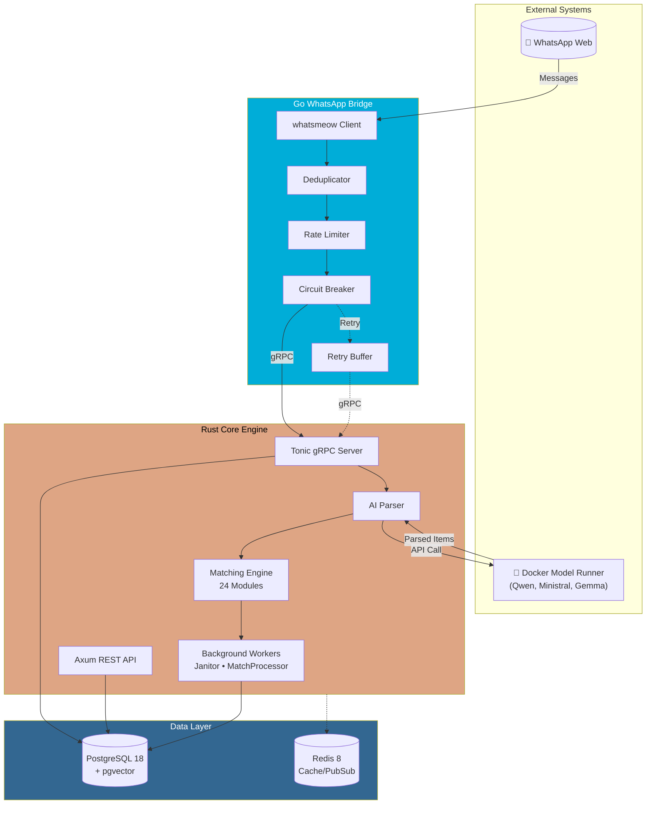
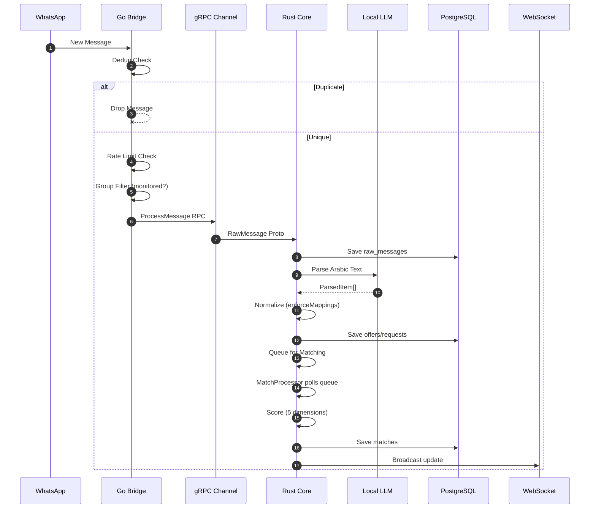
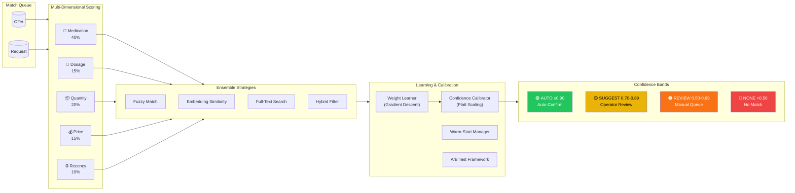
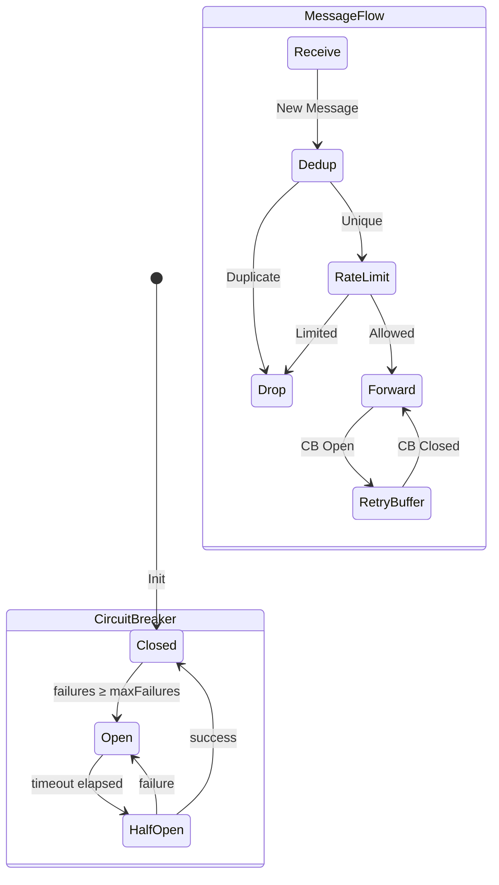

# PharmaBroker

> **AI-Powered Pharmaceutical Trading Platform for Egyptian WhatsApp Groups**

[](https://golang.org)
[](https://www.rust-lang.org)
[](https://www.postgresql.org)
[](https://grpc.io)
[](LICENSE)

PharmaBroker is a polyglot microservices platform that ingests Arabic WhatsApp messages, extracts medication offers/requests using local AI models, and matches supply with demand via an intelligent 24-module matching engine.

---

## ✨ Features

| Category                 | Features                                                                                    |
| ------------------------ | ------------------------------------------------------------------------------------------- |
| **AI Parsing**           | Arabic NLP extraction from informal Egyptian text using local LLMs (Qwen, Ministral, Gemma) |
| **Intelligent Matching** | 24-module engine with ensemble strategies, A/B testing, confidence calibration              |
| **Adaptive Learning**    | Self-optimizing weights based on operator feedback with warm-start support                  |
| **Resilience**           | Circuit breaker, rate limiting, deduplication, retry buffers                                |
| **Real-time**            | WebSocket updates, SSE streaming, gRPC inter-service communication                          |
| **Observability**        | Prometheus metrics, structured logging, audit trails                                        |

---

## 🏗️ System Architecture

PharmaBroker uses a **polyglot microservices architecture** with a Go WhatsApp Bridge communicating via gRPC to a Rust Core Engine.



---

## 📨 Message Processing Flow

The complete lifecycle of a WhatsApp message through the system:



---

## ⚖️ Matching Engine Architecture

The 24-module matching engine provides intelligent, self-optimizing matching:



### Matching Engine Modules

| Module            | Purpose                                      |
| ----------------- | -------------------------------------------- |
| `scorer`          | Multi-dimensional weighted scoring           |
| `learner`         | Gradient descent weight optimization         |
| `calibration`     | Platt scaling for probability calibration    |
| `confidence`      | Confidence band classification               |
| `ensemble`        | Strategy combination (fuzzy, embedding, FTS) |
| `abtest`          | A/B testing framework for strategies         |
| `warm_start`      | Bootstrap from historical data               |
| `historical`      | Medication affinity learning                 |
| `filter`          | Pre-match filtering rules                    |
| `hybrid_filter`   | Combined filtering strategies                |
| `fts_search`      | PostgreSQL full-text search                  |
| `embedding_cache` | Vector embedding cache with synonyms         |
| `thresholds`      | Smooth threshold calculation                 |
| `audit`           | Action logging and audit trail               |
| `scheduler`       | Learning job scheduling (cron)               |

---

## 🛡️ Resilience Architecture

The Go Bridge implements enterprise-grade resilience patterns:



| Pattern             | Implementation                        | Purpose                                   |
| ------------------- | ------------------------------------- | ----------------------------------------- |
| **Circuit Breaker** | `resilience/circuit_breaker.go`       | Prevents cascade failures to Core         |
| **Rate Limiter**    | `resilience/rate_limiter.go`          | Token bucket with burst support           |
| **Deduplicator**    | `deduplicator/deduplicator.go`        | LRU cache with TTL, same-sender detection |
| **Retry Buffer**    | `adapters/resilience/retry_sender.go` | Exponential backoff with jitter           |

---

## 📁 Project Structure

```
pharma-broker/
├── bridge/                     # 🟦 Go WhatsApp Bridge (Hexagonal Architecture)
│   ├── adapters/
│   │   ├── grpc/              # gRPC client to Rust Core
│   │   ├── qr/                # QR code HTTP handler
│   │   ├── resilience/        # Retry sender adapter
│   │   └── whatsapp/          # whatsmeow adapter
│   ├── app/                   # Bridge orchestration logic
│   ├── domain/                # Strong types (JID, MessageID, Phone)
│   ├── ports/                 # Inbound/Outbound interfaces
│   ├── resilience/            # Circuit breaker, rate limiter
│   ├── deduplicator/          # Message deduplication
│   └── cmd/bridge/            # Entry point
│
├── core/                       # 🟧 Rust Core Engine
│   ├── crates/
│   │   ├── db/                # SeaORM database layer
│   │   │   ├── entity/        # ORM entities
│   │   │   ├── migration/     # Database migrations
│   │   │   ├── repo/          # Repository implementations
│   │   │   └── traits/        # Repository interfaces
│   │   └── ai-client/         # Generic AI client library
│   ├── src/
│   │   ├── ai/                # AI parsing, feedback loop, token batcher
│   │   ├── api/               # Axum REST handlers
│   │   ├── grpc/              # Tonic gRPC server
│   │   ├── matching/          # 24-module matching engine
│   │   ├── worker/            # Background workers
│   │   └── main.rs            # Entry point
│   └── tests/                 # Integration tests
│
├── proto/                      # 📜 Shared gRPC Definitions
│   └── pharma.proto           # Service contract
│
├── migrations/                 # 🗃️ SQL Migrations (init-db.sh)
├── docker-compose.yaml        # 🐳 Full stack orchestration
└── Taskfile.yml               # 📋 Development automation
```

---

## 🔌 gRPC API

The Rust Core exposes a gRPC service defined in `proto/pharma.proto`:

| RPC Method           | Request                  | Response                  | Description                                   |
| -------------------- | ------------------------ | ------------------------- | --------------------------------------------- |
| `ProcessMessage`     | `RawMessage`             | `ProcessResponse`         | Process incoming WhatsApp message             |
| `GetStats`           | `StatsRequest`           | `StatsResponse`           | System statistics (offers, requests, matches) |
| `HealthCheck`        | `HealthRequest`          | `HealthResponse`          | Service health and version                    |
| `GetMonitoredGroups` | `MonitoredGroupsRequest` | `MonitoredGroupsResponse` | List of monitored group JIDs                  |
| `SyncGroups`         | `SyncGroupsRequest`      | `SyncGroupsResponse`      | Sync WhatsApp groups to database              |

---

## 🚀 Quick Start

### Prerequisites

- [Go 1.25+](https://golang.org/dl/)
- [Rust 1.75+](https://rustup.rs/)
- [Task](https://taskfile.dev/) (task runner)
- [Docker](https://www.docker.com/) with Docker Compose v2
- [Docker Model Runner](https://docs.docker.com/desktop/features/model-runner/) (for local AI)

### 1. Clone & Setup

```bash
git clone https://github.com/sabry-awad97/pharma-broker.git
cd pharma-broker

# Copy environment template
cp .env.example .env
```

### 2. Start Infrastructure

```bash
# Start PostgreSQL, Redis, and pull AI models
docker compose up -d postgres redis

# Pull AI models (first time only)
docker model pull ai/qwen3-vl:latest
docker model pull ai/embeddinggemma:latest
```

### 3. Build & Run

```bash
# Option A: Docker Compose (recommended)
docker compose up -d

# Option B: Local development
task dev:core    # Terminal 1: Rust Core
task dev:bridge  # Terminal 2: Go Bridge
```

### 4. Access Services

| Service  | URL                          | Description         |
| -------- | ---------------------------- | ------------------- |
| REST API | http://localhost:8080        | Axum REST endpoints |
| gRPC     | grpc://localhost:50051       | Tonic gRPC server   |
| QR Code  | http://localhost:5050/qr     | WhatsApp pairing    |
| Health   | http://localhost:5050/health | Bridge health check |

---

## 📋 Available Commands

```bash
# Root Taskfile (full stack)
task                    # Build everything
task dev:core           # Run Rust Core (dev mode)
task dev:bridge         # Run Go Bridge (dev mode)
task db:reset           # Reset database
task test               # Run all tests

# Core-specific (from core/ directory)
task check              # cargo check --all-targets
task test               # cargo test
task clippy             # cargo clippy --fix
task build              # cargo build --release
```

---

## ⚙️ Configuration

### Environment Variables

| Variable                     | Description                  | Default                                                    |
| ---------------------------- | ---------------------------- | ---------------------------------------------------------- |
| `DATABASE_URL`               | PostgreSQL connection string | `postgres://...`                                           |
| `GRPC_PORT`                  | Rust Core gRPC port          | `50051`                                                    |
| `API_PORT`                   | Rust Core REST port          | `8080`                                                     |
| `AI_BASE_URL`                | Docker Model Runner URL      | `http://model-runner.docker.internal/engines/llama.cpp/v1` |
| `LEARNING_SCHEDULER_ENABLED` | Enable weight learning cron  | `false`                                                    |
| `JANITOR_INTERVAL_SECS`      | Cleanup worker interval      | `3600`                                                     |

### Bridge Configuration (`bridge/config.yml`)

```yaml
grpc:
  core_addr: "localhost:50051"
  connect_timeout: 5s

whatsapp:
  store_path: "./data/whatsapp.db"
  qr_terminal: true
  qr_timeout: 60s

resilience:
  circuit_breaker:
    max_failures: 5
    timeout: 30s
  retry_buffer:
    max_size: 1000
    flush_interval: 5s

rate_limit:
  enabled: true
  per_minute: 100
  burst_size: 20
```

---

## 🔗 API Endpoints

### Core Resources

| Method | Endpoint                    | Description             |
| ------ | --------------------------- | ----------------------- |
| `GET`  | `/api/offers`               | List active offers      |
| `GET`  | `/api/requests`             | List active requests    |
| `GET`  | `/api/matches`              | List pending matches    |
| `POST` | `/api/matches/{id}/confirm` | Confirm a match         |
| `POST` | `/api/matches/{id}/reject`  | Reject a match          |
| `GET`  | `/api/stats`                | Dashboard statistics    |
| `GET`  | `/api/groups`               | List monitored groups   |
| `POST` | `/api/groups/{jid}/monitor` | Enable group monitoring |

### Review Queue

| Method | Endpoint                   | Description              |
| ------ | -------------------------- | ------------------------ |
| `GET`  | `/api/review/queue`        | Pending review items     |
| `POST` | `/api/review/{id}/approve` | Approve with corrections |
| `POST` | `/api/review/{id}/reject`  | Reject item              |

### Matching Engine

| Method | Endpoint                 | Description              |
| ------ | ------------------------ | ------------------------ |
| `GET`  | `/api/weights`           | Current matching weights |
| `POST` | `/api/weights/learn`     | Trigger weight learning  |
| `GET`  | `/api/calibration/stats` | Calibration statistics   |
| `GET`  | `/api/abtest/stats`      | A/B test results         |

### Real-time

| Method | Endpoint   | Description           |
| ------ | ---------- | --------------------- |
| `GET`  | `/api/ws`  | WebSocket connection  |
| `GET`  | `/metrics` | Prometheus metrics    |
| `GET`  | `/health`  | Health check endpoint |

---

## 🧪 Testing

```bash
# Unit tests (both languages)
task test:unit

# Integration tests (requires Docker)
task test:integration

# Rust tests with coverage
cd core && cargo llvm-cov --html

# Go tests with coverage
cd bridge && go test ./... -cover
```

---

## 📊 Matching Algorithm Details

### Scoring Dimensions

| Factor         | Weight | Algorithm                           |
| -------------- | ------ | ----------------------------------- |
| **Medication** | 40%    | Fuzzy + embedding cosine similarity |
| **Dosage**     | 15%    | Normalized numeric comparison       |
| **Quantity**   | 20%    | Fulfillment ratio calculation       |
| **Price**      | 15%    | Budget fit (offer ≤ max_price)      |
| **Recency**    | 10%    | Exponential decay (24h half-life)   |

### Confidence Bands

| Band       | Score Range | Action         | Auto Rate |
| ---------- | ----------- | -------------- | --------- |
| 🟢 AUTO    | ≥ 0.90      | Auto-confirm   | ~15%      |
| 🟡 SUGGEST | 0.70 - 0.89 | Quick approval | ~45%      |
| 🟠 REVIEW  | 0.50 - 0.69 | Manual review  | ~30%      |
| 🔴 NONE    | < 0.50      | No match       | ~10%      |

### Learning System

The matching engine continuously improves through:

1. **Feedback Collection**: Operator confirmations/rejections feed the learner
2. **Gradient Descent**: Optimizer adjusts weights based on feedback scores
3. **Warm-Start**: New deployments bootstrap from historical patterns
4. **A/B Testing**: Strategy variants compared in production
5. **Calibration**: Platt scaling ensures accurate probability estimates

---

## 🤝 Contributing

1. Fork the repository
2. Create a feature branch (`git checkout -b feature/amazing`)
3. Run tests (`task test`)
4. Commit changes (`git commit -m 'Add amazing feature'`)
5. Push to branch (`git push origin feature/amazing`)
6. Open a Pull Request

---

## 📄 License

MIT License - see [LICENSE](LICENSE) for details.

---

## 🙏 Acknowledgments

- [whatsmeow](https://github.com/tulir/whatsmeow) - WhatsApp Web Go library
- [SeaORM](https://www.sea-ql.org/SeaORM/) - Async ORM for Rust
- [Axum](https://github.com/tokio-rs/axum) - Web framework for Rust
- [Tonic](https://github.com/hyperium/tonic) - gRPC for Rust
- [Uber FX](https://github.com/uber-go/fx) - Dependency injection for Go
- [Docker Model Runner](https://docs.docker.com/desktop/features/model-runner/) - Local AI inference
