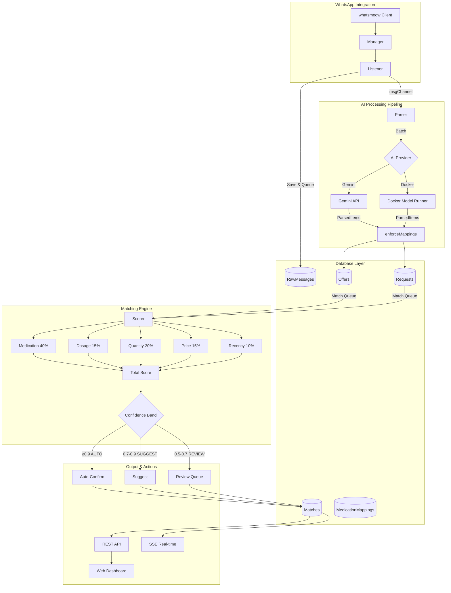

# PharmaBroker

> AI-powered pharmaceutical trading platform for Egyptian WhatsApp groups

[](https://golang.org)
[](LICENSE)

PharmaBroker ingests Arabic WhatsApp messages, extracts medication offers/requests using AI, and matches supply with demand via intelligent multi-field scoring.

---

## ✨ Features

- **Arabic AI Parsing** - Extracts medications from informal Egyptian Arabic text
- **Multi-Provider AI** - Supports Gemini Cloud or local LLM (Docker Model Runner)
- **Intelligent Matching** - 5-dimensional scoring: Medication, Dosage, Quantity, Price, Recency
- **Real-time Dashboard** - React SPA with SSE live updates
- **Adaptive Learning** - Self-optimizing match weights based on feedback
- **Review Queue** - Manual review for low-confidence extractions

---

## 🏗️ Architecture



### How It Works

1. **WhatsApp Integration**: The `whatsmeow` library connects to WhatsApp Web. The `Manager` handles authentication and connection, while the `Listener` receives incoming messages from monitored groups.

2. **Message Processing**: When a message arrives, the Listener saves it to `RawMessages` and queues it via an internal channel. The `Parser` batches messages and sends them to the configured AI provider (Gemini Cloud or local Docker Model Runner).

3. **AI Extraction**: The AI parses informal Arabic text and extracts structured medication data (name, dosage, quantity, price, type). Results pass through `enforceMappings` to normalize medication names using the database dictionary.

4. **Offer/Request Storage**: Extracted items are classified as `OFFER` (seller has medication) or `REQUEST` (buyer needs medication) and stored in the database.

5. **Intelligent Matching**: The `Scorer` continuously polls for new items and calculates multi-dimensional match scores between offers and requests using 5 weighted factors.

6. **Confidence-Based Actions**: Based on the total score, matches are routed to:

   - **AUTO** (≥0.9): Automatically confirmed
   - **SUGGEST** (0.7-0.9): Suggested to operator for quick approval
   - **REVIEW** (0.5-0.7): Queued for manual review

7. **Real-time Updates**: Confirmed matches are broadcast via SSE to the React dashboard for live operator monitoring.

---

## 🚀 Quick Start

### Prerequisites

- [Go 1.25+](https://golang.org/dl/)
- [Bun](https://bun.sh/) (for frontend)
- [Task](https://taskfile.dev/) (task runner)
- SQLite (embedded)

### 1. Clone & Setup

```bash
git clone https://github.com/sabry-awad97/pharma-broker.git
cd pharma-broker

# Copy environment template
cp .env.example .env
```

### 2. Configure AI Provider

Edit `.env` or `config.yaml`:

```yaml
# Option A: Gemini Cloud (recommended for production)
ai:
  provider: gemini

# Set in .env
GEMINI_API_KEY=your-api-key-here
```

```yaml
# Option B: Local LLM (Docker Model Runner)
ai:
  provider: docker
docker_model:
  base_url: http://localhost:12434/engines/llama.cpp/v1
  model: ai/qwen3-vl:latest
```

### 3. Build & Run

```bash
# Build everything (client + server)
task

# Or run in development mode
task dev:server
```

### 4. Access Dashboard

Open [http://localhost:8080](http://localhost:8080)

---

## 📋 Available Commands

| Command                   | Description                      |
| ------------------------- | -------------------------------- |
| `task`                    | Build client + server            |
| `task dev:server`         | Run Go server (dev mode)         |
| `task dev:client`         | Run React dev server             |
| `task db:reset`           | Reset database (delete + reseed) |
| `task test:unit`          | Run all unit tests               |
| `task test:integration`   | Run integration tests            |
| `task playground:mapping` | Test medication mapping          |
| `task monitor`            | TUI for group monitoring         |

---

## 📁 Project Structure

```
pharma-broker/
├── cmd/
│   ├── app/           # Main entrypoint
│   ├── serve.go       # HTTP server setup
│   └── playground/    # Development tools
├── internal/
│   ├── ai/            # AI parsing, scoring, learning
│   ├── api/           # REST handlers, SSE, static files
│   ├── domain/        # Entity models
│   ├── storage/       # GORM repositories
│   ├── whatsapp/      # WhatsApp integration
│   └── monitor/       # Alerting (War Room)
├── config.yaml        # Application config
├── medications.json   # Medication mappings (Arabic → English)
└── Taskfile.yml       # Task runner commands
```

---

## ⚙️ Configuration

### Environment Variables (`.env`)

| Variable           | Description          | Required                           |
| ------------------ | -------------------- | ---------------------------------- |
| `GEMINI_API_KEY`   | Google AI API key    | If using Gemini                    |
| `PB_AI_PROVIDER`   | `gemini` or `docker` | No (default: gemini)               |
| `PB_DATABASE_PATH` | SQLite path          | No (default: data/pharmabroker.db) |

### Config File (`config.yaml`)

```yaml
ai:
  provider: gemini # or "docker"

docker_model:
  base_url: http://localhost:12434/engines/llama.cpp/v1
  model: ai/qwen3-vl:latest

database:
  path: ./data/pharmabroker.db

api:
  port: 8080
  cors_origin: "*"

parser:
  batch_size: 10
  match_threshold: 0.50
```

---

## 🔌 API Endpoints

### Core Resources

| Method | Endpoint                    | Description          |
| ------ | --------------------------- | -------------------- |
| GET    | `/api/offers`               | List active offers   |
| GET    | `/api/requests`             | List active requests |
| GET    | `/api/matches`              | List pending matches |
| POST   | `/api/matches/{id}/confirm` | Confirm a match      |
| POST   | `/api/matches/{id}/reject`  | Reject a match       |
| GET    | `/api/stats`                | Dashboard statistics |

### Review Queue (Multi-Pass)

| Method | Endpoint                   | Description              |
| ------ | -------------------------- | ------------------------ |
| GET    | `/api/review/queue`        | List pending reviews     |
| POST   | `/api/review/{id}/approve` | Approve with corrections |
| POST   | `/api/review/{id}/reject`  | Reject item              |

### Real-time

| Method | Endpoint   | Description                 |
| ------ | ---------- | --------------------------- |
| GET    | `/api/sse` | SSE stream for live updates |

---

## � WhatsApp Bot Commands

PharmaBroker includes a built-in WhatsApp bot for managing matches directly from chat.

### Enabling the Bot

Add to `config.yaml`:

```yaml
whatsapp:
  bot_commands:
    enabled: true
    authorized_phones:
      - "201234567890" # Egyptian format (no +)
      - "201098765432"
```

### Available Commands

| Command         | Description                  | Example             |
| --------------- | ---------------------------- | ------------------- |
| `/status`       | System status & stats        | `/status`           |
| `/pending`      | List pending matches (top 5) | `/pending`          |
| `/confirm <id>` | Confirm a match              | `/confirm abc12345` |
| `/reject <id>`  | Reject a match               | `/reject abc12345`  |
| `/help`         | Show available commands      | `/help`             |

### Command Examples

**Check System Status:**

```
/status

📊 PharmaBroker Status
━━━━━━━━━━━━━━━━
✅ System: Online
📦 Pending Matches: 12
💊 Active Offers: 45
📋 Active Requests: 23
✔️ Confirmed Today: 8
```

**List Pending Matches:**

```
/pending

📋 Pending Matches (5)
━━━━━━━━━━━━━━━━
1. Augmentin 1g 🔥
   ID: abc12345
   Score: 92%

2. Concor 5mg
   ID: def67890
   Score: 85%
```

**Confirm a Match:**

```
/confirm abc12345

✅ Match abc12345 confirmed!
تم تأكيد المطابقة
```

### Security Features

- Only authorized phone numbers can execute commands
- All bot actions are logged to the audit trail
- Partial ID matching (first 8 characters) for convenience
- Bilingual responses (English + Arabic)

---

## �🧪 Testing

```bash
# Run all tests
task test:unit

# Run with coverage
go test ./... -cover

# Run integration tests (requires AI service)
task test:integration
```

---

## 📊 Matching Algorithm

PharmaBroker uses multi-field weighted scoring:

| Factor     | Weight | Description                       |
| ---------- | ------ | --------------------------------- |
| Medication | 40%    | Fuzzy + vector similarity match   |
| Dosage     | 15%    | Numeric comparison (mg, g, etc.)  |
| Quantity   | 20%    | Fulfillment ratio                 |
| Price      | 15%    | Budget fit (offer ≤ max_price)    |
| Recency    | 10%    | Exponential decay (24h half-life) |

### Confidence Bands

| Band    | Score       | Action              |
| ------- | ----------- | ------------------- |
| AUTO    | ≥ 0.90      | Auto-confirm        |
| SUGGEST | 0.70 - 0.89 | Suggest to operator |
| REVIEW  | 0.50 - 0.69 | Manual review       |
| NONE    | < 0.50      | No match            |

---

## 🤝 Contributing

1. Fork the repository
2. Create a feature branch (`git checkout -b feature/amazing`)
3. Commit changes (`git commit -m 'Add amazing feature'`)
4. Push to branch (`git push origin feature/amazing`)
5. Open a Pull Request

---

## 📄 License

MIT License - see [LICENSE](LICENSE) for details.

---

## 🙏 Acknowledgments

- [whatsmeow](https://github.com/tulir/whatsmeow) - WhatsApp Web client library
- [GORM](https://gorm.io/) - ORM for Go
- [Gemini](https://ai.google.dev/) - Google's AI API
