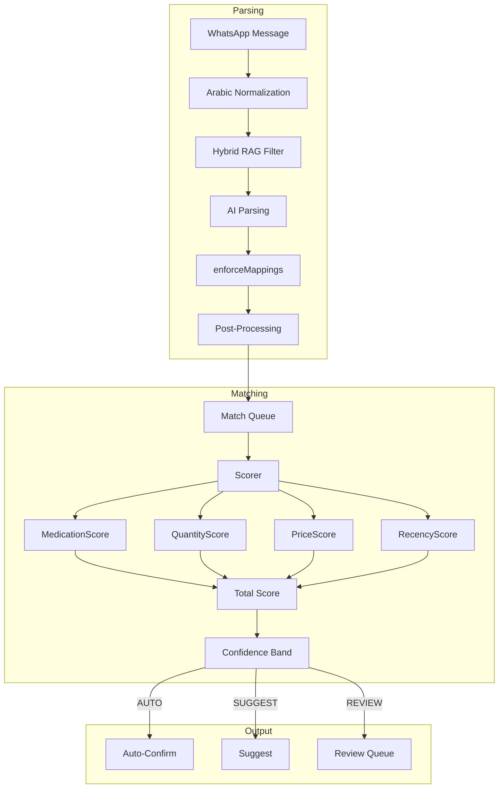

# Architecture Diagram

```mermaid
flowchart TB
    subgraph Parsing
        M[WhatsApp Message] --> N[Arabic Normalization]
        N --> H[Hybrid RAG Filter]
        H --> A[AI Parsing]
        A --> E[enforceMappings]
        E --> P[Post-Processing]
    end

    subgraph Matching
        P --> Q[Match Queue]
        Q --> S[Scorer]
        S --> MS[MedicationScore]
        S --> QS[QuantityScore]
        S --> PS[PriceScore]
        S --> RS[RecencyScore]
        MS & QS & PS & RS --> T[Total Score]
        T --> C[Confidence Band]
    end

    subgraph Output
        C --> |AUTO| AC[Auto-Confirm]
        C --> |SUGGEST| SG[Suggest]
        C --> |REVIEW| RV[Review Queue]
    end
```
