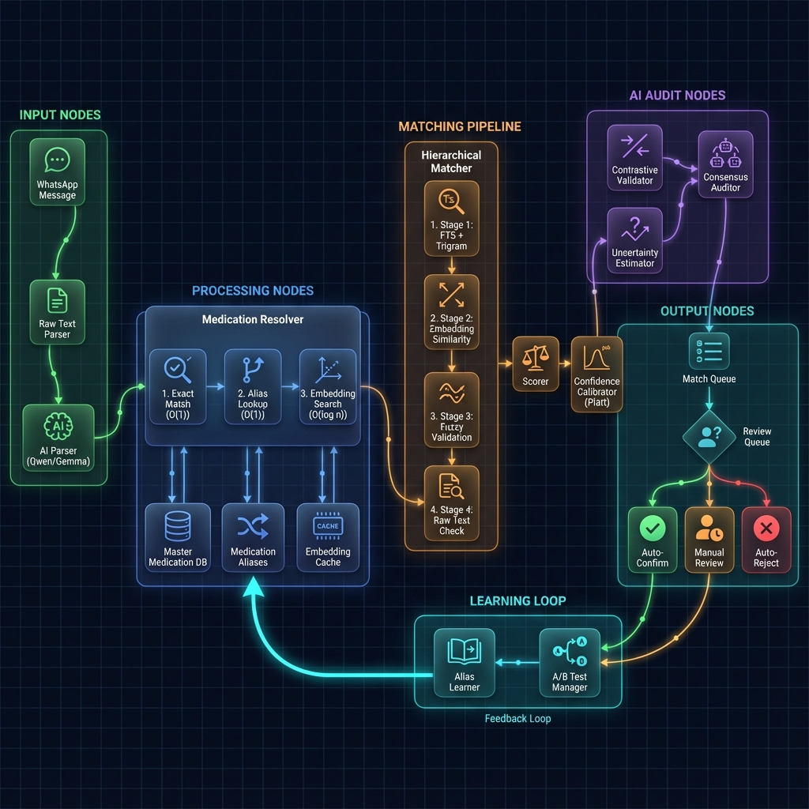

# PharmaBroker Matching System Architecture

> Comprehensive analysis of the matching pipeline and React Flow node design



---

## System Overview

The PharmaBroker matching system connects pharmaceutical **offers** (what suppliers have) with **requests** (what pharmacies need). The system uses a multi-stage pipeline combining deterministic lookups, AI parsing, embedding similarity, and human review.

---

## Node Architecture for React Flow

### 1. Input Nodes (Green)

```typescript
// Node types for React Flow
const inputNodes = [
  {
    id: "whatsapp-input",
    type: "inputNode",
    data: { label: "WhatsApp Message", icon: "MessageCircle" },
    position: { x: 0, y: 200 },
  },
  {
    id: "raw-parser",
    type: "processorNode",
    data: { label: "Raw Text Parser", icon: "FileText" },
    position: { x: 200, y: 200 },
  },
  {
    id: "ai-parser",
    type: "aiNode",
    data: {
      label: "AI Parser",
      models: ["Qwen 32B", "Gemma 27B"],
      temperature: 0.2,
    },
    position: { x: 400, y: 200 },
  },
];
```

| Node                 | Purpose                          | Output                                |
| -------------------- | -------------------------------- | ------------------------------------- |
| **WhatsApp Message** | Raw incoming message from groups | `{ jid, text, timestamp }`            |
| **Raw Text Parser**  | Regex-based extraction           | `{ medication_raw, quantity, price }` |
| **AI Parser**        | LLM-based structured extraction  | `ParsedItem` with confidence          |

---

### 2. Resolution Nodes (Blue/Purple)

```typescript
const resolutionNodes = [
  {
    id: "medication-resolver",
    type: "resolverNode",
    data: {
      label: "Medication Resolver",
      stages: [
        { name: "Exact Match", complexity: "O(1)", color: "#22c55e" },
        { name: "Alias Lookup", complexity: "O(1)", color: "#3b82f6" },
        { name: "Embedding Search", complexity: "O(log n)", color: "#8b5cf6" },
      ],
    },
    position: { x: 600, y: 150 },
  },
  {
    id: "master-db",
    type: "databaseNode",
    data: { label: "Master Medication DB", icon: "Database" },
    position: { x: 600, y: 350 },
  },
];
```

#### Resolution Pipeline

```
Input: "Augmentin 1g tabs"
        ↓
┌─────────────────────────────────────────────────────┐
│ Stage 1: Exact Match (master_medications.name)      │
│   → "Augmentin" == "Augmentin"? ✓ FOUND            │
│   → Return master_id immediately                    │
└─────────────────────────────────────────────────────┘
        ↓ (if not found)
┌─────────────────────────────────────────────────────┐
│ Stage 2: Alias Lookup (medication_aliases)          │
│   → "اوجمنتين" → "Augmentin" ✓ FOUND               │
│   → Arabic transliterations, brand variations       │
└─────────────────────────────────────────────────────┘
        ↓ (if not found)
┌─────────────────────────────────────────────────────┐
│ Stage 3: Embedding Search (pgvector)                │
│   → cosine_similarity(query_emb, master_emb) > 0.85│
│   → Top-K candidates with confidence                │
└─────────────────────────────────────────────────────┘
```

---

### 3. Matching Pipeline Nodes (Orange/Amber)

```typescript
const matchingNodes = [
  {
    id: "hierarchical-matcher",
    type: "pipelineNode",
    data: {
      label: "Hierarchical Matcher",
      stages: [
        { id: "fts", name: "FTS + Trigram", threshold: 0.3 },
        { id: "embedding", name: "Embedding Similarity", threshold: 0.7 },
        { id: "fuzzy", name: "Fuzzy Validation", threshold: 0.5 },
        { id: "raw", name: "Raw Text Check", boost: 0.1 },
      ],
    },
    position: { x: 900, y: 100 },
  },
  {
    id: "scorer",
    type: "scorerNode",
    data: {
      label: "Match Scorer",
      weights: {
        medication: 0.5,
        dosage: 0.15,
        quantity: 0.15,
        price: 0.1,
        recency: 0.1,
      },
    },
    position: { x: 900, y: 300 },
  },
  {
    id: "platt-calibrator",
    type: "calibratorNode",
    data: { label: "Platt Scaling", params: { a: -1.0, b: 0.0 } },
    position: { x: 900, y: 450 },
  },
];
```

#### Scoring Formula

```
FinalScore = Σ(weight_i × component_i) × calibration_factor

Components:
├── medication_similarity (0.5)  → Fuzzy + Raw text match
├── dosage_match (0.15)          → Exact or fuzzy dosage
├── quantity_factor (0.15)       → Availability ratio
├── price_score (0.1)            → Competitiveness
└── recency_decay (0.1)          → Time-based freshness
```

---

### 4. AI Audit Nodes (Violet)

```typescript
const auditNodes = [
  {
    id: "consensus-auditor",
    type: "consensusNode",
    data: {
      label: "Consensus Auditor",
      models: ["Primary", "Secondary", "Tertiary"],
      minAgreement: 0.67,
      requireUnanimous: { forHigh: true, forLow: true },
    },
    position: { x: 1150, y: 100 },
  },
  {
    id: "contrastive-validator",
    type: "validatorNode",
    data: {
      label: "Contrastive Validator",
      numNegatives: 3,
      minMargin: 0.15,
    },
    position: { x: 1150, y: 250 },
  },
  {
    id: "uncertainty-estimator",
    type: "uncertaintyNode",
    data: {
      label: "Uncertainty Estimator",
      numSamples: 10,
      highThreshold: 0.15,
    },
    position: { x: 1150, y: 400 },
  },
];
```

#### Consensus Logic

```
┌──────────────────────────────────────────────────────┐
│                  CONSENSUS AUDITOR                   │
├──────────────────────────────────────────────────────┤
│  Model A (Qwen)  ──→  "MATCH" (0.92)                │
│  Model B (Gemma) ──→  "MATCH" (0.88)                │
│  Model C (Llama) ──→  "MATCH" (0.85)                │
├──────────────────────────────────────────────────────┤
│  Agreement: 3/3 = 100% ✓                            │
│  Average Confidence: 0.883                           │
│  Decision: HIGH_CONFIDENCE_MATCH                     │
└──────────────────────────────────────────────────────┘
```

---

### 5. Output Nodes (Teal)

```typescript
const outputNodes = [
  {
    id: "match-queue",
    type: "queueNode",
    data: { label: "Match Queue", Redis: true },
    position: { x: 1400, y: 100 },
  },
  {
    id: "review-decision",
    type: "decisionNode",
    data: {
      label: "Review Decision",
      thresholds: { autoConfirm: 0.85, autoReject: 0.3 },
    },
    position: { x: 1400, y: 250 },
  },
  {
    id: "auto-confirm",
    type: "outputNode",
    data: { label: "Auto-Confirm", status: "confirmed" },
    style: { background: "#22c55e" },
    position: { x: 1600, y: 100 },
  },
  {
    id: "manual-review",
    type: "outputNode",
    data: { label: "Manual Review", status: "pending" },
    style: { background: "#f59e0b" },
    position: { x: 1600, y: 250 },
  },
  {
    id: "auto-reject",
    type: "outputNode",
    data: { label: "Auto-Reject", status: "rejected" },
    style: { background: "#ef4444" },
    position: { x: 1600, y: 400 },
  },
];
```

#### Decision Thresholds

| Score Range | Decision          | Action                      |
| ----------- | ----------------- | --------------------------- |
| ≥ 85%       | **Auto-Confirm**  | Direct to confirmed matches |
| 30% - 84%   | **Manual Review** | Queue for operator review   |
| < 30%       | **Auto-Reject**   | Discard with audit log      |

---

### 6. Learning Loop Nodes (Cyan)

```typescript
const learningNodes = [
  {
    id: "alias-learner",
    type: "learnerNode",
    data: {
      label: "Alias Learner",
      minScore: 0.85,
      minConfirmations: 2,
    },
    position: { x: 800, y: 550 },
  },
  {
    id: "feedback-loop",
    type: "feedbackNode",
    data: { label: "Feedback Loop", target: "medication-aliases" },
    position: { x: 600, y: 550 },
  },
  {
    id: "abtest-manager",
    type: "abtestNode",
    data: {
      label: "A/B Test Manager",
      autoRollback: true,
      minSamples: 50,
    },
    position: { x: 1000, y: 550 },
  },
];
```

---

## Edge Definitions

```typescript
const edges = [
  // Input flow
  { id: "e1", source: "whatsapp-input", target: "raw-parser", animated: true },
  { id: "e2", source: "raw-parser", target: "ai-parser" },
  { id: "e3", source: "ai-parser", target: "medication-resolver" },

  // Resolution to matching
  {
    id: "e4",
    source: "medication-resolver",
    target: "master-db",
    type: "bidirectional",
  },
  { id: "e5", source: "medication-resolver", target: "hierarchical-matcher" },

  // Matching pipeline
  { id: "e6", source: "hierarchical-matcher", target: "scorer" },
  { id: "e7", source: "scorer", target: "platt-calibrator" },
  { id: "e8", source: "platt-calibrator", target: "consensus-auditor" },

  // Audit chain
  { id: "e9", source: "consensus-auditor", target: "contrastive-validator" },
  {
    id: "e10",
    source: "contrastive-validator",
    target: "uncertainty-estimator",
  },
  { id: "e11", source: "uncertainty-estimator", target: "match-queue" },

  // Output routing
  { id: "e12", source: "match-queue", target: "review-decision" },
  {
    id: "e13",
    source: "review-decision",
    target: "auto-confirm",
    label: "≥85%",
  },
  {
    id: "e14",
    source: "review-decision",
    target: "manual-review",
    label: "30-84%",
  },
  {
    id: "e15",
    source: "review-decision",
    target: "auto-reject",
    label: "<30%",
  },

  // Learning loop (feedback)
  {
    id: "e16",
    source: "manual-review",
    target: "alias-learner",
    type: "feedback",
  },
  { id: "e17", source: "alias-learner", target: "feedback-loop" },
  {
    id: "e18",
    source: "feedback-loop",
    target: "master-db",
    style: { strokeDasharray: "5,5" },
  },
];
```

---

## React Flow Implementation

### Custom Node Components

```tsx
// Example: AI Parser Node
const AIParserNode = ({ data }: NodeProps) => (
  <div
    className="px-4 py-3 rounded-xl bg-linear-to-br from-violet-500/20 to-purple-600/20 
                  border border-violet-500/50 backdrop-blur-xl shadow-xl min-w-[200px]"
  >
    <Handle type="target" position={Position.Left} />

    <div className="flex items-center gap-2 mb-2">
      <Brain className="w-5 h-5 text-violet-400" />
      <span className="font-semibold text-white">{data.label}</span>
    </div>

    <div className="text-xs text-violet-300 space-y-1">
      {data.models.map((model) => (
        <div key={model} className="flex items-center gap-1">
          <div className="w-1.5 h-1.5 rounded-full bg-violet-400" />
          {model}
        </div>
      ))}
    </div>

    <div className="mt-2 pt-2 border-t border-violet-500/30 text-xs text-muted-foreground">
      Temperature: {data.temperature}
    </div>

    <Handle type="source" position={Position.Right} />
  </div>
);
```

---

## Key Metrics

| Metric                   | Current | Target |
| ------------------------ | ------- | ------ |
| False Positive Rate      | ~5%     | <1%    |
| Deterministic Match Rate | ~10%    | >50%   |
| AI Dependency            | 100%    | <50%   |
| P95 Latency              | ~500ms  | <100ms |
| Operator Rejection Rate  | ~15%    | <5%    |

---

## File Structure

```
core/src/matching/
├── mod.rs                    # Module exports
├── engine.rs                 # MatchingEngine orchestrator
├── hierarchical_matcher.rs   # 5-stage matching pipeline
├── medication_resolver.rs    # Master DB resolution
├── scorer.rs                 # Weighted scoring
├── platt_calibrator.rs       # Confidence calibration
├── consensus_auditor.rs      # Multi-model audit
├── contrastive_validator.rs  # Negative sampling
├── uncertainty_estimator.rs  # MC dropout
├── alias_learner.rs          # Automated learning
├── fallback_matcher.rs       # Circuit breaker fallback
└── abtest.rs                 # A/B test manager
```

---

## Version

| Field        | Value             |
| ------------ | ----------------- |
| Version      | 1.0.0             |
| Last Updated | 2026-01-03        |
| Author       | PharmaBroker Team |
