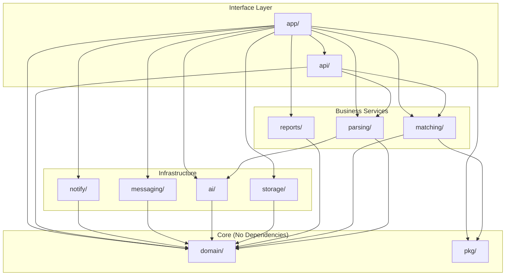

# PharmaBroker Comprehensive Refactoring Plan

## Go Workspace Multi-Module Architecture

Incremental migration to Clean Architecture using Go 1.25 workspace with separate modules.

---

## Target Structure

```
pharma-broker/
│
├── go.work                      # Workspace definition
│
├── app/                         # Main application module
│   ├── go.mod                   # module pharmabroker/app
│   ├── cmd/
│   │   └── serve/
│   │       └── main.go          # Entry point
│   └── internal/
│       └── bootstrap/           # DI container, wiring
│           └── wire.go
│
├── domain/                      # Core domain module (NO DEPENDENCIES)
│   ├── go.mod                   # module pharmabroker/domain
│   ├── entity/
│   │   ├── offer.go
│   │   ├── request.go
│   │   ├── match.go
│   │   ├── message.go
│   │   └── group.go
│   ├── repository/              # ISP: Small focused interfaces
│   │   ├── offer_repository.go
│   │   ├── request_repository.go
│   │   ├── match_repository.go
│   │   └── message_repository.go
│   ├── service/                 # Service interfaces (DIP)
│   │   ├── parser_service.go
│   │   ├── matcher_service.go
│   │   └── notifier_service.go
│   └── errors/
│       └── errors.go
│
├── parsing/                     # Parsing module
│   ├── go.mod                   # module pharmabroker/parsing
│   ├── interface.go             # ISP: ParserService interface
│   ├── service.go               # Implementation
│   ├── batch.go                 # Batch processing
│   ├── review.go                # Multi-pass review logic
│   └── errors.go
│
├── matching/                    # Matching module
│   ├── go.mod                   # module pharmabroker/matching
│   ├── interface.go             # ISP: MatcherService interface
│   ├── service.go               # Implementation
│   ├── scorer.go                # Scoring algorithm
│   ├── weights.go               # Weight management
│   └── errors.go
│
├── ai/                          # AI providers module
│   ├── go.mod                   # module pharmabroker/ai
│   ├── interface.go             # ISP: AIProvider interface
│   ├── gemini/
│   │   ├── provider.go
│   │   └── config.go
│   ├── docker/
│   │   ├── provider.go
│   │   └── config.go
│   └── errors.go
│
├── storage/                     # Persistence module
│   ├── go.mod                   # module pharmabroker/storage
│   ├── interface.go             # Re-exports repository interfaces
│   ├── gorm/
│   │   ├── db.go
│   │   ├── offer_repo.go
│   │   ├── request_repo.go
│   │   ├── match_repo.go
│   │   └── message_repo.go
│   └── errors.go
│
├── messaging/                   # Messaging module (WhatsApp, Telegram)
│   ├── go.mod                   # module pharmabroker/messaging
│   ├── interface.go             # ISP: Messenger interface
│   ├── whatsapp/
│   │   ├── manager.go
│   │   ├── listener.go
│   │   └── bot.go
│   ├── telegram/
│   │   └── bot.go
│   └── errors.go
│
├── api/                         # HTTP API module
│   ├── go.mod                   # module pharmabroker/api
│   ├── server.go
│   ├── handlers/
│   │   ├── offer_handler.go
│   │   ├── request_handler.go
│   │   ├── match_handler.go
│   │   └── stats_handler.go
│   ├── middleware/
│   │   ├── cors.go
│   │   └── auth.go
│   └── sse/
│       └── hub.go
│
├── notify/                      # Notification module
│   ├── go.mod                   # module pharmabroker/notify
│   ├── interface.go             # ISP: Notifier interface
│   ├── telegram.go
│   ├── email.go
│   └── errors.go
│
├── reports/                     # Reports module
│   ├── go.mod                   # module pharmabroker/reports
│   ├── interface.go
│   ├── generator.go
│   ├── csv.go
│   └── excel.go
│
├── pkg/                         # Shared utilities module
│   ├── go.mod                   # module pharmabroker/pkg
│   ├── arabic/
│   │   └── normalizer.go
│   ├── fuzzy/
│   │   └── matcher.go
│   └── config/
│       └── loader.go
│
└── legacy/                      # Old code (temporary during migration)
    └── internal/                # Existing code moved here
```

---

## Dependency Graph



---

## Module go.mod Files

### go.work (Workspace Root)

```go
go 1.25

use (
    ./app
    ./domain
    ./parsing
    ./matching
    ./ai
    ./storage
    ./messaging
    ./api
    ./notify
    ./reports
    ./pkg
)
```

### domain/go.mod

```go
module pharmabroker/domain

go 1.25

// NO external dependencies - pure domain
```

### parsing/go.mod

```go
module pharmabroker/parsing

go 1.25

require (
    pharmabroker/domain v0.0.0
    pharmabroker/ai v0.0.0
    pharmabroker/pkg v0.0.0
)

replace (
    pharmabroker/domain => ../domain
    pharmabroker/ai => ../ai
    pharmabroker/pkg => ../pkg
)
```

### app/go.mod

```go
module pharmabroker/app

go 1.25

require (
    pharmabroker/domain v0.0.0
    pharmabroker/parsing v0.0.0
    pharmabroker/matching v0.0.0
    pharmabroker/storage v0.0.0
    pharmabroker/ai v0.0.0
    pharmabroker/messaging v0.0.0
    pharmabroker/api v0.0.0
    pharmabroker/notify v0.0.0
    pharmabroker/reports v0.0.0
    pharmabroker/pkg v0.0.0
)

replace (
    pharmabroker/domain => ../domain
    pharmabroker/parsing => ../parsing
    pharmabroker/matching => ../matching
    pharmabroker/storage => ../storage
    pharmabroker/ai => ../ai
    pharmabroker/messaging => ../messaging
    pharmabroker/api => ../api
    pharmabroker/notify => ../notify
    pharmabroker/reports => ../reports
    pharmabroker/pkg => ../pkg
)
```

---

## SOLID Principles Applied

### Single Responsibility (SRP)

| Module      | Responsibility                      |
| ----------- | ----------------------------------- |
| `domain/`   | Define entities & interfaces only   |
| `parsing/`  | Parse messages into offers/requests |
| `matching/` | Match offers with requests          |
| `storage/`  | Persist data to database            |
| `ai/`       | Communicate with AI providers       |
| `api/`      | Handle HTTP requests                |

### Open/Closed (OCP)

- New AI providers: Add `ai/newprovider/` without changing `parsing/`
- New storage backends: Add `storage/postgres/` without changing services

### Liskov Substitution (LSP)

```go
// domain/service/parser_service.go
type ParserService interface {
    Parse(ctx context.Context, messages []entity.RawMessage) (*ParseResult, error)
}

// Any implementation can substitute
var _ ParserService = (*parsing.Service)(nil)
```

### Interface Segregation (ISP)

```go
// Small focused interfaces per module

// domain/repository/offer_repository.go
type OfferReader interface {
    GetByID(ctx context.Context, id string) (*entity.Offer, error)
    GetActive(ctx context.Context, limit, offset int) ([]*entity.Offer, error)
}

type OfferWriter interface {
    Save(ctx context.Context, offer *entity.Offer) error
    UpdateStatus(ctx context.Context, id string, status entity.ItemStatus) error
}

type OfferRepository interface {
    OfferReader
    OfferWriter
}
```

### Dependency Inversion (DIP)

```go
// app/internal/bootstrap/wire.go
func NewContainer(cfg *config.Config) *Container {
    // High-level modules depend on abstractions
    db := storage.NewGormDB(cfg.Database)

    // Create implementations
    offerRepo := storage.NewOfferRepo(db)  // implements domain.OfferRepository
    aiProvider := ai.NewGeminiProvider(cfg.AI)  // implements domain.AIProvider

    // Inject abstractions into services
    parserSvc := parsing.NewService(offerRepo, aiProvider)

    return &Container{Parser: parserSvc}
}
```

---

## Migration Phases

### Phase 1: Foundation (Week 1)

- [ ] Create `go.work` file
- [ ] Create `domain/` module with entities
- [ ] Create `pkg/` module with utilities
- [ ] Run: `go work sync`

### Phase 2: Core Services (Week 2)

- [ ] Create `parsing/` module
- [ ] Create `matching/` module
- [ ] Extract business logic from `internal/ai/parser.go`
- [ ] Unit tests for each module

### Phase 3: Infrastructure (Week 3)

- [ ] Create `storage/` module
- [ ] Create `ai/` module
- [ ] Create `messaging/` module
- [ ] Adapter tests

### Phase 4: Interface (Week 4)

- [ ] Create `api/` module with split handlers
- [ ] Create `notify/` module
- [ ] Create `reports/` module
- [ ] Integration tests

### Phase 5: Application (Week 5)

- [ ] Create `app/` module with bootstrap
- [ ] Wire everything together
- [ ] E2E tests
- [ ] Remove `legacy/`

---

## Incremental Migration Strategy

### Step 1: Parallel Structure

```
pharma-broker/
├── internal/           # OLD - keep working
├── domain/             # NEW - create entities
└── go.work
```

### Step 2: Verify New Modules Work

```go
// domain/entity/offer.go
package entity

// Copy entity from old code
type Offer struct { ... }

// Add type alias in old code for compatibility
// internal/domain/models.go
import "pharmabroker/domain/entity"
type Offer = entity.Offer  // Alias
```

### Step 3: Migrate One Service at a Time

```bash
# 1. Create new module
mkdir -p parsing && cd parsing && go mod init pharmabroker/parsing

# 2. Copy and adapt code
# 3. Update go.work
# 4. Test new module
go test ./parsing/...

# 5. Update app to use new module
# 6. Test everything
go test ./...

# 7. Remove old code when verified
```

### Step 4: Feature Flags for Cutover

```go
// app/internal/bootstrap/wire.go
func NewParser(cfg *config.Config) domain.ParserService {
    if cfg.UseNewParser {
        return parsing.NewService(...)  // New module
    }
    return legacy.NewParser(...)  // Old code
}
```

---

## Testing Strategy

### Per-Module Tests

```
parsing/
├── service.go
├── service_test.go      # Unit tests
└── service_integration_test.go  # With mocks
```

### Integration Tests in App

```go
// app/tests/integration/parsing_test.go
func TestFullParsingFlow(t *testing.T) {
    // Real DB, mock AI
}
```

### Coverage Targets

| Module   | Target |
| -------- | ------ |
| domain   | 90%    |
| parsing  | 85%    |
| matching | 85%    |
| storage  | 75%    |
| api      | 70%    |

---

## File Mapping: Old → New

| Old Path                        | New Path                 |
| ------------------------------- | ------------------------ |
| `internal/domain/models.go`     | `domain/entity/*.go`     |
| `internal/domain/repository.go` | `domain/repository/*.go` |
| `internal/ai/parser.go`         | `parsing/service.go`     |
| `internal/ai/scoring.go`        | `matching/scorer.go`     |
| `internal/ai/gemini.go`         | `ai/gemini/provider.go`  |
| `internal/ai/docker_model.go`   | `ai/docker/provider.go`  |
| `internal/storage/*_repo.go`    | `storage/gorm/*.go`      |
| `internal/api/handlers.go`      | `api/handlers/*.go`      |
| `internal/whatsapp/*`           | `messaging/whatsapp/*`   |
| `internal/notify/*`             | `notify/*.go`            |
| `internal/reports/*`            | `reports/*.go`           |

---

## Checklist

### Pre-Migration

- [ ] Create `refactor/clean-architecture` branch ✅
- [ ] Record baseline test results
- [ ] Create `go.work` file

### Domain Module

- [ ] Create `domain/go.mod`
- [ ] Create `domain/entity/*.go`
- [ ] Create `domain/repository/*.go`
- [ ] Create `domain/service/*.go`
- [ ] Add type aliases in legacy for compatibility

### Service Modules

- [ ] Create `parsing/` module
- [ ] Create `matching/` module
- [ ] Unit tests per module
- [ ] Integration tests

### Infrastructure Modules

- [ ] Create `storage/` module
- [ ] Create `ai/` module
- [ ] Create `messaging/` module
- [ ] Adapter tests

### Interface Modules

- [ ] Create `api/` module
- [ ] Create `notify/` module
- [ ] Create `reports/` module
- [ ] Handler tests

### Finalization

- [ ] Create `app/` module with bootstrap
- [ ] Full integration tests
- [ ] Remove legacy code
- [ ] Update documentation

---

_Document Version: 2.0_  
_Last Updated: December 2024_
