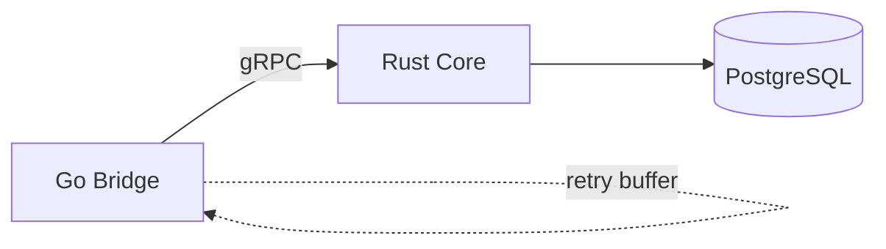
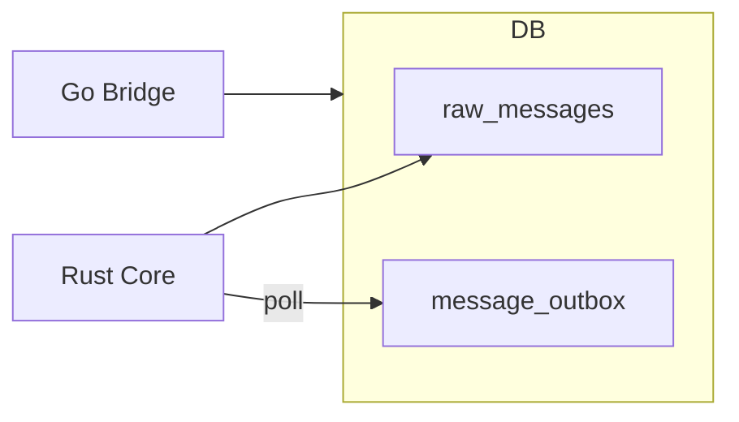
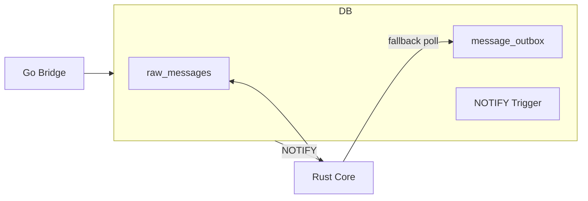
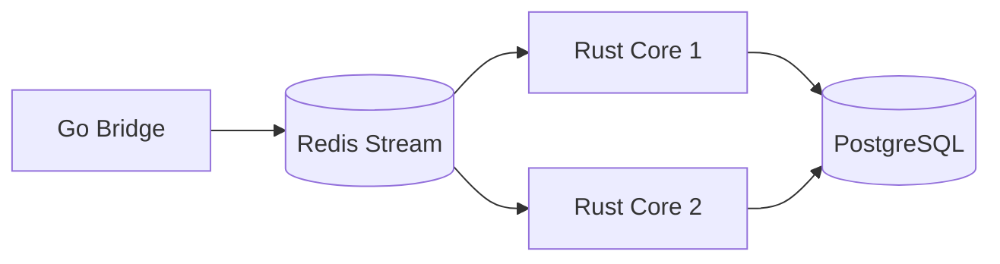

# Alternative Dispute Resolution (ADR)-001: Inter-Service Communication Strategy

> **Status**: Proposed  
> **Date**: 2025-12-21  
> **Decision Makers**: Development Team  
> **Category**: Architecture

---

## Context

PharmaBroker currently uses gRPC for communication between the Go Bridge and Rust Core:

```
Go Bridge → gRPC (port 50051) → Rust Core → PostgreSQL
```

This approach requires:

- gRPC server in Rust Core
- gRPC client in Go Bridge
- Circuit breaker for failure handling
- Retry buffer for failed messages
- Proto file synchronization

We are evaluating whether to replace gRPC with a database-driven approach where:

- Go Bridge writes directly to PostgreSQL
- Rust Core listens for changes and processes them

---

## Decision Drivers

1. **Reliability**: Messages must not be lost
2. **Latency**: Real-time matching requires low latency (<100ms)
3. **Simplicity**: Reduce operational complexity
4. **Debugging**: Easy to trace message flow
5. **Scalability**: Support future growth
6. **Transactional Safety**: Ensure consistency

---

## Options Considered

### Option 1: Keep gRPC (Current)



**How it works:**

- Go Bridge calls `ProcessMessage` RPC
- Rust Core saves to DB and processes
- Circuit breaker handles failures
- Retry buffer stores failed messages

**Pros:**

- Strong typing via Protobuf
- Bidirectional streaming possible
- Horizontal scaling of Rust Core
- Clear service boundaries

**Cons:**

- Additional network hop
- Requires retry buffer for reliability
- gRPC server/client maintenance
- Proto file synchronization needed
- More failure modes (network, gRPC errors)

**Reliability:** Medium (depends on retry buffer)  
**Latency:** ~1ms  
**Complexity:** Medium

---

### Option 2: PostgreSQL LISTEN/NOTIFY


**How it works:**

1. Go Bridge inserts into `raw_messages` table
2. PostgreSQL trigger fires `pg_notify('new_message', payload)`
3. Rust Core listens via `LISTEN new_message`
4. Rust Core fetches full message and processes

**Implementation:**

```sql
-- Trigger function
CREATE OR REPLACE FUNCTION notify_new_message()
RETURNS TRIGGER AS $$
BEGIN
    PERFORM pg_notify('new_message', json_build_object(
        'id', NEW.id,
        'group_jid', NEW.group_jid,
        'timestamp', extract(epoch from NEW.timestamp)
    )::text);
    RETURN NEW;
END;
$$ LANGUAGE plpgsql;

-- Attach to table
CREATE TRIGGER raw_message_notify
AFTER INSERT ON raw_messages
FOR EACH ROW EXECUTE FUNCTION notify_new_message();
```

```go
// Go Bridge: Direct database insert
func (b *Bridge) saveMessage(ctx context.Context, msg *RawMessage) error {
    _, err := b.db.ExecContext(ctx, `
        INSERT INTO raw_messages
        (id, external_id, group_jid, group_name, sender_jid, sender_phone, sender_name, content, timestamp)
        VALUES ($1, $2, $3, $4, $5, $6, $7, $8, to_timestamp($9))
    `, msg.ID, msg.ExternalID, msg.GroupJID, msg.GroupName,
       msg.SenderJID, msg.SenderPhone, msg.SenderName, msg.Content, msg.Timestamp)
    return err
}
```

```rust
// Rust Core: Listen for notifications
use sqlx::postgres::PgListener;

pub async fn listen_for_messages(pool: &PgPool) -> Result<()> {
    let mut listener = PgListener::connect_with(&pool).await?;
    listener.listen("new_message").await?;

    info!("Listening for new messages via PostgreSQL NOTIFY");

    loop {
        match listener.recv().await {
            Ok(notification) => {
                let event: NewMessageEvent = serde_json::from_str(notification.payload())?;
                if let Err(e) = process_message(&pool, &event.id).await {
                    error!("Failed to process message {}: {}", event.id, e);
                }
            }
            Err(e) => {
                error!("Listener error: {}", e);
                tokio::time::sleep(Duration::from_secs(1)).await;
            }
        }
    }
}
```

**Pros:**

- No additional infrastructure
- Transactional (insert + notify atomic)
- Very low latency (~1-5ms)
- Simple implementation
- Easy debugging (check DB directly)

**Cons:**

- Fire-and-forget (notifications lost if Rust is down)
- Payload limited to 8KB
- No built-in retry mechanism
- Single PostgreSQL instance

**Reliability:** Low (no persistence of notifications)  
**Latency:** ~1-5ms  
**Complexity:** Low

---

### Option 3: Outbox Pattern (Polling)



**How it works:**

1. Go Bridge inserts into `raw_messages` AND `message_outbox` in same transaction
2. Rust Core polls `message_outbox` for pending items
3. Rust Core processes and marks as complete
4. Optional: cleanup job removes old processed entries

**Implementation:**

```sql
-- Outbox table
CREATE TABLE message_outbox (
    id BIGSERIAL PRIMARY KEY,
    message_id VARCHAR(50) NOT NULL REFERENCES raw_messages(id),
    created_at TIMESTAMPTZ NOT NULL DEFAULT NOW(),
    processed_at TIMESTAMPTZ,
    attempts INT NOT NULL DEFAULT 0,
    last_error TEXT
);

CREATE INDEX idx_outbox_pending
ON message_outbox(created_at)
WHERE processed_at IS NULL;
```

```go
// Go Bridge: Transactional insert
func (b *Bridge) saveMessage(ctx context.Context, msg *RawMessage) error {
    tx, err := b.db.BeginTx(ctx, nil)
    if err != nil {
        return err
    }
    defer tx.Rollback()

    // Insert raw message
    _, err = tx.ExecContext(ctx, `
        INSERT INTO raw_messages (id, group_jid, sender_jid, content, timestamp)
        VALUES ($1, $2, $3, $4, to_timestamp($5))
    `, msg.ID, msg.GroupJID, msg.SenderJID, msg.Content, msg.Timestamp)
    if err != nil {
        return err
    }

    // Insert into outbox
    _, err = tx.ExecContext(ctx, `
        INSERT INTO message_outbox (message_id) VALUES ($1)
    `, msg.ID)
    if err != nil {
        return err
    }

    return tx.Commit()
}
```

```rust
// Rust Core: Poll outbox with row locking
pub async fn poll_outbox(pool: &PgPool) -> Result<()> {
    let poll_interval = Duration::from_millis(100);
    let batch_size = 100;

    loop {
        let pending: Vec<OutboxItem> = sqlx::query_as(
            r#"
            SELECT id, message_id, attempts
            FROM message_outbox
            WHERE processed_at IS NULL
            ORDER BY created_at
            LIMIT $1
            FOR UPDATE SKIP LOCKED
            "#
        )
        .bind(batch_size)
        .fetch_all(&pool)
        .await?;

        for item in pending {
            match process_message(&pool, &item.message_id).await {
                Ok(_) => {
                    sqlx::query("UPDATE message_outbox SET processed_at = NOW() WHERE id = $1")
                        .bind(item.id)
                        .execute(&pool)
                        .await?;
                }
                Err(e) => {
                    sqlx::query(
                        "UPDATE message_outbox SET attempts = attempts + 1, last_error = $1 WHERE id = $2"
                    )
                    .bind(e.to_string())
                    .bind(item.id)
                    .execute(&pool)
                    .await?;
                }
            }
        }

        tokio::time::sleep(poll_interval).await;
    }
}
```

**Pros:**

- Guaranteed delivery (survives restarts)
- Transactional consistency
- Built-in retry with error tracking
- Easy debugging (query outbox table)
- Supports multiple Rust instances (`FOR UPDATE SKIP LOCKED`)

**Cons:**

- Polling latency (100ms-1s typical)
- Additional table to maintain
- Requires cleanup job for old entries

**Reliability:** High  
**Latency:** 100ms-1s (configurable)  
**Complexity:** Low-Medium

---

### Option 4: Hybrid (LISTEN/NOTIFY + Outbox Fallback) ⭐ RECOMMENDED



**How it works:**

1. Go Bridge inserts into `raw_messages` + `message_outbox` (transaction)
2. PostgreSQL trigger fires NOTIFY
3. Rust Core receives NOTIFY → processes immediately
4. Fallback: Rust polls outbox every 5s for any missed messages
5. Both paths mark outbox entry as processed

**Implementation:**

```rust
// Rust Core: Hybrid listener
pub async fn hybrid_message_listener(pool: &PgPool) -> Result<()> {
    let mut listener = PgListener::connect_with(&pool).await?;
    listener.listen("new_message").await?;

    let fallback_interval = Duration::from_secs(5);

    info!("Starting hybrid message listener (NOTIFY + polling fallback)");

    loop {
        tokio::select! {
            // Primary: Real-time NOTIFY
            result = listener.recv() => {
                match result {
                    Ok(notification) => {
                        let event: NewMessageEvent = serde_json::from_str(notification.payload())?;
                        process_and_mark_complete(&pool, &event.id).await?;
                    }
                    Err(e) => {
                        warn!("NOTIFY listener error: {}, falling back to polling", e);
                    }
                }
            }
            // Fallback: Poll for missed messages
            _ = tokio::time::sleep(fallback_interval) => {
                process_pending_outbox(&pool).await?;
            }
        }
    }
}

async fn process_and_mark_complete(pool: &PgPool, message_id: &str) -> Result<()> {
    // Process the message
    process_message(pool, message_id).await?;

    // Mark as processed in outbox
    sqlx::query("UPDATE message_outbox SET processed_at = NOW() WHERE message_id = $1")
        .bind(message_id)
        .execute(pool)
        .await?;

    Ok(())
}

async fn process_pending_outbox(pool: &PgPool) -> Result<()> {
    let pending: Vec<OutboxItem> = sqlx::query_as(
        r#"
        SELECT id, message_id FROM message_outbox
        WHERE processed_at IS NULL AND created_at < NOW() - INTERVAL '5 seconds'
        ORDER BY created_at LIMIT 100
        FOR UPDATE SKIP LOCKED
        "#
    )
    .fetch_all(pool)
    .await?;

    if !pending.is_empty() {
        info!("Processing {} missed messages from outbox", pending.len());
    }

    for item in pending {
        process_and_mark_complete(pool, &item.message_id).await?;
    }

    Ok(())
}
```

**Pros:**

- Best of both worlds: low latency + guaranteed delivery
- Transactional consistency
- Survives Rust Core restarts
- Easy debugging
- Graceful degradation

**Cons:**

- Slightly more complex than pure polling
- Still limited to single PostgreSQL instance

**Reliability:** High  
**Latency:** ~1-5ms (normal), ~5s (fallback)  
**Complexity:** Medium

---

### Option 5: Redis Streams (Future Scale)



**How it works:**

1. Go Bridge writes to Redis Stream
2. Rust Core instances form consumer group
3. Each message processed by exactly one instance
4. Acknowledgment after processing

**Pros:**

- High throughput (100K+ msgs/sec)
- Consumer groups for horizontal scaling
- Message replay capability
- Built-in acknowledgment

**Cons:**

- Additional infrastructure (Redis)
- Two data stores to manage
- More complex deployment
- Potential data loss if Redis not persisted

**Reliability:** Medium-High (depends on Redis persistence)  
**Latency:** ~1ms  
**Complexity:** High

---

## Comparison Matrix

| Criteria                | gRPC (Current) | LISTEN/NOTIFY | Outbox Polling | Hybrid ⭐  | Redis Streams |
| ----------------------- | -------------- | ------------- | -------------- | ---------- | ------------- |
| **Latency**             | ~1ms           | ~1-5ms        | 100ms-1s       | ~1-5ms     | ~1ms          |
| **Reliability**         | Medium         | Low           | High           | High       | Medium-High   |
| **Complexity**          | Medium         | Low           | Low-Medium     | Medium     | High          |
| **Infrastructure**      | gRPC server    | PostgreSQL    | PostgreSQL     | PostgreSQL | Redis + PG    |
| **Horizontal Scale**    | Yes            | No            | Yes\*          | Yes\*      | Yes           |
| **Message Persistence** | Retry buffer   | No            | Yes            | Yes        | Optional      |
| **Debugging**           | gRPC traces    | DB logs       | Query table    | Both       | Redis CLI     |
| **Failure Recovery**    | Manual retry   | Lost          | Automatic      | Automatic  | Automatic     |
| **Transaction Safety**  | No             | Yes           | Yes            | Yes        | No            |

\*With `FOR UPDATE SKIP LOCKED`

---

## Recommendation

**Adopt Option 4: Hybrid (LISTEN/NOTIFY + Outbox Fallback)**

### Rationale

1. **Reliability**: Outbox pattern guarantees no message loss
2. **Latency**: NOTIFY provides real-time processing (~1-5ms)
3. **Simplicity**: No new infrastructure, uses existing PostgreSQL
4. **Debugging**: Can query outbox table to see pending/failed messages
5. **Graceful Degradation**: Falls back to polling if NOTIFY fails
6. **Transaction Safety**: Message saved = will be processed

### What We Lose (vs gRPC)

| Lost Capability         | Mitigation                                         |
| ----------------------- | -------------------------------------------------- |
| Strong Protobuf typing  | Use shared SQL schema + Rust/Go structs            |
| Bidirectional streaming | Not needed for current use case                    |
| gRPC health checks      | Use HTTP health endpoint + DB connectivity         |
| Horizontal Core scaling | `FOR UPDATE SKIP LOCKED` allows multiple instances |

### What We Gain

| Gained Capability    | Benefit                            |
| -------------------- | ---------------------------------- |
| Transactional safety | Message saved = will be processed  |
| Simpler deployment   | No gRPC port management            |
| Easier debugging     | Query database directly            |
| Fewer failure modes  | No network issues between services |
| Automatic retry      | Outbox tracks failed attempts      |

---

## Migration Plan

### Phase 1: Add Database Infrastructure (Week 1)

```sql
-- 1. Create outbox table
CREATE TABLE message_outbox (
    id BIGSERIAL PRIMARY KEY,
    message_id VARCHAR(50) NOT NULL,
    created_at TIMESTAMPTZ NOT NULL DEFAULT NOW(),
    processed_at TIMESTAMPTZ,
    attempts INT NOT NULL DEFAULT 0,
    last_error TEXT,
    CONSTRAINT fk_message FOREIGN KEY (message_id) REFERENCES raw_messages(id)
);

CREATE INDEX idx_outbox_pending ON message_outbox(created_at) WHERE processed_at IS NULL;
CREATE INDEX idx_outbox_message ON message_outbox(message_id);

-- 2. Create NOTIFY trigger
CREATE OR REPLACE FUNCTION notify_new_message()
RETURNS TRIGGER AS $$
BEGIN
    PERFORM pg_notify('new_message', json_build_object(
        'id', NEW.message_id,
        'created_at', NEW.created_at
    )::text);
    RETURN NEW;
END;
$$ LANGUAGE plpgsql;

CREATE TRIGGER outbox_notify
AFTER INSERT ON message_outbox
FOR EACH ROW EXECUTE FUNCTION notify_new_message();

-- 3. Create cleanup function (run daily)
CREATE OR REPLACE FUNCTION cleanup_processed_outbox(retention_days INT DEFAULT 7)
RETURNS INT AS $$
DECLARE
    deleted_count INT;
BEGIN
    DELETE FROM message_outbox
    WHERE processed_at IS NOT NULL
    AND processed_at < NOW() - (retention_days || ' days')::INTERVAL;

    GET DIAGNOSTICS deleted_count = ROW_COUNT;
    RETURN deleted_count;
END;
$$ LANGUAGE plpgsql;
```

### Phase 2: Update Go Bridge (Week 2)

1. Add PostgreSQL direct connection (alongside gRPC)
2. Implement transactional insert (raw_messages + outbox)
3. Add feature flag to switch between gRPC and DB
4. Test with flag enabled

```go
// bridge/storage/postgres.go
type PostgresStore struct {
    db *sql.DB
}

func (s *PostgresStore) SaveMessage(ctx context.Context, msg *RawMessage) error {
    tx, err := s.db.BeginTx(ctx, nil)
    if err != nil {
        return fmt.Errorf("begin tx: %w", err)
    }
    defer tx.Rollback()

    // Insert raw message
    _, err = tx.ExecContext(ctx, `
        INSERT INTO raw_messages
        (id, external_id, group_jid, group_name, sender_jid, sender_phone, sender_name, content, timestamp)
        VALUES ($1, $2, $3, $4, $5, $6, $7, $8, to_timestamp($9))
        ON CONFLICT (id) DO NOTHING
    `, msg.ID, msg.ExternalID, msg.GroupJID, msg.GroupName,
       msg.SenderJID, msg.SenderPhone, msg.SenderName, msg.Content, msg.Timestamp)
    if err != nil {
        return fmt.Errorf("insert raw_message: %w", err)
    }

    // Insert into outbox
    _, err = tx.ExecContext(ctx, `
        INSERT INTO message_outbox (message_id) VALUES ($1)
        ON CONFLICT DO NOTHING
    `, msg.ID)
    if err != nil {
        return fmt.Errorf("insert outbox: %w", err)
    }

    return tx.Commit()
}
```

### Phase 3: Update Rust Core (Week 3)

1. Implement hybrid listener (NOTIFY + polling)
2. Add feature flag to switch between gRPC and DB listener
3. Test with flag enabled
4. Monitor latency and reliability

### Phase 4: Cutover (Week 4)

1. Enable DB mode in production (Go Bridge)
2. Enable DB listener in production (Rust Core)
3. Monitor for 48 hours
4. Remove gRPC code if stable

### Phase 5: Cleanup (Week 5)

1. Remove gRPC server from Rust Core
2. Remove gRPC client from Go Bridge
3. Remove proto files
4. Update documentation

---

## Monitoring & Observability

### Key Metrics to Track

```sql
-- Outbox health query
SELECT
    COUNT(*) FILTER (WHERE processed_at IS NULL) as pending,
    COUNT(*) FILTER (WHERE processed_at IS NOT NULL) as processed,
    COUNT(*) FILTER (WHERE attempts > 0 AND processed_at IS NULL) as retrying,
    MAX(CASE WHEN processed_at IS NULL THEN NOW() - created_at END) as max_pending_age,
    AVG(CASE WHEN processed_at IS NOT NULL THEN processed_at - created_at END) as avg_processing_time
FROM message_outbox
WHERE created_at > NOW() - INTERVAL '1 hour';
```

### Alerts to Configure

| Alert           | Condition                 | Severity |
| --------------- | ------------------------- | -------- |
| Outbox Backlog  | pending > 1000            | Warning  |
| Outbox Stale    | max_pending_age > 5 min   | Critical |
| Processing Slow | avg_processing_time > 10s | Warning  |
| Retry Storm     | retrying > 100            | Warning  |

### Health Check Endpoint

```rust
// Rust Core: Health check including outbox status
async fn health_check(State(state): State<AppState>) -> Json<HealthResponse> {
    let outbox_stats: OutboxStats = sqlx::query_as(
        "SELECT COUNT(*) FILTER (WHERE processed_at IS NULL) as pending FROM message_outbox"
    )
    .fetch_one(&state.pool)
    .await
    .unwrap_or_default();

    Json(HealthResponse {
        status: if outbox_stats.pending < 1000 { "healthy" } else { "degraded" },
        outbox_pending: outbox_stats.pending,
        // ... other checks
    })
}
```

---

## Rollback Plan

If issues arise after migration:

1. **Immediate**: Re-enable gRPC via feature flag
2. **Short-term**: Run both modes in parallel (dual-write)
3. **Investigation**: Query outbox for failed messages
4. **Recovery**: Reprocess failed messages from outbox

---

## Future Considerations

### When to Consider Redis Streams

- Message volume exceeds 10K/minute sustained
- Need multiple Rust Core instances for CPU-bound processing
- Require message replay for debugging/recovery
- Need pub/sub to multiple consumers

### When to Consider Kafka

- Message volume exceeds 100K/minute
- Need multi-datacenter replication
- Require long-term message retention
- Need complex event streaming

---

## Decision

**Pending team review**

- [ ] Review by backend team
- [ ] Review by DevOps team
- [ ] Proof of concept implementation
- [ ] Performance benchmarking
- [ ] Final decision

---

## References

- [Transactional Outbox Pattern](https://microservices.io/patterns/data/transactional-outbox.html)
- [PostgreSQL LISTEN/NOTIFY](https://www.postgresql.org/docs/current/sql-notify.html)
- [SQLx PgListener](https://docs.rs/sqlx/latest/sqlx/postgres/struct.PgListener.html)
- [Redis Streams](https://redis.io/docs/data-types/streams/)
