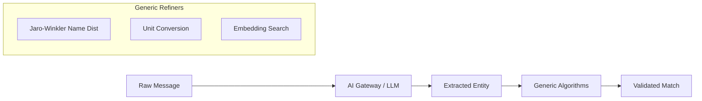
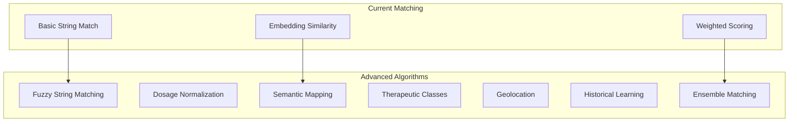
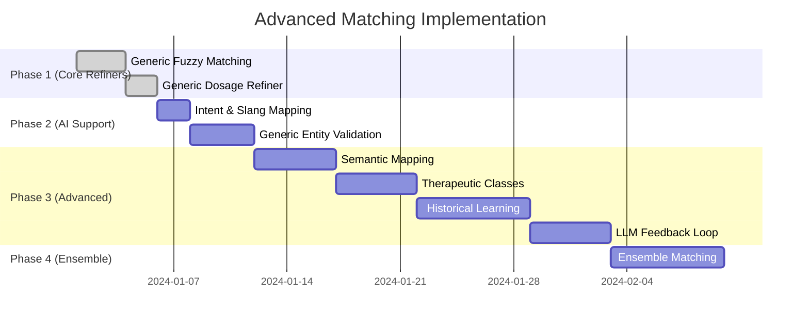

# Advanced Matching Algorithms - Implementation Tasks

This document outlines the implementation of generic algorithms that refine and validate medication data extracted by the **AI Gateway**.

> [!IMPORTANT] > **Extraction Strategy**: The AI Gateway (LLM) is responsible for the initial extraction of items from raw messages. The algorithms defined here act as **Generic Refiners** to ensure high-precision matching regardless of LLM hallucinations or variations.

---

## Strategy: Generic AI Refinement

The Rust matching engine operates on structured entities extracted by the AI Gateway. Its role is to bridge the gap between "Extracted Name" and "Database Master Data" using generic mathematical and semantic rules.



## Overview



---

## Task 1: Generic Fuzzy Name Matching

**Priority**: 🔴 High | **Effort**: Low | **Impact**: High

### Description

Handle spelling variations and LLM hallucinations in extracted English/Arabic medication names using generic string distance.

### Implementation Steps

- [x] **1.1** Add `strsim` crate to Cargo.toml ✅

  ```toml
  strsim = "0.11"
  ```

- [x] **1.2** Create `src/matching/fuzzy.rs` ✅

  - Implement Levenshtein distance
  - Implement Jaro-Winkler similarity
  - Add configurable threshold (default: 0.85)

- [x] **1.3** Handle Arabic text normalization ✅

  - Remove diacritics (تشكيل)
  - Normalize hamza variants (أإآا → ا)
  - Normalize alef maqsura (ى → ي)

- [x] **1.4** Integrate with `Scorer` (via `fallback_similarity` in worker) ✅
- [x] **1.5** Add unit tests ✅
  - Test typo tolerance
  - Test Arabic variations

### Expected Outcome

```rust
// Before
"Aspirin" == "Aspriin" → 0.0 (no match)

// After
fuzzy_match("Aspirin", "Aspriin") → 0.92 (match ✅)
fuzzy_match("أوجمنتين", "اوجمنتين") → 0.97 (match ✅)
```

---

## Task 2: Dosage Normalization

**Priority**: 🔴 High | **Effort**: Low | **Impact**: Medium

### Description

Parse and normalize medication dosages for accurate comparison with unit conversion.

### Implementation Steps

- [ ] **2.1** Generic Dosage Refiner (Done) ✅
  - Validate that "500mg" extracted by AI matches "0.5g" in the database.

### Expected Outcome

```rust
parse_dosage("500mg") == parse_dosage("0.5g") → true
dosage_similarity("500mg", "250mg") → 0.5
dosage_similarity("500mg", "500 mg") → 1.0
```

---

## Task 3: Semantic Medication Mapping

**Priority**: 🟡 Medium | **Effort**: Medium | **Impact**: High

### Description

Map Arabic colloquial/brand names to standardized international names.

### Implementation Steps

- [ ] **3.1** Create medication dictionary table

  ```sql
  CREATE TABLE medication_synonyms (
      id UUID PRIMARY KEY,
      canonical_name TEXT NOT NULL,
      synonym TEXT NOT NULL,
      language TEXT NOT NULL, -- 'ar', 'en'
      source TEXT, -- 'manual', 'learned'
      UNIQUE(canonical_name, synonym)
  );
  ```

- [ ] **3.2** Seed with common medications
      | Arabic | English | Canonical |
      |--------|---------|-----------|
      | البروفين | Brufen | Ibuprofen |
      | الحبة الزرقا | Blue Pill | Sildenafil |
      | أوجمنتين | Augmentin | Amoxicillin/Clavulanate |
      | بندول | Panadol | Paracetamol |

- [ ] **3.3** Create synonym repository

  ```rust
  pub trait MedicationSynonymRepository {
      async fn find_canonical(&self, name: &str) -> Option<String>;
      async fn find_synonyms(&self, canonical: &str) -> Vec<String>;
      async fn add_synonym(&self, canonical: &str, synonym: &str) -> Result<()>;
  }
  ```

- [ ] **3.4** Integrate with matcher

  ```rust
  // Before matching, resolve to canonical names
  let offer_canonical = synonym_repo.find_canonical(&offer.medication)
      .unwrap_or(offer.medication.clone());
  let request_canonical = synonym_repo.find_canonical(&request.medication)
      .unwrap_or(request.medication.clone());
  ```

- [ ] **3.5** Add admin API for managing synonyms
  - `POST /api/synonyms` - Add synonym
  - `GET /api/synonyms/{canonical}` - List synonyms
  - `DELETE /api/synonyms/{id}` - Remove synonym

### Expected Outcome

```rust
find_canonical("البروفين") → "Ibuprofen"
find_canonical("Brufen") → "Ibuprofen"
// Both requests match offers for "Ibuprofen"
```

---

## Task 4: Therapeutic Class Matching

**Priority**: 🟡 Medium | **Effort**: Medium | **Impact**: High

### Description

Match medications in the same therapeutic class as alternatives.

### Implementation Steps

- [ ] **4.1** Create therapeutic class taxonomy

  ```sql
  CREATE TABLE therapeutic_classes (
      id UUID PRIMARY KEY,
      name TEXT NOT NULL,
      parent_id UUID REFERENCES therapeutic_classes(id),
      atc_code TEXT -- Anatomical Therapeutic Chemical code
  );

  CREATE TABLE medication_classes (
      medication_canonical TEXT NOT NULL,
      class_id UUID REFERENCES therapeutic_classes(id),
      PRIMARY KEY (medication_canonical, class_id)
  );
  ```

- [ ] **4.2** Seed with common classes
      | Class | Medications |
      |-------|-------------|
      | Analgesics | Paracetamol, Ibuprofen, Aspirin |
      | Antibiotics - Penicillins | Amoxicillin, Augmentin, Ampicillin |
      | PPIs | Omeprazole, Esomeprazole, Pantoprazole |
      | Antihypertensives | Amlodipine, Lisinopril, Losartan |

- [ ] **4.3** Implement class-based matching

  ```rust
  pub fn therapeutic_similarity(med_a: &str, med_b: &str, class_repo: &ClassRepo) -> f64 {
      if med_a == med_b { return 1.0; }

      let classes_a = class_repo.get_classes(med_a);
      let classes_b = class_repo.get_classes(med_b);

      // Jaccard similarity of class sets
      let intersection = classes_a.intersection(&classes_b).count();
      let union = classes_a.union(&classes_b).count();

      intersection as f64 / union as f64
  }
  ```

- [ ] **4.4** Add "alternative suggestions" to match results

  ```rust
  pub struct MatchResult {
      pub exact_matches: Vec<Match>,
      pub alternative_matches: Vec<AlternativeMatch>, // Same class
  }
  ```

- [ ] **4.5** UI indication for alternatives
  - 🟢 Exact match
  - 🟡 Same therapeutic class (alternative)

### Expected Outcome

```
Request: "أوجمنتين" (Augmentin)
→ Exact: Augmentin 1g offers
→ Alternatives: Amoxicillin offers (same class)
```

---

## Task 5: Geolocation Proximity

**Priority**: 🟢 Low | **Effort**: Medium | **Impact**: Medium

### Description

Prioritize matches from nearby pharmacies.

### Implementation Steps

- [ ] **5.1** Add location to entities

  ```rust
  pub struct Offer {
      // ... existing fields
      pub location: Option<GeoLocation>,
  }

  pub struct GeoLocation {
      pub latitude: f64,
      pub longitude: f64,
      pub city: Option<String>,
      pub governorate: Option<String>,
  }
  ```

- [ ] **5.2** Extract location from group metadata

  - Parse group name for city hints
  - Use sender phone country code

- [ ] **5.3** Implement Haversine distance calculation

  ```rust
  pub fn haversine_distance(a: &GeoLocation, b: &GeoLocation) -> f64 {
      // Returns distance in kilometers
  }
  ```

- [ ] **5.4** Add proximity scoring

  ```rust
  pub fn proximity_score(distance_km: f64) -> f64 {
      match distance_km {
          d if d < 10.0 => 1.0,   // Same area
          d if d < 50.0 => 0.95,  // Same city
          d if d < 100.0 => 0.85, // Nearby
          d if d < 300.0 => 0.70, // Same region
          _ => 0.50,              // Far
      }
  }
  ```

- [ ] **5.5** Optional: Integrate with scoring weights
  ```rust
  weights.location = 0.05; // 5% weight
  ```

### Expected Outcome

```
Request from Cairo
→ Offer in Cairo: +0.05 score
→ Offer in Alexandria: +0.03 score
→ Offer in Aswan: +0.01 score
```

---

## Task 6: Historical Pattern Learning

**Priority**: 🔴 High | **Effort**: High | **Impact**: Very High

### Description

Use confirmed/rejected matches to improve future scoring dynamically.

### Implementation Steps

- [ ] **6.1** Create match feedback table (already exists: `feedback_records`)

  - Track which matches were confirmed/rejected
  - Store component scores at time of match

- [ ] **6.2** Implement weight learning (enhance existing `Learner`)

  ```rust
  pub struct WeightLearner {
      pub async fn update_from_feedback(&self, feedback: &FeedbackRecord) {
          // Increase weight for components where
          // confirmed matches scored high
          // Decrease weight for components where
          // rejected matches scored high
      }
  }
  ```

- [ ] **6.3** Track medication pair affinity

  ```sql
  CREATE TABLE medication_affinity (
      medication_a TEXT NOT NULL,
      medication_b TEXT NOT NULL,
      confirmation_count INT DEFAULT 0,
      rejection_count INT DEFAULT 0,
      affinity_score FLOAT DEFAULT 0.5,
      PRIMARY KEY (medication_a, medication_b)
  );
  ```

- [ ] **6.4** Update affinity on feedback

  ```rust
  // On confirmation: affinity += 0.1 (capped at 1.0)
  // On rejection: affinity -= 0.1 (floored at 0.0)
  ```

- [ ] **6.5** Use affinity in scoring

  ```rust
  let historical_bonus = affinity_repo
      .get_affinity(&offer.medication, &request.medication)
      .unwrap_or(0.5);

  score += historical_bonus * weights.historical;
  ```

- [ ] **6.6** Implement confidence intervals
  - Require minimum samples before applying learned weights
  - Decay old feedback over time

### Expected Outcome

```
After 50 confirmations of "Brufen" ↔ "Ibuprofen":
→ affinity_score = 0.95
→ Future matches get +0.05 bonus
```

---

## Task 7: Ensemble Matching

**Priority**: 🟡 Medium | **Effort**: High | **Impact**: Very High

### Description

Combine multiple algorithms for robust matching.

### Implementation Steps

- [ ] **7.1** Define `MatchingStrategy` trait

  ```rust
  pub trait MatchingStrategy: Send + Sync {
      fn name(&self) -> &str;
      fn score(&self, offer: &Offer, request: &Request) -> f64;
      fn weight(&self) -> f64;
  }
  ```

- [ ] **7.2** Implement strategies

  - `EmbeddingStrategy` - Vector similarity
  - `FuzzyStringStrategy` - String distance
  - `TherapeuticClassStrategy` - Class matching
  - `HistoricalStrategy` - Learned patterns
  - `ProximityStrategy` - Location-based

- [ ] **7.3** Create `EnsembleMatcher`

  ```rust
  pub struct EnsembleMatcher {
      strategies: Vec<Box<dyn MatchingStrategy>>,
  }

  impl EnsembleMatcher {
      pub fn score(&self, offer: &Offer, request: &Request) -> f64 {
          let total_weight: f64 = self.strategies.iter()
              .map(|s| s.weight()).sum();

          self.strategies.iter()
              .map(|s| s.score(offer, request) * s.weight())
              .sum::<f64>() / total_weight
      }
  }
  ```

- [ ] **7.4** Add configurable strategy weights

  ```rust
  pub struct EnsembleConfig {
      pub embedding_weight: f64,      // 0.40
      pub fuzzy_weight: f64,          // 0.25
      pub therapeutic_weight: f64,    // 0.15
      pub historical_weight: f64,     // 0.15
      pub proximity_weight: f64,      // 0.05
  }
  ```

- [ ] **7.5** Provide explainability

  ```rust
  pub struct MatchExplanation {
      pub total_score: f64,
      pub component_scores: HashMap<String, f64>,
      pub reasoning: String,
  }
  ```

- [ ] **7.6** A/B testing support
  - Compare ensemble vs single-strategy
  - Track confirmation rates per strategy

### Expected Outcome

```rust
EnsembleMatcher::score(offer, request)
→ MatchExplanation {
    total_score: 0.87,
    component_scores: {
        "embedding": 0.92,
        "fuzzy": 0.88,
        "therapeutic": 0.75,
        "historical": 0.90,
        "proximity": 0.80,
    },
    reasoning: "Strong embedding match (0.92), same therapeutic class"
}
```

---

## Legacy Data Analysis (UTF-8 Verified)

Based on the analysis of legacy messages (UTF-8) from the Go system:

### Data Patterns Identified

1. **Multi-Item Lists (Bulk Offers/Requests)**:
   - _Example_: Messages often contain bulleted lists or line-separated medication names (e.g., Message #2, #22, #63).
   - _Requirement_: A splitter that breaks messages by `\n` or emoji markers (📌, 💊, 💥).
2. **Intent Signaling (Colloquial Arabic)**:
   - **Offers**: `متوفر`, `متاح`, `وااارردد` (Incoming), `موجود`.
   - **Requests**: `مطلوب` (Required), `اي حد عنده` (Does anyone have), `محتاج`.
   - _Requirement_: Keyword-based intent classification.
3. **Emoji & Noise Pattern**:
   - Emojis (🚨, 🧪, 💣, 🔥) are used as decorative noise or urgency markers.
   - _Requirement_: Strip emojis for text similarity; use them for structure detection.

---

## Task 8: Generic Entity Validation

**Priority**: 🔴 High | **Effort**: Low | **Impact**: Medium

### Description

A "Sanity Check" layer that runs after AI extraction to filter out hallucinations (e.g., AI extracting "WhatsApp" or "Dr. Name" as a medication).

### Implementation Steps

- [ ] **8.1** Create a "Blacklist" of noisy keywords that AI might mis-extract.
- [ ] **8.2** Cross-reference all extracted names against the `medication_mappings` table.
- [ ] **8.3** Flag low-confidence AI results (confidence < 0.6) for manual review.

---

## Task 9: Intent & Slang Mapping

**Priority**: 🔴 High | **Effort**: Low | **Impact**: High

### Description

Classify messages as "Offer" or "Request" using colloquial Arabic indicators.

### Implementation Steps

- [ ] **9.1** Define dictionary of common intent markers (Offer/Request).
- [ ] **9.2** Implement `IntentDetector` for message pre-routing.

---

## Task 10: Structural Noise Reduction

**Priority**: 🟡 Medium | **Effort**: Low | **Impact**: Medium

### Description

Clean emojis and repetitive characters (e.g., `وااارردد` → `وارد`) before similarity scoring.

---

## Task 11: Urgency & Metadata Extraction

**Priority**: 🟢 Low | **Effort**: Medium | **Impact**: Medium

### Description

Extract urgency (Immediate execution) and context (Long expiry) for match prioritization.

---

## Task 12: LLM Feedback Loop (Generic Learning)

**Priority**: 🟡 Medium | **Effort**: High | **Impact**: Very High

### Description

Feed confirmed matches back into the system to improve future AI extraction prompts automatically. "Hard" matches discovered by algorithms but missed by initial AI extraction can be used for automated few-shot prompting updates.

---

## Implementation Order



---

## Estimated Effort

| Task                    | Days        | Dependencies      |
| ----------------------- | ----------- | ----------------- |
| 1. Fuzzy String         | 3           | None              |
| 2. Dosage Normalization | 2           | None              |
| 3. Semantic Mapping     | 5           | Fuzzy             |
| 4. Therapeutic Classes  | 5           | Semantic          |
| 5. Geolocation          | 3           | None              |
| 6. Historical Learning  | 7           | Existing feedback |
| 7. Ensemble Matching    | 7           | All above         |
| **Total**               | **32 days** |                   |

---

## Success Metrics

| Metric                      | Current | Target |
| --------------------------- | ------- | ------ |
| Match confirmation rate     | ~70%    | >85%   |
| False positive rate         | ~15%    | <5%    |
| Average matches per request | 2.1     | 3.5    |
| Arabic name match accuracy  | ~60%    | >90%   |
