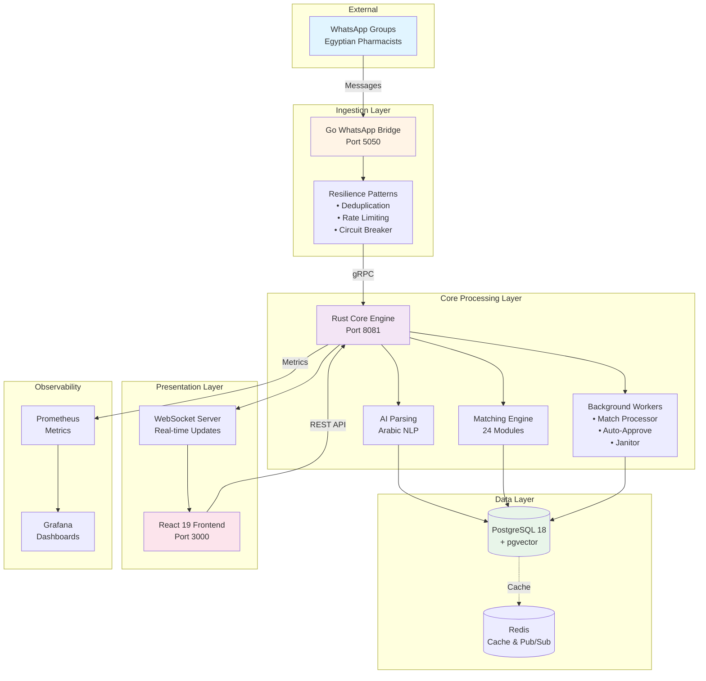
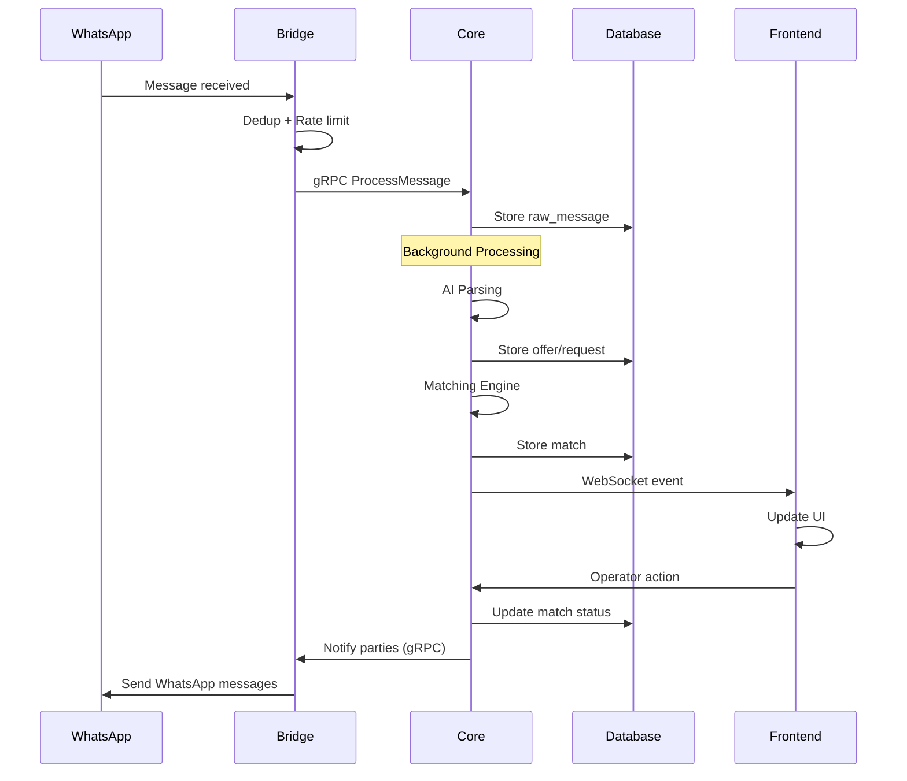
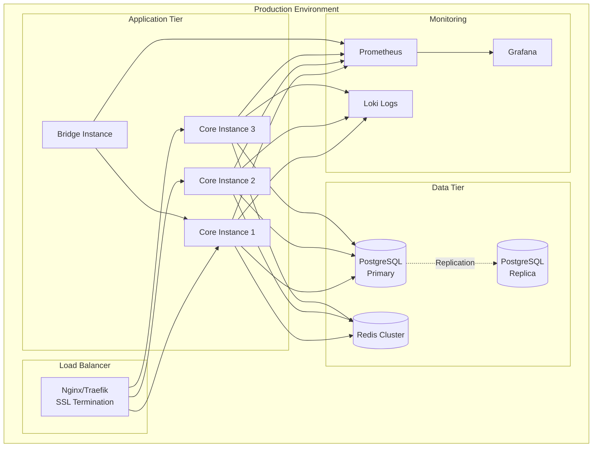
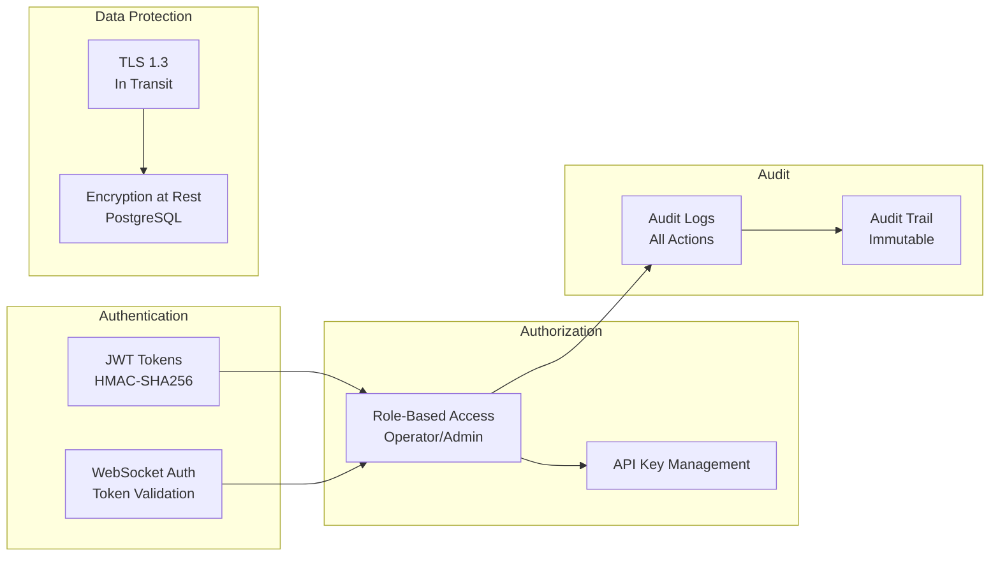

# System Overview - PharmaBroker

**AI-Powered Pharmaceutical Trading Platform for Egyptian WhatsApp Groups**

---

## Executive Summary

PharmaBroker is an enterprise-grade polyglot microservices platform that revolutionizes pharmaceutical trading in Egypt by automating the matching of medication supply and demand through WhatsApp groups.

**Key Capabilities:**

- Real-time WhatsApp message processing
- AI-powered Arabic text parsing
- Sophisticated 24-module matching engine
- Adaptive learning from operator feedback
- Real-time dashboard with WebSocket updates

---

## High-Level Architecture



---

## System Components

### 1. Go WhatsApp Bridge

**Purpose:** Real-time message ingestion with resilience patterns

**Responsibilities:**

- WhatsApp protocol integration (whatsmeow)
- Message deduplication (LRU cache)
- Rate limiting (1000/min)
- Circuit breaker (3 failures → 30s timeout)
- Retry buffer (1000 messages)
- QR code authentication
- Group synchronization

**Technology:** Go 1.25+, gRPC, whatsmeow

---

### 2. Rust Core Engine

**Purpose:** AI parsing, matching, and API services

**Responsibilities:**

- AI-powered Arabic text parsing
- 24-module matching engine
- REST API (26+ endpoints)
- gRPC server (5 RPC methods)
- WebSocket server (real-time events)
- Background workers
- Business logic orchestration

**Technology:** Rust 1.75+, Axum, Tonic, SeaORM

---

### 3. PostgreSQL Database

**Purpose:** Primary data store with vector capabilities

**Responsibilities:**

- Persistent data storage (20 tables)
- Vector embeddings (pgvector)
- Full-text search (BM25)
- Referential integrity
- Audit trail storage

**Technology:** PostgreSQL 18+, pgvector extension

---

### 4. React Frontend

**Purpose:** User interface with real-time updates

**Responsibilities:**

- Dashboard visualization
- Match review interface
- Medication management
- Analytics and reporting
- Real-time WebSocket updates

**Technology:** React 19, TanStack Router, React Query

---

## Data Flow Overview



---

## Key Features

### 🤖 Intelligent AI Parsing

- Arabic NLP extraction from informal Egyptian dialect
- Multi-model support (Qwen, Ministral, Gemma)
- Local inference (no data leaves infrastructure)
- Feedback loop for continuous improvement

### ⚖️ Advanced Matching Engine

- 24 specialized modules working in harmony
- 5-dimension weighted scoring
- Ensemble strategies (fuzzy, embedding, full-text)
- Confidence calibration (Platt scaling)
- A/B testing framework

### 🧠 Adaptive Learning

- Gradient descent weight optimization
- Warm-start manager for new deployments
- Outlier detection for data quality
- Historical affinity learning

### 🔒 Production-Grade Resilience

- Circuit breaker pattern
- Rate limiting and throttling
- Message deduplication
- Retry mechanisms
- Comprehensive audit trail

### 📊 Real-Time Dashboard

- WebSocket-powered live updates
- Match review and confirmation
- Analytics and reporting
- Medication management
- Audit trail viewer

---

## Technology Stack

| Layer             | Technology     | Version | Purpose                 |
| ----------------- | -------------- | ------- | ----------------------- |
| **Bridge**        | Go             | 1.25+   | WhatsApp integration    |
| **Core**          | Rust           | 1.75+   | Business logic, APIs    |
| **Database**      | PostgreSQL     | 18+     | Data persistence        |
| **Cache**         | Redis          | 8+      | Caching, pub/sub        |
| **Frontend**      | React          | 19      | User interface          |
| **Communication** | gRPC           | -       | Inter-service messaging |
| **Monitoring**    | Prometheus     | -       | Metrics collection      |
| **Visualization** | Grafana        | -       | Dashboards              |
| **Orchestration** | Docker Compose | -       | Service management      |

---

## Deployment Architecture



---

## Performance Characteristics

| Metric                | Current    | Target       | Notes                   |
| --------------------- | ---------- | ------------ | ----------------------- |
| **API Latency (p95)** | 500ms      | <200ms       | Includes AI parsing     |
| **Vector Search**     | 50-200ms   | <20ms        | With HNSW index         |
| **Throughput**        | 50 msg/min | 100+ msg/min | Per instance            |
| **Match Accuracy**    | 75%        | 85%+         | Operator feedback       |
| **Uptime**            | 99.5%      | 99.9%        | With redundancy         |
| **Cache Hit Rate**    | 0%         | 70%+         | After Redis integration |

---

## Security Model



---

## Getting Started

### Prerequisites

- Docker & Docker Compose
- Go 1.25+ (for Bridge development)
- Rust 1.75+ (for Core development)
- Bun (for Frontend development)
- PostgreSQL 18+ (or use Docker)

### Quick Start

```bash
# Clone repository
git clone https://github.com/your-org/pharmabroker.git
cd pharmabroker

# Start all services
docker compose up -d

# View logs
docker compose logs -f core bridge

# Access services
# - Frontend: http://localhost:3000
# - Core API: http://localhost:8082
# - Bridge: http://localhost:5050
# - Grafana: http://localhost:3001
```

### Development Setup

```bash
# Core (Rust)
cd core
cargo run

# Bridge (Go)
cd bridge
go run .

# Frontend (React)
cd frontend
bun install
bun run dev
```

---

## Next Steps

1. **For Developers:** Review [Phase 1: Message Ingestion](../phases/01-message-ingestion.md)
2. **For Architects:** Study [Technology Stack](01-technology-stack.md)
3. **For Operations:** Check [Deployment Guide](../improvements/devops.md)

---

**Document Version:** 1.0  
**Last Updated:** February 16, 2026  
**Next Review:** March 16, 2026
