# PharmaBroker Architecture Flow Documentation

> Complete end-to-end flow analysis comparing Legacy (Monolithic Go) vs Current (Rust Core + Go Bridge)
> Last Updated: December 21, 2025

---

## Table of Contents

1. [Architecture Overview](#1-architecture-overview)
2. [Legacy Architecture Flow](#2-legacy-architecture-flow)
3. [Current Architecture Flow](#3-current-architecture-flow)
4. [Detailed Component Diagrams](#4-detailed-component-diagrams)
5. [Database Schema](#5-database-schema)
6. [Data Flow Comparison](#6-data-flow-comparison)
7. [Key Differences](#7-key-differences)

---

## 1. Architecture Overview

### 1.1 High-Level Comparison

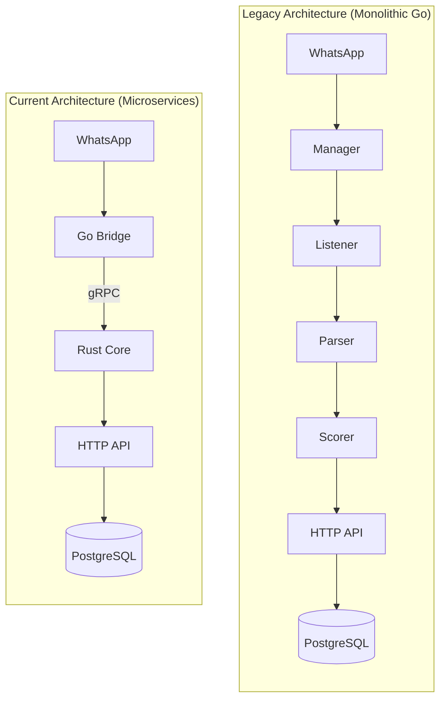

### 1.2 Technology Stack

| Layer                | Legacy            | Current                    |
| -------------------- | ----------------- | -------------------------- |
| WhatsApp Integration | Go (whatsmeow)    | Go Bridge (whatsmeow)      |
| Business Logic       | Go                | Rust Core                  |
| API Framework        | Gin               | Axum                       |
| Inter-service Comm   | N/A (monolith)    | gRPC + Protobuf            |
| AI Integration       | HTTP to Gateway   | Direct Docker Model Runner |
| Database             | PostgreSQL + GORM | PostgreSQL + SQLx          |
| Real-time Updates    | SSE               | WebSocket                  |

---

## 2. Legacy Architecture Flow

### 2.1 Complete Message Flow

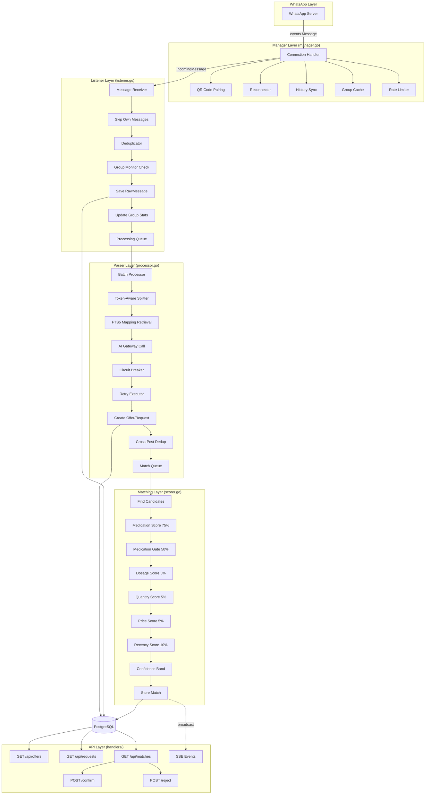

### 2.2 Legacy Scoring Algorithm

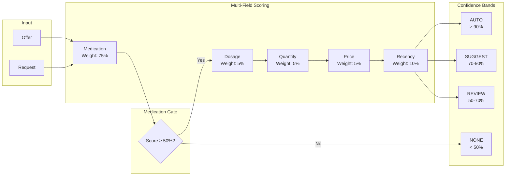

---

## 3. Current Architecture Flow

### 3.1 Complete Message Flow

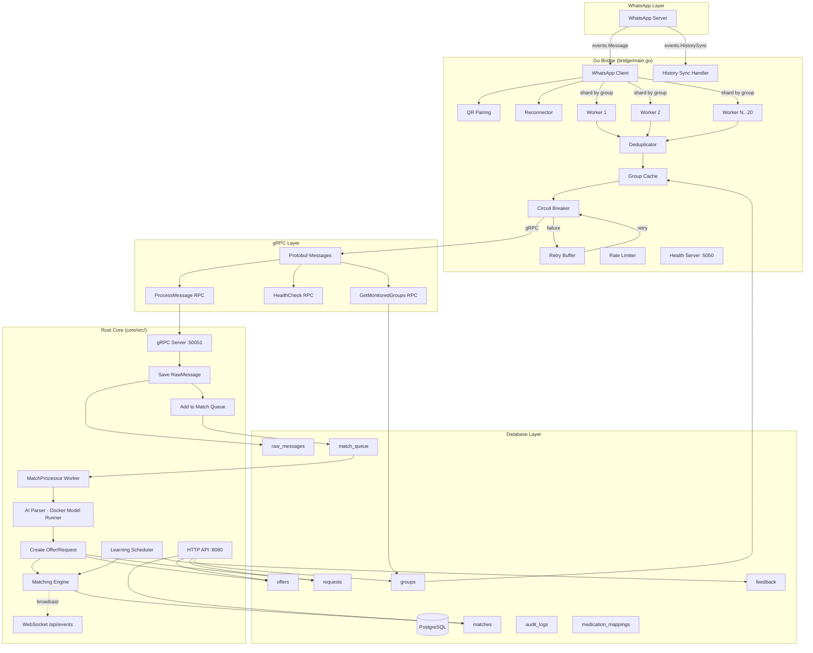

### 3.2 Go Bridge Detail Flow

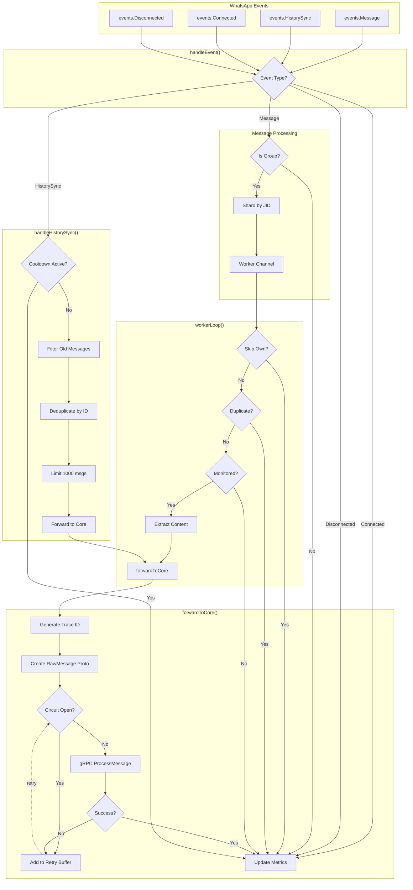

### 3.3 Rust Core Detail Flow

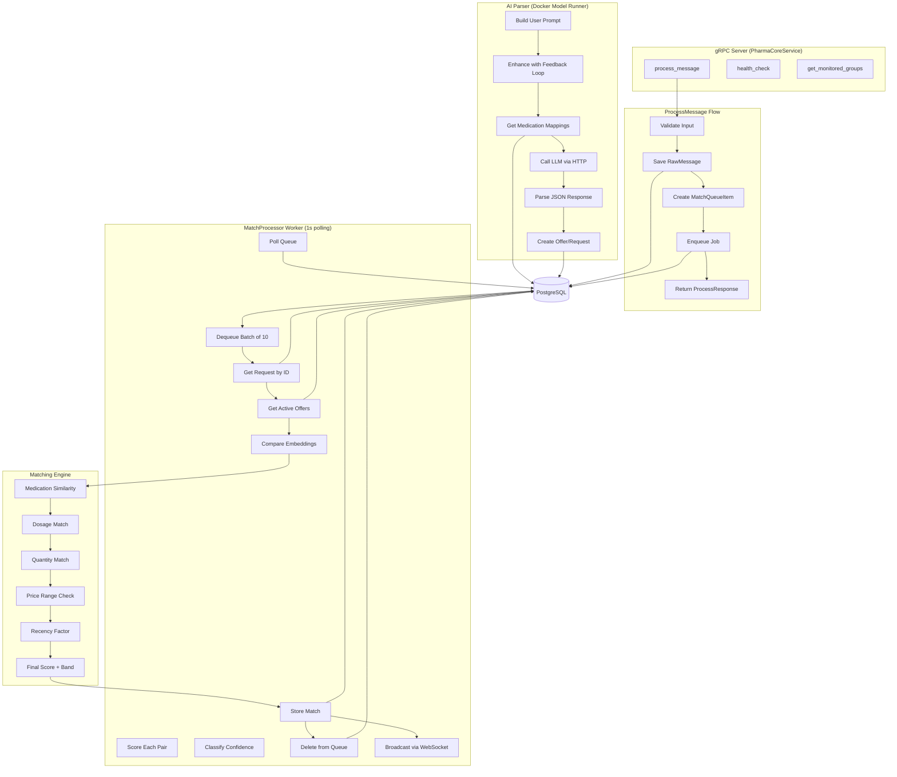

---

## 4. Detailed Component Diagrams

### 4.1 Bridge Resilience Components

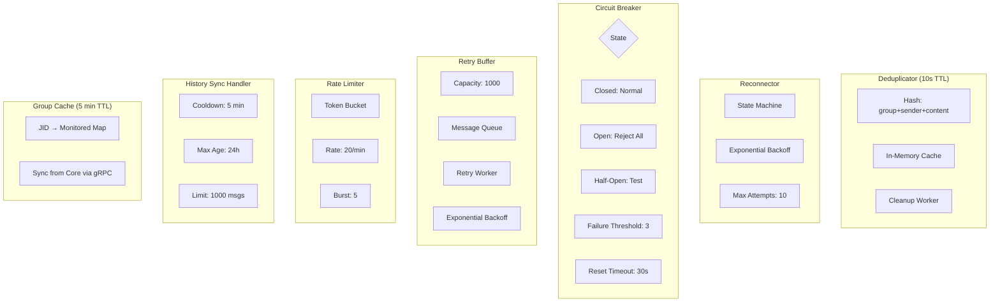

### 4.2 AI Parser Pipeline (Rust Core)

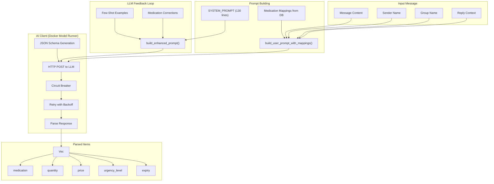

---

## 5. Database Schema

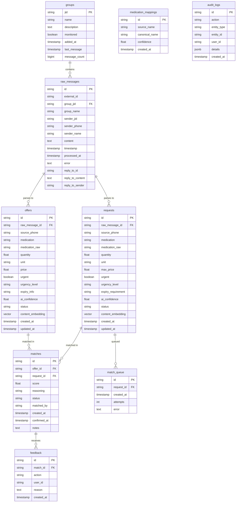

---

## 6. Data Flow Comparison

### 6.1 Side-by-Side Flow

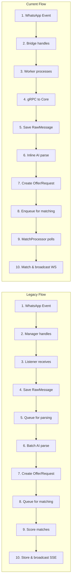

### 6.2 Processing Comparison Table

| Step                 | Legacy             | Current                          |
| -------------------- | ------------------ | -------------------------------- |
| 1. Message Reception | Manager → Listener | Bridge → Worker Pool (sharded)   |
| 2. Deduplication     | In Listener        | In Bridge (Deduplicator + Cache) |
| 3. Group Check       | In Listener        | In Bridge (GroupCache + gRPC)    |
| 4. Persistence       | Direct to DB       | gRPC → Core → DB                 |
| 5. AI Parsing        | Batch in Parser    | Inline in `process_message`      |
| 6. Matching          | Batch in Scorer    | Async via MatchProcessor Worker  |
| 7. Real-time Updates | SSE                | WebSocket                        |
| 8. Resilience        | Basic reconnect    | CB + Retry Buffer + Rate Limit   |

---

## 7. Key Differences

### 7.1 Architecture Comparison

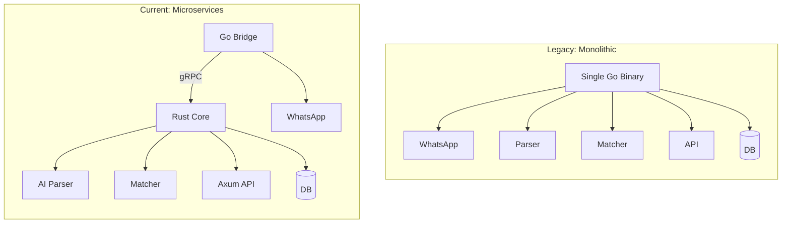

### 7.2 Resilience Comparison

| Feature         | Legacy              | Current                   |
| --------------- | ------------------- | ------------------------- |
| Reconnection    | Exponential backoff | Exponential backoff       |
| Circuit Breaker | AI calls only       | gRPC + AI calls           |
| Retry Buffer    | None                | 1000 message buffer       |
| Rate Limiting   | Outbound only       | Outbound + configurable   |
| Deduplication   | 10s window          | 10s window + history sync |
| Health Checks   | Single endpoint     | Bridge :5050 + Core :8080 |
| Group Caching   | 5 min TTL           | 5 min TTL + gRPC sync     |

### 7.3 Scalability

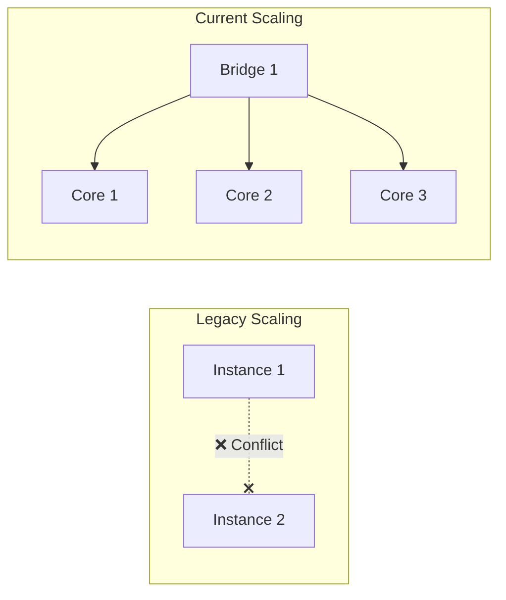

**Note:** Bridge must remain single instance (WhatsApp limitation), but Core can scale horizontally.

### 7.4 Technology Benefits

| Aspect         | Legacy (Go)     | Current (Go + Rust)           |
| -------------- | --------------- | ----------------------------- |
| Memory Safety  | GC-managed      | Rust: Compile-time guarantees |
| Concurrency    | Goroutines      | Rust: async/await + tokio     |
| Performance    | Good            | Excellent (Rust Core)         |
| Type Safety    | Good            | Excellent (Rust)              |
| Error Handling | error interface | Result<T, E> with ? operator  |
| Build Time     | Fast (~10s)     | Slower (~60s Rust)            |
| Binary Size    | Small (~30MB)   | Larger (~50MB Rust)           |

---

## Summary

### Flow Similarity

Both architectures follow the same logical flow:

1. **Ingest** → WhatsApp messages received
2. **Deduplicate** → Filter duplicate messages
3. **Persist** → Save raw messages to database
4. **Parse** → AI extracts offers/requests (with urgency + expiry)
5. **Match** → Score and find matches using embedding similarity
6. **Notify** → Real-time updates to operators

### Key Improvements in Current Architecture

1. **Separation of Concerns**: WhatsApp handling isolated in Go Bridge
2. **Resilience**: Circuit breaker + retry buffer for gRPC failures
3. **Scalability**: Rust Core can scale horizontally
4. **Performance**: Rust for CPU-intensive matching and embedding comparison
5. **AI Integration**: Direct Docker Model Runner (no TypeScript gateway)
6. **Feedback Loop**: LLM learns from operator corrections
7. **Observability**: Better health checks and WebSocket notifications
8. **Type Safety**: Rust's compile-time guarantees prevent runtime errors

### Migration Path

The current architecture maintains compatibility with legacy:

- Same database schema (extended with new fields)
- Same API endpoints (Axum mirrors Gin routes)
- Same matching algorithm (ported from Go scorer)
- Same confidence bands (AUTO/SUGGEST/REVIEW/NONE)
