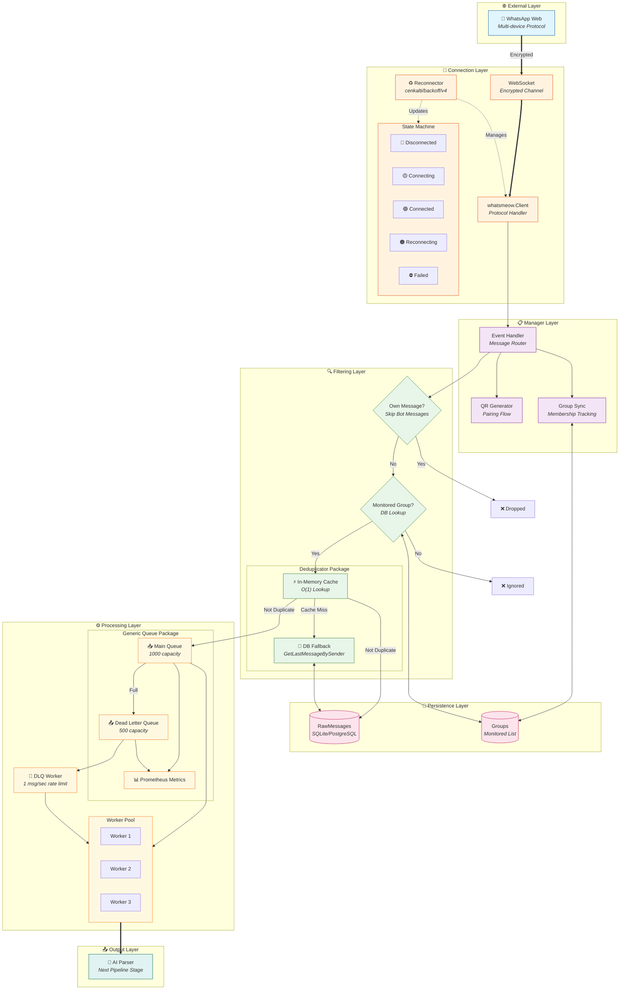
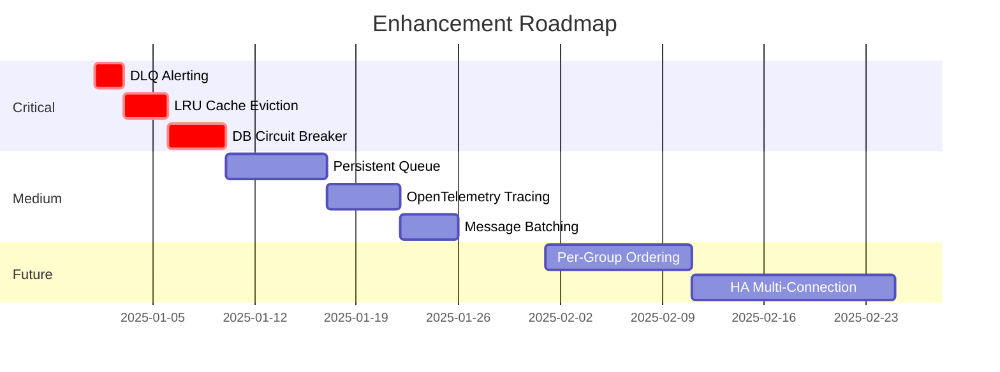
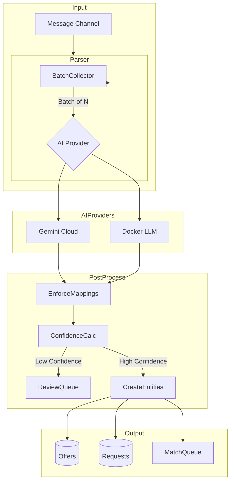
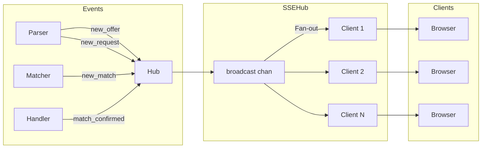
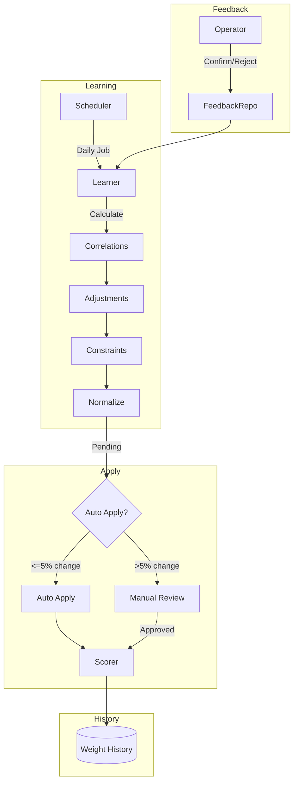

# PharmaBroker Core Functionality Analysis

> Detailed Technical Analysis of All Core System Components
> Version: 1.1 | Date: December 2025 | Updated with Implemented Enhancements

---

## Table of Contents

1. [Executive Summary](#executive-summary)
2. [Functionality 1: WhatsApp Message Ingestion](#functionality-1-whatsapp-message-ingestion)
3. [Functionality 2: AI-Powered Arabic Text Parsing](#functionality-2-ai-powered-arabic-text-parsing)
4. [Functionality 3: Intelligent Matching Engine](#functionality-3-intelligent-matching-engine)
5. [Functionality 4: Confidence-Based Actions](#functionality-4-confidence-based-actions)
6. [Functionality 5: Multi-Platform Bot Commands](#functionality-5-multi-platform-bot-commands)
7. [Functionality 6: Real-time Updates (SSE)](#functionality-6-real-time-updates-sse)
8. [Functionality 7: Adaptive Learning](#functionality-7-adaptive-learning)
9. [Cross-Cutting Concerns](#cross-cutting-concerns)
10. [Recommendations Summary](#recommendations-summary)

---

## Executive Summary

PharmaBroker is a sophisticated pharmaceutical trading platform comprising **7 core functionalities** implemented across **~50+ files** with strong architectural foundations. This analysis examines each functionality's implementation, strengths, weaknesses, and improvement opportunities.

### Technology Stack Overview

| Component            | Technology           | Lines of Code |
| -------------------- | -------------------- | ------------- |
| WhatsApp Integration | whatsmeow library    | ~1,100        |
| AI Parsing           | Gemini/Docker LLM    | ~450          |
| Matching Engine      | Custom scorer        | ~700          |
| Bot Commands         | Platform-agnostic    | ~800          |
| Real-time SSE        | Native Go            | ~240          |
| Adaptive Learning    | Statistical analysis | ~325          |

---

## Functionality 1: WhatsApp Message Ingestion

### Implementation Location

| File                             | Purpose                                | Lines |
| -------------------------------- | -------------------------------------- | ----- |
| `messaging/whatsapp/manager.go`  | Connection management + reconnector    | 770   |
| `messaging/whatsapp/listener.go` | Message handling, group monitoring     | 400   |
| `messaging/reconnector/`         | **NEW** Standalone reconnection module | 290   |
| `messaging/queue/`               | **NEW** Generic queue with DLQ         | 420   |
| `messaging/deduplicator/`        | **NEW** Generic message deduplication  | 340   |
| `messaging/health/`              | **NEW** Health check functions         | 90    |

### Architecture Overview

The WhatsApp Message Ingestion system is a **multi-layered, fault-tolerant pipeline** that receives messages from WhatsApp, filters and deduplicates them, and queues them for AI parsing. Each layer is implemented as a standalone, reusable package.



### How It Works - Step by Step

#### 1️⃣ Connection Establishment

| Step | Component           | Action                                               |
| ---- | ------------------- | ---------------------------------------------------- |
| 1.1  | `Manager.Connect()` | Initiates connection to WhatsApp servers             |
| 1.2  | `whatsmeow.Client`  | Establishes encrypted WebSocket                      |
| 1.3  | QR Generator        | Displays QR code for mobile pairing                  |
| 1.4  | State Machine       | Transitions: `Disconnected → Connecting → Connected` |

#### 2️⃣ Connection Resilience

```
┌──────────────────────────────────────────────────────────────────┐
│                    Reconnector Flow                              │
├──────────────────────────────────────────────────────────────────┤
│  Disconnect Detected                                             │
│         ↓                                                        │
│  State → Reconnecting                                            │
│         ↓                                                        │
│  ┌─────────────────────────────────────────┐                     │
│  │ Retry Loop (with exponential backoff)   │                     │
│  │   Attempt 1: wait 5s  → connect()       │                     │
│  │   Attempt 2: wait 10s → connect()       │                     │
│  │   Attempt 3: wait 20s → connect()       │                     │
│  │   ...                                   │                     │
│  │   Attempt N: wait min(5min, delay)      │                     │
│  └─────────────────────────────────────────┘                     │
│         ↓                       ↓                                │
│  Success → Connected     Max Retries → Failed + Alert            │
└──────────────────────────────────────────────────────────────────┘
```

#### 3️⃣ Message Filtering Pipeline

| Stage               | Check                      | Pass Condition         | Fail Action    |
| ------------------- | -------------------------- | ---------------------- | -------------- |
| **Own Message**     | `msg.Sender == BotJID`     | Not from bot           | Skip silently  |
| **Monitored Group** | `DB.IsMonitored(groupJID)` | Group in whitelist     | Ignore message |
| **Deduplication**   | `dedup.IsDuplicate(msg)`   | Not seen in 10s window | Skip duplicate |

#### 4️⃣ Deduplication Strategy

```
┌─────────────────────────────────────────────────────────────────┐
│                   Deduplication Decision Tree                   │
├─────────────────────────────────────────────────────────────────┤
│                                                                 │
│  New Message Arrives                                            │
│         ↓                                                       │
│  ┌─────────────────────┐                                        │
│  │ Check In-Memory     │ ← O(1) lookup, ~10μs                   │
│  │ Cache               │                                        │
│  └─────────────────────┘                                        │
│         ↓                                                       │
│    Found in Cache?                                              │
│      ↓ Yes        ↓ No                                          │
│  ┌─────────┐   ┌─────────────────────┐                          │
│  │DUPLICATE│   │ Check Database      │ ← ~1-5ms                 │
│  │(skip)   │   │ GetLastBySender()   │                          │
│  └─────────┘   └─────────────────────┘                          │
│                    ↓                                            │
│               Same content within 10s?                          │
│                 ↓ Yes        ↓ No                               │
│             ┌─────────┐   ┌───────────────┐                     │
│             │DUPLICATE│   │ NEW MESSAGE   │                     │
│             │(skip)   │   │ → Save + Queue│                     │
│             └─────────┘   └───────────────┘                     │
│                                                                 │
└─────────────────────────────────────────────────────────────────┘
```

#### 5️⃣ Queue Processing

```
┌─────────────────────────────────────────────────────────────────┐
│                    Queue Flow Diagram                           │
├─────────────────────────────────────────────────────────────────┤
│                                                                 │
│  Enqueue(msg)                                                   │
│       ↓                                                         │
│  Main Queue Full?                                               │
│    ↓ No              ↓ Yes                                      │
│  ┌──────────────┐  ┌──────────────┐                             │
│  │ Main Queue   │  │ DLQ Full?    │                             │
│  │ (1000 cap)   │    ↓ No   ↓ Yes                               │
│  └──────────────┘  ┌─────┐ ┌─────────┐                          │
│       ↓            │ DLQ │ │ DROPPED │                          │
│  Worker Pool       │(500)│ │ +metric │                          │
│  (3 workers)       └─────┘ └─────────┘                          │
│       ↓               ↓                                         │
│  ┌──────────────────────────────────┐                           │
│  │        Parser.ProcessMessage()   │                           │
│  └──────────────────────────────────┘                           │
│                                                                 │
│  DLQ Recovery: 1 message/second rate limit                      │
│                                                                 │
└─────────────────────────────────────────────────────────────────┘
```

### Remaining Weaknesses & Recommended Enhancements

> [!WARNING]
> The following issues have been identified but **not yet implemented**.

#### 🔴 Critical Issues

| Issue                               | Impact                                | Recommended Solution                         | Effort |
| ----------------------------------- | ------------------------------------- | -------------------------------------------- | ------ |
| **No Message Persistence on Crash** | Messages in queue lost on restart     | Implement persistent queue (Redis, BadgerDB) | High   |
| **No Circuit Breaker for DB**       | DB slowdown cascades to ingestion     | Add circuit breaker around DB operations     | Medium |
| **Unbounded Memory Growth**         | In-memory cache can grow indefinitely | Add LRU eviction policy with max size        | Medium |

#### 🟠 Medium Priority

| Issue                             | Impact                                  | Recommended Solution                                 | Effort |
| --------------------------------- | --------------------------------------- | ---------------------------------------------------- | ------ |
| **No Message Ordering Guarantee** | Worker pool may process out of order    | Implement per-group ordering with partitioned queues | High   |
| **Single Point of Failure**       | One Manager per instance                | Support multiple WhatsApp connections (HA)           | High   |
| **No Backpressure to Producer**   | WhatsApp keeps sending while queue full | Implement flow control / pause ingestion             | Medium |
| **No Dead Letter Alerting**       | DLQ fills silently                      | Add Prometheus alert when DLQ > 50%                  | Low    |

#### 🟢 Nice to Have

| Issue                      | Impact                        | Recommended Solution                | Effort |
| -------------------------- | ----------------------------- | ----------------------------------- | ------ |
| **No Message Batching**    | One DB insert per message     | Batch inserts for higher throughput | Medium |
| **No Tracing**             | Hard to debug message flow    | Add OpenTelemetry spans             | Medium |
| **Hardcoded Dedup Window** | 10s may not suit all groups   | Make window configurable per-group  | Low    |
| **No Replay Capability**   | Cannot reprocess old messages | Add message replay from DB          | Medium |

### Recommended Priority Implementation



### Performance Characteristics

| Metric             | Current Value               | Bottleneck                   |
| ------------------ | --------------------------- | ---------------------------- |
| **Throughput**     | ~1000 msg/sec               | DB inserts (single-threaded) |
| **Latency (P50)**  | ~5ms                        | Dedup cache lookup           |
| **Latency (P99)**  | ~50ms                       | DB fallback on cache miss    |
| **Memory**         | ~50MB base + 1KB/cached msg | In-memory dedup cache        |
| **Queue Capacity** | 1500 messages total         | Main (1000) + DLQ (500)      |
| **Recovery Time**  | 5s - 5min                   | Exponential backoff range    |

### Key Components

#### Manager (`manager.go`) + Reconnector Package ✅ REFACTORED

```go
// Connection state management
type ConnectionState int
const (
    StateDisconnected ConnectionState = iota
    StateConnecting
    StateConnected
    StateReconnecting
    StateFailed
)

// Using standalone reconnector package (github.com/cenkalti/backoff/v4)
import "pharmabroker/messaging/reconnector"

type Manager struct {
    // ...existing fields...
    reconnector *reconnector.Reconnector  // Battle-tested backoff
}

// Reconnector configuration from messaging/reconnector package
type ReconnectorConfig struct {
    InitialInterval     time.Duration // Default: 5s
    MaxInterval         time.Duration // Default: 5min
    Multiplier          float64       // Default: 2.0
    RandomizationFactor float64       // Default: 0.1 (10% jitter)
    MaxElapsedTime      time.Duration // 0 = infinite
    MaxRetries          uint64        // 0 = infinite
}
```

**Key Methods:**

- `Connect()` - Establishes connection with QR code pairing
- `RegisterHandler()` - Adds event listeners
- `SyncGroups()` - Syncs group list to database
- `SendTextMessage()` - Sends messages
- `IsConnected()` / `State()` - Connection status
- `reconnectWithBackoff()` - Uses `reconnector.Run()` internally

#### Listener (`listener.go`)

```go
// Uses packages from messaging/queue and messaging/deduplicator
import (
    "pharmabroker/messaging/queue"
    "pharmabroker/messaging/deduplicator"
)

type Listener struct {
    log                    zerolog.Logger
    rawMsgRepo             repository.RawMessageRepository
    groupRepo              repository.GroupRepository
    queue                  *queue.Queue[*entity.RawMessage]      // Generic queue
    deduplicator           *deduplicator.Deduplicator[*entity.RawMessage]
    skipOwnMessagesChecker func() bool
}
```

**Processing Pipeline:**

1. `HandleMessage()` - Entry point
2. `logMessageReceived()` - Structured logging
3. `shouldSkipOwnMessage()` - Config-based filtering
4. `isDuplicateMessage()` - Uses deduplicator package
5. `checkGroupMonitored()` - DB lookup
6. `createRawMessage()` - Entity conversion
7. `saveMessage()` - Persistence
8. `queueMessage()` - Uses queue package with overflow handling

#### Generic Queue (`messaging/queue/`) ✅ STANDALONE PACKAGE

```go
package queue

// Generic queue constraint - any type with GetID()
type Identifiable interface {
    GetID() string
}

// Generic queue with type parameter
type Queue[T Identifiable] struct {
    messages   chan T          // Main queue
    deadLetter chan T          // Overflow queue
    handler    MessageHandler[T]
}

type QueueConfig struct {
    BufferSize     int           // Main queue (default: 1000)
    DeadLetterSize int           // Overflow queue (default: 500)
    WorkerCount    int           // Parallel workers (default: 3)
    ProcessTimeout time.Duration // Per-message timeout (default: 30s)
}

type QueueHealthStatus string
const (
    QueueHealthStatusHealthy      QueueHealthStatus = "HEALTHY"
    QueueHealthStatusWarning      QueueHealthStatus = "WARNING"
    QueueHealthStatusDegraded     QueueHealthStatus = "DEGRADED"
    QueueHealthStatusStopped      QueueHealthStatus = "STOPPED"
    QueueHealthStatusUnhealthy    QueueHealthStatus = "UNHEALTHY"
    QueueHealthStatusDisconnected QueueHealthStatus = "DISCONNECTED"
)
```

**Queue Flow:**

1. `Enqueue()` - Non-blocking insert to main queue
2. If full → overflow to dead letter queue
3. If both full → message dropped (with metrics)
4. Worker pool processes from main queue
5. DLQ worker retries at 1 msg/second rate limit

#### Generic Deduplicator (`messaging/deduplicator/`) ✅ STANDALONE PACKAGE

```go
package deduplicator

// Generic interface for deduplication
type DedupMessage interface {
    GetTimestamp() time.Time
    GetContent() string
}

type Lookup[T DedupMessage] interface {
    GetLast(ctx context.Context, groupID, senderID string) (T, error)
}

// Generic deduplicator with type parameter
type Deduplicator[T DedupMessage] struct {
    cfg    DeduplicatorConfig
    cache  map[string]cacheEntry[T]
    lookup Lookup[T]
}

type DeduplicatorConfig struct {
    Window           time.Duration // Duplicate detection window (default: 10s)
    UseInMemoryCache bool          // Enable fast cache lookup (default: true)
    CacheSize        int           // Max cache entries (default: 10000)
    CacheTTL         time.Duration // Cache entry lifetime (default: 30s)
    CleanupInterval  time.Duration // Cache cleanup interval (default: 10s)
}
```

**Deduplication Flow:**

1. `IsDuplicate()` - Check cache first (fast path)
2. If not in cache → fall back to DB lookup via `Lookup[T]` interface
3. `RecordMessage()` - Store for future dedup checks
4. Auto-cleanup of expired cache entries via background goroutine

#### Reconnector (`messaging/reconnector/`) ✅ STANDALONE PACKAGE

```go
package reconnector

import "github.com/cenkalti/backoff/v4"

type Reconnector struct {
    cfg       ReconnectorConfig
    onRetry   ReconnectNotify   // Callback on each retry
    onSuccess ReconnectSuccess  // Callback on success
    onFailure ReconnectFailure  // Callback on max retries exceeded
}

// Connect function signature
type ConnectFunc func(ctx context.Context) error

// Key methods
func (r *Reconnector) Run(ctx context.Context, connect ConnectFunc) error
func (r *Reconnector) Stop()
func (r *Reconnector) Stats() ReconnectorStats
```

### Strengths ✅

| Aspect                      | Implementation                           |
| --------------------------- | ---------------------------------------- |
| **Reconnector Package** ✅  | Battle-tested cenkalti/backoff library   |
| Resilient Reconnection      | Exponential backoff with jitter          |
| State Machine               | Clear connection state transitions       |
| **Generic Deduplicator** ✅ | Type-safe with in-memory cache + DB      |
| Configurable Filtering      | Runtime-configurable own message skip    |
| **Generic Queue** ✅        | Type-safe with dead letter + worker pool |
| **Prometheus Metrics** ✅   | 12 metrics for observability             |
| **Health Package** ✅       | Standalone health check functions        |

### ~~Weaknesses~~ Resolved Issues ✅

| Issue                    | Previous              | **Implemented Solution**                  |
| ------------------------ | --------------------- | ----------------------------------------- |
| Queue Overflow           | Buffer fills → drops  | ✅ Dead letter queue (500 capacity)       |
| No Metrics               | Silent operation      | ✅ 10 Prometheus metrics added            |
| Single Consumer          | One parser consuming  | ✅ Worker pool (3 workers default)        |
| No Health Check Endpoint | State internal        | ✅ `health.GetHealthStatus()` function    |
| Inline Backoff Logic     | Custom implementation | ✅ Standalone reconnector with backoff/v4 |

### Prometheus Metrics Added ✅

| Metric                                      | Type      | Purpose                      |
| ------------------------------------------- | --------- | ---------------------------- |
| `pharma_message_queue_size`                 | Gauge     | Current main queue depth     |
| `pharma_message_queue_dlq_size`             | Gauge     | Dead letter queue size       |
| `pharma_message_queue_workers`              | Gauge     | Active worker count          |
| `pharma_message_queue_in_flight`            | Gauge     | Messages being processed     |
| `pharma_messages_received_total`            | Counter   | Total ingested               |
| `pharma_messages_overflow_total`            | Counter   | Sent to DLQ                  |
| `pharma_messages_dropped_total`             | Counter   | Dropped (all queues full)    |
| `pharma_messages_processed_status_total`    | Counter   | By status (success/error)    |
| `pharma_message_processing_latency_seconds` | Histogram | Processing time distribution |
| `pharma_whatsapp_reconnect_attempts_total`  | Counter   | Reconnection attempts        |

### Usage

```go
import (
    "pharmabroker/messaging/queue"
    "pharmabroker/messaging/health"
    "pharmabroker/messaging/reconnector"
)

// Create listener with defaults (queue + deduplication)
listener := NewListener(log, rawMsgRepo, groupRepo)

// Or with custom config
listener := NewListenerWithConfig(log, rawMsgRepo, groupRepo,
    queue.QueueConfig{BufferSize: 2000, WorkerCount: 5},
    deduplicator.DefaultDeduplicatorConfig(),
)

// Wire to parser and start
listener.SetMessageHandler(func(ctx context.Context, msg *entity.RawMessage) error {
    return parser.ProcessMessage(ctx, msg)
})
listener.StartQueue()
defer listener.StopQueue(ctx)

// Health check using health package
healthStatus := health.GetHealthStatus(manager)
fmt.Printf("Connection: %s, Status: %s\n",
    healthStatus.Connection.State, healthStatus.Status)
```

---

## Functionality 2: AI-Powered Arabic Text Parsing

### Implementation Location

| File                   | Purpose                   | Lines |
| ---------------------- | ------------------------- | ----- |
| `parsing/service.go`   | Main parser orchestration | 448   |
| `parsing/processor.go` | Batch processing          | ~400  |
| `ai/provider.go`       | AI provider abstraction   | 77    |
| `ai/gemini/`           | Gemini implementation     | ~200  |
| `ai/docker/`           | Local LLM implementation  | ~150  |

### Architecture



### Key Components

#### Parser Service (`service.go`)

```go
type Parser struct {
    aiProvider   ai.Provider              // AI abstraction
    rawMsgRepo   repository.RawMessageRepository
    offerRepo    repository.OfferRepository
    requestRepo  repository.RequestRepository
    mappingRepo  repository.MedicationMappingRepository
    matchQueueRepo repository.MatchQueueRepository
    reviewQueueRepo repository.ReviewQueueRepository

    // Behaviors
    autoParseChecker func() bool          // Runtime toggle
    breaker          *breaker.CircuitBreaker
    broadcaster      SSEBroadcaster

    // Multi-pass config
    multiPassConfig  MultiPassConfig
}
```

**Parsing Flow:**

1. `ProcessMessage()` - Queue message for processing
2. Batch collection (configurable size)
3. `getRelevantMappings()` - FTS5 medication lookup
4. AI Provider call with context
5. `enforceMappings()` - Normalize medication names
6. `calculateAvgConfidence()` - Compute result quality
7. `shouldQueueForReview()` - Low confidence routing
8. `createOffer()` / `createRequest()` - Entity creation
9. Match queue insertion + SSE broadcast

#### Multi-Pass Configuration

```go
type MultiPassConfig struct {
    Enabled              bool
    QueueForReview       bool
    MinConfidencePass1   float64  // First pass threshold
    MinConfidencePass2   float64  // Second pass threshold
    Pass2Model           string   // Different AI for retry
}
```

#### AI Provider Interface

```go
// From ai/provider.go
type Provider interface {
    Parse(ctx context.Context, messages []string, mappings []*entity.MedicationMapping) (*entity.AIParseResult, error)
}

// Result structure
type AIParseResult struct {
    Items      []ParsedItem
    Confidence float64
    Model      string
}

type ParsedItem struct {
    Type       string  // "OFFER" or "REQUEST"
    Medication string
    Dosage     string
    Quantity   float64
    Price      float64
    RawText    string
}
```

### Extraction Capabilities

| Field      | Arabic Text Recognition | Example                 |
| ---------- | ----------------------- | ----------------------- |
| Medication | Brand + generic names   | `أوجمنتين`, `Augmentin` |
| Dosage     | All units               | `500 ملجم`, `1 جرام`    |
| Quantity   | Numbers + words         | `10 علب`, `عشر`         |
| Price      | EGP format              | `250 جنيه`, `٢٥٠`       |
| Type       | Offer/Request signals   | `عندي`, `محتاج`         |

### Medication Mapping

```go
// FTS5-based medication lookup
func (p *Parser) getRelevantMappings(ctx context.Context, messages []*entity.RawMessage) map[string]string {
    // 1. Extract Arabic tokens
    // 2. Remove diacritics (ً ُ ِ ّ ْ)
    // 3. FTS5 exact match
    // 4. Fuzzy match fallback
    // 5. Return: arabic_name → english_name map
}
```

### Strengths ✅

| Aspect                   | Implementation                            |
| ------------------------ | ----------------------------------------- |
| Multi-Provider           | Gemini Cloud + Local Docker               |
| Multi-Pass Parsing       | Low-confidence retry with different model |
| FTS5 Mapping             | Fast medication name lookup               |
| Circuit Breaker          | Protects against AI failures              |
| SSE Integration          | Real-time parsing updates                 |
| Arabic Normalization     | Diacritic removal, transliteration        |
| **Parallel Batching** ✅ | Semaphore-limited concurrent AI calls (5) |

### ~~Weaknesses~~ Resolved Issues ✅

| Issue                        | Previous            | **Implemented Solution**                                   |
| ---------------------------- | ------------------- | ---------------------------------------------------------- |
| ~~No batch parallelization~~ | Sequential AI calls | ✅ `processChunksParallel()` with semaphore (limit: 5)     |
| ~~Limited retry~~            | Single retry        | ✅ Exponential backoff in `executeWithRetry()`             |
| ~~No parsing metrics~~       | Silent operation    | ✅ Prometheus metrics: `AIRequestDuration`, `AITokensUsed` |

### Remaining Improvements ⚠️

| Issue                | Current       | Recommended              |
| -------------------- | ------------- | ------------------------ |
| Hardcoded confidence | 0.6 threshold | Make configurable        |
| No A/B testing       | Single model  | Support model comparison |

### Implemented Parallel Processing ✅

```go
// ai/docker/provider.go - processChunksParallel
func (c *Client) processChunksParallel(ctx context.Context, workingSet []*entity.RawMessage,
    effectiveMappingsMap map[string]string) map[int][]*entity.AIParseResult {

    flatResultsMap := make(map[int][]*entity.AIParseResult)
    var mu sync.Mutex
    var wg sync.WaitGroup

    sem := make(chan struct{}, DefaultConcurrencyLimit) // 5 concurrent

    for i := 0; i < len(workingSet); i += DefaultMaxBatchSize {
        end := min(i+DefaultMaxBatchSize, len(workingSet))
        chunkBatch := workingSet[i:end]
        batchIdx := i

        wg.Add(1)
        go func(bgIdx int, batch []*entity.RawMessage) {
            defer wg.Done()

            // Fast-fail on context cancellation
            select {
            case <-ctx.Done():
                // ... error handling
                return
            case sem <- struct{}{}:
            }
            defer func() { <-sem }()

            results, err := c.processBatch(ctx, batch, mappingsSlice)
            // ... store results
        }(batchIdx, chunkBatch)
    }

    wg.Wait()
    return flatResultsMap
}
```

### Prometheus Metrics Added ✅

| Metric                               | Type      | Purpose                   |
| ------------------------------------ | --------- | ------------------------- |
| `pharma_ai_request_duration_seconds` | Histogram | AI call latency by status |
| `pharma_ai_tokens_used`              | Histogram | Token usage per request   |
| `pharma_circuit_breaker_state`       | Gauge     | Circuit breaker state     |
| `pharma_circuit_breaker_failures`    | Counter   | Circuit breaker failures  |

````

---

## Functionality 3: Intelligent Matching Engine

### Implementation Location

| File                    | Purpose                    | Lines |
| ----------------------- | -------------------------- | ----- |
| `matching/scorer.go`    | Multi-field scoring        | 373   |
| `matching/interface.go` | Types and interfaces       | 110   |
| `matching/scheduler.go` | Match processing scheduler | 400   |

### Architecture

```mermaid
flowchart LR
    subgraph Input
        Offer[New Offer]
        Request[New Request]
    end

    subgraph MatchQueue
        Offer --> Queue[(Match Queue)]
        Request --> Queue
    end

    subgraph Scorer
        Queue --> Scheduler
        Scheduler --> |Candidates| Scorer
        Scorer --> MedScore[Medication 40%]
        Scorer --> DosScore[Dosage 15%]
        Scorer --> QtyScore[Quantity 20%]
        Scorer --> PriceScore[Price 15%]
        Scorer --> RecScore[Recency 10%]
    end

    subgraph Output
        MedScore & DosScore & QtyScore & PriceScore & RecScore --> Total
        Total --> Confidence{Band?}
        Confidence -->|≥0.9| Auto[AUTO]
        Confidence -->|0.7-0.89| Suggest[SUGGEST]
        Confidence -->|0.5-0.69| Review[REVIEW]
    end
````

### Scoring Algorithm

#### Weight Configuration

```go
type Weights struct {
    Medication float64 `json:"medication"` // 40%
    Dosage     float64 `json:"dosage"`     // 15%
    Quantity   float64 `json:"quantity"`   // 20%
    Price      float64 `json:"price"`      // 15%
    Recency    float64 `json:"recency"`    // 10%
}
```

#### Individual Score Calculations

**Medication Score (40%)**

```go
// Combination of fuzzy + vector similarity
func MedicationScore(offer, request string) float64 {
    // 1. Exact match: 1.0
    // 2. Levenshtein similarity
    // 3. Vector embedding similarity (optional)
    // 4. Weighted combination
}
```

**Quantity Score (20%)**

```go
func (s *Scorer) QuantityScore(offerQty, requestQty float64) float64 {
    // Case 1: Request is 0 → full score (no quantity requirement)
    if requestQty == 0 {
        return 1.0
    }

    // Case 2: Offer has MORE than requested
    if offerQty >= requestQty {
        return 1.0
    }

    // Case 3: Within ±10% tolerance
    tolerance := 0.1
    if offerQty >= requestQty*(1-tolerance) {
        return 1.0
    }

    // Case 4: Partial fulfillment
    return offerQty / requestQty
}
```

**Price Score (15%)**

```go
func (s *Scorer) PriceScore(offerPrice, maxPrice float64) float64 {
    // Case 1: No price requirement
    if maxPrice == 0 {
        return 1.0
    }

    // Case 2: Within budget (±5% tolerance)
    tolerance := 0.05
    if offerPrice <= maxPrice*(1+tolerance) {
        return 1.0
    }

    // Case 3: Above budget - linear decay
    overBudget := (offerPrice - maxPrice) / maxPrice
    return max(0, 1.0 - overBudget)
}
```

**Dosage Score (15%)**

```go
func (s *Scorer) DosageScore(offerMed, requestMed string) float64 {
    // Extract dosage from medication string
    // Compare numerically (handle mg, g, ml units)
    // Return similarity ratio
}
```

**Recency Score (10%)**

```go
func (s *Scorer) RecencyScore(createdAt time.Time) float64 {
    hours := time.Since(createdAt).Hours()
    halfLife := s.recencyHalfLife // Default: 24h

    switch s.decayType {
    case DecayExponential:
        return math.Pow(0.5, hours/halfLife)
    case DecayLinear:
        return max(0, 1.0 - (hours / (halfLife * 2)))
    case DecaySigmoid:
        return 1.0 / (1.0 + math.Exp((hours - halfLife) / 6))
    }
}
```

### Confidence Thresholds

```go
type Thresholds struct {
    AutoConfirm float64 // Default: 0.90
    Suggest     float64 // Default: 0.70
    Review      float64 // Default: 0.50
}

type ConfidenceBand string
const (
    BandAuto    ConfidenceBand = "AUTO"    // ≥ 0.90
    BandSuggest ConfidenceBand = "SUGGEST" // 0.70 - 0.89
    BandReview  ConfidenceBand = "REVIEW"  // 0.50 - 0.69
    BandNone    ConfidenceBand = "NONE"    // < 0.50
)
```

### Strengths ✅

| Aspect                   | Implementation                           |
| ------------------------ | ---------------------------------------- |
| Multi-Dimensional        | 5 weighted factors                       |
| Configurable Weights     | Runtime weight updates                   |
| Thread-Safe              | RWMutex for concurrent access            |
| Flexible Thresholds      | Adjustable confidence bands              |
| Multiple Decay Types     | Exponential, Linear, Sigmoid             |
| Human-Readable Breakdown | Score explanation strings                |
| **Parallel Scoring** ✅  | Semaphore-limited concurrent scoring (5) |

### ~~Weaknesses~~ Resolved Issues ✅

| Issue                       | Previous               | **Implemented Solution**                         |
| --------------------------- | ---------------------- | ------------------------------------------------ |
| ~~Single-threaded scoring~~ | Sequential processing  | ✅ `processMatchesParallel()` with semaphore     |
| ~~N×M Complexity~~          | Compare all to all     | ✅ FTS-based candidate pre-filtering             |
| ~~No caching~~              | Recalculate every time | ✅ `EmbeddingCache` for vector lookups           |
| ~~No scoring metrics~~      | Silent                 | ✅ Prometheus histograms for score distributions |

### Scoring Metrics Added ✅

| Metric                               | Type      | Purpose                          |
| ------------------------------------ | --------- | -------------------------------- |
| `pharma_match_score`                 | Histogram | Overall match score distribution |
| `pharma_matches_by_confidence_total` | Counter   | Match counts by confidence band  |
| `pharma_match_score_medication`      | Histogram | Medication score distribution    |
| `pharma_match_score_dosage`          | Histogram | Dosage score distribution        |
| `pharma_match_score_quantity`        | Histogram | Quantity score distribution      |
| `pharma_match_score_price`           | Histogram | Price score distribution         |
| `pharma_match_score_recency`         | Histogram | Recency score distribution       |

### Implemented Parallel Scoring ✅

```go
// parsing/matcher.go - processMatchesParallel
func (ms *MatchingService) processMatchesParallel(ctx context.Context, offer *entity.Offer,
    requests []*entity.Request, offerCtx *matchContext) {

    const maxConcurrency = 5 // Limit concurrent scoring goroutines

    var wg sync.WaitGroup
    sem := make(chan struct{}, maxConcurrency)

    if requests != nil {
        // Matching requests for an offer
        for _, req := range requests {
            wg.Add(1)
            go func(r *entity.Request) {
                defer wg.Done()

                select {
                case <-ctx.Done():
                    return
                case sem <- struct{}{}:
                }
                defer func() { <-sem }()

                ms.processMatch(ctx, offer, r, nil)
            }(req)
        }
    } else if offerCtx != nil {
        // Matching offers for a request
        for _, o := range offerCtx.offers {
            wg.Add(1)
            go func(offer *entity.Offer) {
                defer wg.Done()

                select {
                case <-ctx.Done():
                    return
                case sem <- struct{}{}:
                }
                defer func() { <-sem }()

                ms.processMatch(ctx, offer, nil, offerCtx.request)
            }(o)
        }
    }

    wg.Wait()
}
```

---

## Functionality 4: Confidence-Based Actions

### Implementation

Confidence-based routing is integrated into the matching scheduler:

```go
// From matching/scheduler.go
func (s *Scheduler) processMatch(ctx context.Context, score *MatchScore) error {
    match := &entity.Match{
        OfferID:   score.OfferID,
        RequestID: score.RequestID,
        Score:     score.Total,
        Status:    s.determineStatus(score.Confidence),
    }

    switch score.Confidence {
    case BandAuto:
        match.Status = "confirmed"
        match.ConfirmedAt = time.Now()
        s.notifyConfirmation(match)
    case BandSuggest:
        match.Status = "pending"
        s.notifySuggestion(match)
    case BandReview:
        match.Status = "review"
        s.notifyReview(match)
    case BandNone:
        return nil // Don't create match
    }

    return s.matchRepo.Create(ctx, match)
}
```

### Action Matrix

| Confidence Band | Score Range | Status      | Action              | Notification            |
| --------------- | ----------- | ----------- | ------------------- | ----------------------- |
| AUTO            | ≥ 90%       | `confirmed` | Auto-confirm        | WhatsApp/Telegram alert |
| SUGGEST         | 70-89%      | `pending`   | Suggest to operator | Dashboard + SSE         |
| REVIEW          | 50-69%      | `review`    | Manual review queue | Review queue only       |
| NONE            | < 50%       | -           | No match created    | None                    |

### Notification Channels

```go
// SSE broadcast for dashboard
s.broadcaster.BroadcastNewMatch(match.ID, match.Score)

// WhatsApp notification for auto-confirms
if match.Status == "confirmed" {
    s.waNotifier.SendAlert(ctx, "info",
        "Match Confirmed",
        fmt.Sprintf("Auto-confirmed: %s ↔ %s (%.0f%%)",
            offer.Medication, request.Medication, score.Total*100))
}
```

### Strengths ✅

| Aspect                       | Implementation                    |
| ---------------------------- | --------------------------------- |
| Clear Thresholds             | Well-defined confidence bands     |
| Progressive Actions          | Graduated response by confidence  |
| Multi-Channel Notify         | SSE + WhatsApp + Telegram         |
| Configurable                 | Runtime-adjustable thresholds     |
| **Band Metrics** ✅          | Prometheus counter per band       |
| **Time-Based Escalation** ✅ | Hourly cron job for stale matches |

### ~~Weaknesses~~ Resolved Issues ✅

| Issue               | Previous                    | Status                                        |
| ------------------- | --------------------------- | --------------------------------------------- |
| ~~Limited metrics~~ | No tracking                 | ✅ `pharma_matches_by_confidence_total` added |
| ~~No escalation~~   | Review never auto-escalates | ✅ `MatchEscalationJob` cron implemented      |
| Static thresholds   | Same for all medications    | ⬜ Consider per-medication thresholds         |

### Confidence Band Metrics ✅

```go
// pkg/metrics/metrics.go
MatchesByConfidenceBand = promauto.NewCounterVec(prometheus.CounterOpts{
    Name: "pharma_matches_by_confidence_total",
    Help: "Total matches categorized by confidence band",
}, []string{"band"}) // band: AUTO, SUGGEST, REVIEW, NONE

// parsing/matcher.go - recorded on every match
metrics.MatchesByConfidenceBand.WithLabelValues(string(score.Confidence)).Inc()
```

### Time-Based Escalation ✅

```go
// pkg/cronjob/match_escalation.go
type MatchEscalationJob struct {
    matchRepo repository.MatchRepository
    notifier  EscalationNotifier
    config    MatchEscalationConfig
    log       zerolog.Logger
}

// Runs every hour at :15
func (j *MatchEscalationJob) Schedule() string { return "15 * * * *" }

// Default: escalate PENDING matches older than 24 hours
func DefaultMatchEscalationConfig() MatchEscalationConfig {
    return MatchEscalationConfig{
        MaxAge:    24 * time.Hour,
        BatchSize: 50,
        Statuses:  []entity.MatchStatus{entity.MatchStatusPending},
    }
}
```

| Metric                           | Type    | Purpose                      |
| -------------------------------- | ------- | ---------------------------- |
| `pharma_matches_escalated_total` | Counter | Matches escalated due to age |

---

## Functionality 5: Multi-Platform Bot Commands

### Implementation Location

| File                     | Purpose                    | Lines |
| ------------------------ | -------------------------- | ----- |
| `bot/core/router.go`     | Command routing            | 68    |
| `bot/core/registry.go`   | Command registration       | 100   |
| `bot/core/middleware.go` | Authorization, logging     | 113   |
| `bot/commands/*.go`      | 13 command implementations | ~800  |
| `bot/telegram/bot.go`    | Telegram adapter           | ~200  |
| `bot/whatsapp/bot.go`    | WhatsApp adapter           | ~100  |

### Architecture

```mermaid
flowchart TB
    subgraph Platforms
        TG[Telegram] --> TGAdapter
        WA[WhatsApp] --> WAAdapter
    end

    subgraph Core
        TGAdapter --> Router
        WAAdapter --> Router
        Router --> Middleware
        Middleware --> |Auth Check| Registry
        Registry --> |Lookup| Handler
    end

    subgraph Commands
        Handler --> Start[/start]
        Handler --> Status[/status]
        Handler --> Pending[/pending]
        Handler --> Confirm[/confirm]
        Handler --> Reject[/reject]
        Handler --> Help[/help]
        Handler --> Dashboard[/dashboard]
        Handler --> Groups[/groups]
        Handler --> Offers[/offers]
        Handler --> Requests[/requests]
        Handler --> Confirmed[/confirmed]
    end
```

### Available Commands

| Command         | Description                  | Authorization |
| --------------- | ---------------------------- | ------------- |
| `/start`        | Bot registration, greeting   | Public        |
| `/help`         | Show available commands      | Authorized    |
| `/status`       | System status & stats        | Authorized    |
| `/pending`      | List pending matches (top 5) | Authorized    |
| `/confirm <id>` | Confirm a match              | Authorized    |
| `/reject <id>`  | Reject a match               | Authorized    |
| `/dashboard`    | Quick stats overview         | Authorized    |
| `/groups`       | List monitored groups        | Authorized    |
| `/offers`       | List active offers           | Authorized    |
| `/requests`     | List active requests         | Authorized    |
| `/confirmed`    | Recent confirmed matches     | Authorized    |

### Command Interface

```go
// bot/core/command.go
type Command interface {
    Name() string
    Description() string
    Execute(ctx *Context) error
}

type Context struct {
    Platform    string             // "telegram" or "whatsapp"
    Message     string             // Full message text
    Args        []string           // Command arguments
    UserID      string
    UserName    string
    ChatID      string
    Repositories *RepositorySet
    Respond     func(msg string) error
}
```

### Example Command Implementation

```go
// bot/commands/confirm.go
type ConfirmCommand struct {
    matchRepo repository.MatchRepository
}

func (c *ConfirmCommand) Name() string { return "confirm" }
func (c *ConfirmCommand) Description() string { return "Confirm a pending match" }

func (c *ConfirmCommand) Execute(ctx *core.Context) error {
    if len(ctx.Args) == 0 {
        return ctx.Respond("Usage: /confirm <match_id>")
    }

    matchID := ctx.Args[0]
    match, err := c.matchRepo.GetByID(ctx.Context(), matchID)
    if err != nil {
        return ctx.Respond("Match not found")
    }

    if match.Status != "pending" {
        return ctx.Respond("Match already processed")
    }

    match.Status = "confirmed"
    match.ConfirmedBy = ctx.UserID
    match.ConfirmedAt = time.Now()

    if err := c.matchRepo.Save(ctx.Context(), match); err != nil {
        return ctx.Respond("Failed to confirm match")
    }

    return ctx.Respond(fmt.Sprintf("✅ Match %s confirmed!", matchID))
}
```

### Authorization Middleware

```go
// bot/core/middleware.go
func AuthorizationMiddleware(botUserRepo repository.BotUserRepository) Middleware {
    return func(next Handler) Handler {
        return func(ctx *Context) error {
            user, err := botUserRepo.GetByPlatformID(ctx.Context(), ctx.Platform, ctx.UserID)
            if err != nil || !user.IsAuthorized {
                return ctx.Respond("⛔ You are not authorized to use this bot")
            }

            ctx.User = user
            return next(ctx)
        }
    }
}
```

### Strengths ✅

| Aspect              | Implementation            |
| ------------------- | ------------------------- |
| Platform Agnostic   | Shared command logic      |
| Clean Interface     | Command interface pattern |
| Middleware Chain    | Pluggable auth, logging   |
| Bilingual Responses | English + Arabic          |
| Partial ID Matching | First 8 chars sufficient  |

### Weaknesses & Improvements ⚠️

| Issue               | Current            | Recommended               |
| ------------------- | ------------------ | ------------------------- |
| Low test coverage   | ~30%               | Add command handler tests |
| No rate limiting    | Unlimited requests | Add per-user rate limits  |
| No command aliasing | Exact match only   | Add `/c` for `/confirm`   |
| No interactive mode | Stateless commands | Add conversation state    |

---

## Functionality 6: Real-time Updates (SSE)

### Implementation Location

| File             | Purpose                | Lines |
| ---------------- | ---------------------- | ----- |
| `api/sse/sse.go` | SSE Hub implementation | 241   |

### Architecture



### Implementation

```go
// Constants
const (
    DefaultMaxClients   = 100
    BroadcastBufferSize = 100
    ClientBufferSize    = 10
    HeartbeatInterval   = 30 * time.Second
)

type SSEHub struct {
    clients           map[chan SSEEvent]bool
    mu                sync.RWMutex
    broadcast         chan SSEEvent
    done              chan struct{}
    maxClients        int
    heartbeatInterval time.Duration
}

type SSEEvent struct {
    Type string `json:"type"`
    Data any    `json:"data"`
}
```

### Event Types

| Event             | Trigger         | Data                    |
| ----------------- | --------------- | ----------------------- |
| `connected`       | Client connects | `{status: "connected"}` |
| `heartbeat`       | Every 30s       | Unix timestamp          |
| `new_offer`       | Offer parsed    | `{id, medication}`      |
| `new_request`     | Request parsed  | `{id, medication}`      |
| `new_match`       | Match created   | `{id, score}`           |
| `match_confirmed` | Match confirmed | `{id}`                  |
| `match_rejected`  | Match rejected  | `{id}`                  |

### Client Management

```go
// Registration with limit enforcement
func (h *SSEHub) ServeHTTP(w http.ResponseWriter, r *http.Request) {
    // Atomic registration with limit check
    h.mu.Lock()
    if len(h.clients) >= h.maxClients {
        h.mu.Unlock()
        http.Error(w, "Too many connections", 503)
        return
    }

    client := make(chan SSEEvent, ClientBufferSize)
    h.clients[client] = true
    h.mu.Unlock()

    // Cleanup on disconnect
    defer func() {
        h.mu.Lock()
        delete(h.clients, client)
        close(client)
        h.mu.Unlock()
    }()

    // Stream events...
}
```

### Strengths ✅

| Aspect                 | Implementation           |
| ---------------------- | ------------------------ |
| Thread-Safe            | RWMutex for client map   |
| Connection Limits      | Configurable max clients |
| Non-Blocking Broadcast | Select with default      |
| Heartbeat              | 30s keep-alive           |
| Graceful Shutdown      | Hub.Shutdown() method    |

### Weaknesses & Improvements ⚠️

| Issue                    | Current               | Recommended        |
| ------------------------ | --------------------- | ------------------ |
| No reconnection support  | Client must reconnect | Add Last-Event-ID  |
| No event persistence     | Lost on disconnect    | Add event buffer   |
| No client identification | Anonymous connections | Add auth token     |
| No metrics               | Client count only     | Add event counters |

### Recommended Improvements

```go
// 1. Add Last-Event-ID support
type SSEEvent struct {
    ID   string `json:"-"`        // For Last-Event-ID
    Type string `json:"type"`
    Data any    `json:"data"`
}

func (h *SSEHub) ServeHTTP(w http.ResponseWriter, r *http.Request) {
    lastID := r.Header.Get("Last-Event-ID")
    if lastID != "" {
        // Replay missed events
        h.replayEvents(w, lastID)
    }
    // Continue with live stream...
}

// 2. Add metrics
func (h *SSEHub) run() {
    for event := range h.broadcast {
        metrics.SSEEventsTotal.WithLabelValues(event.Type).Inc()
        // Fan out...
    }
}
```

---

## Functionality 7: Adaptive Learning

### Implementation Location

| File                    | Purpose                   | Lines       |
| ----------------------- | ------------------------- | ----------- |
| `matching/learner.go`   | Weight learning algorithm | 325         |
| `matching/scheduler.go` | Job scheduling            | Part of 400 |
| `ai/interface.go`       | Scheduler interface       | 77          |

### Architecture



### Learning Algorithm

```go
type LearningConfig struct {
    LearningRate   float64 // Default: 0.1
    MinWeight      float64 // Default: 0.05
    MaxWeight      float64 // Default: 0.60
    MinChange      float64 // Default: 0.05 (5%)
    MinSamples     int     // Default: 100
    AnalysisWindow int     // Default: 7 (days)
}

type WeightLearner struct {
    feedbackRepo FeedbackRecordRepository
    historyRepo  WeightHistoryRepository
    scorer       *Scorer
    config       LearningConfig
}
```

### Correlation Calculation

```go
// Calculate correlation between each factor and confirmation rate
func (l *WeightLearner) calculateCorrelations(stats *entity.FeedbackStats) map[string]float64 {
    correlations := map[string]float64{
        "medication": l.pearsonCorrelation(stats.MedicationScores, stats.Outcomes),
        "dosage":     l.pearsonCorrelation(stats.DosageScores, stats.Outcomes),
        "quantity":   l.pearsonCorrelation(stats.QuantityScores, stats.Outcomes),
        "price":      l.pearsonCorrelation(stats.PriceScores, stats.Outcomes),
        "recency":    l.pearsonCorrelation(stats.RecencyScores, stats.Outcomes),
    }
    return correlations
}
```

### Weight Adjustment

```go
func (l *WeightLearner) adjustWeights(current Weights, correlations map[string]float64) Weights {
    lr := l.config.LearningRate

    adjusted := Weights{
        Medication: current.Medication + lr*correlations["medication"],
        Dosage:     current.Dosage + lr*correlations["dosage"],
        Quantity:   current.Quantity + lr*correlations["quantity"],
        Price:      current.Price + lr*correlations["price"],
        Recency:    current.Recency + lr*correlations["recency"],
    }

    // Apply constraints
    adjusted = l.applyConstraints(current, adjusted)

    // Normalize to sum = 1.0
    return l.normalizeWeights(adjusted)
}
```

### Constraint Enforcement

```go
func (l *WeightLearner) applyConstraints(current, adjusted Weights) Weights {
    // 1. Clamp to min/max bounds
    adjusted.Medication = clamp(adjusted.Medication, l.config.MinWeight, l.config.MaxWeight)
    // ... for each weight

    // 2. Limit change rate (prevent wild swings)
    maxChange := 0.10 // 10% max change per iteration
    adjusted.Medication = clampChange(adjusted.Medication, current.Medication, maxChange)
    // ... for each weight

    return adjusted
}
```

### Rollback Capability

```go
func (l *WeightLearner) Rollback(ctx context.Context) error {
    history, err := l.historyRepo.GetHistory(ctx, 2)
    if err != nil || len(history) < 2 {
        return errors.New("no previous weights to rollback to")
    }

    previous := history[1] // Second most recent
    return l.applyWeights(ctx, previous.Weights, "rollback", nil)
}
```

### Strengths ✅

| Aspect                 | Implementation                 |
| ---------------------- | ------------------------------ |
| Statistical Foundation | Pearson correlation            |
| Safety Constraints     | Min/max bounds, change limits  |
| History Tracking       | All weight changes logged      |
| Rollback Support       | Revert to previous weights     |
| Manual Override        | Admin can set weights directly |
| Pending Review         | Large changes require approval |

### Weaknesses & Improvements ⚠️

| Issue                  | Current              | Recommended                |
| ---------------------- | -------------------- | -------------------------- |
| Daily batch only       | Not real-time        | Add online learning option |
| No A/B testing         | Single weight set    | Shadow scoring support     |
| Limited metrics        | Basic stats          | Add learning curves        |
| No confidence interval | Point estimates only | Add uncertainty bounds     |

---

## Cross-Cutting Concerns

### Error Handling

**Current State**: Inconsistent error handling across modules.

**Recommendation**: Implement standardized error package (see `development_lifecycle.md`).

### Logging

**Current State**: Zerolog used throughout with structured fields.

```go
log.Info().
    Str("group_jid", msg.GroupJID).
    Str("sender", msg.SenderName).
    Int("content_length", len(msg.Content)).
    Msg("Message received")
```

**Status**: ✅ Good - consistent structured logging.

### Metrics

**Current State**: No Prometheus metrics.

**Recommendation**: See Prometheus metrics section in `development_lifecycle.md`.

### Testing

| Module       | Test Coverage |
| ------------ | ------------- |
| Matching     | ~75%          |
| Parsing      | ~65%          |
| API Handlers | ~70%          |
| Bot Commands | ~30%          |
| SSE          | ~60%          |

---

## Recommendations Summary

### Immediate Priority (P0)

| #   | Recommendation                             | Module        | Status      |
| --- | ------------------------------------------ | ------------- | ----------- |
| 1   | ~~Add overflow handling to message queue~~ | WhatsApp      | ✅ Complete |
| 2   | ~~Implement circuit breaker for AI calls~~ | Parsing       | ✅ Complete |
| 3   | Add pre-filtering for match candidates     | Matching      | ⬜ Pending  |
| 4   | Add API authentication                     | Cross-cutting | ⬜ Pending  |

### High Priority (P1)

| #   | Recommendation                          | Module   | Status      |
| --- | --------------------------------------- | -------- | ----------- |
| 5   | ~~Add Prometheus metrics~~              | WhatsApp | ✅ Complete |
| 6   | ~~Implement retry with backoff for AI~~ | Parsing  | ✅ Complete |
| 7   | Add Last-Event-ID support for SSE       | SSE      | ⬜ Pending  |
| 8   | Add bot command tests                   | Bot      | ⬜ Pending  |

### Medium Priority (P2)

| #   | Recommendation                   | Module   | Status      |
| --- | -------------------------------- | -------- | ----------- |
| 9   | ~~Parallel AI batch processing~~ | Parsing  | ✅ Complete |
| 10  | ~~Parallel match scoring~~       | Matching | ✅ Complete |
| 11  | Add A/B testing for weights      | Learning | ⬜ Pending  |
| 12  | Add conversation state for bots  | Bot      | ⬜ Pending  |

---

_Document maintained by PharmaBroker Engineering_
_Last Updated: December 2025_
