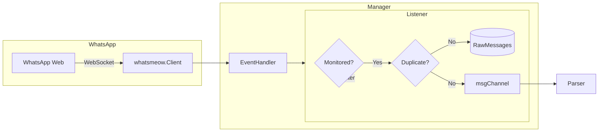
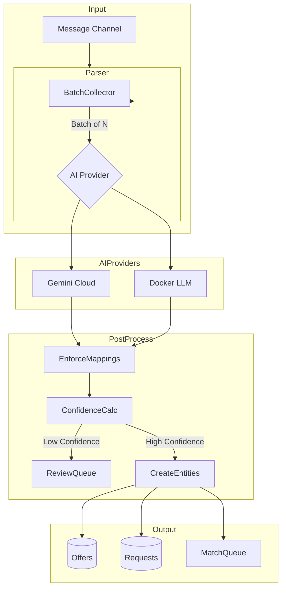
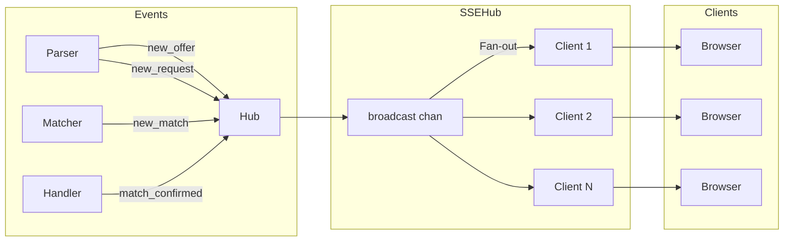
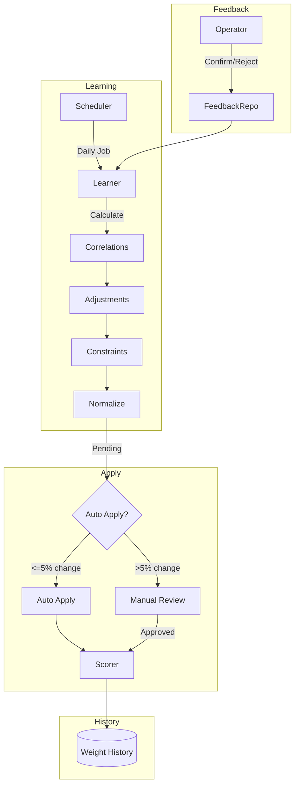

# PharmaBroker Core Functionality Analysis

> Detailed Technical Analysis of All Core System Components
> Version: 1.0 | Date: December 2025

---

## Table of Contents

1. [Executive Summary](#executive-summary)
2. [Functionality 1: WhatsApp Message Ingestion](#functionality-1-whatsapp-message-ingestion)
3. [Functionality 2: AI-Powered Arabic Text Parsing](#functionality-2-ai-powered-arabic-text-parsing)
4. [Functionality 3: Intelligent Matching Engine](#functionality-3-intelligent-matching-engine)
5. [Functionality 4: Confidence-Based Actions](#functionality-4-confidence-based-actions)
6. [Functionality 5: Multi-Platform Bot Commands](#functionality-5-multi-platform-bot-commands)
7. [Functionality 6: Real-time Updates (SSE)](#functionality-6-real-time-updates-sse)
8. [Functionality 7: Adaptive Learning](#functionality-7-adaptive-learning)
9. [Cross-Cutting Concerns](#cross-cutting-concerns)
10. [Recommendations Summary](#recommendations-summary)

---

## Executive Summary

PharmaBroker is a sophisticated pharmaceutical trading platform comprising **7 core functionalities** implemented across **~50+ files** with strong architectural foundations. This analysis examines each functionality's implementation, strengths, weaknesses, and improvement opportunities.

### Technology Stack Overview

| Component            | Technology           | Lines of Code |
| -------------------- | -------------------- | ------------- |
| WhatsApp Integration | whatsmeow library    | ~1,100        |
| AI Parsing           | Gemini/Docker LLM    | ~450          |
| Matching Engine      | Custom scorer        | ~700          |
| Bot Commands         | Platform-agnostic    | ~800          |
| Real-time SSE        | Native Go            | ~240          |
| Adaptive Learning    | Statistical analysis | ~325          |

---

## Functionality 1: WhatsApp Message Ingestion

### Implementation Location

| File                             | Purpose                             | Lines |
| -------------------------------- | ----------------------------------- | ----- |
| `messaging/whatsapp/manager.go`  | Connection management, reconnection | 799   |
| `messaging/whatsapp/listener.go` | Message handling, group monitoring  | 305   |

### Architecture



### Key Components

#### Manager (`manager.go`)

```go
// Connection state management
type ConnectionState int
const (
    StateDisconnected ConnectionState = iota
    StateConnecting
    StateConnected
    StateReconnecting
    StateFailed
)

// Resilient reconnection
type ReconnectConfig struct {
    MaxAttempts   int           // Default: 10
    BaseDelay     time.Duration // Default: 5s
    MaxDelay      time.Duration // Default: 5min
    JitterFactor  float64       // Default: 10%
    OnMaxAttempts func()        // Alert callback
    OnStateChange func(from, to ConnectionState)
}
```

**Key Methods:**

- `Connect()` - Establishes connection with QR code pairing
- `RegisterHandler()` - Adds event listeners
- `SyncGroups()` - Syncs group list to database
- `SendTextMessage()` - Sends messages
- `IsConnected()` / `State()` - Connection status

#### Listener (`listener.go`)

```go
const (
    messageChannelBuffer = 1000    // Buffer size
    deduplicationWindow  = 10s     // Duplicate check window
    groupCheckTimeout    = 5s      // DB lookup timeout
)

type Listener struct {
    msgChannel chan *entity.RawMessage  // Processing queue
    skipOwnMessagesChecker func() bool  // Config-based filtering
    recentMessages sync.Map             // Deduplication cache
}
```

**Processing Pipeline:**

1. `HandleMessage()` - Entry point
2. `logMessageReceived()` - Structured logging
3. `shouldSkipOwnMessage()` - Config-based filtering
4. `isDuplicateMessage()` - 10s deduplication window
5. `checkGroupMonitored()` - DB lookup
6. `createRawMessage()` - Entity conversion
7. `saveMessage()` - Persistence
8. `queueMessage()` - Channel send

### Strengths ✅

| Aspect                 | Implementation                        |
| ---------------------- | ------------------------------------- |
| Resilient Reconnection | Exponential backoff with jitter       |
| State Machine          | Clear connection state transitions    |
| Deduplication          | 10s window prevents duplicates        |
| Configurable Filtering | Runtime-configurable own message skip |
| Buffered Queue         | 1000 message buffer prevents blocking |

### Weaknesses & Improvements ⚠️

| Issue                    | Current                | Recommended                         |
| ------------------------ | ---------------------- | ----------------------------------- |
| Queue Overflow           | Buffer fills → blocks  | Add overflow handling (dead letter) |
| No Metrics               | Silent operation       | Add Prometheus counters             |
| Single Consumer          | One parser consuming   | Consider worker pool                |
| No Health Check Endpoint | Manager state internal | Expose connection health            |

### Recommended Improvements

```go
// 1. Add overflow handling
func (l *Listener) queueMessage(rawMsg *entity.RawMessage) {
    select {
    case l.msgChannel <- rawMsg:
        metrics.MessagesQueued.Inc()
    default:
        metrics.QueueOverflow.Inc()
        l.log.Warn().Msg("Queue full, saving to overflow table")
        l.overflowRepo.Save(context.Background(), rawMsg)
    }
}

// 2. Add health check
func (m *Manager) HealthCheck() HealthStatus {
    return HealthStatus{
        Connected:     m.IsConnected(),
        State:         m.State().String(),
        Uptime:        time.Since(m.connectedAt),
        MessageCount:  atomic.LoadInt64(&m.messageCount),
        ReconnectAttempts: m.reconnectCount,
    }
}
```

---

## Functionality 2: AI-Powered Arabic Text Parsing

### Implementation Location

| File                   | Purpose                   | Lines |
| ---------------------- | ------------------------- | ----- |
| `parsing/service.go`   | Main parser orchestration | 448   |
| `parsing/processor.go` | Batch processing          | ~400  |
| `ai/provider.go`       | AI provider abstraction   | 77    |
| `ai/gemini/`           | Gemini implementation     | ~200  |
| `ai/docker/`           | Local LLM implementation  | ~150  |

### Architecture



### Key Components

#### Parser Service (`service.go`)

```go
type Parser struct {
    aiProvider   ai.Provider              // AI abstraction
    rawMsgRepo   repository.RawMessageRepository
    offerRepo    repository.OfferRepository
    requestRepo  repository.RequestRepository
    mappingRepo  repository.MedicationMappingRepository
    matchQueueRepo repository.MatchQueueRepository
    reviewQueueRepo repository.ReviewQueueRepository

    // Behaviors
    autoParseChecker func() bool          // Runtime toggle
    breaker          *breaker.CircuitBreaker
    broadcaster      SSEBroadcaster

    // Multi-pass config
    multiPassConfig  MultiPassConfig
}
```

**Parsing Flow:**

1. `ProcessMessage()` - Queue message for processing
2. Batch collection (configurable size)
3. `getRelevantMappings()` - FTS5 medication lookup
4. AI Provider call with context
5. `enforceMappings()` - Normalize medication names
6. `calculateAvgConfidence()` - Compute result quality
7. `shouldQueueForReview()` - Low confidence routing
8. `createOffer()` / `createRequest()` - Entity creation
9. Match queue insertion + SSE broadcast

#### Multi-Pass Configuration

```go
type MultiPassConfig struct {
    Enabled              bool
    QueueForReview       bool
    MinConfidencePass1   float64  // First pass threshold
    MinConfidencePass2   float64  // Second pass threshold
    Pass2Model           string   // Different AI for retry
}
```

#### AI Provider Interface

```go
// From ai/provider.go
type Provider interface {
    Parse(ctx context.Context, messages []string, mappings []*entity.MedicationMapping) (*entity.AIParseResult, error)
}

// Result structure
type AIParseResult struct {
    Items      []ParsedItem
    Confidence float64
    Model      string
}

type ParsedItem struct {
    Type       string  // "OFFER" or "REQUEST"
    Medication string
    Dosage     string
    Quantity   float64
    Price      float64
    RawText    string
}
```

### Extraction Capabilities

| Field      | Arabic Text Recognition | Example                 |
| ---------- | ----------------------- | ----------------------- |
| Medication | Brand + generic names   | `أوجمنتين`, `Augmentin` |
| Dosage     | All units               | `500 ملجم`, `1 جرام`    |
| Quantity   | Numbers + words         | `10 علب`, `عشر`         |
| Price      | EGP format              | `250 جنيه`, `٢٥٠`       |
| Type       | Offer/Request signals   | `عندي`, `محتاج`         |

### Medication Mapping

```go
// FTS5-based medication lookup
func (p *Parser) getRelevantMappings(ctx context.Context, messages []*entity.RawMessage) map[string]string {
    // 1. Extract Arabic tokens
    // 2. Remove diacritics (ً ُ ِ ّ ْ)
    // 3. FTS5 exact match
    // 4. Fuzzy match fallback
    // 5. Return: arabic_name → english_name map
}
```

### Strengths ✅

| Aspect               | Implementation                            |
| -------------------- | ----------------------------------------- |
| Multi-Provider       | Gemini Cloud + Local Docker               |
| Multi-Pass Parsing   | Low-confidence retry with different model |
| FTS5 Mapping         | Fast medication name lookup               |
| Circuit Breaker      | Protects against AI failures              |
| SSE Integration      | Real-time parsing updates                 |
| Arabic Normalization | Diacritic removal, transliteration        |

### Weaknesses & Improvements ⚠️

| Issue                    | Current             | Recommended                     |
| ------------------------ | ------------------- | ------------------------------- |
| No batch parallelization | Sequential AI calls | Parallel with semaphore         |
| Limited retry            | Single retry        | Exponential backoff with jitter |
| No parsing metrics       | Silent operation    | Track parse time, accuracy      |
| Hardcoded confidence     | 0.6 threshold       | Make configurable               |
| No A/B testing           | Single model        | Support model comparison        |

### Recommended Improvements

```go
// 1. Parallel processing with concurrency limit
func (p *Parser) processBatchParallel(ctx context.Context, batch []*entity.RawMessage) {
    sem := make(chan struct{}, 3) // Max 3 concurrent AI calls
    var wg sync.WaitGroup

    for _, msg := range batch {
        wg.Add(1)
        go func(m *entity.RawMessage) {
            defer wg.Done()
            sem <- struct{}{}
            defer func() { <-sem }()

            p.processOne(ctx, m)
        }(msg)
    }
    wg.Wait()
}

// 2. Add parsing metrics
var (
    ParseDuration = prometheus.NewHistogramVec(
        prometheus.HistogramOpts{Name: "parse_duration_seconds"},
        []string{"provider", "success"},
    )
    ParseConfidence = prometheus.NewHistogram(
        prometheus.HistogramOpts{Name: "parse_confidence"},
    )
)
```

---

## Functionality 3: Intelligent Matching Engine

### Implementation Location

| File                    | Purpose                    | Lines |
| ----------------------- | -------------------------- | ----- |
| `matching/scorer.go`    | Multi-field scoring        | 373   |
| `matching/interface.go` | Types and interfaces       | 110   |
| `matching/scheduler.go` | Match processing scheduler | 400   |

### Architecture

```mermaid
flowchart LR
    subgraph Input
        Offer[New Offer]
        Request[New Request]
    end

    subgraph MatchQueue
        Offer --> Queue[(Match Queue)]
        Request --> Queue
    end

    subgraph Scorer
        Queue --> Scheduler
        Scheduler --> |Candidates| Scorer
        Scorer --> MedScore[Medication 40%]
        Scorer --> DosScore[Dosage 15%]
        Scorer --> QtyScore[Quantity 20%]
        Scorer --> PriceScore[Price 15%]
        Scorer --> RecScore[Recency 10%]
    end

    subgraph Output
        MedScore & DosScore & QtyScore & PriceScore & RecScore --> Total
        Total --> Confidence{Band?}
        Confidence -->|≥0.9| Auto[AUTO]
        Confidence -->|0.7-0.89| Suggest[SUGGEST]
        Confidence -->|0.5-0.69| Review[REVIEW]
    end
```

### Scoring Algorithm

#### Weight Configuration

```go
type Weights struct {
    Medication float64 `json:"medication"` // 40%
    Dosage     float64 `json:"dosage"`     // 15%
    Quantity   float64 `json:"quantity"`   // 20%
    Price      float64 `json:"price"`      // 15%
    Recency    float64 `json:"recency"`    // 10%
}
```

#### Individual Score Calculations

**Medication Score (40%)**

```go
// Combination of fuzzy + vector similarity
func MedicationScore(offer, request string) float64 {
    // 1. Exact match: 1.0
    // 2. Levenshtein similarity
    // 3. Vector embedding similarity (optional)
    // 4. Weighted combination
}
```

**Quantity Score (20%)**

```go
func (s *Scorer) QuantityScore(offerQty, requestQty float64) float64 {
    // Case 1: Request is 0 → full score (no quantity requirement)
    if requestQty == 0 {
        return 1.0
    }

    // Case 2: Offer has MORE than requested
    if offerQty >= requestQty {
        return 1.0
    }

    // Case 3: Within ±10% tolerance
    tolerance := 0.1
    if offerQty >= requestQty*(1-tolerance) {
        return 1.0
    }

    // Case 4: Partial fulfillment
    return offerQty / requestQty
}
```

**Price Score (15%)**

```go
func (s *Scorer) PriceScore(offerPrice, maxPrice float64) float64 {
    // Case 1: No price requirement
    if maxPrice == 0 {
        return 1.0
    }

    // Case 2: Within budget (±5% tolerance)
    tolerance := 0.05
    if offerPrice <= maxPrice*(1+tolerance) {
        return 1.0
    }

    // Case 3: Above budget - linear decay
    overBudget := (offerPrice - maxPrice) / maxPrice
    return max(0, 1.0 - overBudget)
}
```

**Dosage Score (15%)**

```go
func (s *Scorer) DosageScore(offerMed, requestMed string) float64 {
    // Extract dosage from medication string
    // Compare numerically (handle mg, g, ml units)
    // Return similarity ratio
}
```

**Recency Score (10%)**

```go
func (s *Scorer) RecencyScore(createdAt time.Time) float64 {
    hours := time.Since(createdAt).Hours()
    halfLife := s.recencyHalfLife // Default: 24h

    switch s.decayType {
    case DecayExponential:
        return math.Pow(0.5, hours/halfLife)
    case DecayLinear:
        return max(0, 1.0 - (hours / (halfLife * 2)))
    case DecaySigmoid:
        return 1.0 / (1.0 + math.Exp((hours - halfLife) / 6))
    }
}
```

### Confidence Thresholds

```go
type Thresholds struct {
    AutoConfirm float64 // Default: 0.90
    Suggest     float64 // Default: 0.70
    Review      float64 // Default: 0.50
}

type ConfidenceBand string
const (
    BandAuto    ConfidenceBand = "AUTO"    // ≥ 0.90
    BandSuggest ConfidenceBand = "SUGGEST" // 0.70 - 0.89
    BandReview  ConfidenceBand = "REVIEW"  // 0.50 - 0.69
    BandNone    ConfidenceBand = "NONE"    // < 0.50
)
```

### Strengths ✅

| Aspect                   | Implementation                |
| ------------------------ | ----------------------------- |
| Multi-Dimensional        | 5 weighted factors            |
| Configurable Weights     | Runtime weight updates        |
| Thread-Safe              | RWMutex for concurrent access |
| Flexible Thresholds      | Adjustable confidence bands   |
| Multiple Decay Types     | Exponential, Linear, Sigmoid  |
| Human-Readable Breakdown | Score explanation strings     |

### Weaknesses & Improvements ⚠️

| Issue                   | Current                            | Recommended                 |
| ----------------------- | ---------------------------------- | --------------------------- |
| N×M Complexity          | Compare all offers to all requests | Add pre-filtering           |
| No caching              | Recalculate every time             | Cache medication embeddings |
| Single-threaded scoring | Sequential processing              | Parallel with worker pool   |
| No scoring metrics      | Silent                             | Track score distributions   |

### Recommended Improvements

```go
// 1. Pre-filtering for performance
type CandidateFilter struct {
    medicationIndex map[string][]string // medication → [offer_ids]
}

func (f *CandidateFilter) GetCandidates(request *entity.Request) []*entity.Offer {
    // First: exact medication match
    if offers := f.medicationIndex[request.Medication]; len(offers) > 0 {
        return f.lookupOffers(offers)
    }
    // Fallback: fuzzy medication match
    return f.fuzzyMatch(request.Medication)
}

// 2. Parallel scoring
func (s *Scheduler) scoreParallel(request *entity.Request, offers []*entity.Offer) []*MatchScore {
    results := make(chan *MatchScore, len(offers))
    var wg sync.WaitGroup

    for _, offer := range offers {
        wg.Add(1)
        go func(o *entity.Offer) {
            defer wg.Done()
            score := s.scorer.ScoreMatch(o, request, 0)
            results <- score
        }(offer)
    }

    go func() {
        wg.Wait()
        close(results)
    }()

    var scores []*MatchScore
    for s := range results {
        scores = append(scores, s)
    }
    return scores
}
```

---

## Functionality 4: Confidence-Based Actions

### Implementation

Confidence-based routing is integrated into the matching scheduler:

```go
// From matching/scheduler.go
func (s *Scheduler) processMatch(ctx context.Context, score *MatchScore) error {
    match := &entity.Match{
        OfferID:   score.OfferID,
        RequestID: score.RequestID,
        Score:     score.Total,
        Status:    s.determineStatus(score.Confidence),
    }

    switch score.Confidence {
    case BandAuto:
        match.Status = "confirmed"
        match.ConfirmedAt = time.Now()
        s.notifyConfirmation(match)
    case BandSuggest:
        match.Status = "pending"
        s.notifySuggestion(match)
    case BandReview:
        match.Status = "review"
        s.notifyReview(match)
    case BandNone:
        return nil // Don't create match
    }

    return s.matchRepo.Create(ctx, match)
}
```

### Action Matrix

| Confidence Band | Score Range | Status      | Action              | Notification            |
| --------------- | ----------- | ----------- | ------------------- | ----------------------- |
| AUTO            | ≥ 90%       | `confirmed` | Auto-confirm        | WhatsApp/Telegram alert |
| SUGGEST         | 70-89%      | `pending`   | Suggest to operator | Dashboard + SSE         |
| REVIEW          | 50-69%      | `review`    | Manual review queue | Review queue only       |
| NONE            | < 50%       | -           | No match created    | None                    |

### Notification Channels

```go
// SSE broadcast for dashboard
s.broadcaster.BroadcastNewMatch(match.ID, match.Score)

// WhatsApp notification for auto-confirms
if match.Status == "confirmed" {
    s.waNotifier.SendAlert(ctx, "info",
        "Match Confirmed",
        fmt.Sprintf("Auto-confirmed: %s ↔ %s (%.0f%%)",
            offer.Medication, request.Medication, score.Total*100))
}
```

### Strengths ✅

| Aspect               | Implementation                   |
| -------------------- | -------------------------------- |
| Clear Thresholds     | Well-defined confidence bands    |
| Progressive Actions  | Graduated response by confidence |
| Multi-Channel Notify | SSE + WhatsApp + Telegram        |
| Configurable         | Runtime-adjustable thresholds    |

### Weaknesses & Improvements ⚠️

| Issue             | Current                     | Recommended               |
| ----------------- | --------------------------- | ------------------------- |
| Static thresholds | Same for all medications    | Per-medication thresholds |
| No escalation     | Review never auto-escalates | Add time-based escalation |
| Limited metrics   | No tracking                 | Track band distribution   |

---

## Functionality 5: Multi-Platform Bot Commands

### Implementation Location

| File                     | Purpose                    | Lines |
| ------------------------ | -------------------------- | ----- |
| `bot/core/router.go`     | Command routing            | 68    |
| `bot/core/registry.go`   | Command registration       | 100   |
| `bot/core/middleware.go` | Authorization, logging     | 113   |
| `bot/commands/*.go`      | 13 command implementations | ~800  |
| `bot/telegram/bot.go`    | Telegram adapter           | ~200  |
| `bot/whatsapp/bot.go`    | WhatsApp adapter           | ~100  |

### Architecture

```mermaid
flowchart TB
    subgraph Platforms
        TG[Telegram] --> TGAdapter
        WA[WhatsApp] --> WAAdapter
    end

    subgraph Core
        TGAdapter --> Router
        WAAdapter --> Router
        Router --> Middleware
        Middleware --> |Auth Check| Registry
        Registry --> |Lookup| Handler
    end

    subgraph Commands
        Handler --> Start[/start]
        Handler --> Status[/status]
        Handler --> Pending[/pending]
        Handler --> Confirm[/confirm]
        Handler --> Reject[/reject]
        Handler --> Help[/help]
        Handler --> Dashboard[/dashboard]
        Handler --> Groups[/groups]
        Handler --> Offers[/offers]
        Handler --> Requests[/requests]
        Handler --> Confirmed[/confirmed]
    end
```

### Available Commands

| Command         | Description                  | Authorization |
| --------------- | ---------------------------- | ------------- |
| `/start`        | Bot registration, greeting   | Public        |
| `/help`         | Show available commands      | Authorized    |
| `/status`       | System status & stats        | Authorized    |
| `/pending`      | List pending matches (top 5) | Authorized    |
| `/confirm <id>` | Confirm a match              | Authorized    |
| `/reject <id>`  | Reject a match               | Authorized    |
| `/dashboard`    | Quick stats overview         | Authorized    |
| `/groups`       | List monitored groups        | Authorized    |
| `/offers`       | List active offers           | Authorized    |
| `/requests`     | List active requests         | Authorized    |
| `/confirmed`    | Recent confirmed matches     | Authorized    |

### Command Interface

```go
// bot/core/command.go
type Command interface {
    Name() string
    Description() string
    Execute(ctx *Context) error
}

type Context struct {
    Platform    string             // "telegram" or "whatsapp"
    Message     string             // Full message text
    Args        []string           // Command arguments
    UserID      string
    UserName    string
    ChatID      string
    Repositories *RepositorySet
    Respond     func(msg string) error
}
```

### Example Command Implementation

```go
// bot/commands/confirm.go
type ConfirmCommand struct {
    matchRepo repository.MatchRepository
}

func (c *ConfirmCommand) Name() string { return "confirm" }
func (c *ConfirmCommand) Description() string { return "Confirm a pending match" }

func (c *ConfirmCommand) Execute(ctx *core.Context) error {
    if len(ctx.Args) == 0 {
        return ctx.Respond("Usage: /confirm <match_id>")
    }

    matchID := ctx.Args[0]
    match, err := c.matchRepo.GetByID(ctx.Context(), matchID)
    if err != nil {
        return ctx.Respond("Match not found")
    }

    if match.Status != "pending" {
        return ctx.Respond("Match already processed")
    }

    match.Status = "confirmed"
    match.ConfirmedBy = ctx.UserID
    match.ConfirmedAt = time.Now()

    if err := c.matchRepo.Save(ctx.Context(), match); err != nil {
        return ctx.Respond("Failed to confirm match")
    }

    return ctx.Respond(fmt.Sprintf("✅ Match %s confirmed!", matchID))
}
```

### Authorization Middleware

```go
// bot/core/middleware.go
func AuthorizationMiddleware(botUserRepo repository.BotUserRepository) Middleware {
    return func(next Handler) Handler {
        return func(ctx *Context) error {
            user, err := botUserRepo.GetByPlatformID(ctx.Context(), ctx.Platform, ctx.UserID)
            if err != nil || !user.IsAuthorized {
                return ctx.Respond("⛔ You are not authorized to use this bot")
            }

            ctx.User = user
            return next(ctx)
        }
    }
}
```

### Strengths ✅

| Aspect              | Implementation            |
| ------------------- | ------------------------- |
| Platform Agnostic   | Shared command logic      |
| Clean Interface     | Command interface pattern |
| Middleware Chain    | Pluggable auth, logging   |
| Bilingual Responses | English + Arabic          |
| Partial ID Matching | First 8 chars sufficient  |

### Weaknesses & Improvements ⚠️

| Issue               | Current            | Recommended               |
| ------------------- | ------------------ | ------------------------- |
| Low test coverage   | ~30%               | Add command handler tests |
| No rate limiting    | Unlimited requests | Add per-user rate limits  |
| No command aliasing | Exact match only   | Add `/c` for `/confirm`   |
| No interactive mode | Stateless commands | Add conversation state    |

---

## Functionality 6: Real-time Updates (SSE)

### Implementation Location

| File             | Purpose                | Lines |
| ---------------- | ---------------------- | ----- |
| `api/sse/sse.go` | SSE Hub implementation | 241   |

### Architecture



### Implementation

```go
// Constants
const (
    DefaultMaxClients   = 100
    BroadcastBufferSize = 100
    ClientBufferSize    = 10
    HeartbeatInterval   = 30 * time.Second
)

type SSEHub struct {
    clients           map[chan SSEEvent]bool
    mu                sync.RWMutex
    broadcast         chan SSEEvent
    done              chan struct{}
    maxClients        int
    heartbeatInterval time.Duration
}

type SSEEvent struct {
    Type string `json:"type"`
    Data any    `json:"data"`
}
```

### Event Types

| Event             | Trigger         | Data                    |
| ----------------- | --------------- | ----------------------- |
| `connected`       | Client connects | `{status: "connected"}` |
| `heartbeat`       | Every 30s       | Unix timestamp          |
| `new_offer`       | Offer parsed    | `{id, medication}`      |
| `new_request`     | Request parsed  | `{id, medication}`      |
| `new_match`       | Match created   | `{id, score}`           |
| `match_confirmed` | Match confirmed | `{id}`                  |
| `match_rejected`  | Match rejected  | `{id}`                  |

### Client Management

```go
// Registration with limit enforcement
func (h *SSEHub) ServeHTTP(w http.ResponseWriter, r *http.Request) {
    // Atomic registration with limit check
    h.mu.Lock()
    if len(h.clients) >= h.maxClients {
        h.mu.Unlock()
        http.Error(w, "Too many connections", 503)
        return
    }

    client := make(chan SSEEvent, ClientBufferSize)
    h.clients[client] = true
    h.mu.Unlock()

    // Cleanup on disconnect
    defer func() {
        h.mu.Lock()
        delete(h.clients, client)
        close(client)
        h.mu.Unlock()
    }()

    // Stream events...
}
```

### Strengths ✅

| Aspect                 | Implementation           |
| ---------------------- | ------------------------ |
| Thread-Safe            | RWMutex for client map   |
| Connection Limits      | Configurable max clients |
| Non-Blocking Broadcast | Select with default      |
| Heartbeat              | 30s keep-alive           |
| Graceful Shutdown      | Hub.Shutdown() method    |

### Weaknesses & Improvements ⚠️

| Issue                    | Current               | Recommended        |
| ------------------------ | --------------------- | ------------------ |
| No reconnection support  | Client must reconnect | Add Last-Event-ID  |
| No event persistence     | Lost on disconnect    | Add event buffer   |
| No client identification | Anonymous connections | Add auth token     |
| No metrics               | Client count only     | Add event counters |

### Recommended Improvements

```go
// 1. Add Last-Event-ID support
type SSEEvent struct {
    ID   string `json:"-"`        // For Last-Event-ID
    Type string `json:"type"`
    Data any    `json:"data"`
}

func (h *SSEHub) ServeHTTP(w http.ResponseWriter, r *http.Request) {
    lastID := r.Header.Get("Last-Event-ID")
    if lastID != "" {
        // Replay missed events
        h.replayEvents(w, lastID)
    }
    // Continue with live stream...
}

// 2. Add metrics
func (h *SSEHub) run() {
    for event := range h.broadcast {
        metrics.SSEEventsTotal.WithLabelValues(event.Type).Inc()
        // Fan out...
    }
}
```

---

## Functionality 7: Adaptive Learning

### Implementation Location

| File                    | Purpose                   | Lines       |
| ----------------------- | ------------------------- | ----------- |
| `matching/learner.go`   | Weight learning algorithm | 325         |
| `matching/scheduler.go` | Job scheduling            | Part of 400 |
| `ai/interface.go`       | Scheduler interface       | 77          |

### Architecture



### Learning Algorithm

```go
type LearningConfig struct {
    LearningRate   float64 // Default: 0.1
    MinWeight      float64 // Default: 0.05
    MaxWeight      float64 // Default: 0.60
    MinChange      float64 // Default: 0.05 (5%)
    MinSamples     int     // Default: 100
    AnalysisWindow int     // Default: 7 (days)
}

type WeightLearner struct {
    feedbackRepo FeedbackRecordRepository
    historyRepo  WeightHistoryRepository
    scorer       *Scorer
    config       LearningConfig
}
```

### Correlation Calculation

```go
// Calculate correlation between each factor and confirmation rate
func (l *WeightLearner) calculateCorrelations(stats *entity.FeedbackStats) map[string]float64 {
    correlations := map[string]float64{
        "medication": l.pearsonCorrelation(stats.MedicationScores, stats.Outcomes),
        "dosage":     l.pearsonCorrelation(stats.DosageScores, stats.Outcomes),
        "quantity":   l.pearsonCorrelation(stats.QuantityScores, stats.Outcomes),
        "price":      l.pearsonCorrelation(stats.PriceScores, stats.Outcomes),
        "recency":    l.pearsonCorrelation(stats.RecencyScores, stats.Outcomes),
    }
    return correlations
}
```

### Weight Adjustment

```go
func (l *WeightLearner) adjustWeights(current Weights, correlations map[string]float64) Weights {
    lr := l.config.LearningRate

    adjusted := Weights{
        Medication: current.Medication + lr*correlations["medication"],
        Dosage:     current.Dosage + lr*correlations["dosage"],
        Quantity:   current.Quantity + lr*correlations["quantity"],
        Price:      current.Price + lr*correlations["price"],
        Recency:    current.Recency + lr*correlations["recency"],
    }

    // Apply constraints
    adjusted = l.applyConstraints(current, adjusted)

    // Normalize to sum = 1.0
    return l.normalizeWeights(adjusted)
}
```

### Constraint Enforcement

```go
func (l *WeightLearner) applyConstraints(current, adjusted Weights) Weights {
    // 1. Clamp to min/max bounds
    adjusted.Medication = clamp(adjusted.Medication, l.config.MinWeight, l.config.MaxWeight)
    // ... for each weight

    // 2. Limit change rate (prevent wild swings)
    maxChange := 0.10 // 10% max change per iteration
    adjusted.Medication = clampChange(adjusted.Medication, current.Medication, maxChange)
    // ... for each weight

    return adjusted
}
```

### Rollback Capability

```go
func (l *WeightLearner) Rollback(ctx context.Context) error {
    history, err := l.historyRepo.GetHistory(ctx, 2)
    if err != nil || len(history) < 2 {
        return errors.New("no previous weights to rollback to")
    }

    previous := history[1] // Second most recent
    return l.applyWeights(ctx, previous.Weights, "rollback", nil)
}
```

### Strengths ✅

| Aspect                 | Implementation                 |
| ---------------------- | ------------------------------ |
| Statistical Foundation | Pearson correlation            |
| Safety Constraints     | Min/max bounds, change limits  |
| History Tracking       | All weight changes logged      |
| Rollback Support       | Revert to previous weights     |
| Manual Override        | Admin can set weights directly |
| Pending Review         | Large changes require approval |

### Weaknesses & Improvements ⚠️

| Issue                  | Current              | Recommended                |
| ---------------------- | -------------------- | -------------------------- |
| Daily batch only       | Not real-time        | Add online learning option |
| No A/B testing         | Single weight set    | Shadow scoring support     |
| Limited metrics        | Basic stats          | Add learning curves        |
| No confidence interval | Point estimates only | Add uncertainty bounds     |

---

## Cross-Cutting Concerns

### Error Handling

**Current State**: Inconsistent error handling across modules.

**Recommendation**: Implement standardized error package (see `development_lifecycle.md`).

### Logging

**Current State**: Zerolog used throughout with structured fields.

```go
log.Info().
    Str("group_jid", msg.GroupJID).
    Str("sender", msg.SenderName).
    Int("content_length", len(msg.Content)).
    Msg("Message received")
```

**Status**: ✅ Good - consistent structured logging.

### Metrics

**Current State**: No Prometheus metrics.

**Recommendation**: See Prometheus metrics section in `development_lifecycle.md`.

### Testing

| Module       | Test Coverage |
| ------------ | ------------- |
| Matching     | ~75%          |
| Parsing      | ~65%          |
| API Handlers | ~70%          |
| Bot Commands | ~30%          |
| SSE          | ~60%          |

---

## Recommendations Summary

### Immediate Priority (P0)

| #   | Recommendation                         | Module        |
| --- | -------------------------------------- | ------------- |
| 1   | Add overflow handling to message queue | WhatsApp      |
| 2   | Implement circuit breaker for AI calls | Parsing       |
| 3   | Add pre-filtering for match candidates | Matching      |
| 4   | Add API authentication                 | Cross-cutting |

### High Priority (P1)

| #   | Recommendation                      | Module  |
| --- | ----------------------------------- | ------- |
| 5   | Add Prometheus metrics              | All     |
| 6   | Implement retry with backoff for AI | Parsing |
| 7   | Add Last-Event-ID support for SSE   | SSE     |
| 8   | Add bot command tests               | Bot     |

### Medium Priority (P2)

| #   | Recommendation                  | Module   |
| --- | ------------------------------- | -------- |
| 9   | Parallel AI batch processing    | Parsing  |
| 10  | Parallel match scoring          | Matching |
| 11  | Add A/B testing for weights     | Learning |
| 12  | Add conversation state for bots | Bot      |

---

_Document maintained by PharmaBroker Engineering_
_Last Updated: December 2025_
