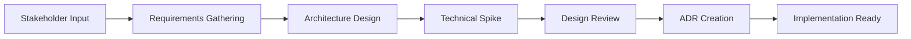
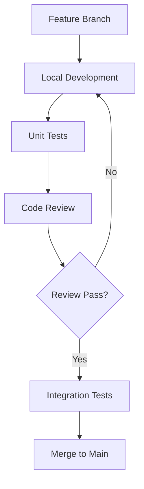

# PharmaBroker Development Lifecycle Analysis

> Production Readiness, Concurrency, and Error Resilience Guide
> Version: 1.0 | Date: December 2025

---

## Table of Contents

1. [Phase 1: Requirements & Architecture](#phase-1-requirements--architecture)
2. [Phase 2: Development & Implementation](#phase-2-development--implementation)
3. [Phase 3: Testing & Quality Assurance](#phase-3-testing--quality-assurance)
4. [Phase 4: Deployment & Operations](#phase-4-deployment--operations)
5. [Phase 5: Maintenance & Evolution](#phase-5-maintenance--evolution)
6. [Concurrency & Race Condition Analysis](#concurrency--race-condition-analysis)
7. [Production Readiness Checklist](#production-readiness-checklist)

---

## Phase 1: Requirements & Architecture

### 1.1 Objectives

| Objective                   | Description                               | Success Criteria                          |
| --------------------------- | ----------------------------------------- | ----------------------------------------- |
| System Boundaries           | Define all integration points             | All external APIs documented              |
| Non-Functional Requirements | Performance, availability, security specs | SLOs defined and measurable               |
| Scalability Design          | Plan for growth                           | Horizontal scaling strategy documented    |
| Fault Tolerance             | Handle failures gracefully                | Failure modes identified with mitigations |

### 1.2 Processes



### 1.3 Deliverables

| Deliverable                 | Status     | Location                           |
| --------------------------- | ---------- | ---------------------------------- |
| System Architecture Diagram | ✅ Exists  | `Readme.md` (mermaid)              |
| API Specification           | ❌ Missing | Should be `docs/API.md` or OpenAPI |
| Data Model Documentation    | ⚠️ Partial | Scattered in entity files          |
| Integration Contracts       | ❌ Missing | AI provider, WhatsApp contracts    |
| Security Requirements       | ❌ Missing | Should be `docs/SECURITY.md`       |

### 1.4 Current State Analysis

#### Advantages ✅

| Aspect                | Implementation                         | Benefit                                     |
| --------------------- | -------------------------------------- | ------------------------------------------- |
| Clean Architecture    | Domain-driven design with clear layers | Easy to modify, test, extend                |
| Interface Segregation | Repository pattern with interfaces     | Loose coupling, mockable                    |
| Multi-Provider AI     | Abstracted AI interface                | Vendor flexibility                          |
| Event-Driven          | Message channels for async processing  | Decoupled components                        |
| Modular Monolith      | Go workspaces with separate modules    | Clear boundaries, future microservices path |

#### Disadvantages ⚠️

| Issue                   | Risk Level | Impact                            | Mitigation Strategy           |
| ----------------------- | ---------- | --------------------------------- | ----------------------------- |
| SQLite single-writer    | High       | Concurrency bottleneck under load | Migrate to PostgreSQL         |
| No message queue        | High       | Lost messages on crash            | Add Redis Streams/RabbitMQ    |
| Monolithic deployment   | Medium     | Single point of failure           | Container orchestration (K8s) |
| No service mesh         | Medium     | Limited observability             | Add Istio/Linkerd             |
| Tight WhatsApp coupling | Medium     | Vendor lock-in                    | Abstract messaging layer      |

### 1.5 Missing Production Considerations

#### 1.5.1 Circuit Breaker Pattern

```go
// CURRENT: No circuit breaker
aiResult, err := provider.Parse(ctx, messages) // Can hang forever

// RECOMMENDED: Add circuit breaker
package ai

import "github.com/sony/gobreaker"

type ResilientProvider struct {
    provider AIProvider
    breaker  *gobreaker.CircuitBreaker
}

func NewResilientProvider(p AIProvider) *ResilientProvider {
    settings := gobreaker.Settings{
        Name:        "ai-provider",
        MaxRequests: 3,                    // Half-open requests
        Interval:    60 * time.Second,     // Reset interval
        Timeout:     30 * time.Second,     // Open -> Half-open
        ReadyToTrip: func(counts gobreaker.Counts) bool {
            failureRatio := float64(counts.TotalFailures) / float64(counts.Requests)
            return counts.Requests >= 3 && failureRatio >= 0.6
        },
        OnStateChange: func(name string, from, to gobreaker.State) {
            log.Warn().Str("from", from.String()).Str("to", to.String()).
                Msg("AI circuit breaker state change")
        },
    }
    return &ResilientProvider{
        provider: p,
        breaker:  gobreaker.NewCircuitBreaker(settings),
    }
}

func (r *ResilientProvider) Parse(ctx context.Context, msgs []string) ([]ParsedItem, error) {
    result, err := r.breaker.Execute(func() (interface{}, error) {
        return r.provider.Parse(ctx, msgs)
    })
    if err != nil {
        return nil, fmt.Errorf("circuit breaker: %w", err)
    }
    return result.([]ParsedItem), nil
}
```

#### 1.5.2 Graceful Degradation

```go
// CURRENT: All-or-nothing matching
type MatchingService interface {
    FindMatches(ctx context.Context) error
}

// RECOMMENDED: Fallback modes
type MatchingService interface {
    // Full AI-powered matching
    FindMatches(ctx context.Context) error

    // Fallback: Exact medication name match only (no AI)
    FindMatchesDegraded(ctx context.Context) error

    // Check if degraded mode is active
    IsDegraded() bool
}

// Implementation
func (s *service) FindMatches(ctx context.Context) error {
    if s.aiProvider.IsFailing() {
        log.Warn().Msg("AI unavailable, using degraded matching")
        return s.FindMatchesDegraded(ctx)
    }
    return s.findMatchesFull(ctx)
}
```

### 1.6 Recommendations

#### 1.6.1 Create Architecture Decision Records (ADRs)

```markdown
<!-- docs/adr/001-database-selection.md -->

# ADR-001: Database Selection

## Status: Accepted

## Context

We need a database for storing medication offers, requests, and matches.

## Decision

Start with SQLite for development simplicity. Plan migration to PostgreSQL for production.

## Consequences

- ✅ Zero-configuration development
- ✅ Embedded, no external dependencies
- ❌ Single-writer limitation
- ❌ Migration required for production

## Migration Plan

1. Abstract all database access through repositories
2. Use GORM for database-agnostic queries
3. Create PostgreSQL migration scripts
4. Test with PostgreSQL in staging
```

#### 1.6.2 Define Service Level Objectives (SLOs)

| Metric                     | Target                      | Measurement                           |
| -------------------------- | --------------------------- | ------------------------------------- |
| Message Processing Latency | p99 < 5s                    | Time from WhatsApp receipt to DB save |
| Match Accuracy             | > 85% confirmed / suggested | Operator feedback ratio               |
| System Availability        | 99.5% uptime                | Uptime monitoring                     |
| AI Response Time           | p95 < 10s                   | Provider latency                      |
| Error Rate                 | < 1%                        | Failed message processing             |

---

## Phase 2: Development & Implementation

### 2.1 Objectives

| Objective      | Description                 | Measurement                       |
| -------------- | --------------------------- | --------------------------------- |
| Code Quality   | Maintainable, readable code | Linter pass rate, review feedback |
| Error Handling | Graceful failure handling   | Error recovery rate               |
| Thread Safety  | No race conditions          | Race detector pass                |
| Observability  | Debuggable production code  | Log coverage, trace depth         |

### 2.2 Processes



### 2.3 Deliverables

| Deliverable     | Standard        | Tool            |
| --------------- | --------------- | --------------- |
| Formatted Code  | gofmt/goimports | Pre-commit hook |
| Linted Code     | golangci-lint   | CI pipeline     |
| Documented APIs | GoDoc comments  | go doc          |
| Test Coverage   | >70%            | go test -cover  |

### 2.4 Error Handling Standards

#### 2.4.1 Current Problems

```go
// Problem 1: Silent failures ❌
result, _ := repo.Get(ctx, id)  // Error ignored!

// Problem 2: Context-free errors ❌
if err != nil {
    return err  // No stack trace, no context
}

// Problem 3: Inconsistent error types ❌
return errors.New("not found")      // Sometimes
return fmt.Errorf("not found")      // Sometimes
return sql.ErrNoRows               // Sometimes
```

#### 2.4.2 Recommended Error Package

```go
// pkg/apperror/error.go
package apperror

import (
    "fmt"
    "runtime"
)

type Code string

const (
    CodeNotFound     Code = "NOT_FOUND"
    CodeConflict     Code = "CONFLICT"
    CodeValidation   Code = "VALIDATION"
    CodeUnauthorized Code = "UNAUTHORIZED"
    CodeForbidden    Code = "FORBIDDEN"
    CodeInternal     Code = "INTERNAL"
    CodeUnavailable  Code = "UNAVAILABLE"
    CodeTimeout      Code = "TIMEOUT"
)

type AppError struct {
    Code       Code              `json:"code"`
    Message    string            `json:"message"`
    Details    map[string]any    `json:"details,omitempty"`
    cause      error
    stackTrace string
}

func New(code Code, message string) *AppError {
    return &AppError{
        Code:       code,
        Message:    message,
        stackTrace: captureStack(),
    }
}

func Wrap(err error, code Code, message string) *AppError {
    return &AppError{
        Code:       code,
        Message:    message,
        cause:      err,
        stackTrace: captureStack(),
    }
}

func (e *AppError) Error() string {
    if e.cause != nil {
        return fmt.Sprintf("%s: %s (caused by: %v)", e.Code, e.Message, e.cause)
    }
    return fmt.Sprintf("%s: %s", e.Code, e.Message)
}

func (e *AppError) Unwrap() error {
    return e.cause
}

func (e *AppError) WithDetail(key string, value any) *AppError {
    if e.Details == nil {
        e.Details = make(map[string]any)
    }
    e.Details[key] = value
    return e
}

func captureStack() string {
    buf := make([]byte, 4096)
    n := runtime.Stack(buf, false)
    return string(buf[:n])
}

// HTTP status mapping
func (e *AppError) HTTPStatus() int {
    switch e.Code {
    case CodeNotFound:
        return 404
    case CodeConflict:
        return 409
    case CodeValidation:
        return 400
    case CodeUnauthorized:
        return 401
    case CodeForbidden:
        return 403
    case CodeUnavailable:
        return 503
    case CodeTimeout:
        return 504
    default:
        return 500
    }
}
```

#### 2.4.3 Usage in Handlers

```go
// api/handlers/match_handler.go
func (h *MatchHandler) Confirm(w http.ResponseWriter, r *http.Request) {
    id := chi.URLParam(r, "id")

    if err := h.service.ConfirmMatch(r.Context(), id); err != nil {
        var appErr *apperror.AppError
        if errors.As(err, &appErr) {
            h.respondError(w, appErr)
            return
        }
        // Unexpected error - wrap it
        h.respondError(w, apperror.Wrap(err, apperror.CodeInternal, "confirm failed"))
        return
    }

    h.respondJSON(w, 200, map[string]string{"status": "confirmed"})
}

func (h *MatchHandler) respondError(w http.ResponseWriter, err *apperror.AppError) {
    h.logger.Error().
        Str("code", string(err.Code)).
        Str("message", err.Message).
        Err(err.Unwrap()).
        Msg("API error")

    w.Header().Set("Content-Type", "application/json")
    w.WriteHeader(err.HTTPStatus())
    json.NewEncoder(w).Encode(err)
}
```

### 2.5 Concurrency Patterns

#### 2.5.1 Pattern Inventory

| Component        | Location                         | Pattern          | Thread-Safe | Concern                   |
| ---------------- | -------------------------------- | ---------------- | ----------- | ------------------------- |
| Config Cache     | `storage/gorm/config_repo.go`    | sync.RWMutex     | ✅          | Cache invalidation timing |
| SSE Hub          | `api/sse/hub.go`                 | sync.RWMutex     | ✅          | Client cleanup race       |
| Match Queue      | `matching/scheduler.go`          | Buffered channel | ✅          | Buffer overflow handling  |
| Parser Batch     | `parsing/parser.go`              | sync.WaitGroup   | ✅          | Context cancellation      |
| Weight Learner   | `matching/learner.go`            | DB transaction   | ⚠️          | Read-modify-write race    |
| Message Listener | `messaging/whatsapp/listener.go` | Channel send     | ✅          | Blocking on full channel  |

#### 2.5.2 Race Condition Fixes

**Fix 1: Weight Update Race (matching/learner.go)**

```go
// BEFORE: Race condition ❌
func (l *Learner) UpdateWeights(ctx context.Context) error {
    current, err := l.repo.GetWeights(ctx)
    if err != nil {
        return err
    }

    newWeights := l.calculateNewWeights(current)

    return l.repo.SaveWeights(ctx, newWeights)
    // Another goroutine may have updated between Get and Save!
}

// AFTER: Atomic update with locking ✅
func (l *Learner) UpdateWeights(ctx context.Context) error {
    return l.db.Transaction(func(tx *gorm.DB) error {
        var current WeightConfig

        // Lock the row for update
        if err := tx.Clauses(clause.Locking{Strength: "UPDATE"}).
            First(&current).Error; err != nil {
            return apperror.Wrap(err, apperror.CodeInternal, "lock weights failed")
        }

        // Calculate new weights
        newWeights := l.calculateNewWeights(&current)

        // Increment version for optimistic locking
        newWeights.Version = current.Version + 1

        // Save with version check
        result := tx.Model(&WeightConfig{}).
            Where("id = ? AND version = ?", current.ID, current.Version).
            Updates(newWeights)

        if result.RowsAffected == 0 {
            return apperror.New(apperror.CodeConflict, "concurrent weight update detected")
        }

        return nil
    })
}
```

**Fix 2: Match Confirmation Race**

```go
// BEFORE: Double-confirm possible ❌
func (s *MatchService) Confirm(ctx context.Context, id string) error {
    match, err := s.repo.GetByID(ctx, id)
    if err != nil {
        return err
    }

    if match.Status != "pending" {
        return errors.New("match not pending")
    }

    match.Status = "confirmed"
    match.ConfirmedAt = time.Now()

    return s.repo.Save(ctx, match)
    // Two concurrent requests can both pass the status check!
}

// AFTER: Atomic update ✅
func (s *MatchService) Confirm(ctx context.Context, id, confirmedBy string) error {
    result := s.db.Model(&Match{}).
        Where("id = ? AND status = ?", id, "pending").
        Updates(map[string]any{
            "status":       "confirmed",
            "confirmed_at": time.Now(),
            "confirmed_by": confirmedBy,
        })

    if result.Error != nil {
        return apperror.Wrap(result.Error, apperror.CodeInternal, "confirm failed")
    }

    if result.RowsAffected == 0 {
        // Check if match exists
        var exists bool
        s.db.Model(&Match{}).Select("1").Where("id = ?", id).Find(&exists)
        if !exists {
            return apperror.New(apperror.CodeNotFound, "match not found")
        }
        return apperror.New(apperror.CodeConflict, "match already processed")
    }

    // Emit event for SSE
    s.events.Publish(MatchConfirmedEvent{MatchID: id})

    return nil
}
```

**Fix 3: Channel Buffer Overflow**

```go
// BEFORE: Blocking send ❌
func (l *Listener) HandleMessage(msg *IncomingMessage) {
    rawMsg := l.createRawMessage(msg)
    l.msgChannel <- rawMsg  // Blocks if channel is full!
}

// AFTER: Non-blocking with backpressure ✅
func (l *Listener) HandleMessage(msg *IncomingMessage) {
    rawMsg := l.createRawMessage(msg)

    select {
    case l.msgChannel <- rawMsg:
        // Message queued successfully
    default:
        // Channel full - apply backpressure strategy
        l.metrics.ChannelOverflow.Inc()
        l.log.Warn().
            Str("message_id", rawMsg.ID).
            Int("queue_size", len(l.msgChannel)).
            Msg("Message queue full, applying backpressure")

        // Option 1: Save to overflow table for later processing
        if err := l.saveToOverflow(rawMsg); err != nil {
            l.log.Error().Err(err).Msg("Failed to save overflow message")
        }

        // Option 2: Block with timeout
        // select {
        // case l.msgChannel <- rawMsg:
        // case <-time.After(5 * time.Second):
        //     l.log.Error().Msg("Message queue timeout")
        // }
    }
}
```

### 2.6 Request ID Tracing

```go
// pkg/middleware/request_id.go
package middleware

import (
    "context"
    "net/http"

    "github.com/google/uuid"
    "github.com/rs/zerolog"
)

type contextKey string
const RequestIDKey contextKey = "request_id"

func RequestID(next http.Handler) http.Handler {
    return http.HandlerFunc(func(w http.ResponseWriter, r *http.Request) {
        // Check for existing request ID (from load balancer, etc.)
        requestID := r.Header.Get("X-Request-ID")
        if requestID == "" {
            requestID = uuid.New().String()
        }

        // Add to context
        ctx := context.WithValue(r.Context(), RequestIDKey, requestID)

        // Add to response header
        w.Header().Set("X-Request-ID", requestID)

        // Add to logger context
        logger := zerolog.Ctx(r.Context()).With().Str("request_id", requestID).Logger()
        ctx = logger.WithContext(ctx)

        next.ServeHTTP(w, r.WithContext(ctx))
    })
}

// Helper to get request ID from context
func GetRequestID(ctx context.Context) string {
    if id, ok := ctx.Value(RequestIDKey).(string); ok {
        return id
    }
    return ""
}
```

### 2.7 Retry with Exponential Backoff

```go
// pkg/retry/retry.go
package retry

import (
    "context"
    "math/rand"
    "time"
)

type Config struct {
    MaxAttempts int
    BaseDelay   time.Duration
    MaxDelay    time.Duration
    Multiplier  float64
    Jitter      float64 // 0.0 - 1.0
}

func DefaultConfig() Config {
    return Config{
        MaxAttempts: 3,
        BaseDelay:   1 * time.Second,
        MaxDelay:    30 * time.Second,
        Multiplier:  2.0,
        Jitter:      0.1,
    }
}

func Do(ctx context.Context, cfg Config, fn func() error) error {
    var lastErr error

    for attempt := 0; attempt < cfg.MaxAttempts; attempt++ {
        if err := fn(); err == nil {
            return nil
        } else {
            lastErr = err
        }

        // Don't sleep after last attempt
        if attempt == cfg.MaxAttempts-1 {
            break
        }

        // Calculate delay with exponential backoff
        delay := float64(cfg.BaseDelay) * pow(cfg.Multiplier, float64(attempt))
        if delay > float64(cfg.MaxDelay) {
            delay = float64(cfg.MaxDelay)
        }

        // Add jitter
        jitter := delay * cfg.Jitter * (rand.Float64()*2 - 1)
        delay += jitter

        // Wait with context cancellation
        select {
        case <-ctx.Done():
            return ctx.Err()
        case <-time.After(time.Duration(delay)):
        }
    }

    return fmt.Errorf("after %d attempts: %w", cfg.MaxAttempts, lastErr)
}

func pow(base, exp float64) float64 {
    result := 1.0
    for i := 0; i < int(exp); i++ {
        result *= base
    }
    return result
}
```

---

## Phase 3: Testing & Quality Assurance

### 3.1 Objectives

| Objective                 | Target      | Current |
| ------------------------- | ----------- | ------- |
| Unit Test Coverage        | > 70%       | ~65%    |
| Integration Test Coverage | > 50%       | ~20%    |
| Race Detection            | 0 issues    | Not run |
| Load Testing Baseline     | Established | None    |

### 3.2 Testing Pyramid

```
        /\
       /  \     E2E Tests (5%)
      /────\    - Full system integration
     /      \   - Browser/API automation
    /────────\  Integration Tests (25%)
   /          \ - Component interactions
  /────────────\- Database operations
 /              \ Unit Tests (70%)
/────────────────\- Pure functions
                   - Isolated logic
```

### 3.3 Test Categories Status

| Category          | Files | Estimated Coverage | CI Enabled |
| ----------------- | ----- | ------------------ | ---------- |
| Unit Tests        | 50    | ~65%               | ❌         |
| Integration Tests | 3     | ~20%               | ❌         |
| E2E Tests         | 1     | ~5%                | ❌         |
| Load Tests        | 0     | 0%                 | ❌         |
| Race Detection    | 0     | 0%                 | ❌         |
| Contract Tests    | 0     | 0%                 | ❌         |

### 3.4 Missing Test Types

#### 3.4.1 Race Condition Tests

```go
// matching/learner_race_test.go
//go:build race
// +build race

package matching

import (
    "context"
    "sync"
    "testing"

    "github.com/stretchr/testify/assert"
)

func TestConcurrentWeightUpdates(t *testing.T) {
    db := setupTestDB(t)
    repo := NewWeightRepo(db)
    learner := NewLearner(repo, nil)

    // Seed initial weights
    err := repo.SaveWeights(context.Background(), defaultWeights())
    assert.NoError(t, err)

    // Run 100 concurrent updates
    var wg sync.WaitGroup
    errors := make(chan error, 100)

    for i := 0; i < 100; i++ {
        wg.Add(1)
        go func() {
            defer wg.Done()
            if err := learner.UpdateWeights(context.Background()); err != nil {
                errors <- err
            }
        }()
    }

    wg.Wait()
    close(errors)

    // Check for any errors
    for err := range errors {
        t.Errorf("Concurrent update error: %v", err)
    }

    // Verify final state is valid
    weights, err := repo.GetWeights(context.Background())
    assert.NoError(t, err)
    assert.InDelta(t, 1.0, sumWeights(weights), 0.001, "Weights should sum to 1.0")
}

func TestConcurrentMatchConfirmations(t *testing.T) {
    db := setupTestDB(t)
    service := NewMatchService(db)

    // Create a pending match
    match := &entity.Match{ID: "test-123", Status: "pending"}
    db.Create(match)

    // Try to confirm from 10 goroutines
    var wg sync.WaitGroup
    successCount := int32(0)

    for i := 0; i < 10; i++ {
        wg.Add(1)
        go func(userID string) {
            defer wg.Done()
            if err := service.Confirm(context.Background(), "test-123", userID); err == nil {
                atomic.AddInt32(&successCount, 1)
            }
        }(fmt.Sprintf("user-%d", i))
    }

    wg.Wait()

    // Exactly one should succeed
    assert.Equal(t, int32(1), successCount, "Exactly one confirmation should succeed")

    // Verify match state
    var result entity.Match
    db.First(&result, "id = ?", "test-123")
    assert.Equal(t, "confirmed", result.Status)
}
```

#### 3.4.2 Chaos/Failure Tests

```go
// parsing/parser_chaos_test.go
package parsing

import (
    "context"
    "errors"
    "testing"
    "time"

    "github.com/stretchr/testify/assert"
)

func TestParserWithAITimeout(t *testing.T) {
    mockAI := &MockProvider{
        ParseFunc: func(ctx context.Context, msgs []string) ([]ParsedItem, error) {
            time.Sleep(10 * time.Second) // Simulate slow response
            return nil, nil
        },
    }

    parser := NewParser(mockAI)
    ctx, cancel := context.WithTimeout(context.Background(), 1*time.Second)
    defer cancel()

    err := parser.ProcessBatch(ctx, []string{"test message"})

    assert.ErrorIs(t, err, context.DeadlineExceeded)
}

func TestParserWithAIFailure(t *testing.T) {
    callCount := 0
    mockAI := &MockProvider{
        ParseFunc: func(ctx context.Context, msgs []string) ([]ParsedItem, error) {
            callCount++
            if callCount < 3 {
                return nil, errors.New("connection refused")
            }
            return []ParsedItem{{Medication: "test"}}, nil
        },
    }

    parser := NewParser(mockAI, WithRetry(3))

    result, err := parser.ProcessBatch(context.Background(), []string{"test"})

    assert.NoError(t, err)
    assert.Equal(t, 3, callCount, "Should retry until success")
    assert.Len(t, result, 1)
}

func TestParserWithDatabaseFailure(t *testing.T) {
    mockAI := &MockProvider{
        ParseFunc: func(ctx context.Context, msgs []string) ([]ParsedItem, error) {
            return []ParsedItem{{Medication: "test"}}, nil
        },
    }

    failingRepo := &MockRepo{
        SaveFunc: func(ctx context.Context, item *entity.Offer) error {
            return errors.New("database unavailable")
        },
    }

    parser := NewParser(mockAI, WithOfferRepo(failingRepo))

    err := parser.ProcessBatch(context.Background(), []string{"test"})

    // Should return error but not crash
    assert.Error(t, err)
    assert.Contains(t, err.Error(), "database unavailable")
}
```

#### 3.4.3 Load Tests (k6)

```javascript
// tests/load/api_load.js
import http from "k6/http";
import { check, sleep } from "k6";
import { Rate, Trend } from "k6/metrics";

// Custom metrics
const errorRate = new Rate("errors");
const matchLatency = new Trend("match_latency");

export const options = {
  stages: [
    { duration: "1m", target: 10 }, // Ramp up
    { duration: "5m", target: 50 }, // Sustained load
    { duration: "2m", target: 100 }, // Peak load
    { duration: "1m", target: 0 }, // Ramp down
  ],
  thresholds: {
    http_req_duration: ["p(95)<500", "p(99)<1000"],
    http_req_failed: ["rate<0.01"],
    errors: ["rate<0.05"],
  },
};

const BASE_URL = __ENV.BASE_URL || "http://localhost:8080";

export default function () {
  // Test: List matches
  const matchesRes = http.get(`${BASE_URL}/api/matches`);
  check(matchesRes, {
    "matches status 200": (r) => r.status === 200,
    "matches has data": (r) => r.json("data") !== undefined,
  });
  errorRate.add(matchesRes.status !== 200);
  matchLatency.add(matchesRes.timings.duration);

  // Test: Get stats
  const statsRes = http.get(`${BASE_URL}/api/stats`);
  check(statsRes, {
    "stats status 200": (r) => r.status === 200,
  });

  // Test: Confirm match (with unique ID)
  if (matchesRes.status === 200) {
    const matches = matchesRes.json("data");
    if (matches && matches.length > 0) {
      const matchId = matches[0].id;
      const confirmRes = http.post(
        `${BASE_URL}/api/matches/${matchId}/confirm`
      );
      check(confirmRes, {
        "confirm success or conflict": (r) =>
          r.status === 200 || r.status === 409,
      });
    }
  }

  sleep(1);
}

// Test SSE connections
export function sseConnections() {
  // Note: k6 doesn't natively support SSE, use xk6-sse extension
}
```

### 3.5 Contract Tests for AI Provider

```go
// ai/provider_contract_test.go
package ai

import (
    "context"
    "testing"
    "time"

    "github.com/stretchr/testify/assert"
    "github.com/stretchr/testify/require"
)

// AIProviderContract defines the contract all providers must satisfy
type AIProviderContractTest struct {
    provider AIProvider
    t        *testing.T
}

func NewContractTest(t *testing.T, p AIProvider) *AIProviderContractTest {
    return &AIProviderContractTest{provider: p, t: t}
}

func (c *AIProviderContractTest) Run() {
    c.t.Run("MustRespondWithinTimeout", c.testTimeout)
    c.t.Run("MustHandleEmptyInput", c.testEmptyInput)
    c.t.Run("MustBeIdempotent", c.testIdempotent)
    c.t.Run("MustReturnValidStructure", c.testValidStructure)
    c.t.Run("MustHandleArabicText", c.testArabicText)
}

func (c *AIProviderContractTest) testTimeout() {
    ctx, cancel := context.WithTimeout(context.Background(), 30*time.Second)
    defer cancel()

    start := time.Now()
    _, err := c.provider.Parse(ctx, []string{"test message"})
    duration := time.Since(start)

    if err == context.DeadlineExceeded {
        c.t.Errorf("Provider exceeded 30s timeout (took %v)", duration)
    }
}

func (c *AIProviderContractTest) testEmptyInput() {
    result, err := c.provider.Parse(context.Background(), []string{})

    require.NoError(c.t, err, "Empty input should not error")
    assert.Empty(c.t, result, "Empty input should return empty result")
}

func (c *AIProviderContractTest) testIdempotent() {
    input := []string{"عندي Augmentin 1g عدد 10"}

    result1, err1 := c.provider.Parse(context.Background(), input)
    require.NoError(c.t, err1)

    result2, err2 := c.provider.Parse(context.Background(), input)
    require.NoError(c.t, err2)

    // Results should be structurally identical
    assert.Equal(c.t, len(result1), len(result2), "Idempotent calls should return same count")
    if len(result1) > 0 && len(result2) > 0 {
        assert.Equal(c.t, result1[0].Medication, result2[0].Medication)
    }
}

func (c *AIProviderContractTest) testValidStructure() {
    result, err := c.provider.Parse(context.Background(), []string{"عندي Augmentin 1g عدد 10"})
    require.NoError(c.t, err)
    require.NotEmpty(c.t, result)

    item := result[0]
    assert.NotEmpty(c.t, item.Medication, "Medication name required")
    assert.Contains(c.t, []string{"OFFER", "REQUEST"}, item.Type, "Type must be OFFER or REQUEST")
}

func (c *AIProviderContractTest) testArabicText() {
    arabicMessages := []string{
        "عندي أوجمنتين ١ جرام",
        "محتاج فلاجيل أقراص",
        "للبيع كونكور ٥ ملجم",
    }

    result, err := c.provider.Parse(context.Background(), arabicMessages)
    require.NoError(c.t, err)
    require.NotEmpty(c.t, result, "Should parse Arabic medication messages")
}
```

### 3.6 CI/CD Pipeline Configuration

```yaml
# .github/workflows/ci.yml
name: CI

on:
  push:
    branches: [main, develop]
  pull_request:
    branches: [main]

jobs:
  lint:
    runs-on: ubuntu-latest
    steps:
      - uses: actions/checkout@v4
      - uses: actions/setup-go@v5
        with:
          go-version: "1.25"
      - name: golangci-lint
        uses: golangci/golangci-lint-action@v6
        with:
          version: latest

  test:
    runs-on: ubuntu-latest
    steps:
      - uses: actions/checkout@v4
      - uses: actions/setup-go@v5
        with:
          go-version: "1.25"

      - name: Run tests with race detector
        run: go test -race -coverprofile=coverage.out ./...

      - name: Check coverage threshold
        run: |
          COVERAGE=$(go tool cover -func=coverage.out | grep total | awk '{print $3}' | sed 's/%//')
          echo "Coverage: $COVERAGE%"
          if (( $(echo "$COVERAGE < 70" | bc -l) )); then
            echo "Coverage below 70% threshold!"
            exit 1
          fi

      - name: Upload coverage
        uses: codecov/codecov-action@v4
        with:
          file: ./coverage.out

  build:
    runs-on: ubuntu-latest
    needs: [lint, test]
    steps:
      - uses: actions/checkout@v4
      - uses: actions/setup-go@v5
        with:
          go-version: "1.25"

      - name: Build
        run: go build -o pharmabroker ./cmd/app

      - name: Upload artifact
        uses: actions/upload-artifact@v4
        with:
          name: pharmabroker
          path: pharmabroker

  security:
    runs-on: ubuntu-latest
    steps:
      - uses: actions/checkout@v4
      - name: Run Gosec
        uses: securego/gosec@master
        with:
          args: ./...

      - name: Run Trivy vulnerability scanner
        uses: aquasecurity/trivy-action@master
        with:
          scan-type: "fs"
          scan-ref: "."
```

---

## Phase 4: Deployment & Operations

### 4.1 Objectives

| Objective            | Description                     | Target           |
| -------------------- | ------------------------------- | ---------------- |
| Zero-Downtime Deploy | No user-visible interruption    | < 1s service gap |
| Automated Rollback   | Quick recovery from bad deploys | < 5 min rollback |
| Full Observability   | Metrics, logs, traces           | 100% coverage    |
| Incident Response    | Defined procedures              | < 15 min MTTR    |

### 4.2 Current vs Target State

| Capability        | Current          | Target             | Gap                   |
| ----------------- | ---------------- | ------------------ | --------------------- |
| Container Runtime | Docker           | Docker/K8s         | Add K8s manifests     |
| CI/CD             | None             | GitHub Actions     | Implement pipeline    |
| Secrets           | .env file        | HashiCorp Vault    | Add Vault integration |
| Logging           | Zerolog (stdout) | Centralized (Loki) | Add log shipping      |
| Metrics           | None             | Prometheus/Grafana | Add instrumentation   |
| Tracing           | None             | Jaeger             | Add OpenTelemetry     |
| Alerting          | None             | PagerDuty/Slack    | Define alert rules    |

### 4.3 Health Check Implementation

```go
// api/handlers/health_handler.go
package handlers

import (
    "context"
    "encoding/json"
    "net/http"
    "runtime"
    "time"
)

type HealthHandler struct {
    db        *gorm.DB
    waManager WhatsAppManager
    aiProvider AIProvider
    startTime time.Time
    version   string
}

type HealthResponse struct {
    Status    string                 `json:"status"`
    Version   string                 `json:"version"`
    Uptime    string                 `json:"uptime"`
    Checks    map[string]CheckResult `json:"checks,omitempty"`
    System    *SystemInfo            `json:"system,omitempty"`
}

type CheckResult struct {
    Status   string `json:"status"`
    Latency  string `json:"latency,omitempty"`
    Message  string `json:"message,omitempty"`
}

type SystemInfo struct {
    GoVersion   string `json:"go_version"`
    NumCPU      int    `json:"num_cpu"`
    NumGoroutine int   `json:"num_goroutine"`
    MemoryMB    uint64 `json:"memory_mb"`
}

// Liveness - is the process alive?
func (h *HealthHandler) Liveness(w http.ResponseWriter, r *http.Request) {
    w.Header().Set("Content-Type", "application/json")
    json.NewEncoder(w).Encode(HealthResponse{
        Status:  "ok",
        Version: h.version,
        Uptime:  time.Since(h.startTime).String(),
    })
}

// Readiness - can the service handle requests?
func (h *HealthHandler) Readiness(w http.ResponseWriter, r *http.Request) {
    checks := make(map[string]CheckResult)
    allHealthy := true

    // Check database
    dbCheck := h.checkDatabase(r.Context())
    checks["database"] = dbCheck
    if dbCheck.Status != "healthy" {
        allHealthy = false
    }

    // Check WhatsApp connection
    waCheck := h.checkWhatsApp(r.Context())
    checks["whatsapp"] = waCheck
    // WhatsApp not critical for readiness

    w.Header().Set("Content-Type", "application/json")

    status := "ready"
    httpStatus := http.StatusOK
    if !allHealthy {
        status = "not_ready"
        httpStatus = http.StatusServiceUnavailable
    }

    w.WriteHeader(httpStatus)
    json.NewEncoder(w).Encode(HealthResponse{
        Status:  status,
        Version: h.version,
        Uptime:  time.Since(h.startTime).String(),
        Checks:  checks,
    })
}

// DeepHealth - comprehensive health check
func (h *HealthHandler) DeepHealth(w http.ResponseWriter, r *http.Request) {
    checks := make(map[string]CheckResult)

    checks["database"] = h.checkDatabase(r.Context())
    checks["whatsapp"] = h.checkWhatsApp(r.Context())
    checks["ai_provider"] = h.checkAIProvider(r.Context())

    // System info
    var m runtime.MemStats
    runtime.ReadMemStats(&m)

    sysInfo := &SystemInfo{
        GoVersion:    runtime.Version(),
        NumCPU:       runtime.NumCPU(),
        NumGoroutine: runtime.NumGoroutine(),
        MemoryMB:     m.Alloc / 1024 / 1024,
    }

    allHealthy := true
    for _, check := range checks {
        if check.Status == "unhealthy" {
            allHealthy = false
            break
        }
    }

    status := "healthy"
    httpStatus := http.StatusOK
    if !allHealthy {
        status = "degraded"
        httpStatus = http.StatusOK // 200 for degraded, 503 for down
    }

    w.Header().Set("Content-Type", "application/json")
    w.WriteHeader(httpStatus)
    json.NewEncoder(w).Encode(HealthResponse{
        Status:  status,
        Version: h.version,
        Uptime:  time.Since(h.startTime).String(),
        Checks:  checks,
        System:  sysInfo,
    })
}

func (h *HealthHandler) checkDatabase(ctx context.Context) CheckResult {
    start := time.Now()

    sqlDB, err := h.db.DB()
    if err != nil {
        return CheckResult{Status: "unhealthy", Message: err.Error()}
    }

    if err := sqlDB.PingContext(ctx); err != nil {
        return CheckResult{Status: "unhealthy", Message: err.Error()}
    }

    return CheckResult{
        Status:  "healthy",
        Latency: time.Since(start).String(),
    }
}

func (h *HealthHandler) checkWhatsApp(ctx context.Context) CheckResult {
    if h.waManager == nil {
        return CheckResult{Status: "skipped", Message: "not configured"}
    }

    if h.waManager.IsConnected() {
        return CheckResult{Status: "healthy"}
    }

    return CheckResult{Status: "unhealthy", Message: "disconnected"}
}

func (h *HealthHandler) checkAIProvider(ctx context.Context) CheckResult {
    start := time.Now()
    ctx, cancel := context.WithTimeout(ctx, 5*time.Second)
    defer cancel()

    // Simple health check - parse empty message
    _, err := h.aiProvider.Parse(ctx, []string{})
    if err != nil {
        return CheckResult{Status: "unhealthy", Message: err.Error()}
    }

    return CheckResult{
        Status:  "healthy",
        Latency: time.Since(start).String(),
    }
}
```

### 4.4 Prometheus Metrics

```go
// pkg/metrics/metrics.go
package metrics

import (
    "github.com/prometheus/client_golang/prometheus"
    "github.com/prometheus/client_golang/prometheus/promauto"
)

var (
    // HTTP metrics
    HTTPRequestsTotal = promauto.NewCounterVec(
        prometheus.CounterOpts{
            Namespace: "pharmabroker",
            Name:      "http_requests_total",
            Help:      "Total HTTP requests",
        },
        []string{"method", "path", "status"},
    )

    HTTPRequestDuration = promauto.NewHistogramVec(
        prometheus.HistogramOpts{
            Namespace: "pharmabroker",
            Name:      "http_request_duration_seconds",
            Help:      "HTTP request latency",
            Buckets:   []float64{0.01, 0.05, 0.1, 0.25, 0.5, 1, 2.5, 5, 10},
        },
        []string{"method", "path"},
    )

    // Business metrics
    MessagesProcessed = promauto.NewCounterVec(
        prometheus.CounterOpts{
            Namespace: "pharmabroker",
            Name:      "messages_processed_total",
            Help:      "Total messages processed",
        },
        []string{"status", "type"},
    )

    MatchesCreated = promauto.NewCounterVec(
        prometheus.CounterOpts{
            Namespace: "pharmabroker",
            Name:      "matches_created_total",
            Help:      "Total matches created",
        },
        []string{"confidence_band"},
    )

    MatchConfirmations = promauto.NewCounterVec(
        prometheus.CounterOpts{
            Namespace: "pharmabroker",
            Name:      "match_confirmations_total",
            Help:      "Match confirmation outcomes",
        },
        []string{"outcome"}, // "confirmed", "rejected"
    )

    MatchingLatency = promauto.NewHistogram(
        prometheus.HistogramOpts{
            Namespace: "pharmabroker",
            Name:      "matching_duration_seconds",
            Help:      "Time to score and create matches",
            Buckets:   []float64{0.1, 0.5, 1, 2, 5, 10, 30},
        },
    )

    AIProviderLatency = promauto.NewHistogramVec(
        prometheus.HistogramOpts{
            Namespace: "pharmabroker",
            Name:      "ai_provider_duration_seconds",
            Help:      "AI provider response time",
            Buckets:   []float64{0.5, 1, 2, 5, 10, 30, 60},
        },
        []string{"provider"}, // "gemini", "docker"
    )

    AIProviderErrors = promauto.NewCounterVec(
        prometheus.CounterOpts{
            Namespace: "pharmabroker",
            Name:      "ai_provider_errors_total",
            Help:      "AI provider errors",
        },
        []string{"provider", "error_type"},
    )

    // System metrics
    ActiveSSEClients = promauto.NewGauge(
        prometheus.GaugeOpts{
            Namespace: "pharmabroker",
            Name:      "sse_active_clients",
            Help:      "Number of active SSE connections",
        },
    )

    MessageQueueSize = promauto.NewGauge(
        prometheus.GaugeOpts{
            Namespace: "pharmabroker",
            Name:      "message_queue_size",
            Help:      "Messages waiting in processing queue",
        },
    )
)
```

### 4.5 Graceful Shutdown

```go
// app/bootstrap/shutdown.go
package bootstrap

import (
    "context"
    "net/http"
    "os"
    "os/signal"
    "sync"
    "syscall"
    "time"

    "github.com/rs/zerolog/log"
)

type ShutdownManager struct {
    wg         sync.WaitGroup
    components []Shutdownable
    timeout    time.Duration
}

type Shutdownable interface {
    Shutdown(ctx context.Context) error
    Name() string
}

func NewShutdownManager(timeout time.Duration) *ShutdownManager {
    return &ShutdownManager{
        timeout: timeout,
    }
}

func (m *ShutdownManager) Register(s Shutdownable) {
    m.components = append(m.components, s)
}

func (m *ShutdownManager) Wait() {
    sigChan := make(chan os.Signal, 1)
    signal.Notify(sigChan, syscall.SIGINT, syscall.SIGTERM)

    sig := <-sigChan
    log.Info().Str("signal", sig.String()).Msg("Received shutdown signal")

    m.Shutdown()
}

func (m *ShutdownManager) Shutdown() {
    ctx, cancel := context.WithTimeout(context.Background(), m.timeout)
    defer cancel()

    log.Info().Dur("timeout", m.timeout).Msg("Starting graceful shutdown")

    // Shutdown in reverse order (LIFO)
    for i := len(m.components) - 1; i >= 0; i-- {
        component := m.components[i]
        log.Info().Str("component", component.Name()).Msg("Shutting down component")

        if err := component.Shutdown(ctx); err != nil {
            log.Error().
                Err(err).
                Str("component", component.Name()).
                Msg("Component shutdown error")
        } else {
            log.Info().Str("component", component.Name()).Msg("Component shutdown complete")
        }
    }

    log.Info().Msg("Graceful shutdown complete")
}

// HTTPServerWrapper wraps http.Server for shutdown
type HTTPServerWrapper struct {
    server *http.Server
    name   string
}

func (w *HTTPServerWrapper) Shutdown(ctx context.Context) error {
    return w.server.Shutdown(ctx)
}

func (w *HTTPServerWrapper) Name() string {
    return w.name
}
```

### 4.6 Kubernetes Manifests

```yaml
# k8s/deployment.yaml
apiVersion: apps/v1
kind: Deployment
metadata:
  name: pharmabroker
  labels:
    app: pharmabroker
spec:
  replicas: 2
  selector:
    matchLabels:
      app: pharmabroker
  template:
    metadata:
      labels:
        app: pharmabroker
      annotations:
        prometheus.io/scrape: "true"
        prometheus.io/port: "8080"
        prometheus.io/path: "/metrics"
    spec:
      containers:
        - name: pharmabroker
          image: pharmabroker:latest
          ports:
            - containerPort: 8080
          env:
            - name: DATABASE_PATH
              value: "/data/pharmabroker.db"
            - name: GEMINI_API_KEY
              valueFrom:
                secretKeyRef:
                  name: pharmabroker-secrets
                  key: gemini-api-key
          volumeMounts:
            - name: data
              mountPath: /data
          livenessProbe:
            httpGet:
              path: /health/live
              port: 8080
            initialDelaySeconds: 10
            periodSeconds: 10
            timeoutSeconds: 5
            failureThreshold: 3
          readinessProbe:
            httpGet:
              path: /health/ready
              port: 8080
            initialDelaySeconds: 5
            periodSeconds: 5
            timeoutSeconds: 3
            failureThreshold: 2
          resources:
            requests:
              memory: "256Mi"
              cpu: "100m"
            limits:
              memory: "512Mi"
              cpu: "500m"
      volumes:
        - name: data
          persistentVolumeClaim:
            claimName: pharmabroker-data
---
apiVersion: v1
kind: Service
metadata:
  name: pharmabroker
spec:
  selector:
    app: pharmabroker
  ports:
    - port: 80
      targetPort: 8080
  type: ClusterIP
```

---

## Phase 5: Maintenance & Evolution

### 5.1 Objectives

| Objective               | Description                      | Metric                   |
| ----------------------- | -------------------------------- | ------------------------ |
| Knowledge Preservation  | Document decisions and rationale | ADR coverage             |
| Technical Debt Tracking | Manage deliberately accrued debt | Debt items documented    |
| Dependency Management   | Keep dependencies current        | < 6 months behind latest |
| Security Patching       | Address vulnerabilities promptly | < 7 days for critical    |

### 5.2 Documentation Structure

```
docs/
├── README.md                    # Project overview
├── ARCHITECTURE.md              # System design
├── API.md                       # API reference
├── DEPLOYMENT.md                # Deployment guide
├── RUNBOOK.md                   # Operational procedures
├── TROUBLESHOOTING.md           # Common issues
├── CHANGELOG.md                 # Version history
│
├── adr/                         # Architecture Decision Records
│   ├── template.md
│   ├── 001-database-selection.md
│   ├── 002-ai-provider-abstraction.md
│   └── 003-messaging-queue.md
│
├── development/
│   ├── SETUP.md                 # Dev environment setup
│   ├── TESTING.md               # Test strategy
│   ├── CONTRIBUTING.md          # Contribution guide
│   └── CODE_STYLE.md            # Style guidelines
│
└── operations/
    ├── MONITORING.md            # Metrics & dashboards
    ├── ALERTING.md              # Alert definitions
    ├── INCIDENT_RESPONSE.md     # Incident procedures
    ├── DISASTER_RECOVERY.md     # DR procedures
    └── SLO_DEFINITIONS.md       # Service level objectives
```

### 5.3 Operational Runbook Template

````markdown
# Operational Runbook

## Table of Contents

1. [Service Overview](#service-overview)
2. [Common Procedures](#common-procedures)
3. [Troubleshooting](#troubleshooting)
4. [Emergency Procedures](#emergency-procedures)

---

## Service Overview

### Components

| Component         | Purpose                | Health Check           |
| ----------------- | ---------------------- | ---------------------- |
| API Server        | HTTP endpoints         | GET /health/ready      |
| WhatsApp Listener | Message ingestion      | Check connected status |
| Parser            | AI message extraction  | Monitor queue size     |
| Matcher           | Offer/request matching | Monitor latency        |

### Dependencies

| Dependency        | Required | Fallback             |
| ----------------- | -------- | -------------------- |
| SQLite/PostgreSQL | Yes      | None (critical)      |
| Gemini API        | No       | Docker LLM           |
| WhatsApp          | Yes      | Manual message entry |

---

## Common Procedures

### Restart Service

```bash
# Docker Compose
docker compose restart pharmabroker

# Kubernetes
kubectl rollout restart deployment/pharmabroker
```
````

### Check Logs

```bash
# Docker
docker logs -f pharmabroker --tail 100

# Kubernetes
kubectl logs -f deployment/pharmabroker --tail 100
```

### Check Health

```bash
curl http://localhost:8080/health/deep | jq
```

### Database Backup

```bash
# SQLite
sqlite3 data/pharmabroker.db ".backup data/backup-$(date +%Y%m%d).db"

# Verify backup
sqlite3 data/backup-*.db "SELECT COUNT(*) FROM matches;"
```

---

## Troubleshooting

### WhatsApp Disconnected

**Symptoms**: No new messages being processed
**Check**:

```bash
curl http://localhost:8080/health/deep | jq '.checks.whatsapp'
```

**Resolution**:

1. Check WhatsApp session files exist in `/data/whatsapp/`
2. Restart service
3. If QR code appears in logs, scan with WhatsApp mobile

### High Memory Usage

**Symptoms**: OOM kills, slow responses
**Check**:

```bash
curl http://localhost:8080/health/deep | jq '.system.memory_mb'
```

**Resolution**:

1. Check SSE client count - close stale connections
2. Check message queue size - may need more workers
3. Restart service if above 80% memory

### Match Queue Backlog

**Symptoms**: Matches not appearing on dashboard
**Check**:

```bash
curl http://localhost:8080/api/stats | jq '.pending_matches'
```

**Resolution**:

1. Check AI provider health
2. Increase match worker pool size in config
3. Check for parsing errors in logs

---

## Emergency Procedures

### Service Down

1. Check process running: `docker ps | grep pharmabroker`
2. Check logs for panic: `docker logs pharmabroker | grep -i panic`
3. Restart: `docker compose up -d`
4. Verify: `curl http://localhost:8080/health/live`

### Database Corrupted

1. Stop service: `docker compose stop pharmabroker`
2. Backup current: `cp data/pharmabroker.db data/corrupted-$(date +%s).db`
3. Restore from backup: `cp data/backup-YYYYMMDD.db data/pharmabroker.db`
4. Start service: `docker compose start pharmabroker`
5. Verify data integrity: Check recent matches exist

### AI Provider Outage

1. Edit `config.yaml`: Change `ai.provider` to `docker`
2. Ensure local LLM is running
3. Restart: `docker compose restart pharmabroker`
4. Monitor parsing quality

```

---

## Concurrency & Race Condition Analysis

### Comprehensive Race Condition Matrix

| Location | Operation | Shared Resource | Current Protection | Risk Level | Fix Status |
|----------|-----------|-----------------|-------------------|------------|------------|
| `matching/learner.go` | Weight update | weights table | DB transaction | High | ⚠️ Needs locking |
| `api/handlers/match.go` | Confirm match | match status | None | High | ❌ Needs atomic update |
| `api/sse/hub.go` | Client registration | clients map | RWMutex | Low | ✅ Fixed |
| `storage/gorm/config_repo.go` | Cache update | config cache | Mutex | Low | ✅ Fixed |
| `parsing/parser.go` | Batch processing | none | Stateless | None | ✅ OK |
| `messaging/listener.go` | Message queue | channel | Buffered chan | Medium | ⚠️ Add overflow handling |

### Prevention Checklist

- [ ] Run `go test -race ./...` in CI
- [ ] Use atomic updates for status changes
- [ ] Add optimistic locking for read-modify-write
- [ ] Implement idempotency keys for critical operations
- [ ] Use database transactions for multi-table operations
- [ ] Add channel overflow handling

---

## Production Readiness Checklist

### ✅ = Complete | ⚠️ = Partial | ❌ = Missing

### Security
- ❌ API authentication (JWT/API keys)
- ❌ Input validation middleware
- ⚠️ Rate limiting (configured, not enforced)
- ❌ Secrets management (Vault)
- ❌ TLS termination
- ✅ SQL injection prevention

### Reliability
- ⚠️ Connection pooling (default GORM)
- ❌ Circuit breakers
- ❌ Retry with backoff
- ⚠️ Graceful shutdown
- ❌ Dead letter queue

### Observability
- ❌ Prometheus metrics
- ❌ Distributed tracing
- ✅ Structured logging
- ❌ Alerting rules
- ❌ Dashboards

### Resilience
- ⚠️ Health checks (basic only)
- ❌ K8s probes
- ❌ Auto-scaling
- ❌ Backup/restore tested
- ❌ DR plan documented

### Testing
- ⚠️ Unit coverage (~65%)
- ⚠️ Integration tests (~20%)
- ❌ Load testing
- ❌ Race detection in CI
- ❌ Chaos experiments

---

## Action Items Summary

### Immediate (P0) - This Sprint
1. Add API authentication middleware
2. Fix match confirmation race condition
3. Run `go test -race` and fix issues
4. Implement proper graceful shutdown

### Short-term (P1) - Next Sprint
1. Add Prometheus metrics
2. Implement circuit breaker for AI
3. Create operational runbook
4. Set up CI/CD pipeline

### Medium-term (P2) - Next Quarter
1. Migrate to PostgreSQL
2. Add Redis for caching/queuing
3. Implement distributed tracing
4. Set up Grafana dashboards

---

*Last Updated: December 2025*
*Maintained by: PharmaBroker Engineering Team*
```
