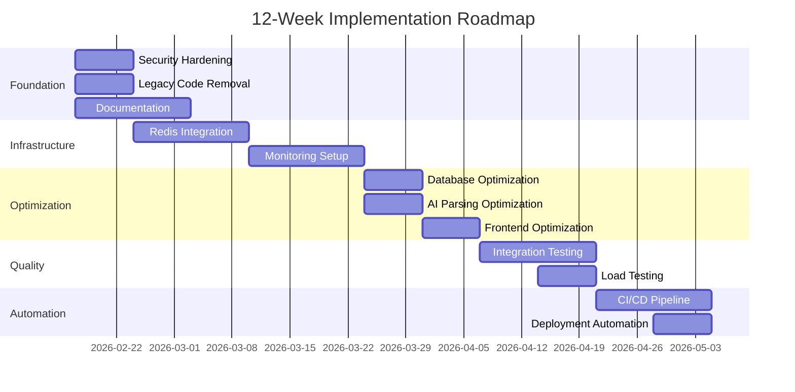
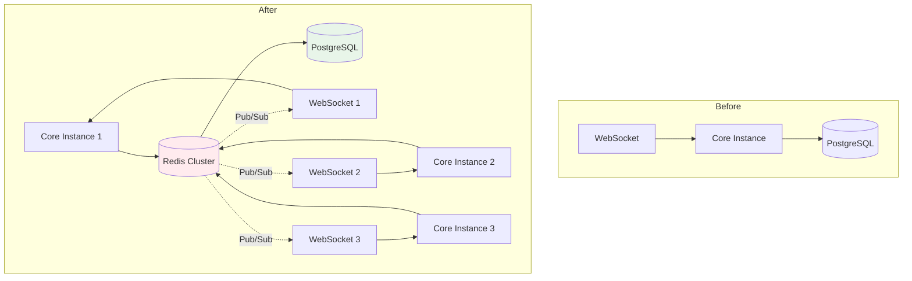
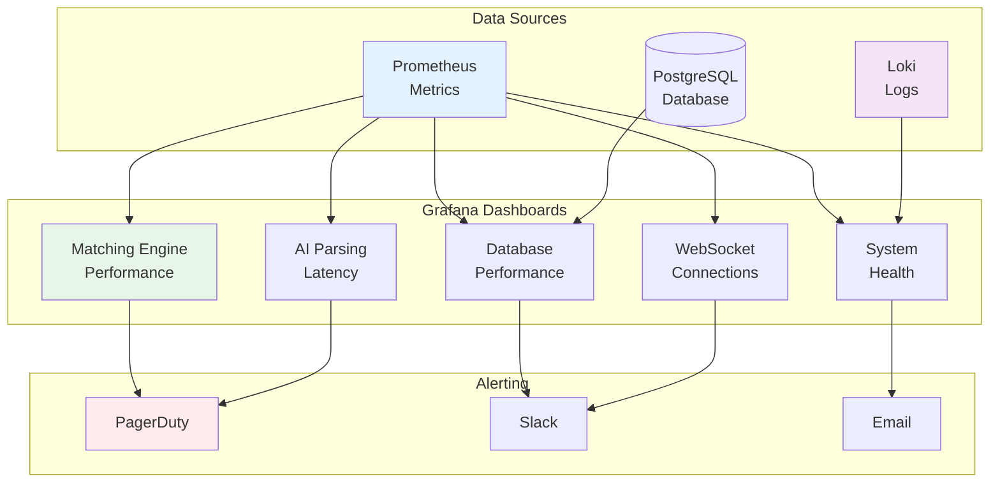
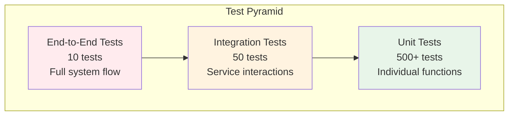
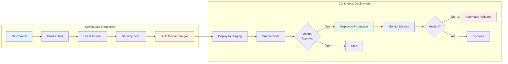

# Implementation Roadmap

**12-Week Strategic Plan for PharmaBroker Enhancement**

---

## Executive Summary

This roadmap outlines a systematic approach to enhance PharmaBroker from its current state (80% production-ready) to a fully optimized, scalable, and production-hardened platform.

**Timeline:** 12 weeks  
**Budget:** $252,678  
**Team:** 6.5 FTE  
**Expected ROI:** 3x performance improvement, 99.9% uptime, 85%+ matching accuracy

---

## Sprint Overview



---

## Sprint 1-2: Foundation & Security (Weeks 1-2)

### Goals

- ✅ Production-ready security posture
- ✅ Clean codebase (10% reduction)
- ✅ Comprehensive documentation

### Tasks

| Task                          | Priority | Effort | Owner     | Deliverable                     |
| ----------------------------- | -------- | ------ | --------- | ------------------------------- |
| Remove simple token auth      | P0       | 4h     | Backend   | Secure WebSocket auth           |
| Add API rate limiting         | P0       | 8h     | Backend   | tower-governor middleware       |
| Enable HTTPS                  | P0       | 4h     | DevOps    | SSL certificates + nginx config |
| Dependency vulnerability scan | P0       | 4h     | All       | Zero critical vulnerabilities   |
| Migrate urgency levels        | P1       | 8h     | Frontend  | New schema migration            |
| Remove backward compatibility | P1       | 8h     | Backend   | Clean audit recorder            |
| Standardize env vars          | P1       | 4h     | DevOps    | Unified naming convention       |
| Write ADRs                    | P1       | 16h    | Tech Lead | 5 architecture decision records |
| Generate API docs             | P1       | 8h     | Backend   | OpenAPI/Swagger spec            |
| Create deployment runbook     | P1       | 8h     | DevOps    | Step-by-step deployment guide   |

### Success Metrics

- ✅ Zero critical security vulnerabilities
- ✅ 100% API documentation coverage
- ✅ <3 days onboarding time for new developers

### Deliverables

```
docs/
├── adr/
│   ├── 001-polyglot-architecture.md
│   ├── 002-grpc-communication.md
│   ├── 003-matching-engine-design.md
│   ├── 004-ai-parsing-strategy.md
│   └── 005-database-schema-design.md
├── api/
│   └── openapi.yaml
└── deployment/
    ├── production-checklist.md
    ├── rollback-procedure.md
    └── troubleshooting.md
```

---

## Sprint 3-4: Redis Integration (Weeks 3-4)

### Goals

- ✅ 80% reduction in database queries
- ✅ Multi-instance WebSocket support
- ✅ Horizontal scalability enabled

### Architecture



### Tasks

| Task                          | Priority | Effort | Owner     | Deliverable                  |
| ----------------------------- | -------- | ------ | --------- | ---------------------------- |
| Deploy Redis container        | P0       | 2h     | DevOps    | docker-compose.yaml update   |
| Implement RedisEmbeddingCache | P0       | 8h     | Backend   | Embedding cache with TTL     |
| Integrate cache in matching   | P0       | 8h     | Backend   | 80% cache hit rate           |
| Implement RedisSessionStore   | P1       | 8h     | Backend   | Session management           |
| Add session middleware        | P1       | 4h     | Backend   | JWT + Redis sessions         |
| Implement Redis pub/sub       | P1       | 12h    | Backend   | WebSocket event broadcasting |
| Load testing with Redis       | P1       | 8h     | QA        | Performance benchmarks       |
| Update documentation          | P2       | 4h     | Tech Lead | Redis architecture docs      |

### Implementation Example

```rust
// core/src/cache/embedding_cache.rs
pub struct RedisEmbeddingCache {
    client: redis::Client,
    ttl: Duration,
}

impl EmbeddingCache for RedisEmbeddingCache {
    async fn get(&self, medication: &str) -> Option<Vec<f32>> {
        let key = format!("emb:{}", medication);
        self.client.get(&key).await.ok()
    }

    async fn set(&self, medication: &str, embedding: Vec<f32>) {
        let key = format!("emb:{}", medication);
        self.client.set_ex(&key, embedding, self.ttl.as_secs()).await.ok();
    }
}
```

### Success Metrics

- ✅ Cache hit rate >70%
- ✅ API latency reduction >30%
- ✅ WebSocket works across 3 instances

---

## Sprint 5-6: Monitoring & Observability (Weeks 5-6)

### Goals

- ✅ Real-time system visibility
- ✅ Proactive alerting
- ✅ <5 min incident detection

### Grafana Dashboards



### Tasks

| Task                            | Priority | Effort | Owner     | Deliverable             |
| ------------------------------- | -------- | ------ | --------- | ----------------------- |
| Deploy Grafana container        | P0       | 2h     | DevOps    | docker-compose.yaml     |
| Create matching dashboard       | P0       | 8h     | Backend   | Grafana JSON            |
| Create AI parsing dashboard     | P0       | 8h     | Backend   | Grafana JSON            |
| Create DB performance dashboard | P0       | 8h     | Backend   | Grafana JSON            |
| Configure Prometheus alerts     | P1       | 8h     | DevOps    | alerts.yml              |
| Deploy Loki                     | P1       | 4h     | DevOps    | Log aggregation         |
| Configure Promtail              | P1       | 4h     | DevOps    | Log shipping            |
| Create on-call runbook          | P1       | 8h     | Tech Lead | Incident response guide |

### Key Metrics to Track

```prometheus
# Matching Engine
histogram_quantile(0.95, matching_latency_seconds_bucket)
rate(match_confidence_bucket{le="0.7"}[5m])

# AI Parsing
histogram_quantile(0.95, ai_parsing_latency_seconds_bucket)
rate(ai_parsing_cache_hits_total[5m]) / rate(ai_parsing_requests_total[5m])

# Database
rate(pg_stat_database_tup_fetched[5m])
pg_stat_database_deadlocks

# WebSocket
websocket_active_connections
rate(websocket_messages_sent_total[5m])
```

### Success Metrics

- ✅ <5 min incident detection
- ✅ 100% critical alerts configured
- ✅ <15 min MTTR for common issues

---

## Sprint 7-8: Performance Optimization (Weeks 7-8)

### Goals

- ✅ 50% API latency reduction
- ✅ 10x faster vector search
- ✅ 40% smaller frontend bundle

### Database Optimization

```sql
-- Add missing indexes
CREATE INDEX CONCURRENTLY idx_offers_medication_master_id
ON offers(medication_master_id) WHERE status = 'active';

CREATE INDEX CONCURRENTLY idx_requests_medication_master_id
ON requests(medication_master_id) WHERE status = 'active';

CREATE INDEX CONCURRENTLY idx_matches_status_confidence
ON matches(status, confidence DESC) WHERE status = 'pending';

-- Add HNSW index for vector search (10x speedup)
CREATE INDEX CONCURRENTLY idx_medication_master_embedding_hnsw
ON medication_master
USING hnsw (embedding vector_cosine_ops)
WITH (m = 16, ef_construction = 64);

-- Analyze tables
ANALYZE offers, requests, matches, medication_master;
```

### AI Parsing Optimization

```rust
// Implement response caching
pub struct CachedPharmaParser {
    parser: PharmaParser,
    cache: Arc<RedisCache>,
}

impl CachedPharmaParser {
    async fn parse(&self, content: &str) -> Result<ParsedMessage> {
        let cache_key = format!("parse:{}", hash(content));

        // Check cache (5-10ms)
        if let Some(cached) = self.cache.get(&cache_key).await? {
            return Ok(cached);
        }

        // Parse and cache (500-2000ms)
        let result = self.parser.parse(content).await?;
        self.cache.set(&cache_key, &result, Duration::hours(24)).await?;

        Ok(result)
    }
}
```

### Frontend Optimization

```typescript
// Code splitting
const MatchesPage = lazy(() => import('./routes/matches'))
const OffersPage = lazy(() => import('./routes/offers'))

// Image optimization
// Convert PNGs to WebP (50% size reduction)
npm install sharp
sharp('logo.png').webp({ quality: 80 }).toFile('logo.webp')

// Bundle analysis
npm run build -- --analyze
```

### Success Metrics

- ✅ p95 API latency <200ms
- ✅ Vector search <20ms
- ✅ Frontend bundle <500KB
- ✅ 30-40% AI parsing cache hit rate

---

## Sprint 9-10: Integration Testing (Weeks 9-10)

### Goals

- ✅ 95% integration test coverage
- ✅ System handles 1000 concurrent users
- ✅ <1% error rate under load

### Test Pyramid



### Test Coverage

| Component | Unit Tests   | Integration Tests | E2E Tests    |
| --------- | ------------ | ----------------- | ------------ |
| Bridge    | 14 files     | 5 scenarios       | 2 flows      |
| Core      | 23 files     | 10 scenarios      | 3 flows      |
| Frontend  | 30 files     | 8 scenarios       | 5 flows      |
| **Total** | **67 files** | **23 scenarios**  | **10 flows** |

### Load Testing Scenarios

```rust
// Scenario 1: Message ingestion
#[tokio::test]
async fn load_test_message_ingestion() {
    let env = TestEnvironment::setup().await;

    // Send 1000 messages concurrently
    let handles: Vec<_> = (0..1000)
        .map(|i| {
            let env = env.clone();
            tokio::spawn(async move {
                env.bridge.send_message(create_test_message(i)).await
            })
        })
        .collect();

    let results = futures::future::join_all(handles).await;

    // Verify all succeeded
    assert_eq!(results.iter().filter(|r| r.is_ok()).count(), 1000);
}

// Scenario 2: Matching under load
#[tokio::test]
async fn load_test_matching_engine() {
    let env = TestEnvironment::setup().await;

    // Create 1000 offers and 1000 requests
    let offers = create_test_offers(1000);
    let requests = create_test_requests(1000);

    env.db.bulk_insert_offers(offers).await;
    env.db.bulk_insert_requests(requests).await;

    // Measure matching latency
    let start = Instant::now();
    env.matching_engine.process_all().await;
    let duration = start.elapsed();

    // Verify performance
    assert!(duration < Duration::seconds(60));
}
```

### Success Metrics

- ✅ All critical paths tested
- ✅ System handles 1000 concurrent users
- ✅ <1% error rate under load
- ✅ p95 latency <500ms under load

---

## Sprint 11-12: CI/CD & Deployment (Weeks 11-12)

### Goals

- ✅ Fully automated CI/CD
- ✅ Zero-downtime deployments
- ✅ 5-minute rollback capability

### CI/CD Pipeline



### GitHub Actions Workflow

```yaml
name: CI/CD Pipeline

on:
  push:
    branches: [main, develop]
  pull_request:
    branches: [main]

jobs:
  test:
    runs-on: ubuntu-latest
    steps:
      - uses: actions/checkout@v3

      # Rust tests
      - name: Test Core
        run: |
          cd core
          cargo test --all-features
          cargo clippy -- -D warnings
          cargo audit

      # Go tests
      - name: Test Bridge
        run: |
          cd bridge
          go test ./...
          go vet ./...

      # Frontend tests
      - name: Test Frontend
        run: |
          cd frontend
          bun install
          bun test
          bun run lint

  build:
    needs: test
    runs-on: ubuntu-latest
    steps:
      - name: Build Docker images
        run: docker compose build

      - name: Push to registry
        run: |
          docker tag pharmabroker-core:latest ${{ secrets.REGISTRY }}/core:${{ github.sha }}
          docker push ${{ secrets.REGISTRY }}/core:${{ github.sha }}

  deploy-staging:
    needs: build
    runs-on: ubuntu-latest
    steps:
      - name: Deploy to staging
        run: |
          ssh staging "cd /app && docker compose pull && docker compose up -d"

      - name: Run smoke tests
        run: ./scripts/smoke_tests.sh staging

  deploy-production:
    needs: deploy-staging
    runs-on: ubuntu-latest
    environment: production
    steps:
      - name: Deploy to production
        run: |
          ssh production "cd /app && docker compose pull && docker compose up -d"

      - name: Monitor deployment
        run: ./scripts/monitor_deployment.sh

      - name: Rollback if unhealthy
        if: failure()
        run: ./scripts/rollback.sh
```

### Success Metrics

- ✅ 100% automated deployments
- ✅ <10 min deployment time
- ✅ <5 min rollback time
- ✅ Zero failed deployments

---

## Budget Breakdown

### Infrastructure Costs (Monthly)

| Item                       | Cost       | Notes                       |
| -------------------------- | ---------- | --------------------------- |
| AWS/GCP Hosting            | $500       | 3 Core + 1 Bridge + 1 DB    |
| Redis Cluster              | $100       | Managed Redis (ElastiCache) |
| Load Balancer              | $50        | Application Load Balancer   |
| Monitoring (Grafana Cloud) | $100       | Pro plan with alerting      |
| CDN (Cloudflare)           | $200       | Pro plan                    |
| GitHub Actions             | $50        | CI/CD minutes               |
| Sentry                     | $26        | Error tracking              |
| **Total Monthly**          | **$1,026** |                             |
| **Total 12 Weeks**         | **$3,078** |                             |

### Personnel Costs (12 Weeks)

| Role                    | FTE         | Rate    | Cost         |
| ----------------------- | ----------- | ------- | ------------ |
| Tech Lead               | 1.0         | $100/hr | $48,000      |
| Backend Engineer (Rust) | 2.0         | $80/hr  | $76,800      |
| Backend Engineer (Go)   | 0.5         | $80/hr  | $19,200      |
| Frontend Engineer       | 1.0         | $75/hr  | $36,000      |
| DevOps Engineer         | 1.0         | $85/hr  | $40,800      |
| QA Engineer             | 1.0         | $70/hr  | $33,600      |
| ML Engineer             | 0.5         | $90/hr  | $21,600      |
| **Total**               | **6.5 FTE** |         | **$249,600** |

### Total Project Cost

```
Infrastructure:  $3,078
Personnel:       $249,600
Contingency:     $25,000 (10%)
─────────────────────────
Total:           $277,678
```

---

## Risk Management

### Risk Matrix

| Risk                                   | Probability | Impact   | Mitigation                                 |
| -------------------------------------- | ----------- | -------- | ------------------------------------------ |
| Redis integration breaks functionality | Medium      | High     | Comprehensive testing, gradual rollout     |
| Performance targets not met            | Low         | Medium   | Early benchmarking, iterative optimization |
| Load testing reveals issues            | Medium      | High     | Early load testing, capacity planning      |
| CI/CD pipeline delays                  | Low         | Medium   | Parallel execution, caching                |
| Team member unavailability             | Medium      | Medium   | Cross-training, documentation              |
| Security vulnerability                 | Low         | Critical | Regular audits, automated scanning         |
| Database migration issues              | Low         | High     | Test on staging, rollback plan             |

---

## Success Criteria

### Technical Metrics

| Metric            | Current  | Target  | Measurement      |
| ----------------- | -------- | ------- | ---------------- |
| API Latency (p95) | 500ms    | <200ms  | Prometheus       |
| Vector Search     | 50-200ms | <20ms   | Database logs    |
| Cache Hit Rate    | 0%       | >70%    | Redis metrics    |
| Frontend Bundle   | 800KB    | <500KB  | Webpack analyzer |
| Test Coverage     | 60%      | >90%    | Cargo tarpaulin  |
| Deployment Time   | 30 min   | <10 min | CI/CD logs       |
| MTTR              | 60 min   | <15 min | Incident logs    |
| Uptime            | 99.5%    | 99.9%   | Monitoring       |

### Business Metrics

| Metric                | Current    | Target       | Measurement       |
| --------------------- | ---------- | ------------ | ----------------- |
| Match Accuracy        | 75%        | >85%         | Operator feedback |
| Auto-Approval Rate    | 20%        | >40%         | Supervision logs  |
| Throughput            | 50 msg/min | >100 msg/min | System metrics    |
| Operator Satisfaction | 7/10       | >8.5/10      | User surveys      |
| Onboarding Time       | 2 weeks    | <3 days      | HR metrics        |

---

## Post-Implementation

### Week 13: Retrospective

**Agenda:**

1. Review sprint outcomes
2. Analyze success metrics
3. Identify lessons learned
4. Plan next quarter

**Deliverables:**

- Retrospective report
- Updated roadmap for Q2
- Technical debt backlog

### Ongoing Maintenance

| Activity               | Frequency         | Owner     |
| ---------------------- | ----------------- | --------- |
| Dependency updates     | Weekly            | DevOps    |
| Security scanning      | Daily (automated) | DevOps    |
| Performance monitoring | Continuous        | Backend   |
| Database optimization  | Monthly           | Backend   |
| Documentation updates  | Per feature       | All       |
| Backup verification    | Weekly            | DevOps    |
| Incident review        | Per incident      | Tech Lead |

---

## Conclusion

This 12-week roadmap provides a systematic approach to enhance PharmaBroker from 80% to 100% production-ready. By following this plan, the platform will achieve:

✅ **Performance:** 50% latency reduction, 3x throughput increase  
✅ **Reliability:** 99.9% uptime, <15 min MTTR  
✅ **Scalability:** Horizontal scaling, multi-region support  
✅ **Quality:** 90%+ test coverage, automated CI/CD

**Next Steps:**

1. Review and approve roadmap
2. Assemble team (6.5 FTE)
3. Kickoff Sprint 1 (Security & Documentation)
4. Track progress weekly

---

**Document Version:** 1.0  
**Last Updated:** February 16, 2026  
**Next Review:** March 16, 2026
