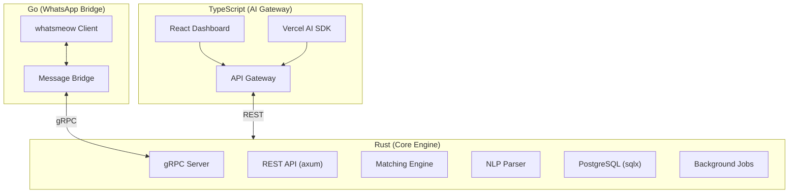
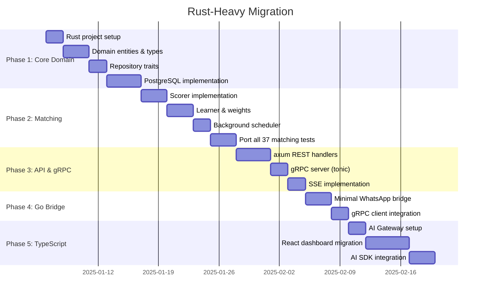

# Rust-Heavy Architecture Blueprint

> **Goal**: Restructure PharmaBroker with Rust core, TypeScript AI gateway, and Go WhatsApp bridge
> **Date**: 2025-12-19

---

## Executive Summary



| Service             | Language   | Responsibility                   |
| ------------------- | ---------- | -------------------------------- |
| **AI Gateway**      | TypeScript | Dashboard, AI SDK, API proxy     |
| **Core Engine**     | Rust       | Matching, parsing, storage, jobs |
| **WhatsApp Bridge** | Go         | whatsmeow client only (~500 LOC) |

---

## Current Go to Rust Mapping

### Domain Entities

| Go Entity    | Go Location                       | Rust Equivalent         |
| ------------ | --------------------------------- | ----------------------- |
| `RawMessage` | `domain/entity/entity.go:54-71`   | `src/domain/message.rs` |
| `Offer`      | `domain/entity/entity.go:86-106`  | `src/domain/offer.rs`   |
| `Request`    | `domain/entity/entity.go:109-128` | `src/domain/request.rs` |
| `Match`      | `domain/entity/entity.go:131-142` | `src/domain/match.rs`   |
| `Group`      | `domain/entity/entity.go:152-159` | `src/domain/group.rs`   |
| `Stats`      | `domain/entity/entity.go:162-171` | `src/domain/stats.rs`   |

### Enums Mapping

```rust
// src/domain/types.rs

#[derive(Debug, Clone, Serialize, Deserialize, sqlx::Type)]
#[sqlx(type_name = "message_type", rename_all = "SCREAMING_SNAKE_CASE")]
pub enum MessageType {
    Offer,
    Request,
    Both,
    Unknown,
}

#[derive(Debug, Clone, Serialize, Deserialize, sqlx::Type)]
#[sqlx(type_name = "item_status", rename_all = "SCREAMING_SNAKE_CASE")]
pub enum ItemStatus {
    Active,
    Matched,
    Expired,
    Archived,
}

#[derive(Debug, Clone, Serialize, Deserialize, sqlx::Type)]
#[sqlx(type_name = "match_status", rename_all = "SCREAMING_SNAKE_CASE")]
pub enum MatchStatus {
    Pending,
    Confirmed,
    Rejected,
}
```

---

## Repository Pattern → Rust Traits

### Go Interface → Rust Trait

| Go Interface      | Rust Trait          | Methods                                                                      |
| ----------------- | ------------------- | ---------------------------------------------------------------------------- |
| `OfferReader`     | `OfferRepository`   | `get_by_id`, `get_active`, `search`, `count_active`, `find_recent_duplicate` |
| `RequestReader`   | `RequestRepository` | `get_by_id`, `get_active`, `search`, `count_active`                          |
| `MatchReader`     | `MatchRepository`   | `get_by_id`, `get_pending`, `count_pending`, `get_stale_matches`             |
| `AuditRepository` | `AuditRepository`   | `log`, `get_recent`, `delete_older_than`                                     |

### Example Rust Trait

```rust
// src/repository/offer.rs
use async_trait::async_trait;
use crate::domain::{Offer, ItemStatus};
use crate::error::Result;

#[async_trait]
pub trait OfferRepository: Send + Sync {
    async fn get_by_id(&self, id: &str) -> Result<Option<Offer>>;
    async fn get_active(&self, limit: i64, offset: i64) -> Result<Vec<Offer>>;
    async fn search(&self, query: &str, limit: i64, offset: i64) -> Result<Vec<Offer>>;
    async fn count_active(&self) -> Result<i64>;
    async fn find_recent_duplicate(
        &self,
        sender_phone: &str,
        medication: &str,
        within: chrono::Duration,
    ) -> Result<Option<Offer>>;
    async fn save(&self, offer: &Offer) -> Result<()>;
    async fn update_status(&self, id: &str, status: ItemStatus) -> Result<()>;
}
```

---

## Matching Engine → Rust

### Go Scorer → Rust Scorer

| Go Component | File                     | Rust Equivalent              |
| ------------ | ------------------------ | ---------------------------- |
| `Scorer`     | `matching/scorer.go`     | `src/matching/scorer.rs`     |
| `Learner`    | `matching/learner.go`    | `src/matching/learner.rs`    |
| `Scheduler`  | `matching/scheduler.go`  | `src/matching/scheduler.rs`  |
| `WarmStart`  | `matching/warm_start.go` | `src/matching/warm_start.rs` |

### Rust Scorer Implementation

```rust
// src/matching/scorer.rs
use crate::domain::{Offer, Request, ConfidenceBand};

#[derive(Debug, Clone)]
pub struct Weights {
    pub medication: f64,  // 0.40
    pub dosage: f64,      // 0.15
    pub quantity: f64,    // 0.20
    pub price: f64,       // 0.15
    pub recency: f64,     // 0.10
}

#[derive(Debug, Clone)]
pub struct MatchScore {
    pub medication_score: f64,
    pub dosage_score: f64,
    pub quantity_score: f64,
    pub price_score: f64,
    pub recency_score: f64,
    pub total: f64,
    pub confidence: ConfidenceBand,
    pub breakdown: String,
}

pub struct Scorer {
    weights: RwLock<Weights>,
    thresholds: RwLock<Thresholds>,
    recency_half_life: f64,
}

impl Scorer {
    pub fn score_match(&self, offer: &Offer, request: &Request, medication_score: f64) -> MatchScore {
        // Implementation mirrors Go logic
    }

    pub fn quantity_score(&self, offer_qty: f64, request_qty: f64) -> f64 {
        // ±10% tolerance, then ratio
    }

    pub fn price_score(&self, offer_price: f64, max_price: f64) -> f64 {
        // ±5% tolerance with bonus for better prices
    }

    pub fn recency_score(&self, created_at: DateTime<Utc>) -> f64 {
        // Exponential decay with half-life
    }
}
```

---

## Test Mapping: Go → Rust

### Test Files Mapping

| Go Test File                 | Tests    | Rust Equivalent                           |
| ---------------------------- | -------- | ----------------------------------------- |
| `matching/scorer_test.go`    | 11 tests | `src/matching/scorer.rs` (`#[cfg(test)]`) |
| `matching/learner_test.go`   | 8 tests  | `src/matching/learner.rs`                 |
| `matching/scheduler_test.go` | 9 tests  | `src/matching/scheduler.rs`               |
| `matching/recency_test.go`   | 4 tests  | `src/matching/recency.rs`                 |
| `matching/e2e_test.go`       | 5 tests  | `tests/e2e_matching.rs`                   |
| `api/handlers/*_test.go`     | 32 tests | `tests/api/*`                             |
| `parsing/*_test.go`          | 24 tests | `tests/parsing/*`                         |

### Rust Test Example

```rust
// src/matching/scorer.rs
#[cfg(test)]
mod tests {
    use super::*;
    use chrono::Utc;

    #[test]
    fn test_quantity_score_exact_match() {
        let scorer = Scorer::default();
        assert!((scorer.quantity_score(10.0, 10.0) - 1.0).abs() < 0.001);
    }

    #[test]
    fn test_quantity_score_over_supply() {
        let scorer = Scorer::default();
        assert!((scorer.quantity_score(15.0, 10.0) - 1.0).abs() < 0.001);
    }

    #[test]
    fn test_quantity_score_under_supply() {
        let scorer = Scorer::default();
        let score = scorer.quantity_score(5.0, 10.0);
        assert!((score - 0.5).abs() < 0.001);
    }

    #[test]
    fn test_price_score_within_budget() {
        let scorer = Scorer::default();
        assert!((scorer.price_score(90.0, 100.0) - 1.0).abs() < 0.1);
    }

    #[tokio::test]
    async fn test_recency_score_decay() {
        let scorer = Scorer::default();
        let old = Utc::now() - chrono::Duration::hours(24);
        let score = scorer.recency_score(old);
        assert!(score < 0.6); // After 24h with 24h half-life
    }
}
```

---

## Rust Project Structure

```
pharma-core/
├── Cargo.toml
├── src/
│   ├── main.rs                 # Entry point
│   ├── lib.rs                  # Library exports
│   │
│   ├── config/
│   │   └── mod.rs              # Configuration (from Go config.yaml)
│   │
│   ├── domain/
│   │   ├── mod.rs
│   │   ├── types.rs            # Enums (MessageType, ItemStatus, etc.)
│   │   ├── message.rs          # RawMessage
│   │   ├── offer.rs            # Offer
│   │   ├── request.rs          # Request
│   │   ├── match_entity.rs     # Match (avoiding keyword)
│   │   ├── group.rs            # Group
│   │   └── stats.rs            # Stats
│   │
│   ├── repository/
│   │   ├── mod.rs
│   │   ├── traits.rs           # All repository traits
│   │   ├── postgres/
│   │   │   ├── mod.rs
│   │   │   ├── offer.rs        # Offer CRUD
│   │   │   ├── request.rs      # Request CRUD
│   │   │   ├── match_repo.rs   # Match CRUD
│   │   │   └── audit.rs        # Audit logging
│   │   └── migrations/         # SQL migrations
│   │
│   ├── matching/
│   │   ├── mod.rs
│   │   ├── scorer.rs           # Multi-field scorer
│   │   ├── weights.rs          # Weight management
│   │   ├── learner.rs          # Adaptive learning
│   │   ├── scheduler.rs        # Background matching
│   │   └── confidence.rs       # Confidence bands
│   │
│   ├── parsing/
│   │   ├── mod.rs
│   │   ├── arabic.rs           # Arabic NLP
│   │   ├── medication.rs       # Medication extraction
│   │   ├── normalizer.rs       # Name normalization
│   │   └── confidence.rs       # Parse confidence
│   │
│   ├── api/
│   │   ├── mod.rs
│   │   ├── routes.rs           # axum router
│   │   ├── handlers/
│   │   │   ├── mod.rs
│   │   │   ├── offers.rs
│   │   │   ├── requests.rs
│   │   │   ├── matches.rs
│   │   │   └── stats.rs
│   │   ├── middleware/
│   │   │   ├── mod.rs
│   │   │   └── auth.rs
│   │   └── sse.rs              # Server-sent events
│   │
│   ├── grpc/
│   │   ├── mod.rs
│   │   ├── server.rs           # gRPC server (for Go bridge)
│   │   └── proto/              # Generated protobuf
│   │
│   ├── jobs/
│   │   ├── mod.rs
│   │   ├── janitor.rs          # Data cleanup
│   │   ├── expiry.rs           # Offer expiration
│   │   └── scheduler.rs        # Cron scheduler
│   │
│   └── error.rs                # Error types
│
├── proto/
│   └── pharma.proto            # gRPC definitions
│
└── tests/
    ├── api/                    # API integration tests
    ├── matching/               # Matching E2E tests
    └── fixtures/               # Test data
```

---

## Go WhatsApp Bridge (Minimal)

```go
// bridge/main.go (~500 lines total)
package main

import (
    "context"
    pb "pharma-bridge/proto"
    "go.mau.fi/whatsmeow"
    "google.golang.org/grpc"
)

type Bridge struct {
    wa     *whatsmeow.Client
    rust   pb.PharmaCoreClient  // gRPC to Rust
}

func (b *Bridge) handleMessage(evt *events.Message) {
    // Forward to Rust via gRPC
    b.rust.ProcessMessage(context.Background(), &pb.RawMessage{
        Id:          evt.Info.ID,
        GroupJid:    evt.Info.Chat.String(),
        SenderPhone: evt.Info.Sender.User,
        Content:     evt.Message.GetConversation(),
        Timestamp:   evt.Info.Timestamp.Unix(),
    })
}
```

---

## TypeScript AI Gateway

```typescript
// gateway/src/routes/ai.ts
import { createOpenAI } from "@ai-sdk/openai";
import { streamText } from "ai";

export async function parseMessage(content: string) {
  const result = await streamText({
    model: openai("gpt-4-turbo"),
    system: "Extract medication offers/requests from Arabic text...",
    prompt: content,
  });

  // Forward parsed result to Rust
  await fetch("http://rust-core:8080/api/parse", {
    method: "POST",
    body: JSON.stringify(result),
  });
}
```

---

## Rust Crate Dependencies

```toml
# Cargo.toml
[package]
name = "pharma-core"
version = "0.1.0"
edition = "2021"

[dependencies]
# Async runtime
tokio = { version = "1", features = ["full"] }

# Web framework
axum = "0.7"
tower = "0.4"
tower-http = { version = "0.5", features = ["cors", "trace"] }

# gRPC
tonic = "0.11"
prost = "0.12"

# Database
sqlx = { version = "0.7", features = ["runtime-tokio", "postgres", "chrono", "uuid"] }

# Serialization
serde = { version = "1", features = ["derive"] }
serde_json = "1"

# Utilities
chrono = { version = "0.4", features = ["serde"] }
uuid = { version = "1", features = ["v4", "serde"] }
tracing = "0.1"
tracing-subscriber = { version = "0.3", features = ["env-filter"] }

# NLP (optional, for local parsing)
# rust-bert = "0.21"
# tokenizers = "0.15"

[dev-dependencies]
tokio-test = "0.4"
rstest = "0.18"
```

---

## Migration Roadmap



---

## Summary

| Aspect            | Solution                                |
| ----------------- | --------------------------------------- |
| **Core Logic**    | Rust (axum, sqlx, tonic)                |
| **WhatsApp**      | Go (whatsmeow only, ~500 LOC)           |
| **AI/Dashboard**  | TypeScript (Vercel AI SDK, React)       |
| **Database**      | PostgreSQL (same schema)                |
| **Communication** | gRPC (Go↔Rust), REST (TS↔Rust)          |
| **Tests**         | 73 Go tests → Rust `#[test]` + `rstest` |

This architecture gives you:

- 🦀 **Rust performance** for matching, parsing, storage
- 🔒 **Memory safety** for long-running services
- ⚡ **TypeScript DX** for AI and web
- 📱 **Go necessity** for WhatsApp (no alternative)
