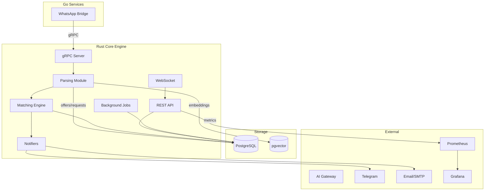
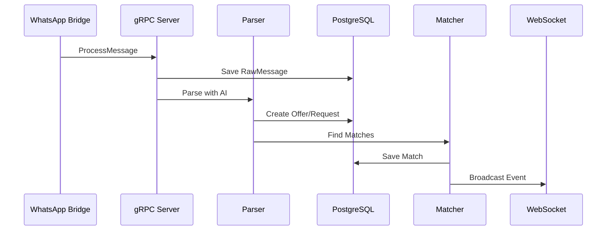

# PharmaBroker Migration Overview

## Architecture

## Module Structure

| Module               | Purpose                | Phase |
| -------------------- | ---------------------- | ----- |
| `metrics/`           | Prometheus metrics     | 1     |
| `api/handlers`       | Health, CRUD endpoints | 1     |
| `queue/`             | In-memory queue        | 2     |
| `retry/`             | Retry with backoff     | 2     |
| `ai/`                | AI gateway client      | 2     |
| `api/groups`         | Group management       | 3     |
| `ws/`                | WebSocket events       | 3     |
| `grpc/`              | Bridge communication   | 4     |
| `matching/`          | Scorer, weights        | 5     |
| `matching/embedding` | Semantic matching      | 7     |
| `parsing/`           | Batch processing       | 8     |
| `api/middleware/jwt` | JWT auth               | 9     |
| `notify/`            | Telegram, Email        | 10    |
| `worker/janitor`     | Cleanup jobs           | 11    |

## Phase Summary

| #   | Phase           | Status      | Tests           |
| --- | --------------- | ----------- | --------------- |
| 1   | Observability   | ✅          | metrics, health |
| 2   | Reliability     | ✅          | queue, retry    |
| 3   | Features        | ✅          | groups, ws      |
| 4   | Resilience      | ✅          | grpc, cache     |
| 5   | Matching        | ✅          | scorer          |
| 6   | Dashboards      | ✅          | grafana         |
| 7   | Embeddings      | ✅          | semantic        |
| 8   | Parsing         | ✅ 14 tests | batch           |
| 9   | Security        | ✅ 8 tests  | jwt             |
| 10  | Notifications   | ✅ 8 tests  | notify          |
| 11  | Background Jobs | ✅ 2 tests  | janitor         |
| 12  | E2E Testing     | 🔲          | full flow       |

## Data Flow

