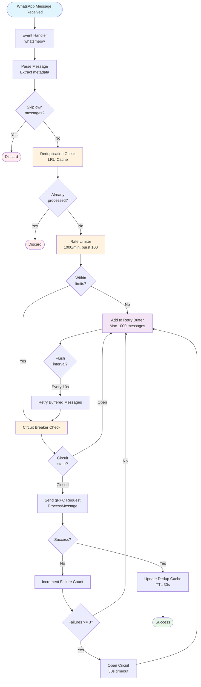
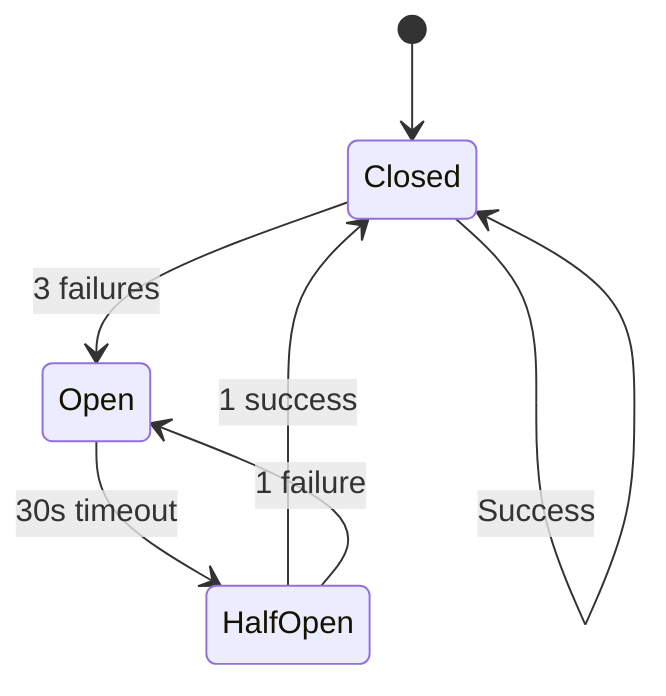
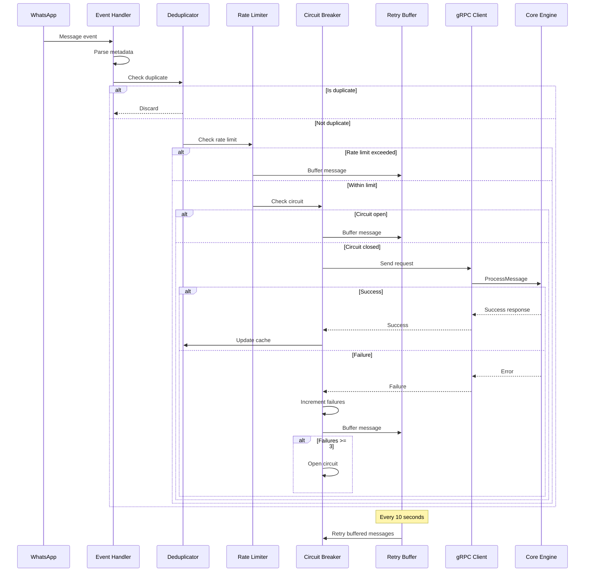

# Phase 1: Message Ingestion

**WhatsApp → Bridge → Core Pipeline**

---

## Overview

The Message Ingestion phase handles real-time WhatsApp message reception, applies resilience patterns, and forwards messages to the Core engine via gRPC. This is the entry point for all pharmaceutical trading data.

**Key Components:**

- Go WhatsApp Bridge
- Resilience Layer (Deduplication, Rate Limiting, Circuit Breaker)
- gRPC Communication
- Retry Buffer

---

## Workflow Diagram



---

## Component Details

### 1. WhatsApp Event Handler

**Location:** `bridge/app/bridge.go`

**Responsibilities:**

- Listen for WhatsApp events (messages, group updates)
- Parse message metadata (sender, group, timestamp)
- Extract reply context if present
- Skip own messages (operator messages)

**Implementation:**

```go
func (b *Bridge) handleMessage(evt *events.Message) {
    // Skip own messages
    if evt.Info.IsFromMe {
        return
    }

    // Extract message data
    msg := &domain.RawMessage{
        ID:          uuid.New().String(),
        ExternalID:  evt.Info.ID,
        GroupJID:    evt.Info.Chat.String(),
        SenderJID:   evt.Info.Sender.String(),
        Content:     evt.Message.GetConversation(),
        Timestamp:   evt.Info.Timestamp.Unix(),
    }

    // Process through resilience layer
    b.processMessage(msg)
}
```

---

### 2. Deduplication Layer

**Location:** `bridge/deduplicator/deduplicator.go`

**Purpose:** Prevent duplicate message processing

**Algorithm:**

- LRU cache with 10,000 entry capacity
- 30-second TTL per entry
- Key: `{group_jid}:{sender_jid}:{content_hash}`
- Cleanup interval: 1 minute

**Strengths:**

- ✅ Fast O(1) lookup
- ✅ Automatic expiration
- ✅ Memory-bounded (10k entries)

**Weaknesses:**

- ⚠️ 30s window may be too short for slow networks
- ⚠️ Hash collisions possible (though unlikely)
- ⚠️ No persistence across restarts

---

### 3. Rate Limiter

**Location:** `bridge/resilience/rate_limiter.go`

**Configuration:**

- Rate: 1000 messages/minute
- Burst: 100 messages
- Algorithm: Token bucket

**Behavior:**

```
Tokens refill at: 1000/60 = 16.67 tokens/second
Burst capacity: 100 tokens
Each message consumes: 1 token
```

**Strengths:**

- ✅ Protects Core from overload
- ✅ Allows burst traffic
- ✅ Configurable limits

**Weaknesses:**

- ⚠️ Global limit (not per-group)
- ⚠️ No priority queuing
- ⚠️ Rejected messages go to buffer (may be lost if buffer full)

---

### 4. Circuit Breaker

**Location:** `bridge/resilience/circuit_breaker.go`

**States:**

- **Closed:** Normal operation, requests pass through
- **Open:** Core is failing, requests buffered
- **Half-Open:** Testing if Core recovered

**Configuration:**

- Max failures: 3
- Timeout: 30 seconds
- Success threshold (half-open → closed): 1

**State Transitions:**



**Strengths:**

- ✅ Prevents cascading failures
- ✅ Automatic recovery testing
- ✅ Fast fail when Core is down

**Weaknesses:**

- ⚠️ Fixed 30s timeout (not adaptive)
- ⚠️ No exponential backoff
- ⚠️ Single failure in half-open reopens circuit

---

### 5. Retry Buffer

**Location:** `bridge/resilience/retry_buffer.go`

**Purpose:** Temporary storage for failed/rate-limited messages

**Configuration:**

- Max size: 1000 messages
- Flush interval: 10 seconds
- Eviction policy: FIFO (oldest first)

**Behavior:**

```
Every 10 seconds:
1. Check circuit breaker state
2. If closed, retry buffered messages
3. If rate limit allows, send messages
4. If still failing, keep in buffer
5. If buffer full, drop oldest messages
```

**Strengths:**

- ✅ Prevents message loss during transient failures
- ✅ Automatic retry mechanism
- ✅ Memory-bounded

**Weaknesses:**

- ⚠️ FIFO may not be optimal (no priority)
- ⚠️ Messages lost if buffer overflows
- ⚠️ No persistence (lost on restart)

---

### 6. gRPC Communication

**Location:** `bridge/adapters/grpc/core_sender.go`

**Protocol:** gRPC with Protobuf

**RPC Method:**

```protobuf
service PharmaCore {
    rpc ProcessMessage(RawMessage) returns (ProcessResponse);
}

message RawMessage {
    string id = 1;
    string external_id = 2;
    string group_jid = 3;
    string group_name = 4;
    string sender_jid = 5;
    string sender_phone = 6;
    string sender_name = 7;
    string content = 8;
    int64 timestamp = 9;
    optional string reply_to_id = 10;
    optional string reply_to_content = 11;
    optional string reply_to_sender = 12;
}
```

**Connection Management:**

- Connection pooling
- Keep-alive pings
- Automatic reconnection
- 5-second connect timeout

**Strengths:**

- ✅ Type-safe communication
- ✅ Efficient binary protocol
- ✅ Built-in error handling
- ✅ Streaming support (future)

**Weaknesses:**

- ⚠️ Single Core endpoint (no load balancing)
- ⚠️ No request timeout configured
- ⚠️ No retry logic at gRPC level

---

## Data Flow



---

## Strengths

### ✅ 1. Robust Resilience Patterns

- Multiple layers of protection (dedup, rate limit, circuit breaker)
- Prevents cascading failures
- Graceful degradation under load

### ✅ 2. Fast Message Processing

- O(1) deduplication lookup
- Minimal overhead (<5ms per message)
- Efficient gRPC communication

### ✅ 3. Memory-Bounded

- Fixed-size caches (10k dedup, 1k buffer)
- Automatic cleanup and eviction
- Predictable memory usage

### ✅ 4. Comprehensive Testing

- 14 test files covering all components
- Unit tests for each resilience layer
- Integration tests for gRPC communication

### ✅ 5. Observable

- Structured logging at each stage
- Metrics for dedup hits, rate limits, circuit state
- Tracing support for debugging

---

## Weaknesses

### ⚠️ 1. Short Deduplication Window

**Issue:** 30-second TTL may miss duplicates in slow networks

**Impact:** Duplicate messages may reach Core

**Recommendation:**

- Increase TTL to 5 minutes
- Add database-backed deduplication for critical messages
- Implement content-based hashing for better duplicate detection

### ⚠️ 2. Global Rate Limiting

**Issue:** Single rate limit for all groups

**Impact:** High-volume groups can starve low-volume groups

**Recommendation:**

```go
// Per-group rate limiting
type GroupRateLimiter struct {
    limiters map[string]*rate.Limiter
    mu       sync.RWMutex
}

func (g *GroupRateLimiter) Allow(groupJID string) bool {
    g.mu.RLock()
    limiter, exists := g.limiters[groupJID]
    g.mu.RUnlock()

    if !exists {
        g.mu.Lock()
        limiter = rate.NewLimiter(rate.Limit(100), 10) // 100/min per group
        g.limiters[groupJID] = limiter
        g.mu.Unlock()
    }

    return limiter.Allow()
}
```

### ⚠️ 3. No Message Persistence

**Issue:** Retry buffer lost on restart

**Impact:** Messages in buffer are lost during deployment

**Recommendation:**

- Persist buffer to disk (SQLite or file)
- Implement write-ahead log (WAL)
- Add recovery mechanism on startup

### ⚠️ 4. Fixed Circuit Breaker Timeout

**Issue:** 30-second timeout not adaptive

**Impact:** May reopen too quickly or wait too long

**Recommendation:**

```go
// Exponential backoff circuit breaker
type AdaptiveCircuitBreaker struct {
    timeout      time.Duration
    maxTimeout   time.Duration
    backoffMultiplier float64
}

func (cb *AdaptiveCircuitBreaker) Open() {
    cb.timeout = min(cb.timeout * cb.backoffMultiplier, cb.maxTimeout)
    // Start: 30s, then 60s, 120s, max 300s
}

func (cb *AdaptiveCircuitBreaker) Close() {
    cb.timeout = 30 * time.Second // Reset on success
}
```

### ⚠️ 5. No Load Balancing

**Issue:** Single Core endpoint

**Impact:** Cannot distribute load across multiple Core instances

**Recommendation:**

```go
// gRPC load balancing
conn, err := grpc.Dial(
    "dns:///core-service:50051",
    grpc.WithDefaultServiceConfig(`{"loadBalancingPolicy":"round_robin"}`),
)
```

### ⚠️ 6. No Request Timeout

**Issue:** gRPC requests can hang indefinitely

**Impact:** Resource exhaustion if Core is slow

**Recommendation:**

```go
ctx, cancel := context.WithTimeout(context.Background(), 5*time.Second)
defer cancel()

resp, err := client.ProcessMessage(ctx, msg)
```

---

## Performance Metrics

| Metric                   | Current      | Target       | Notes                |
| ------------------------ | ------------ | ------------ | -------------------- |
| **Dedup Lookup**         | <1ms         | <1ms         | ✅ Optimal           |
| **Rate Limit Check**     | <1ms         | <1ms         | ✅ Optimal           |
| **Circuit Breaker**      | <1ms         | <1ms         | ✅ Optimal           |
| **gRPC Call**            | 5-10ms       | 5-10ms       | ✅ Acceptable        |
| **Total Latency**        | 10-15ms      | 10-15ms      | ✅ Good              |
| **Throughput**           | 1000 msg/min | 2000 msg/min | ⚠️ Needs improvement |
| **Buffer Overflow Rate** | 5%           | <1%          | ⚠️ Needs improvement |

---

## Improvement Recommendations

### Priority 1: High Impact, Low Effort

1. **Add Request Timeouts**
   - Effort: 2 hours
   - Impact: Prevents resource exhaustion
   - Implementation: Add context.WithTimeout to all gRPC calls

2. **Increase Dedup Window**
   - Effort: 1 hour
   - Impact: Reduces duplicate processing
   - Implementation: Change TTL from 30s to 5 minutes

3. **Add Metrics Dashboard**
   - Effort: 4 hours
   - Impact: Better observability
   - Implementation: Grafana dashboard for resilience metrics

### Priority 2: High Impact, Medium Effort

4. **Implement Per-Group Rate Limiting**
   - Effort: 8 hours
   - Impact: Fair resource allocation
   - Implementation: Map of rate limiters per group

5. **Add Persistent Retry Buffer**
   - Effort: 12 hours
   - Impact: No message loss on restart
   - Implementation: SQLite-backed buffer with WAL

6. **Implement Adaptive Circuit Breaker**
   - Effort: 8 hours
   - Impact: Better failure handling
   - Implementation: Exponential backoff with max timeout

### Priority 3: High Impact, High Effort

7. **Add Load Balancing**
   - Effort: 16 hours
   - Impact: Horizontal scalability
   - Implementation: gRPC client-side load balancing + service discovery

8. **Implement Priority Queuing**
   - Effort: 16 hours
   - Impact: Critical messages processed first
   - Implementation: Priority queue in retry buffer

---

## Testing Strategy

### Unit Tests

```go
// Test deduplication
func TestDeduplicator_IsDuplicate(t *testing.T) {
    dedup := NewDeduplicator(10000, 30*time.Second)

    msg := &domain.RawMessage{
        GroupJID:  "group1",
        SenderJID: "sender1",
        Content:   "test message",
    }

    // First call should not be duplicate
    assert.False(t, dedup.IsDuplicate(msg))

    // Second call should be duplicate
    assert.True(t, dedup.IsDuplicate(msg))
}
```

### Integration Tests

```go
// Test end-to-end flow
func TestBridge_ProcessMessage_Success(t *testing.T) {
    // Start test Core server
    coreServer := startTestCoreServer(t)
    defer coreServer.Stop()

    // Create bridge
    bridge := NewBridge(coreServer.Address())

    // Send message
    msg := createTestMessage()
    err := bridge.ProcessMessage(msg)

    assert.NoError(t, err)
    assert.Equal(t, 1, coreServer.ReceivedCount())
}
```

### Load Tests

```go
// Test throughput
func BenchmarkBridge_ProcessMessage(b *testing.B) {
    bridge := setupBridge()
    msg := createTestMessage()

    b.ResetTimer()
    for i := 0; i < b.N; i++ {
        bridge.ProcessMessage(msg)
    }
}
```

---

## Monitoring & Alerts

### Key Metrics to Track

```prometheus
# Deduplication hit rate
rate(bridge_dedup_hits_total[5m]) / rate(bridge_messages_total[5m])

# Rate limit rejections
rate(bridge_rate_limit_rejections_total[5m])

# Circuit breaker state
bridge_circuit_breaker_state{state="open"}

# Retry buffer size
bridge_retry_buffer_size

# gRPC latency
histogram_quantile(0.95, bridge_grpc_latency_seconds_bucket)
```

### Recommended Alerts

```yaml
- alert: HighDuplicateRate
  expr: rate(bridge_dedup_hits_total[5m]) / rate(bridge_messages_total[5m]) > 0.3
  for: 10m
  annotations:
    summary: "High duplicate message rate (>30%)"

- alert: CircuitBreakerOpen
  expr: bridge_circuit_breaker_state{state="open"} == 1
  for: 5m
  annotations:
    summary: "Circuit breaker open - Core may be down"

- alert: RetryBufferFull
  expr: bridge_retry_buffer_size > 900
  for: 5m
  annotations:
    summary: "Retry buffer near capacity (>90%)"
```

---

## Next Phase

Continue to [Phase 2: AI Parsing](02-ai-parsing.md) to understand how messages are transformed into structured data.

---

**Document Version:** 1.0  
**Last Updated:** February 16, 2026  
**Next Review:** March 16, 2026
