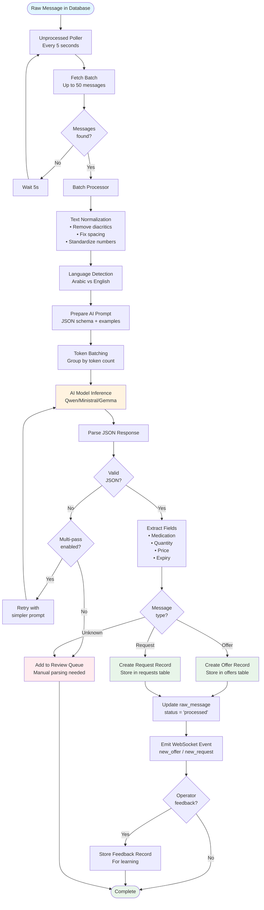
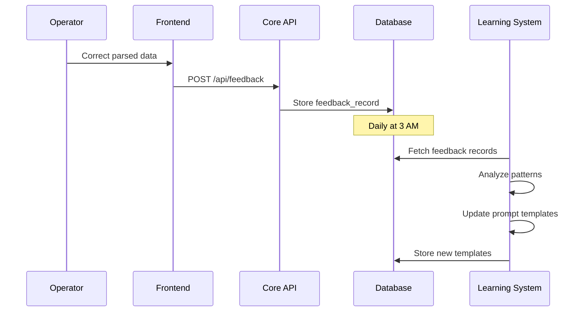
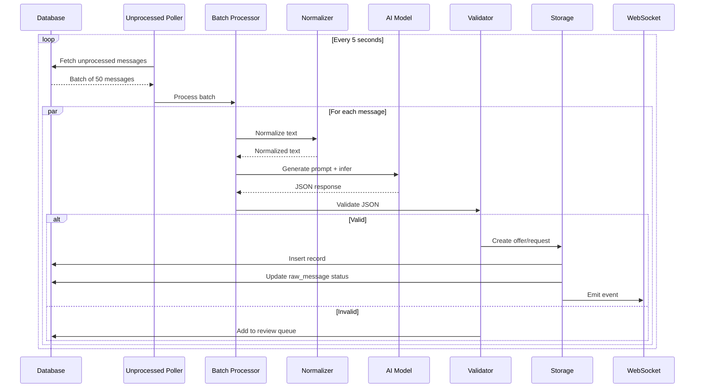

# Phase 2: AI Parsing

**Arabic NLP & Structured Data Extraction**

---

## Overview

The AI Parsing phase transforms informal Arabic WhatsApp messages into structured medication data (offers and requests). This is the intelligence layer that enables automated matching.

**Key Capabilities:**

- Arabic dialect understanding (Egyptian)
- Multi-model support (Qwen, Ministral, Gemma)
- Batch processing for efficiency
- Feedback loop for continuous improvement
- Multi-pass parsing for complex messages

---

## Workflow Diagram



---

## Component Details

### 1. Unprocessed Poller

**Location:** `core/src/worker/unprocessed_poller.rs`

**Purpose:** Background worker that polls for unprocessed messages

**Configuration:**

```rust
pub struct UnprocessedPollerConfig {
    pub poll_interval: Duration,      // Default: 5 seconds
    pub batch_size: usize,             // Default: 50 messages
    pub max_retries: u32,              // Default: 3
    pub retry_delay: Duration,         // Default: 60 seconds
}
```

**Behavior:**

```rust
loop {
    // Fetch unprocessed messages
    let messages = db.find_unprocessed_messages(batch_size).await?;

    if messages.is_empty() {
        tokio::time::sleep(poll_interval).await;
        continue;
    }

    // Send to batch processor
    batch_processor.process(messages).await?;

    tokio::time::sleep(poll_interval).await;
}
```

**Strengths:**

- ✅ Simple and reliable
- ✅ Automatic retry mechanism
- ✅ Configurable batch size

**Weaknesses:**

- ⚠️ Fixed polling interval (not event-driven)
- ⚠️ No priority handling
- ⚠️ Single-threaded processing

---

### 2. Text Normalization

**Location:** `core/src/matching/arabic.rs`

**Purpose:** Standardize Arabic text for better AI parsing

**Transformations:**

```rust
pub fn normalize_arabic(text: &str) -> String {
    text
        // Remove diacritics (تشكيل)
        .chars()
        .filter(|c| !is_arabic_diacritic(*c))
        .collect::<String>()

        // Normalize alef variants
        .replace('أ', "ا")
        .replace('إ', "ا")
        .replace('آ', "ا")

        // Normalize teh marbuta
        .replace('ة', "ه")

        // Fix spacing
        .split_whitespace()
        .collect::<Vec<_>>()
        .join(" ")

        // Standardize numbers
        .replace("٠", "0")
        .replace("١", "1")
        // ... more number replacements
}
```

**Examples:**

```
Input:  "مُحتاج أسبرين ١٠٠ قرص"
Output: "محتاج اسبرين 100 قرص"

Input:  "عندي باراسيتامول ٥٠٠ مجم"
Output: "عندي باراسيتامول 500 مجم"
```

**Strengths:**

- ✅ Handles Arabic variants
- ✅ Removes noise (diacritics)
- ✅ Standardizes numbers

**Weaknesses:**

- ⚠️ May lose semantic information (diacritics can change meaning)
- ⚠️ Hardcoded rules (not ML-based)

---

### 3. AI Model Inference

**Location:** `core/src/ai/pharma_parser.rs`

**Supported Models:**

- **Qwen 2.5 (7B)** - Best accuracy, slower
- **Ministral (8B)** - Balanced performance
- **Gemma 2 (9B)** - Fast, good for simple messages

**Prompt Engineering:**

```rust
let prompt = format!(r#"
You are a pharmaceutical data extraction expert for Egyptian Arabic WhatsApp messages.

Extract structured data from this message:
"{}"

Return ONLY valid JSON in this exact format:
{{
  "type": "offer" or "request",
  "medication": "medication name",
  "quantity": number,
  "unit": "قرص" or "علبة" or "شريط",
  "price": number (optional),
  "expiry_date": "YYYY-MM-DD" (optional),
  "notes": "any additional info"
}}

Rules:
- If unclear, set type to "unknown"
- Extract numbers as integers
- Normalize medication names (e.g., "أسبرين" not "اسبرين")
- Price is per unit unless specified otherwise
"#, normalized_text);
```

**Response Parsing:**

```rust
pub async fn parse(&self, content: &str) -> Result<ParsedMessage> {
    // Normalize text
    let normalized = normalize_arabic(content);

    // Call AI model
    let response = self.client
        .generate(&prompt, &normalized)
        .await?;

    // Extract JSON from response
    let json = extract_json(&response)?;

    // Parse into struct
    let parsed: ParsedMessage = serde_json::from_str(&json)?;

    // Validate
    validate_parsed_message(&parsed)?;

    Ok(parsed)
}
```

**Strengths:**

- ✅ Handles informal Arabic
- ✅ Understands context
- ✅ Flexible extraction

**Weaknesses:**

- ⚠️ Slow (500-2000ms per message)
- ⚠️ Non-deterministic (same input may give different outputs)
- ⚠️ Requires careful prompt engineering

---

### 4. Token Batching

**Location:** `core/src/ai/token_batcher.rs`

**Purpose:** Group messages by token count for efficient batch processing

**Algorithm:**

```rust
pub fn batch_by_tokens(
    messages: Vec<RawMessage>,
    max_tokens_per_batch: usize,
) -> Vec<Vec<RawMessage>> {
    let mut batches = Vec::new();
    let mut current_batch = Vec::new();
    let mut current_tokens = 0;

    for msg in messages {
        let tokens = estimate_tokens(&msg.content);

        if current_tokens + tokens > max_tokens_per_batch {
            batches.push(current_batch);
            current_batch = Vec::new();
            current_tokens = 0;
        }

        current_batch.push(msg);
        current_tokens += tokens;
    }

    if !current_batch.is_empty() {
        batches.push(current_batch);
    }

    batches
}
```

**Token Estimation:**

```rust
fn estimate_tokens(text: &str) -> usize {
    // Rough estimate: 1 token ≈ 4 characters for Arabic
    (text.len() / 4).max(1)
}
```

**Strengths:**

- ✅ Maximizes GPU utilization
- ✅ Reduces API calls
- ✅ Faster overall processing

**Weaknesses:**

- ⚠️ Token estimation is approximate
- ⚠️ May create unbalanced batches

---

### 5. Multi-Pass Parsing

**Location:** `core/src/parsing/processor.rs`

**Purpose:** Retry failed parses with simpler prompts

**Strategy:**

```rust
pub struct MultiPassConfig {
    pub max_passes: usize,           // Default: 3
    pub simplify_prompt: bool,       // Default: true
    pub fallback_to_keywords: bool,  // Default: true
}

pub async fn parse_with_multipass(
    &self,
    content: &str,
    config: &MultiPassConfig,
) -> Result<ParsedMessage> {
    let mut last_error = None;

    for pass in 0..config.max_passes {
        let prompt = match pass {
            0 => self.full_prompt(content),
            1 => self.simplified_prompt(content),
            2 => self.keyword_extraction_prompt(content),
            _ => break,
        };

        match self.parse_with_prompt(content, &prompt).await {
            Ok(parsed) => return Ok(parsed),
            Err(e) => last_error = Some(e),
        }
    }

    Err(last_error.unwrap())
}
```

**Prompt Simplification:**

```
Pass 1 (Full): Extract all fields with validation
Pass 2 (Simplified): Extract only medication and type
Pass 3 (Keywords): Use regex patterns for extraction
```

**Strengths:**

- ✅ Increases success rate
- ✅ Handles complex messages
- ✅ Graceful degradation

**Weaknesses:**

- ⚠️ 3x slower for failed messages
- ⚠️ May extract incomplete data

---

### 6. Feedback Loop

**Location:** `core/src/ai/feedback_loop.rs`

**Purpose:** Learn from operator corrections

**Process:**



**Feedback Record:**

```rust
pub struct FeedbackRecord {
    pub id: Uuid,
    pub raw_message_id: Uuid,
    pub original_parse: serde_json::Value,
    pub corrected_parse: serde_json::Value,
    pub feedback_type: FeedbackType,  // Correction, Validation, Rejection
    pub created_at: DateTime<Utc>,
}
```

**Learning Algorithm:**

```rust
pub async fn learn_from_feedback(&self) -> Result<()> {
    // Fetch recent feedback
    let feedback = self.repo.get_recent_feedback(30).await?;

    // Analyze common mistakes
    let mistakes = analyze_mistakes(&feedback);

    // Update prompt templates
    for mistake in mistakes {
        if mistake.frequency > 0.1 {  // >10% error rate
            self.update_prompt_for_pattern(&mistake).await?;
        }
    }

    Ok(())
}
```

**Strengths:**

- ✅ Continuous improvement
- ✅ Adapts to new patterns
- ✅ Reduces manual corrections over time

**Weaknesses:**

- ⚠️ Requires operator feedback
- ⚠️ Slow learning (daily updates)
- ⚠️ May overfit to recent data

---

## Data Flow



---

## Strengths

### ✅ 1. Handles Informal Arabic

- Understands Egyptian dialect
- Handles typos and abbreviations
- Contextual understanding

### ✅ 2. Multi-Model Support

- Can switch models based on performance
- A/B testing capability
- Fallback options

### ✅ 3. Batch Processing

- Efficient GPU utilization
- Reduced API calls
- Faster overall throughput

### ✅ 4. Feedback Loop

- Continuous improvement
- Adapts to new patterns
- Reduces errors over time

### ✅ 5. Graceful Degradation

- Multi-pass parsing
- Review queue for failures
- No data loss

---

## Weaknesses

### ⚠️ 1. High Latency

**Issue:** 500-2000ms per message

**Impact:** Bottleneck in end-to-end flow

**Recommendation:**

```rust
// Implement response caching
pub struct CachedPharmaParser {
    parser: PharmaParser,
    cache: Arc<RedisCache>,
}

impl CachedPharmaParser {
    async fn parse(&self, content: &str) -> Result<ParsedMessage> {
        let cache_key = format!("parse:{}", hash(content));

        // Check cache
        if let Some(cached) = self.cache.get(&cache_key).await? {
            return Ok(cached);
        }

        // Parse and cache
        let result = self.parser.parse(content).await?;
        self.cache.set(&cache_key, &result, Duration::hours(24)).await?;

        Ok(result)
    }
}
```

**Expected Impact:**

- 30-40% cache hit rate
- 500-2000ms → 5-10ms for cached responses
- 60% reduction in AI API costs

### ⚠️ 2. Non-Deterministic Output

**Issue:** Same input may give different outputs

**Impact:** Inconsistent parsing, difficult debugging

**Recommendation:**

```rust
// Add temperature control and seed
pub struct AIConfig {
    pub temperature: f32,  // 0.0 for deterministic
    pub seed: Option<u64>, // Fixed seed for reproducibility
}

// For production: temperature = 0.1 (mostly deterministic)
// For testing: temperature = 0.0, seed = 42 (fully deterministic)
```

### ⚠️ 3. No Confidence Scores

**Issue:** Parser doesn't indicate confidence in extraction

**Impact:** Cannot prioritize review queue

**Recommendation:**

```rust
pub struct ParsedMessage {
    pub medication: String,
    pub quantity: Option<u32>,
    pub confidence: f64,  // 0.0-1.0
    pub field_confidence: HashMap<String, f64>,  // Per-field confidence
}

// Use model's logprobs or implement heuristic scoring
pub fn calculate_confidence(parsed: &ParsedMessage) -> f64 {
    let mut score = 1.0;

    // Penalize missing fields
    if parsed.quantity.is_none() {
        score *= 0.8;
    }

    // Penalize unusual values
    if parsed.medication.len() < 3 {
        score *= 0.5;
    }

    score
}
```

### ⚠️ 4. Fixed Polling Interval

**Issue:** 5-second polling regardless of load

**Impact:** Wasted CPU cycles when idle, delayed processing when busy

**Recommendation:**

```rust
// Adaptive polling
pub struct AdaptivePoller {
    min_interval: Duration,
    max_interval: Duration,
    current_interval: Duration,
}

impl AdaptivePoller {
    async fn poll(&mut self) {
        let messages = self.fetch_messages().await;

        if messages.is_empty() {
            // Increase interval when idle
            self.current_interval = min(
                self.current_interval * 2,
                self.max_interval
            );
        } else {
            // Decrease interval when busy
            self.current_interval = self.min_interval;
        }

        tokio::time::sleep(self.current_interval).await;
    }
}
```

### ⚠️ 5. No Parallel Processing

**Issue:** Single-threaded batch processing

**Impact:** Underutilized CPU, slower throughput

**Recommendation:**

```rust
// Parallel batch processing
use rayon::prelude::*;

pub async fn process_batch_parallel(
    &self,
    messages: Vec<RawMessage>,
) -> Vec<Result<ParsedMessage>> {
    messages
        .par_iter()
        .map(|msg| self.parse_single(msg))
        .collect()
}
```

---

## Performance Metrics

| Metric                  | Current    | Target      | Notes                   |
| ----------------------- | ---------- | ----------- | ----------------------- |
| **Parse Latency (p50)** | 800ms      | 400ms       | With caching            |
| **Parse Latency (p95)** | 2000ms     | 1000ms      | With caching            |
| **Success Rate**        | 85%        | 95%         | With multi-pass         |
| **Cache Hit Rate**      | 0%         | 40%         | After Redis integration |
| **Throughput**          | 50 msg/min | 100 msg/min | With parallelization    |
| **Accuracy**            | 90%        | 95%         | With feedback loop      |

---

## Improvement Recommendations

### Priority 1: Immediate (Week 1-2)

1. **Implement Response Caching**
   - Effort: 8 hours
   - Impact: 60% latency reduction for repeated messages
   - ROI: High

2. **Add Confidence Scores**
   - Effort: 8 hours
   - Impact: Better review queue prioritization
   - ROI: Medium

3. **Optimize Prompt Templates**
   - Effort: 4 hours
   - Impact: 10-15% accuracy improvement
   - ROI: High

### Priority 2: Short-Term (Week 3-4)

4. **Implement Parallel Processing**
   - Effort: 12 hours
   - Impact: 2x throughput increase
   - ROI: High

5. **Add Adaptive Polling**
   - Effort: 6 hours
   - Impact: Reduced CPU usage, faster response
   - ROI: Medium

6. **Model Quantization**
   - Effort: 16 hours
   - Impact: 30-40% latency reduction
   - ROI: High

### Priority 3: Medium-Term (Week 5-8)

7. **Fine-Tune Model on Egyptian Arabic**
   - Effort: 40 hours
   - Impact: 15-20% accuracy improvement
   - ROI: Very High

8. **Implement Streaming Inference**
   - Effort: 24 hours
   - Impact: Lower perceived latency
   - ROI: Medium

---

## Testing Strategy

### Unit Tests

```rust
#[tokio::test]
async fn test_parse_offer_message() {
    let parser = PharmaParser::new();
    let content = "عندي أسبرين 100 قرص بـ 50 جنيه";

    let result = parser.parse(content).await.unwrap();

    assert_eq!(result.message_type, MessageType::Offer);
    assert_eq!(result.medication, "أسبرين");
    assert_eq!(result.quantity, Some(100));
    assert_eq!(result.price, Some(50.0));
}
```

### Integration Tests

```rust
#[tokio::test]
async fn test_end_to_end_parsing() {
    let db = setup_test_db().await;
    let parser = setup_parser().await;

    // Insert raw message
    let msg_id = db.insert_raw_message("محتاج باراسيتامول").await;

    // Run poller
    let poller = UnprocessedPoller::new(db.clone(), parser);
    poller.poll_once().await.unwrap();

    // Verify request created
    let request = db.find_request_by_raw_message_id(msg_id).await;
    assert!(request.is_some());
    assert_eq!(request.unwrap().medication, "باراسيتامول");
}
```

---

## Next Phase

Continue to [Phase 3: Medication Normalization](03-medication-normalization.md) to understand how medications are mapped to a canonical database.

---

**Document Version:** 1.0  
**Last Updated:** February 16, 2026  
**Next Review:** March 16, 2026
