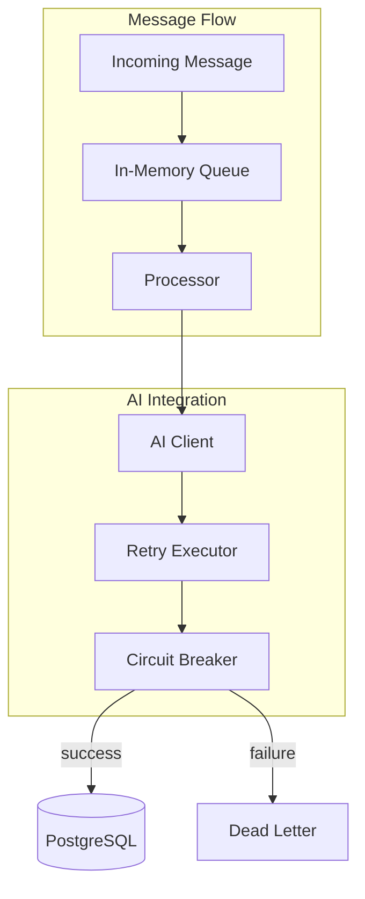
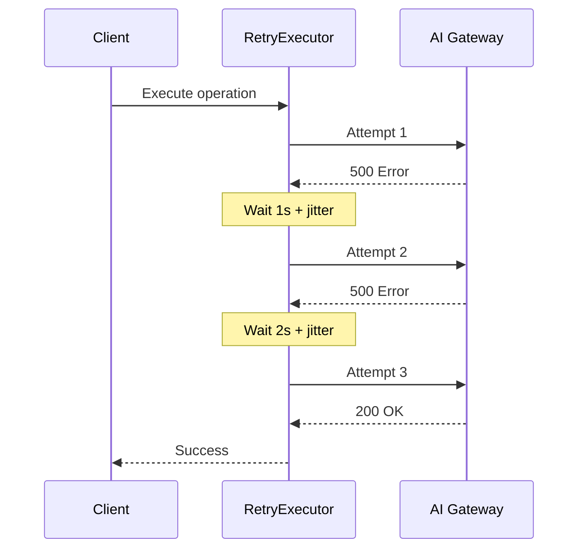

# Phase 2: Reliability

## Overview

Queue-based processing, retry logic, and AI error handling for system resilience.

## Architecture



## Key Components

| File           | Component         | Description                     |
| -------------- | ----------------- | ------------------------------- |
| `queue/mod.rs` | `BoundedQueue<T>` | Thread-safe bounded queue       |
| `retry/mod.rs` | `RetryExecutor`   | Exponential backoff with jitter |
| `ai/client.rs` | `AiClient`        | AI gateway HTTP client          |
| `ai/retry.rs`  | Circuit breaker   | Prevent cascading failures      |

## Queue Configuration

```rust
pub struct QueueConfig {
    pub capacity: usize,        // Default: 1000
    pub batch_size: usize,      // Default: 10
    pub drain_timeout: Duration, // Default: 30s
}
```

## Retry Behavior



## Integration Test

```rust
#[tokio::test]
async fn test_phase2_queue_reliability() {
    let queue = BoundedQueue::new(100);

    // Push items
    for i in 0..50 {
        queue.push(format!("msg-{}", i)).await;
    }

    // Drain and verify
    let batch = queue.drain_batch(10, Duration::from_secs(1)).await;
    assert_eq!(batch.len(), 10);
}

#[tokio::test]
async fn test_retry_with_backoff() {
    let executor = RetryExecutor::new(RetryConfig::default());
    let attempt_count = Arc::new(AtomicU32::new(0));

    let result = executor.execute(|| async {
        attempt_count.fetch_add(1, Ordering::SeqCst);
        if attempt_count.load(Ordering::SeqCst) < 3 {
            Err(Error::transient("retry me"))
        } else {
            Ok("success")
        }
    }).await;

    assert!(result.is_ok());
    assert_eq!(attempt_count.load(Ordering::SeqCst), 3);
}
```
