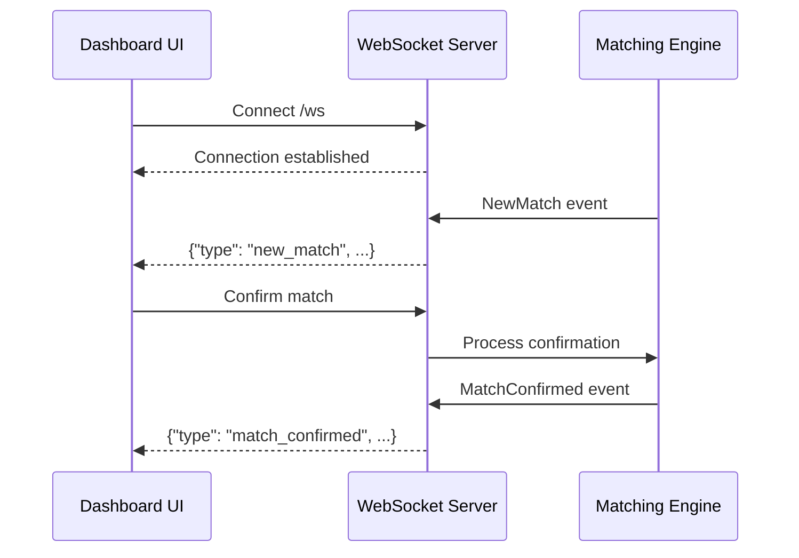

# Phase 3: Features

## Overview

Group management API and WebSocket real-time events.

## Architecture

```mermaid
graph TB
    subgraph "REST API"
        GC[Groups CRUD]
        GR[GET /api/groups]
        GP[POST /api/groups]
        GU[PUT /api/groups/:jid]
        GD[DELETE /api/groups/:jid]
    end

    subgraph "WebSocket"
        WS[/ws endpoint]
        BC[Broadcast Channel]
        CL1[Client 1]
        CL2[Client 2]
    end

    GC --> DB[(PostgreSQL)]
    WS --> BC
    BC --> CL1
    BC --> CL2
```

## Key Components

| File            | Component        | Description       |
| --------------- | ---------------- | ----------------- |
| `api/groups.rs` | `list_groups()`  | GET all groups    |
| `api/groups.rs` | `create_group()` | POST new group    |
| `api/groups.rs` | `update_group()` | PUT update group  |
| `api/groups.rs` | `delete_group()` | DELETE group      |
| `ws/mod.rs`     | `WsEvent` enum   | Event types       |
| `ws/mod.rs`     | `ws_handler()`   | WebSocket upgrade |

## WebSocket Events



## Event Types

| Event            | Description                 |
| ---------------- | --------------------------- |
| `NewOffer`       | New offer created           |
| `NewRequest`     | New request created         |
| `NewMatch`       | Match found                 |
| `MatchConfirmed` | Match confirmed by operator |
| `MatchRejected`  | Match rejected              |
| `StatsUpdate`    | Dashboard stats refresh     |

## Integration Test

```rust
#[tokio::test]
async fn test_phase3_groups_api() {
    let client = TestClient::new(app);

    // Create group
    let resp = client.post("/api/groups")
        .json(&json!({"jid": "test@g.us", "name": "Test"}))
        .send().await;
    assert_eq!(resp.status(), 201);

    // List groups
    let groups: Vec<Group> = client.get("/api/groups")
        .send().await.json().await;
    assert!(!groups.is_empty());
}

#[tokio::test]
async fn test_websocket_events() {
    let (ws_tx, mut ws_rx) = broadcast::channel(16);

    // Simulate match event
    ws_tx.send(WsEvent::NewMatch(match_entity)).unwrap();

    // Verify event received
    let event = ws_rx.recv().await.unwrap();
    assert!(matches!(event, WsEvent::NewMatch(_)));
}
```
