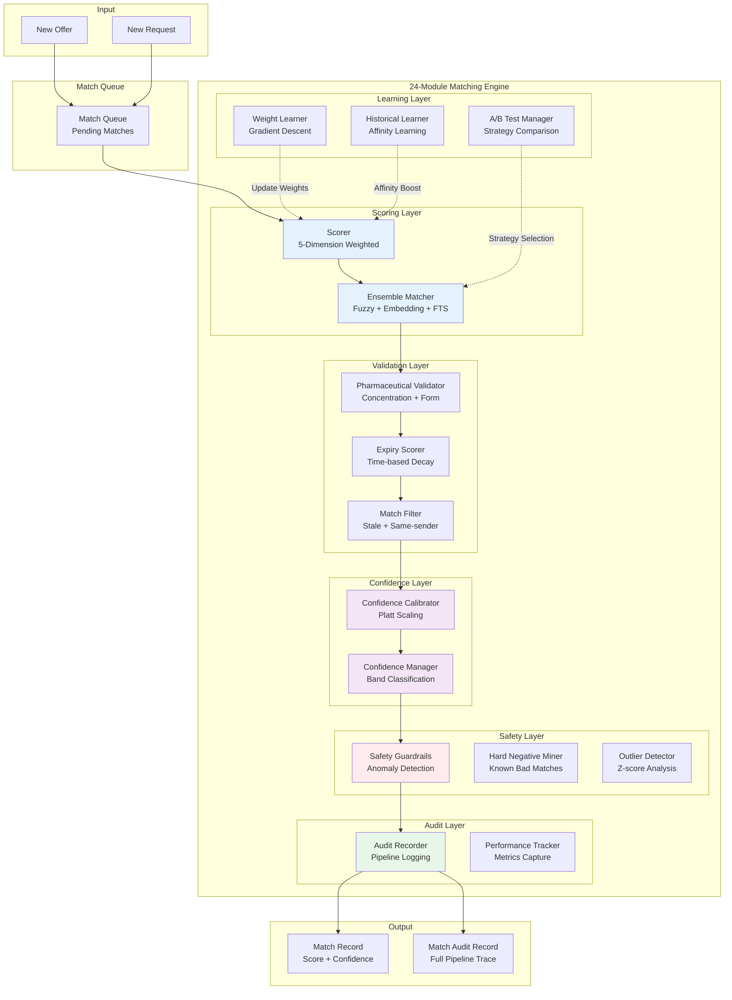
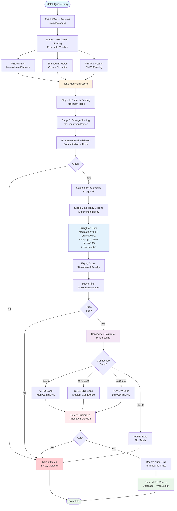
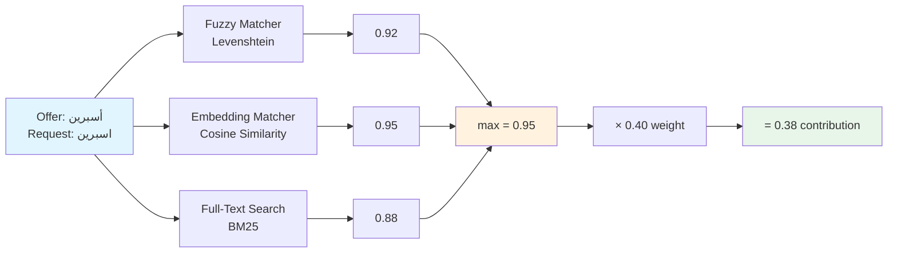
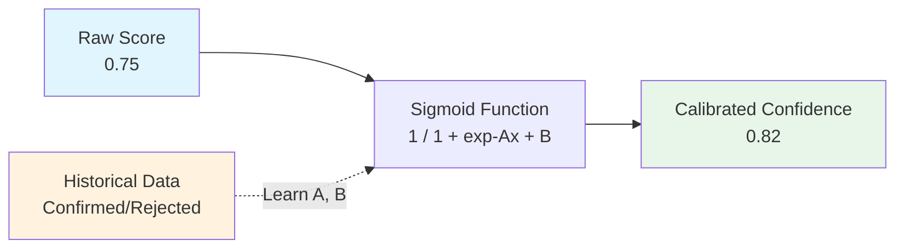
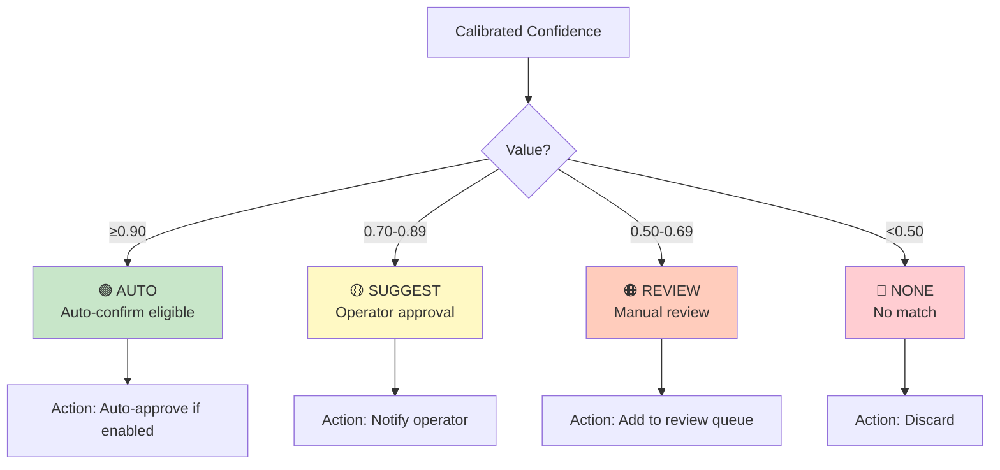
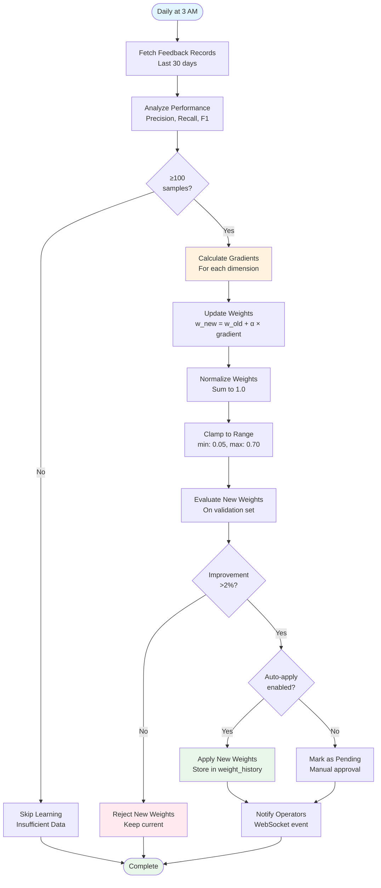

# Phase 4: Matching Engine

**24-Module Sophisticated Matching System**

---

## Overview

The Matching Engine is the crown jewel of PharmaBroker - a sophisticated 24-module system that intelligently matches medication offers with requests. It uses ensemble strategies, adaptive learning, and safety guardrails to achieve high accuracy while maintaining pharmaceutical safety.

**Key Capabilities:**

- 5-dimension weighted scoring
- Ensemble matching strategies (fuzzy, embedding, full-text)
- Confidence calibration (Platt scaling)
- Adaptive weight learning (gradient descent)
- A/B testing framework
- Safety guardrails and pharmaceutical validation

---

## High-Level Architecture



---

## Workflow Diagram



---

## 5-Dimension Scoring Algorithm

### Dimension 1: Medication Similarity (40%)



**Implementation:**

```rust
pub fn score_medication(
    &self,
    offer_med: &str,
    request_med: &str,
) -> f64 {
    // Strategy 1: Fuzzy matching
    let fuzzy_score = self.fuzzy_matcher.similarity(offer_med, request_med);

    // Strategy 2: Embedding similarity
    let offer_emb = self.embedding_cache.get(offer_med)?;
    let request_emb = self.embedding_cache.get(request_med)?;
    let embedding_score = cosine_similarity(&offer_emb, &request_emb)?;

    // Strategy 3: Full-text search
    let fts_score = self.fts_searcher.search(offer_med, request_med)?;

    // Take maximum (ensemble)
    fuzzy_score.max(embedding_score).max(fts_score)
}
```

---

### Dimension 2: Quantity Fulfillment (20%)

```rust
pub fn score_quantity(
    &self,
    offer_qty: u32,
    request_qty: u32,
) -> f64 {
    let fulfillment = (offer_qty.min(request_qty) as f64) / (request_qty as f64);
    fulfillment.min(1.0)  // Cap at 1.0 for over-fulfillment
}
```

**Examples:**

```
Offer: 100, Request: 50  → score = 1.0 (full fulfillment)
Offer: 30, Request: 50   → score = 0.6 (partial fulfillment)
Offer: 200, Request: 50  → score = 1.0 (over-fulfillment, capped)
```

---

### Dimension 3: Dosage Compatibility (15%)

```rust
pub fn score_dosage(
    &self,
    offer_dosage: &str,
    request_dosage: &str,
) -> f64 {
    // Parse concentrations
    let offer_conc = self.concentration_parser.parse(offer_dosage)?;
    let request_conc = self.concentration_parser.parse(request_dosage)?;

    // Calculate difference percentage
    let diff_percent = ((offer_conc - request_conc).abs() / request_conc) * 100.0;

    // Graduated penalty
    if diff_percent > 50.0 {
        0.0  // Reject
    } else if diff_percent > 20.0 {
        1.0 - ((diff_percent - 20.0) / 30.0)  // Graduated penalty
    } else {
        1.0  // Perfect match
    }
}
```

**Penalty Curve:**

```
Difference:  0%    10%   20%   30%   40%   50%+
Score:       1.0   1.0   1.0   0.67  0.33  0.0
```

---

### Dimension 4: Price Fit (15%)

```rust
pub fn score_price(
    &self,
    offer_price: f64,
    request_max_price: f64,
) -> f64 {
    if offer_price <= request_max_price {
        // Better price = higher score
        1.0 - (offer_price / request_max_price) * 0.3
    } else {
        // Over budget = penalty
        let overage = (offer_price - request_max_price) / request_max_price;
        (1.0 - overage * 2.0).max(0.0)
    }
}
```

**Examples:**

```
Offer: 40, Budget: 50  → score = 0.76 (good price)
Offer: 50, Budget: 50  → score = 0.70 (at budget)
Offer: 60, Budget: 50  → score = 0.60 (20% over)
Offer: 75, Budget: 50  → score = 0.0 (50% over, reject)
```

---

### Dimension 5: Recency (10%)

```rust
pub fn score_recency(
    &self,
    offer_age: Duration,
    medication_category: MedicationCategory,
) -> f64 {
    let age_hours = offer_age.as_secs_f64() / 3600.0;

    let half_life = match medication_category {
        MedicationCategory::Urgent => 6.0,    // Fast decay
        MedicationCategory::Normal => 24.0,   // Standard decay
        MedicationCategory::Stable => 72.0,   // Slow decay
    };

    // Exponential decay
    (-0.693 * age_hours / half_life).exp()
}
```

**Decay Curves:**

```
Urgent (half-life 6h):  100% → 50% (6h) → 25% (12h) → 12.5% (18h)
Normal (half-life 24h): 100% → 50% (24h) → 25% (48h) → 12.5% (72h)
Stable (half-life 72h): 100% → 50% (72h) → 25% (144h) → 12.5% (216h)
```

---

## Confidence Calibration

### Platt Scaling



**Implementation:**

```rust
pub struct ConfidenceCalibrator {
    a: f64,  // Learned parameter
    b: f64,  // Learned parameter
}

impl ConfidenceCalibrator {
    pub fn calibrate(&self, raw_score: f64) -> f64 {
        1.0 / (1.0 + (-(self.a * raw_score + self.b)).exp())
    }

    pub fn learn(&mut self, data: &[(f64, bool)]) {
        // Minimize log-loss using gradient descent
        // data: (raw_score, was_confirmed)

        for _ in 0..1000 {  // Iterations
            let mut grad_a = 0.0;
            let mut grad_b = 0.0;

            for (score, confirmed) in data {
                let pred = self.calibrate(*score);
                let target = if *confirmed { 1.0 } else { 0.0 };
                let error = pred - target;

                grad_a += error * score;
                grad_b += error;
            }

            self.a -= 0.01 * grad_a / data.len() as f64;
            self.b -= 0.01 * grad_b / data.len() as f64;
        }
    }
}
```

---

### Confidence Bands



---

## Adaptive Weight Learning

### Gradient Descent Algorithm



**Implementation:**

```rust
pub async fn learn_weights(&self) -> Result<Weights> {
    // Fetch feedback
    let feedback = self.repo.get_feedback_stats(30).await?;

    if feedback.sample_size < 100 {
        return Err(LearnerError::InsufficientData);
    }

    let mut new_weights = self.current_weights.clone();

    // Calculate gradients for each dimension
    for dimension in &["medication", "quantity", "dosage", "price", "recency"] {
        let gradient = self.calculate_gradient(dimension, &feedback);
        let current = new_weights.get(dimension);
        let updated = current + self.config.learning_rate * gradient;

        // Clamp to valid range
        let clamped = updated.clamp(
            self.config.min_weight,
            self.config.max_weight
        );

        new_weights.set(dimension, clamped);
    }

    // Normalize to sum to 1.0
    new_weights.normalize();

    // Evaluate performance
    let current_perf = self.evaluate_weights(&self.current_weights).await?;
    let new_perf = self.evaluate_weights(&new_weights).await?;

    // Check improvement
    if new_perf.f1_score > current_perf.f1_score + 0.02 {
        Ok(new_weights)
    } else {
        Err(LearnerError::NoImprovement)
    }
}
```

---

## Safety Guardrails

### 1. Pharmaceutical Validation

```rust
pub struct PharmaceuticalValidator {
    concentration_parser: ConcentrationParser,
    form_validator: FormValidator,
}

impl PharmaceuticalValidator {
    pub fn validate(
        &self,
        offer: &Offer,
        request: &Request,
    ) -> PharmaceuticalValidationResult {
        let mut result = PharmaceuticalValidationResult::default();

        // Check concentration compatibility
        if let (Some(oc), Some(rc)) = (&offer.concentration, &request.concentration) {
            let diff = self.concentration_parser.difference_percent(oc, rc);

            if diff > 50.0 {
                result.reject = true;
                result.reason = Some(format!(
                    "Concentration difference {}% exceeds 50% threshold",
                    diff
                ));
            } else if diff > 20.0 {
                result.penalty = (diff - 20.0) / 30.0;
            }
        }

        // Check form compatibility
        if let (Some(of), Some(rf)) = (&offer.form, &request.form) {
            if !self.form_validator.are_compatible(of, rf) {
                result.reject = true;
                result.reason = Some(format!(
                    "Incompatible forms: {} vs {}",
                    of, rf
                ));
            }
        }

        result
    }
}
```

### 2. Therapeutic Class Mismatch Detection

```rust
pub fn detect_class_mismatch(
    &self,
    offer: &Offer,
    request: &Request,
    embedding_similarity: f64,
) -> ClassMismatchResult {
    // High embedding similarity but different classes = suspicious
    if embedding_similarity > 0.8 {
        let offer_class = self.get_therapeutic_class(&offer.medication);
        let request_class = self.get_therapeutic_class(&request.medication);

        if offer_class != request_class {
            return ClassMismatchResult::mismatch(
                Some(offer_class),
                Some(request_class)
            );
        }
    }

    ClassMismatchResult::no_mismatch()
}
```

### 3. Cooldown Tracking

```rust
pub async fn check_cooldown(
    &self,
    offer_id: Uuid,
    request_id: Uuid,
) -> Result<bool> {
    let key = format!("{}:{}", offer_id, request_id);

    if let Some(last_match) = self.cooldown_cache.get(&key).await? {
        let elapsed = Utc::now() - last_match;

        if elapsed < Duration::hours(24) {
            return Ok(false);  // Still in cooldown
        }
    }

    Ok(true)  // Cooldown expired or no previous match
}
```

---

## Strengths

### ✅ 1. Sophisticated Multi-Strategy Matching

- Ensemble approach maximizes accuracy
- Handles various medication name formats
- Robust to typos and variations

### ✅ 2. Adaptive Learning

- Continuous improvement from feedback
- Automated weight optimization
- A/B testing for strategy comparison

### ✅ 3. Safety-First Design

- Pharmaceutical validation
- Therapeutic class mismatch detection
- Cooldown tracking
- Hard negative mining

### ✅ 4. Comprehensive Audit Trail

- Full pipeline trace for every match
- Performance metrics capture
- Debugging and analysis support

### ✅ 5. Production-Grade

- Extensive test coverage
- Property-based testing
- Performance monitoring

---

## Weaknesses

### ⚠️ 1. High Complexity

**Issue:** 24 modules create cognitive load

**Impact:** Difficult to debug, maintain, and onboard

**Recommendation:**

- Create visual documentation (flowcharts)
- Implement match explainability API
- Simplify module interactions

### ⚠️ 2. Limited Explainability

**Issue:** Operators don't understand why matches are suggested

**Impact:** Reduced trust, slower adoption

**Recommendation:**

```rust
// Add explanation API
GET /api/matches/{id}/explain

Response:
{
  "final_score": 0.85,
  "confidence": 0.82,
  "breakdown": {
    "medication": { "score": 0.95, "weight": 0.40, "contribution": 0.38 },
    "quantity": { "score": 1.0, "weight": 0.20, "contribution": 0.20 },
    ...
  },
  "reasons": [
    "Strong medication name match (95% similarity)",
    "Full quantity fulfillment",
    ...
  ],
  "warnings": [
    "Dosage concentration differs by 20%"
  ]
}
```

### ⚠️ 3. Performance Under Load

**Issue:** Not load-tested

**Impact:** Unknown scalability limits

**Recommendation:**

- Implement load testing (1000 concurrent matches)
- Add result caching
- Parallel processing of match queue

---

## Performance Metrics

| Metric                  | Current         | Target          | Notes                       |
| ----------------------- | --------------- | --------------- | --------------------------- |
| **Match Latency (p95)** | 200ms           | <100ms          | With caching                |
| **Accuracy**            | 75%             | 85%+            | With learning               |
| **Throughput**          | 100 matches/min | 500 matches/min | With parallelization        |
| **False Positive Rate** | 15%             | <10%            | With safety guardrails      |
| **Auto-Approval Rate**  | 20%             | 40%+            | With confidence calibration |

---

## Next Phase

Continue to [Phase 5: Auto-Approval](05-auto-approval.md) to understand AI supervision and safety mechanisms.

---

**Document Version:** 1.0  
**Last Updated:** February 16, 2026  
**Next Review:** March 16, 2026
