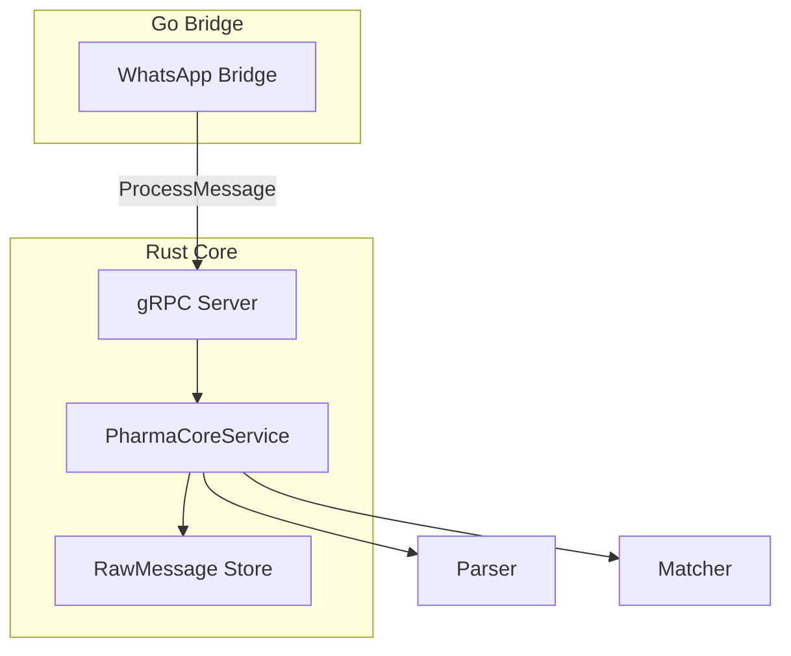
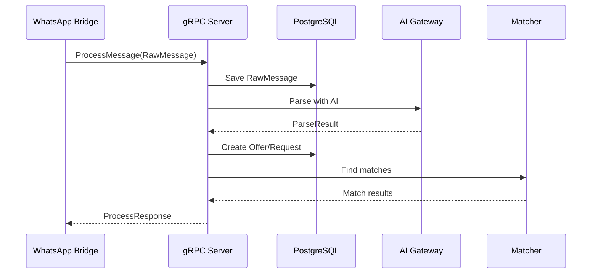

# Phase 4: Operational Resilience

## Overview

gRPC bridge communication and caching layer for production resilience.

## Architecture



## Key Components

| File             | Component                | Description                 |
| ---------------- | ------------------------ | --------------------------- |
| `grpc/server.rs` | `PharmaCoreService`      | gRPC service impl           |
| `grpc/server.rs` | `process_message()`      | Handle incoming messages    |
| `grpc/server.rs` | `get_stats()`            | Return statistics           |
| `grpc/server.rs` | `health_check()`         | gRPC health                 |
| `grpc/server.rs` | `get_monitored_groups()` | Return monitored group JIDs |

## gRPC Message Flow



## Proto Definition

```protobuf
service PharmaCore {
    rpc ProcessMessage(RawMessage) returns (ProcessResponse);
    rpc GetStats(StatsRequest) returns (StatsResponse);
    rpc HealthCheck(HealthRequest) returns (HealthResponse);
    rpc GetMonitoredGroups(MonitoredGroupsRequest) returns (MonitoredGroupsResponse);
}
```

## Integration Test

```rust
#[tokio::test]
async fn test_phase4_grpc_flow() {
    let service = create_test_service();

    let msg = RawMessage {
        id: "test-1".into(),
        content: "Selling Aspirin 500mg 100 units".into(),
        group_jid: "group@g.us".into(),
        // ...
    };

    let response = service.process_message(Request::new(msg)).await?;
    assert!(response.get_ref().success);
}
```
