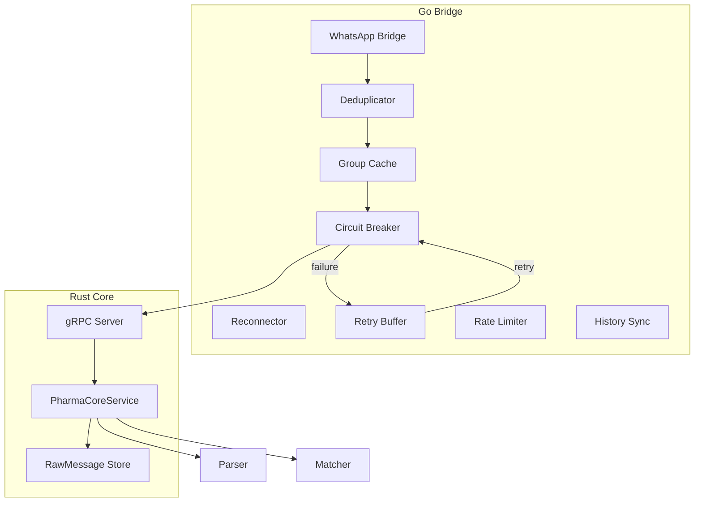
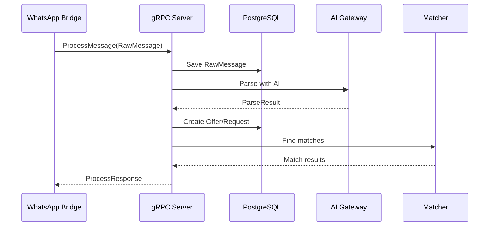

# Phase 4: Operational Resilience

## Overview

gRPC bridge communication and caching layer for production resilience.

## Architecture



## Key Components

### Rust Core

| File             | Component                | Description                 |
| ---------------- | ------------------------ | --------------------------- |
| `grpc/server.rs` | `PharmaCoreService`      | gRPC service impl           |
| `grpc/server.rs` | `process_message()`      | Handle incoming messages    |
| `grpc/server.rs` | `get_stats()`            | Return statistics           |
| `grpc/server.rs` | `health_check()`         | gRPC health                 |
| `grpc/server.rs` | `get_monitored_groups()` | Return monitored group JIDs |

### Go Bridge Resilience Components

| File                            | Component        | Description                       |
| ------------------------------- | ---------------- | --------------------------------- |
| `resilience/circuit_breaker.go` | `CircuitBreaker` | Prevent cascading gRPC failures   |
| `resilience/retry_buffer.go`    | `RetryBuffer`    | Queue failed messages for retry   |
| `resilience/rate_limiter.go`    | `RateLimiter`    | Token bucket (20/min, burst 5)    |
| `historysync/handler.go`        | `Handler`        | History sync deduplication        |
| `deduplicator/deduplicator.go`  | `Deduplicator`   | Message deduplication             |
| `reconnector/reconnector.go`    | `Reconnector`    | Exponential backoff reconnect     |
| `cache/group_cache.go`          | `GroupCache`     | Monitored groups cache (5min TTL) |

## Health Endpoint

The bridge exposes a `/health` endpoint on port 5050 with detailed stats:

```json
{
  "status": "healthy",
  "service": "pharma-bridge",
  "version": "0.2.0",
  "whatsapp_connected": true,
  "core_connected": true,
  "messages_forwarded": 1234,
  "circuit_breaker": "closed",
  "retry_buffer_size": 0,
  "deduplicator_stats": { "total": 5000, "duplicates": 150 },
  "rate_limiter_stats": { "total_requests": 100, "total_allowed": 95 },
  "history_sync_stats": { "total_syncs": 5, "messages_processed": 500 }
}
```

## gRPC Message Flow



## Proto Definition

```protobuf
service PharmaCore {
    rpc ProcessMessage(RawMessage) returns (ProcessResponse);
    rpc GetStats(StatsRequest) returns (StatsResponse);
    rpc HealthCheck(HealthRequest) returns (HealthResponse);
    rpc GetMonitoredGroups(MonitoredGroupsRequest) returns (MonitoredGroupsResponse);
}
```

## Integration Test

```rust
#[tokio::test]
async fn test_phase4_grpc_flow() {
    let service = create_test_service();

    let msg = RawMessage {
        id: "test-1".into(),
        content: "Selling Aspirin 500mg 100 units".into(),
        group_jid: "group@g.us".into(),
        // ...
    };

    let response = service.process_message(Request::new(msg)).await?;
    assert!(response.get_ref().success);
}
```
