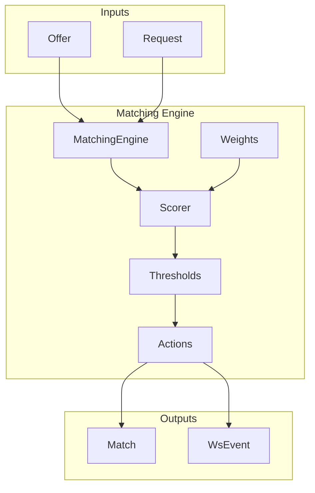
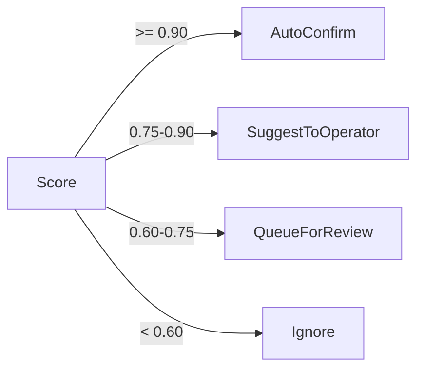

# Phase 5: Matching Engine

## Overview

Multi-factor matching with configurable weights, thresholds, and confidence bands.

## Architecture



## Key Components

| File                     | Component        | Description                         |
| ------------------------ | ---------------- | ----------------------------------- |
| `matching/engine.rs`     | `MatchingEngine` | Core orchestrator                   |
| `matching/scorer.rs`     | `Scorer`         | Calculate match scores              |
| `matching/weights.rs`    | `Weights`        | Configurable factor weights         |
| `matching/thresholds.rs` | Threshold config | Auto/suggest/reject levels          |
| `matching/actions.rs`    | `MatchAction`    | AutoConfirm, Suggest, Queue, Ignore |
| `matching/dosage.rs`     | Dosage parser    | Extract medication dosages          |

## Scoring Formula

```
score = w_med × medication_score
      + w_qty × quantity_score
      + w_price × price_score
      + w_recency × recency_score
```

## Match Actions



## Integration Test

```rust
#[tokio::test]
async fn test_phase5_matching() {
    let engine = MatchingEngine::new(config);

    let offer = Offer { medication: "Aspirin 500mg", quantity: 100, price: 10.0, .. };
    let request = Request { medication: "Aspirin 500mg", quantity: 100, max_price: 12.0, .. };

    let result = engine.find_matches(&request).await?;
    assert!(!result.is_empty());
    assert!(result[0].score >= 0.8);
}

#[test]
fn test_scorer_weights() {
    let weights = Weights::default();
    let scorer = Scorer::new(weights);

    let score = scorer.calculate(&offer, &request);
    assert!(score.total >= 0.0 && score.total <= 1.0);
}
```
