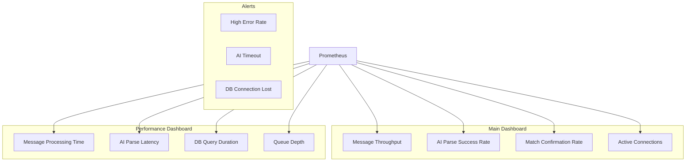

# Phase 6: Grafana Dashboards

## Overview

Pre-built Grafana dashboards for monitoring PharmaBroker metrics.

## Dashboard Panels



## Key Metrics

| Panel             | Metric                                       | Query                             |
| ----------------- | -------------------------------------------- | --------------------------------- |
| Message Rate      | `pharma_messages_received_total`             | `rate(...[5m])`                   |
| AI Success        | `pharma_ai_parse_total`                      | `rate(...{status="success"}[5m])` |
| Confirmation Rate | `pharma_match_confirmation_rate`             | Direct gauge                      |
| Processing P99    | `pharma_message_processing_duration_seconds` | `histogram_quantile(0.99, ...)`   |

## Sample Dashboard JSON

```json
{
  "title": "PharmaBroker Overview",
  "panels": [
    {
      "title": "Messages per Second",
      "type": "graph",
      "targets": [
        {
          "expr": "rate(pharma_messages_received_total[5m])"
        }
      ]
    }
  ]
}
```

## Verification

Manual verification required:

1. Import dashboard JSON to Grafana
2. Verify data source connection
3. Check panel queries return data
4. Validate alert thresholds
