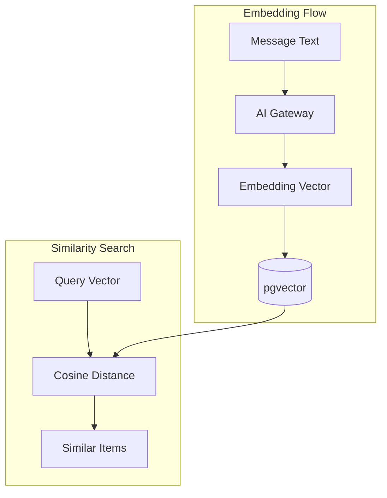

# Phase 7: Embedding-Based Matching

## Overview

Semantic similarity matching using pgvector embeddings for medication names.

## Architecture



## Key Components

| File                           | Component                    | Description         |
| ------------------------------ | ---------------------------- | ------------------- |
| `matching/mod.rs`              | `cosine_similarity()`        | Vector similarity   |
| `ai/client.rs`                 | `embed()`                    | Generate embeddings |
| `repository/postgres/offer.rs` | `find_semantic_duplicates()` | pgvector search     |
| `domain/offer.rs`              | `content_embedding`          | Stored embedding    |

## Similarity Calculation

```rust
pub fn cosine_similarity(a: &[f32], b: &[f32]) -> Result<f64, &'static str> {
    // dot product / (norm_a * norm_b)
    let dot = a.iter().zip(b).map(|(ai, bi)| ai * bi).sum();
    Ok(dot / (norm_a.sqrt() * norm_b.sqrt()))
}
```

## Database Schema

```sql
-- pgvector extension
CREATE EXTENSION IF NOT EXISTS vector;

-- Offers table with embedding
CREATE TABLE offers (
    id VARCHAR PRIMARY KEY,
    medication VARCHAR NOT NULL,
    content_embedding vector(1536),
    -- ...
);

-- Similarity index
CREATE INDEX offers_embedding_idx
    ON offers USING ivfflat (content_embedding vector_cosine_ops);
```

## Integration Test

```rust
#[tokio::test]
async fn test_phase7_embeddings() {
    // Generate embedding
    let embedding = ai_client.embed("Aspirin 500mg").await?;
    assert_eq!(embedding.len(), 1536);

    // Find similar
    let similar = offer_repo.find_semantic_duplicates(
        &embedding,
        0.95, // threshold
        Duration::hours(24)
    ).await?;

    // Verify cosine similarity
    let sim = cosine_similarity(&embedding, &similar[0].content_embedding)?;
    assert!(sim > 0.9);
}
```
