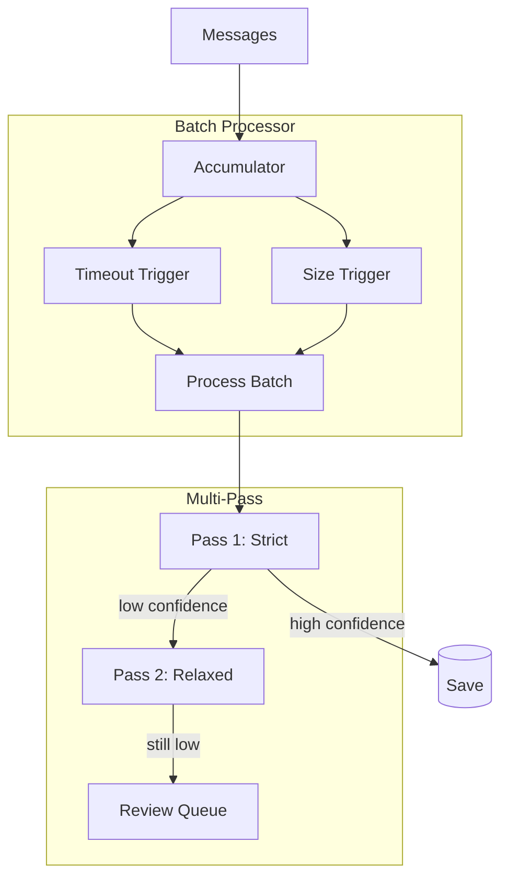

# Phase 8: Batch Processing & Multi-Pass Parsing

## Overview

Batch message processing with multi-pass AI parsing for improved accuracy.

## Architecture



## Key Components

| File                   | Component                 | Description            |
| ---------------------- | ------------------------- | ---------------------- |
| `parsing/config.rs`    | `BatchConfig`             | Batch size, timeout    |
| `parsing/config.rs`    | `MultiPassConfig`         | Thresholds             |
| `parsing/processor.rs` | `BatchProcessor`          | Accumulate and process |
| `parsing/mod.rs`       | `ParseJob`, `ParseResult` | Job types              |

## Configuration

```rust
pub struct BatchConfig {
    pub batch_size: usize,           // Default: 10
    pub batch_timeout: Duration,     // Default: 5s
    pub worker_count: usize,         // Default: 4
    pub channel_buffer: usize,       // Default: 100
}

pub struct MultiPassConfig {
    pub strict_threshold: f64,       // Default: 0.85
    pub relaxed_threshold: f64,      // Default: 0.70
    pub enable_pass2: bool,          // Default: true
    pub enable_review_queue: bool,   // Default: true
}
```

## Integration Test (14 tests)

```rust
#[tokio::test]
async fn test_phase8_batch_processing() {
    let config = BatchConfig::default();
    let processor = BatchProcessor::new(config, ai_client, repos);

    // Push messages
    for i in 0..15 {
        processor.push(raw_message(i)).await;
    }

    // Wait for batch trigger
    tokio::time::sleep(Duration::from_secs(6)).await;

    // Verify processing
    let stats = processor.stats();
    assert!(stats.batches_processed >= 1);
}

#[test]
fn test_multipass_config() {
    let config = MultiPassConfig::default();
    assert!(config.needs_pass2(0.75));  // Below strict
    assert!(!config.needs_pass2(0.90)); // Above strict
}
```
