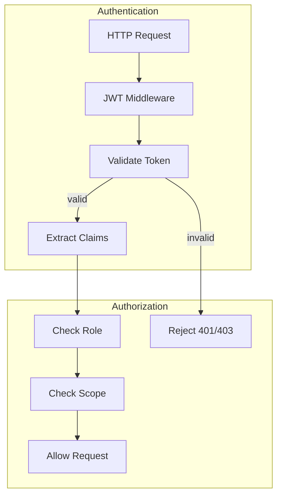

# Phase 9: JWT Security

## Overview

JWT-based authentication with role and scope-based access control.

## Architecture



## Key Components

| File                    | Component        | Description                 |
| ----------------------- | ---------------- | --------------------------- |
| `api/middleware/jwt.rs` | `JwtConfig`      | Secret, issuer, audience    |
| `api/middleware/jwt.rs` | `Claims`         | User ID, role, scopes       |
| `api/middleware/jwt.rs` | `JwtAuth`        | Token generation/validation |
| `api/middleware/jwt.rs` | `AuthUser`       | Axum extractor              |
| `api/middleware/jwt.rs` | `jwt_middleware` | Axum middleware             |

## Claims Structure

```rust
pub struct Claims {
    pub sub: String,           // User ID
    pub username: Option<String>,
    pub role: Option<String>,  // admin, operator, viewer
    pub scopes: Vec<String>,   // read, write, admin
    pub iss: String,           // Issuer
    pub aud: String,           // Audience
    pub exp: u64,              // Expiry timestamp
    pub iat: u64,              // Issued at
}
```

## Environment Variables

```bash
JWT_SECRET=your-32-char-secret-key-here!
JWT_ISSUER=pharmabroker
JWT_AUDIENCE=pharmabroker-api
JWT_EXPIRY_HOURS=24
JWT_REFRESH_DAYS=7
```

## Integration Test (8 tests)

```rust
#[test]
fn test_phase9_jwt_flow() {
    let auth = JwtAuth::new(test_config());

    // Generate token
    let token = auth.generate_token(
        "user-123",
        Some("admin"),
        Some("admin"),
        vec!["read".into(), "write".into()]
    ).unwrap();

    // Validate token
    let claims = auth.validate_token(&token).unwrap();
    assert_eq!(claims.sub, "user-123");
    assert!(claims.has_role("admin"));
    assert!(claims.has_scope("write"));
}

#[test]
fn test_skip_paths() {
    let auth = JwtAuth::new(config);
    assert!(auth.should_skip("/health"));
    assert!(auth.should_skip("/metrics"));
    assert!(!auth.should_skip("/api/offers"));
}
```
