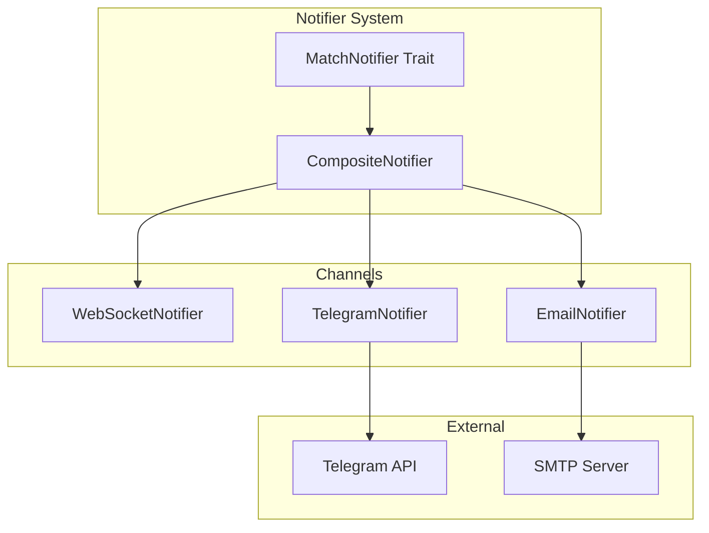
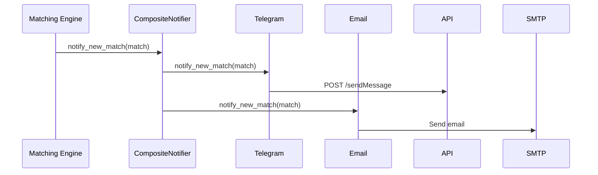

# Phase 10: Notifications

## Overview

Multi-channel notifications via Telegram Bot API and Email.

## Architecture



## Key Components

| File                 | Component             | Description            |
| -------------------- | --------------------- | ---------------------- |
| `notify/mod.rs`      | `MatchNotifier` trait | Notification interface |
| `notify/mod.rs`      | `CompositeNotifier`   | Chain multiple         |
| `notify/telegram.rs` | `TelegramNotifier`    | Telegram Bot API       |
| `notify/email.rs`    | `EmailNotifier`       | SMTP email             |

## Environment Variables

```bash
# Telegram
TELEGRAM_BOT_TOKEN=123:ABC
TELEGRAM_CHAT_ID=-1001234567890
TELEGRAM_ENABLED=true

# Email
SMTP_HOST=smtp.example.com
SMTP_PORT=587
EMAIL_FROM_ADDRESS=noreply@pharmabroker.local
EMAIL_RECIPIENTS=admin@example.com
EMAIL_ENABLED=true
```

## Notification Flow



## Integration Test (8 tests)

```rust
#[test]
fn test_phase10_telegram_format() {
    let msg = TelegramNotifier::format_match_message(
        &test_match(),
        &MatchAction::Suggest
    );
    assert!(msg.contains("💡"));
    assert!(msg.contains("High similarity"));
}

#[test]
fn test_composite_notifier() {
    let notifier = CompositeNotifier::new()
        .add(TelegramNotifier::from_env())
        .add(EmailNotifier::from_env());

    // Should not panic even if not configured
    notifier.notify_new_match(&match_entity, action).await;
}
```
