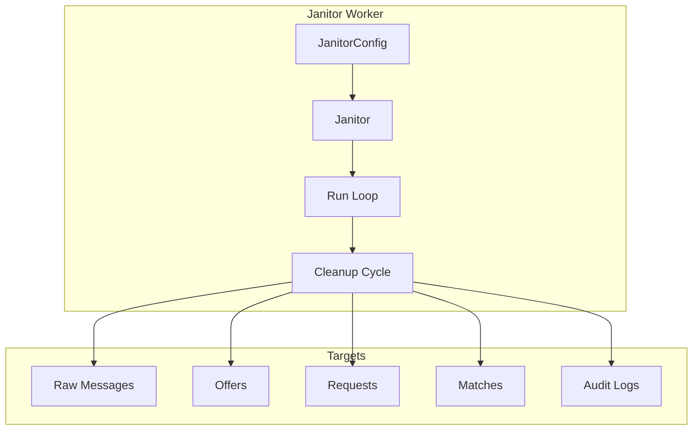
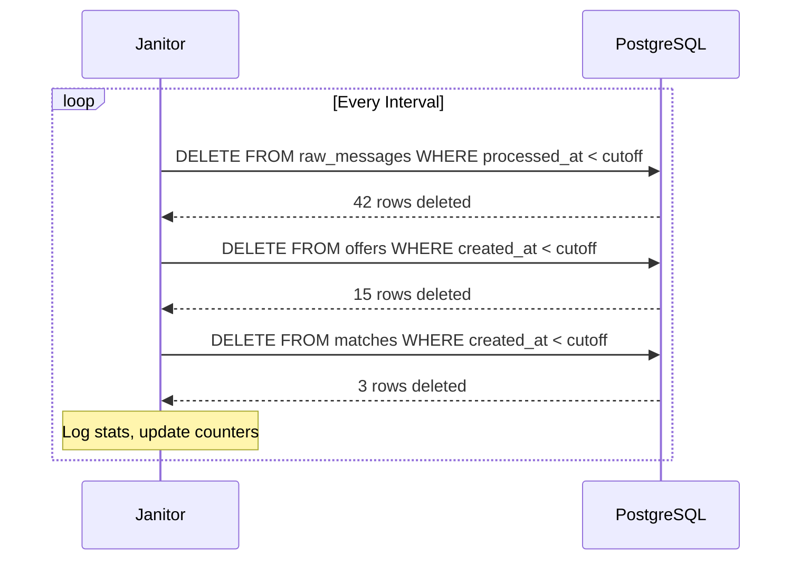

# Phase 11: Background Jobs

## Overview

Scheduled cleanup jobs for database maintenance and retention policy enforcement.

## Architecture



## Key Components

| File                   | Component         | Description       |
| ---------------------- | ----------------- | ----------------- |
| `worker/janitor.rs`    | `JanitorConfig`   | Retention periods |
| `worker/janitor.rs`    | `CleanupStats`    | Deletion tracking |
| `worker/janitor.rs`    | `Janitor`         | Background worker |
| `repository/traits.rs` | `delete_before()` | Trait method      |

## Configuration

```rust
pub struct JanitorConfig {
    pub interval: Duration,              // Default: 1 hour
    pub raw_message_retention_days: u32, // Default: 30
    pub offer_retention_days: u32,       // Default: 90
    pub request_retention_days: u32,     // Default: 90
    pub match_retention_days: u32,       // Default: 365
    pub audit_log_retention_days: u32,   // Default: 365
    pub enabled: bool,                   // Default: true
}
```

## Environment Variables

```bash
JANITOR_ENABLED=true
JANITOR_INTERVAL_SECS=3600
JANITOR_RAW_MSG_DAYS=30
JANITOR_OFFER_DAYS=90
JANITOR_REQUEST_DAYS=90
JANITOR_MATCH_DAYS=365
JANITOR_AUDIT_DAYS=365
```

## Cleanup Cycle



## Integration Test (2 tests)

```rust
#[test]
fn test_phase11_config() {
    let config = JanitorConfig::default();
    assert_eq!(config.interval, Duration::from_secs(3600));
    assert_eq!(config.raw_message_retention_days, 30);
    assert!(config.enabled);
}

#[tokio::test]
async fn test_cleanup_stats() {
    let stats = CleanupStats::default();
    assert_eq!(stats.run_count, 0);
    assert!(stats.last_run.is_none());
}
```
