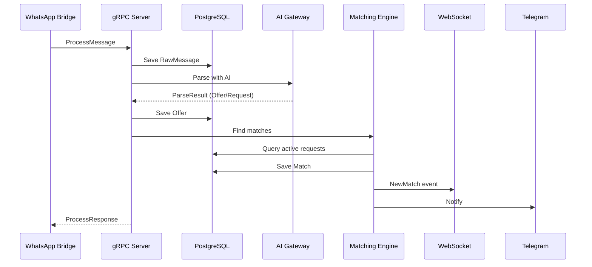

# Phase 12: E2E Testing & Validation

## Overview

Comprehensive integration tests covering the full message processing flow.

## Full System Flow



## Test Categories

### 1. Message Flow Tests

```rust
#[tokio::test]
async fn test_e2e_offer_creation() {
    let service = setup_test_service().await;

    let msg = RawMessage {
        content: "Selling Aspirin 500mg, 100 units at $10 each",
        group_jid: "pharmacy@g.us",
        ..Default::default()
    };

    let response = service.process_message(msg).await?;
    assert!(response.success);

    // Verify offer created
    let offers = offer_repo.get_active(10, 0).await?;
    assert!(!offers.is_empty());
    assert_eq!(offers[0].medication, "Aspirin 500mg");
}
```

### 2. Matching Tests

```rust
#[tokio::test]
async fn test_e2e_match_flow() {
    // Create offer
    let offer = create_offer("Aspirin 500mg", 100, 10.0).await;

    // Create request
    let request = create_request("Aspirin 500mg", 100, 12.0).await;

    // Verify match created
    let matches = match_repo.get_pending(10, 0).await?;
    assert!(!matches.is_empty());
    assert!(matches[0].score >= 0.8);
}
```

### 3. WebSocket Event Tests

```rust
#[tokio::test]
async fn test_e2e_websocket_events() {
    let (ws_tx, mut ws_rx) = broadcast::channel(16);

    // Process message that creates match
    process_matching_message().await;

    // Verify WebSocket event
    let event = ws_rx.recv().await?;
    assert!(matches!(event, WsEvent::NewMatch(_)));
}
```

### 4. API Integration Tests

```rust
#[tokio::test]
async fn test_e2e_api_flow() {
    let client = TestClient::new(app);

    // Health check
    let resp = client.get("/health").send().await;
    assert_eq!(resp.status(), 200);

    // List offers
    let offers: ApiResponse<Vec<Offer>> = client
        .get("/api/offers")
        .send().await
        .json().await;
    assert!(offers.success);
}
```

## Test Infrastructure

```rust
/// Setup test environment with real DB
async fn setup_test_env() -> TestEnv {
    let pool = create_test_pool().await;
    let ai_client = MockAiClient::new();
    let repos = create_repos(pool.clone());

    TestEnv { pool, ai_client, repos }
}

/// Cleanup after test
async fn teardown(env: TestEnv) {
    sqlx::query("DELETE FROM offers WHERE id LIKE 'test-%'")
        .execute(&env.pool).await.ok();
}
```

## Load Testing

```bash
# 1000 messages benchmark
cargo bench --bench message_throughput

# Expected results
# - 500+ messages/second
# - P99 latency < 100ms
```

## Verification Checklist

- [ ] Message received and saved
- [ ] AI parsing successful
- [ ] Offer/Request created
- [ ] Match found and saved
- [ ] WebSocket event broadcast
- [ ] Notification sent
- [ ] Metrics updated
- [ ] Audit log created
