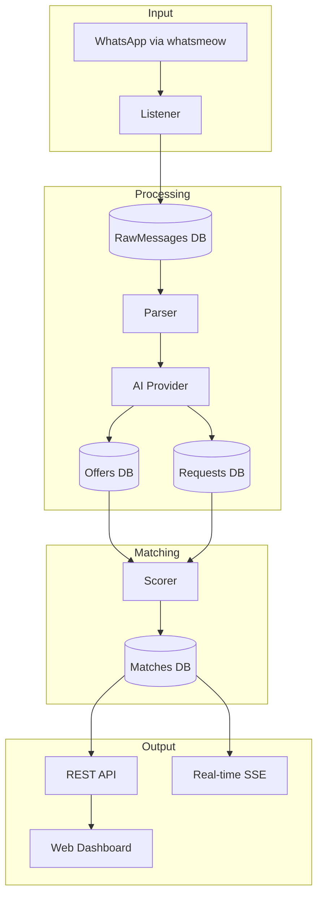

# PharmaBroker: Comprehensive Project Analysis

## Project Purpose

**PharmaBroker** is an AI-powered pharmaceutical trading platform that:

1. **Ingests** Arabic WhatsApp messages from Egyptian pharmacy groups
2. **Parses** medication offers/requests using AI (Gemini/local LLM)
3. **Matches** supply with demand via multi-field scoring
4. **Notifies** operators of matches for confirmation/rejection

---

## Architecture Overview

---

## Project Phases & Assessment

### Phase 1: Core Infrastructure ✅ SOLID

| Component     | Files | Lines | Tests | Assessment          |
| ------------- | ----- | ----- | ----- | ------------------- |
| Domain Models | 7     | ~800  | -     | Clean entity design |
| Storage/GORM  | 40    | ~3000 | 50+   | Well-tested repos   |
| Config        | 2     | ~300  | -     | YAML-based          |
| Metrics       | 1     | ~150  | -     | Prometheus ready    |

**Maintainability: 9/10**

- Repository pattern with interfaces
- Converters separate GORM models from domain
- SQLite with auto-migration
- Areas for improvement: index optimization for large datasets

---

### Phase 2: WhatsApp Integration ✅ SOLID

| Component            | Files | Assessment        |
| -------------------- | ----- | ----------------- |
| Manager              | 1     | whatsmeow wrapper |
| Listener             | 1     | Message handler   |
| Handler registration | -     | Event-driven      |

**Maintainability: 8/10**

- Clean separation from business logic
- Reply context extraction (Phase D)
- Bot command support
- Consideration: Reconnection handling could be more robust

---

### Phase 3: AI Parsing ✅ SOLID

| Component         | Files | Lines | Tests |
| ----------------- | ----- | ----- | ----- |
| Parser            | 1     | 1150  | 6     |
| Prompts           | 1     | 160   | -     |
| Docker Model      | 1     | 900   | 3     |
| Gemini            | 1     | 400   | -     |
| Fuzzy Match       | 1     | 150   | 3     |
| Arabic Normalizer | 1     | 100   | 10    |

**Maintainability: 8/10**

- Provider interface allows switching AI backends
- Circuit breaker for resilience
- Multi-pass parsing with review queue (Phase D)
- Prompt engineering optimized
- Consideration: Parser.go is large (1150 lines) - could split

---

### Phase 4: Matching Engine ✅ SOLID

| Component       | Function            | Weight |
| --------------- | ------------------- | ------ |
| MedicationScore | Fuzzy + exact match | 40%    |
| DosageScore     | Numeric comparison  | 15%    |
| QuantityScore   | Fulfillment ratio   | 20%    |
| PriceScore      | Budget fit          | 15%    |
| RecencyScore    | Exponential decay   | 10%    |

**Confidence Bands:**

- AUTO (≥0.9): Auto-confirm
- SUGGEST (0.7-0.9): Suggest to operator
- REVIEW (0.5-0.7): Needs review
- NONE (<0.5): No match

**Maintainability: 9/10**

- Configurable weights and thresholds
- Thread-safe scorer
- Well-tested (matching_test.go, scoring_test.go)
- Weight learning algorithm for optimization

---

### Phase 5: API & Dashboard ✅ SOLID

| Endpoint Category | Count | Handler              |
| ----------------- | ----- | -------------------- |
| Offers/Requests   | 6     | handlers.go          |
| Matches           | 5     | handlers.go          |
| Groups            | 4     | handlers.go          |
| Stats             | 2     | handlers.go          |
| Config            | 2     | handlers.go          |
| Learning          | 5     | learning_handlers.go |
| Review Queue      | 5     | review_handlers.go   |
| Health            | 2     | health.go            |
| SSE               | 1     | sse.go               |

**Dashboard:** React SPA in `internal/api/static/`

**Maintainability: 8/10**

- Go 1.22 ServeMux routing
- CORS middleware
- Rate limiting
- SSE for real-time updates
- Consideration: handlers.go (26KB) could split by domain

---

### Phase 6: Adaptive Learning ✅ SOLID

| Component         | Purpose                              |
| ----------------- | ------------------------------------ |
| WeightLearner     | Gradient descent on score weights    |
| FeedbackRepo      | Match confirmation/rejection history |
| LearningScheduler | Automated retraining                 |
| AuditRepo         | Weight change history                |

**Maintainability: 8/10**

- Bayesian-inspired optimization
- Configurable learning rate
- Audit trail for changes
- Integration with feedback loop

---

### Phase 7: Operational Features ✅ SOLID

| Feature | Component | Purpose          |
| ------- | --------- | ---------------- |
| Janitor | janitor/  | Archive old data |
| Monitor | monitor/  | WarRoom alerts   |
| Reports | reports/  | PDF generation   |
| Metrics | metrics/  | Prometheus       |

**Maintainability: 7/10**

- Good separation of concerns
- Could benefit from scheduling framework

---

## Test Coverage Summary

| Package | Test Files | Coverage |
| ------- | ---------- | -------- |
| ai      | 12         | High     |
| storage | 16         | High     |
| api     | 2          | Medium   |

**Total: ~50 test files**

---

## Key Strengths

1. **Clean Architecture**: Domain-driven with repository pattern
2. **AI Provider Abstraction**: Gemini/Docker model interchangeable
3. **Comprehensive Scoring**: Multi-field with configurable weights
4. **Real-time Updates**: SSE for live dashboard
5. **Test Coverage**: Critical paths well-tested

## Areas for Enhancement

1. **Parser.go Size**: 1150 lines - consider splitting
2. **handlers.go Size**: 26KB - could split by domain
3. **Error Handling**: More structured error types
4. **Database Indexes**: Performance tuning for scale
5. **Integration Tests**: More E2E coverage

---

## Overall Maintainability Score: **8.5/10**

The project is well-structured with good separation of concerns, comprehensive testing, and clean interfaces. It's production-ready for small-medium scale and can scale with minor optimizations.
