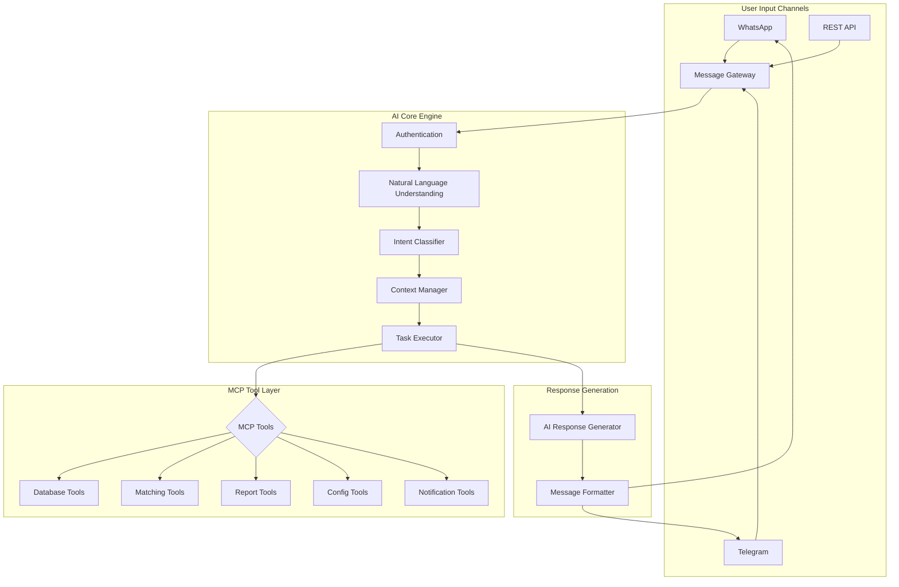
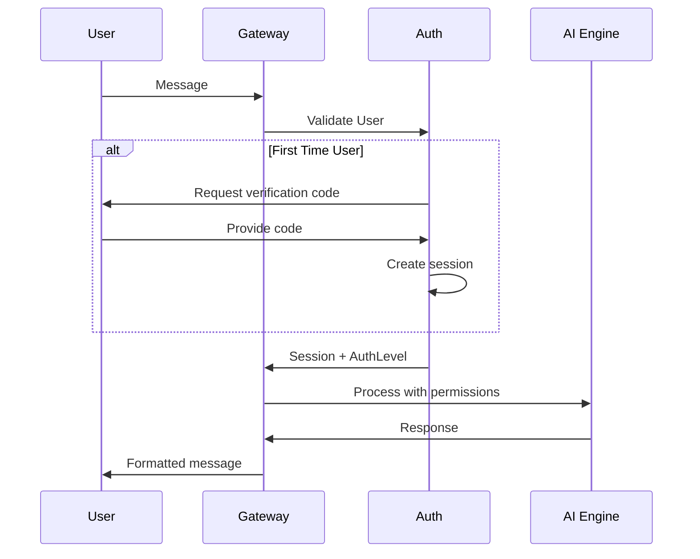

# AI-Powered Conversational Bot System

## Overview

A comprehensive system enabling natural language communication with the PharmaBroker bot, powered by AI for intelligent task execution via MCP (Model Context Protocol).



---

## Architecture Components

### 1. Message Gateway

Unified entry point for all messaging platforms.

```go
type MessageGateway struct {
    whatsapp  *whatsapp.Manager
    telegram  *telegram.Bot
    aiEngine  *AIEngine
    sessions  *SessionManager
}

type UnifiedMessage struct {
    Platform    string    // "whatsapp" | "telegram" | "api"
    UserID      string    // Normalized user identifier
    ChatID      string    // Chat/Group ID
    Content     string    // Raw message content
    ReplyTo     string    // Reply context
    Timestamp   time.Time
    Attachments []Attachment
}
```

### 2. Authentication Layer

Secure multi-tier access control.

```go
type AuthLevel int

const (
    AuthPublic   AuthLevel = 0  // Read-only stats
    AuthOperator AuthLevel = 1  // Confirm/reject matches
    AuthAdmin    AuthLevel = 2  // Config, user management
    AuthOwner    AuthLevel = 3  // Full system control
)

type UserSession struct {
    UserID       string
    Platform     string
    AuthLevel    AuthLevel
    Preferences  UserPrefs
    Context      ConversationContext
    LastActive   time.Time
    RateLimit    *RateLimiter
}
```

### 3. Natural Language Understanding (NLU)

AI-powered intent recognition and entity extraction.

```go
type NLUEngine struct {
    aiProvider   ai.AIProvider
    intentModel  IntentClassifier
    entityExtractor EntityExtractor
    contextWindow []Message  // Last N messages for context
}

type ParsedIntent struct {
    Intent      string            // "confirm_match", "search_medication", etc.
    Confidence  float64           // 0.0 - 1.0
    Entities    map[string]string // Extracted entities
    RawQuery    string
}
```

**Supported Intents:**

| Intent              | Examples                             | Entities         |
| ------------------- | ------------------------------------ | ---------------- |
| `greet`             | "hello", "hi", "مرحبا"               | -                |
| `status`            | "how's the system?", "ازاي النظام؟"  | -                |
| `confirm_match`     | "confirm abc123", "أكد المطابقة"     | match_id         |
| `reject_match`      | "reject abc123", "ارفض"              | match_id, reason |
| `search_medication` | "find Augmentin", "ابحث عن اوجمنتين" | medication       |
| `list_pending`      | "show pending", "اعرض المعلق"        | filter, limit    |
| `generate_report`   | "daily report", "تقرير اليوم"        | period           |
| `configure`         | "set threshold to 0.8"               | key, value       |
| `help`              | "what can you do?", "ممكن تعمل ايه؟" | topic            |
| `unknown`           | (fallback)                           | -                |

---

## MCP Tool Definitions

Model Context Protocol tools for AI task execution.

### Tool Schema

```json
{
  "tools": [
    {
      "name": "get_system_status",
      "description": "Get current system status including offers, requests, matches count",
      "parameters": {}
    },
    {
      "name": "search_medications",
      "description": "Search for offers or requests by medication name",
      "parameters": {
        "medication": {
          "type": "string",
          "description": "Medication name (Arabic or English)"
        },
        "type": { "type": "string", "enum": ["offer", "request", "both"] },
        "limit": { "type": "integer", "default": 10 }
      }
    },
    {
      "name": "get_pending_matches",
      "description": "List pending matches optionally filtered",
      "parameters": {
        "urgent_only": { "type": "boolean", "default": false },
        "min_score": { "type": "number", "default": 0.5 },
        "limit": { "type": "integer", "default": 5 }
      }
    },
    {
      "name": "confirm_match",
      "description": "Confirm a pending match by ID",
      "parameters": {
        "match_id": {
          "type": "string",
          "description": "Full or partial match ID"
        },
        "note": {
          "type": "string",
          "description": "Optional confirmation note"
        }
      }
    },
    {
      "name": "reject_match",
      "description": "Reject a pending match by ID",
      "parameters": {
        "match_id": {
          "type": "string",
          "description": "Full or partial match ID"
        },
        "reason": { "type": "string", "description": "Rejection reason" }
      }
    },
    {
      "name": "generate_report",
      "description": "Generate summary report for a time period",
      "parameters": {
        "period": {
          "type": "string",
          "enum": ["today", "yesterday", "week", "month"]
        },
        "format": { "type": "string", "enum": ["text", "csv"] }
      }
    },
    {
      "name": "update_config",
      "description": "Update system configuration (admin only)",
      "parameters": {
        "key": { "type": "string" },
        "value": { "type": "string" }
      }
    },
    {
      "name": "manage_groups",
      "description": "Manage monitored WhatsApp groups",
      "parameters": {
        "action": {
          "type": "string",
          "enum": ["list", "monitor", "unmonitor"]
        },
        "group_id": { "type": "string" }
      }
    }
  ]
}
```

---

## Conversation Flow

### Natural Conversation Example

```
User: مرحبا
Bot: أهلاً! 👋 أنا بوت فارما بروكر. كيف أقدر أساعدك؟

User: عندي كام matching معلق؟
Bot: 📋 عندك 5 مطابقات معلقة:

1. *Augmentin 1g* (92%) 🔥
   ID: abc123
2. *Concor 5mg* (87%)
   ID: def456
...

هل تحب تأكد أي واحدة؟

User: اكد الأولى
Bot: ✅ تم تأكيد مطابقة Augmentin 1g (abc123)
   البائع: صيدلية النور
   المشتري: د. أحمد

هل فيه حاجة تانية؟

User: ابحث عن بانادول
Bot: 🔍 نتائج البحث عن "بانادول":

📦 *عروض (3)*:
1. Panadol Extra - 50 علبة @ 40 ج.م
2. Panadol Night - 20 علبة @ 55 ج.م

📋 *طلبات (2)*:
1. Panadol Extra - 30 علبة (عاجل 🔥)

هل تحب تعرف تفاصيل أكتر؟
```

---

## Security Model

### Authentication Flow



### Permission Matrix

| Action           | Public | Operator | Admin | Owner |
| ---------------- | ------ | -------- | ----- | ----- |
| View stats       | ✅     | ✅       | ✅    | ✅    |
| Search           | ✅     | ✅       | ✅    | ✅    |
| List pending     | ❌     | ✅       | ✅    | ✅    |
| Confirm/Reject   | ❌     | ✅       | ✅    | ✅    |
| Generate reports | ❌     | ✅       | ✅    | ✅    |
| Manage groups    | ❌     | ❌       | ✅    | ✅    |
| Config changes   | ❌     | ❌       | ✅    | ✅    |
| User management  | ❌     | ❌       | ❌    | ✅    |
| System control   | ❌     | ❌       | ❌    | ✅    |

### Rate Limiting

```go
type RateLimits struct {
    MessagesPerMinute  int // Default: 20
    ToolCallsPerMinute int // Default: 10
    ReportsPerHour     int // Default: 5
}
```

---

## Implementation Tasks

### Phase 1: Core Infrastructure

- [ ] Create `internal/bot/gateway.go` - Unified message gateway
- [ ] Create `internal/bot/session.go` - Session management
- [ ] Create `internal/bot/auth.go` - Authentication layer
- [ ] Create `internal/bot/nlu.go` - NLU engine wrapper
- [ ] Define MCP tool schemas in `internal/bot/tools/`

### Phase 2: Intent & Entity Extraction

- [ ] Create intent classification prompt
- [ ] Implement entity extraction for medications, IDs, dates
- [ ] Add Arabic/English normalization
- [ ] Create intent test cases (50+ examples)

### Phase 3: MCP Tool Implementation

- [ ] `tools/status.go` - System status tool
- [ ] `tools/search.go` - Medication search tool
- [ ] `tools/matches.go` - Match management tools
- [ ] `tools/reports.go` - Report generation tool
- [ ] `tools/config.go` - Configuration tool
- [ ] `tools/groups.go` - Group management tool

### Phase 4: Conversation Management

- [ ] Implement context windowing (last 10 messages)
- [ ] Add conversation state machine
- [ ] Create response templates (AR/EN)
- [ ] Add personality configuration

### Phase 5: Platform Integration

- [ ] Extend WhatsApp bot commands
- [ ] Implement Telegram bot with inline keyboards
- [ ] Add webhook endpoint for API access
- [ ] Create unified message formatter

### Phase 6: Security & Monitoring

- [ ] Implement auth code verification
- [ ] Add rate limiting middleware
- [ ] Create audit logging for all actions
- [ ] Add usage analytics

---

## Code Structure

```
internal/
├── bot/
│   ├── gateway.go         # Message gateway
│   ├── session.go         # Session management
│   ├── auth.go            # Authentication
│   ├── nlu.go             # NLU engine
│   ├── executor.go        # Tool executor
│   ├── response.go        # Response generator
│   └── tools/
│       ├── schema.go      # MCP tool definitions
│       ├── status.go      # Status tool
│       ├── search.go      # Search tool
│       ├── matches.go     # Match tools
│       ├── reports.go     # Report tools
│       ├── config.go      # Config tools
│       └── groups.go      # Group tools
├── whatsapp/
│   └── ai_handler.go      # AI-powered message handler
└── telegram/
    └── ai_handler.go      # AI-powered message handler
```

---

## AI Prompt Template

```
You are PharmaBroker Bot, an intelligent assistant for pharmaceutical trading.

## Your Capabilities:
- Search medications (offers and requests)
- Manage match confirmations/rejections
- Generate reports
- Configure system settings (admin only)
- Monitor WhatsApp groups

## Available Tools:
{{tools}}

## User Info:
- Platform: {{platform}}
- Auth Level: {{auth_level}}
- Language: {{language}}

## Conversation History:
{{context}}

## Current Message:
{{message}}

Respond naturally in {{language}}. Use the appropriate tool if needed.
If unsure, ask for clarification. Be helpful and professional.
```

---

_Document Version: 1.0_  
_Last Updated: December 2024_
